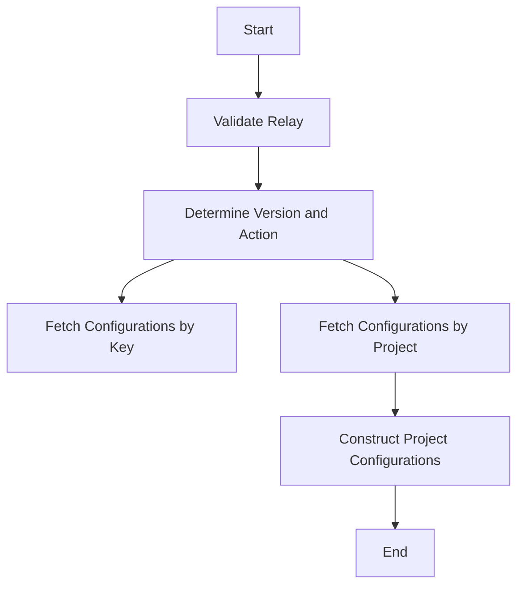

This document will cover the process of handling POST requests in the application. We'll cover:

1. Validating the relay making the request
2. Determining the version and action
3. Fetching configurations by key
4. Fetching configurations by project
5. Constructing project configurations

Technical document: <SwmLink doc-title="Handling POST Requests">[Handling POST Requests](/.swm/handling-post-requests.btoaek2g.sw.md)</SwmLink>

# [Validating the relay making the request](https://app.swimm.io/repos/Z2l0aHViJTNBJTNBc2VudHJ5LWRlbW8tMSUzQSUzQVN3aW1tLURlbW8=/docs/btoaek2g#handling-the-post-request)

When a POST request is received, the first step is to validate the relay making the request. This involves checking if the relay is internal and authorized to fetch configuration information. If the relay is not internal, the request is denied with a 403 status code. This ensures that only trusted and authorized relays can access sensitive configuration data, enhancing the security of the application.

# [Determining the version and action](https://app.swimm.io/repos/Z2l0aHViJTNBJTNBc2VudHJ5LWRlbW8tMSUzQSUzQVN3aW1tLURlbW8=/docs/btoaek2g#handling-the-post-request)

After validating the relay, the next step is to determine the version specified in the request. The version dictates the action to be taken. If the version is '3' and the request includes global data, a global configuration is fetched. Otherwise, the system decides whether to compute the full configuration or fetch configurations by key or project. This step ensures that the appropriate configuration data is retrieved based on the request's version, providing flexibility in handling different types of requests.

# [Fetching configurations by key](https://app.swimm.io/repos/Z2l0aHViJTNBJTNBc2VudHJ5LWRlbW8tMSUzQSUzQVN3aW1tLURlbW8=/docs/btoaek2g#fetching-configurations-by-key)

When fetching configurations by key, the system retrieves project configurations based on public keys provided in the request. It ensures that only active keys and accessible organizations are considered. This involves fetching project keys, projects, and organizations from the cache to avoid repeated database access. This step is crucial for efficiently retrieving the necessary configuration data while ensuring that only authorized entities are included.

# [Fetching configurations by project](https://app.swimm.io/repos/Z2l0aHViJTNBJTNBc2VudHJ5LWRlbW8tMSUzQSUzQVN3aW1tLURlbW8=/docs/btoaek2g#fetching-projects-and-organizations)

Fetching configurations by project involves retrieving project and organization data based on project IDs provided in the request. The system fetches project objects from the cache and preloads organization objects and their options to prevent repeated database access. This step ensures that all necessary data is available for constructing project configurations, improving the efficiency and performance of the system.

# [Constructing project configurations](https://app.swimm.io/repos/Z2l0aHViJTNBJTNBc2VudHJ5LWRlbW8tMSUzQSUzQVN3aW1tLURlbW8=/docs/btoaek2g#constructing-project-configurations)

The final step is constructing the project configurations. For each project, the system checks if the project and its organization exist. If they do, it fetches the project configuration using the `get_project_config` function and stores it in a dictionary. This step ensures that each project has a complete and accurate configuration, which is essential for the proper functioning of the application.

&nbsp;

*This is an auto-generated document by Swimm AI 🌊 and has not yet been verified by a human*

<SwmMeta version="3.0.0" repo-id="Z2l0aHViJTNBJTNBc2VudHJ5LWRlbW8tMSUzQSUzQVN3aW1tLURlbW8=" repo-name="sentry-demo-1" doc-type="product-flows">Powered by [Swimm](/)</SwmMeta>
