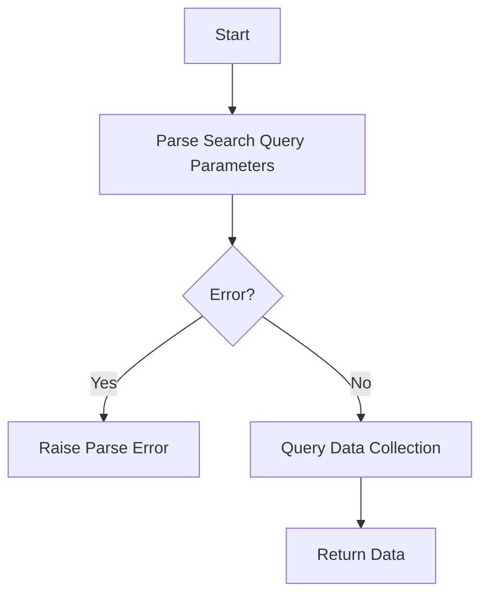

This document will cover the flow of handling search queries and retrieving replay data. We'll cover:

1. Parsing search query parameters
2. Handling errors
3. Querying the data collection

Technical document: <SwmLink doc-title="Overview of the data_fn Function">[Overview of the data_fn Function](/.swm/overview-of-the-data_fn-function.8h71kha8.sw.md)</SwmLink>

# [Parsing Search Query Parameters](https://app.swimm.io/repos/Z2l0aHViJTNBJTNBc2VudHJ5LWRlbW8tMSUzQSUzQVN3aW1tLURlbW8=/docs/8h71kha8#data_fn)

The first step in the flow is to parse the search query parameters from the request. This involves extracting the search terms that the user has inputted. These parameters are crucial as they define the scope and specifics of the data the user is interested in. For example, a user might want to filter replay data based on specific error messages or time frames.

# [Handling Errors](https://app.swimm.io/repos/Z2l0aHViJTNBJTNBc2VudHJ5LWRlbW8tMSUzQSUzQVN3aW1tLURlbW8=/docs/8h71kha8#data_fn)

If there is an issue with the search query parameters, such as an invalid format or unsupported search term, an error is raised. This ensures that the user is immediately informed of any issues with their query, allowing them to correct it and try again. This step is important for maintaining a smooth user experience and ensuring that only valid queries are processed.

# [Querying the Data Collection](https://app.swimm.io/repos/Z2l0aHViJTNBJTNBc2VudHJ5LWRlbW8tMSUzQSUzQVN3aW1tLURlbW8=/docs/8h71kha8#query_selector_collection)

Once the search query parameters are successfully parsed, the next step is to query the data collection. This involves using the parsed parameters to filter and retrieve the relevant replay data. The query includes additional arguments such as project IDs, start and end times, sort order, limit, and offset. These arguments help in narrowing down the data to exactly what the user needs. For instance, a user might want to see replay data for a specific project within a certain time frame, sorted by the most recent events.

&nbsp;

*This is an auto-generated document by Swimm AI 🌊 and has not yet been verified by a human*

<SwmMeta version="3.0.0" repo-id="Z2l0aHViJTNBJTNBc2VudHJ5LWRlbW8tMSUzQSUzQVN3aW1tLURlbW8=" repo-name="sentry-demo-1" doc-type="product-flows">Powered by [Swimm](/)</SwmMeta>
