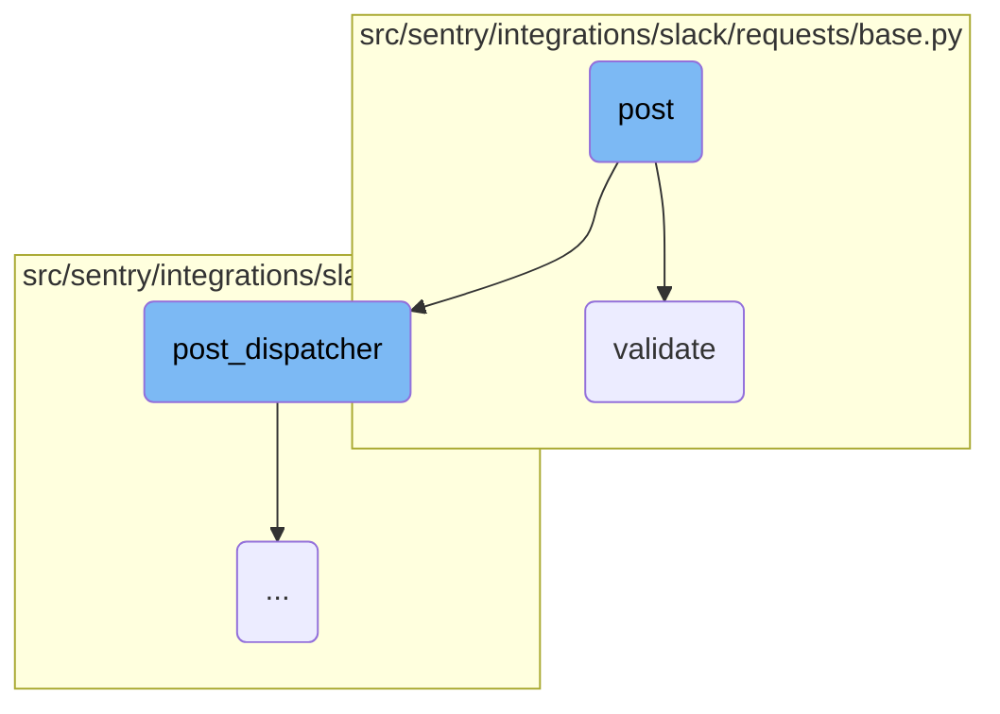

This document explains the <SwmToken path="src/sentry/integrations/slack/webhooks/command.py" pos="165:3:3" line-data="    def post(self, request: Request) -&gt; Response:">`post`</SwmToken> function, which is responsible for handling incoming Slack command requests. It outlines the steps involved in processing these requests, including validation, metrics tracking, and dispatching the request for further processing.

When a Slack command request comes in, the <SwmToken path="src/sentry/integrations/slack/webhooks/command.py" pos="165:3:3" line-data="    def post(self, request: Request) -&gt; Response:">`post`</SwmToken> function first creates a <SwmToken path="src/sentry/integrations/slack/webhooks/command.py" pos="167:1:1" line-data="            slack_request = self.slack_request_class(request)">`slack_request`</SwmToken> object from the incoming request. It then validates this request to ensure it contains all necessary information. If the validation fails, it logs the failure and returns an error response. If the validation succeeds, it logs the success and sends the request for further processing.

Here is a high level diagram of the flow, showing only the most important functions:

```mermaid
graph TD;
      subgraph src/sentry/integrations/slack
9b9d76c57a174967856f2bdaf763f1cf3a0a5feaaad22714dfb80bf315b634ab(post):::mainFlowStyle --> 2acc32e897f8f6a9dda62496c87ef1e8c79e4875de6aa1e12fab0674ea122e95(validate)
end

subgraph src/sentry/integrations/slack/webhooks
9b9d76c57a174967856f2bdaf763f1cf3a0a5feaaad22714dfb80bf315b634ab(post):::mainFlowStyle --> ba302aba31e26026640fd0a44935e2a90dfff0b65c463b553c509baf4e1f1dd6(post_dispatcher):::mainFlowStyle
end

subgraph src/sentry/integrations/slack
ba302aba31e26026640fd0a44935e2a90dfff0b65c463b553c509baf4e1f1dd6(post_dispatcher):::mainFlowStyle --> 9b86106bed10e3bbf1def0ee7c0f7984ab1fb681abaf26e3b1af3eafc9babc07(build):::mainFlowStyle
end

subgraph src/sentry/integrations/metric_alerts.py
9b86106bed10e3bbf1def0ee7c0f7984ab1fb681abaf26e3b1af3eafc9babc07(build):::mainFlowStyle --> 61adf78917ec9ab1d44bb9b0f44abc37d8fa51bd1540e49fb57468d506102f6d(incident_attachment_info):::mainFlowStyle
end

subgraph src/sentry/integrations/metric_alerts.py
61adf78917ec9ab1d44bb9b0f44abc37d8fa51bd1540e49fb57468d506102f6d(incident_attachment_info):::mainFlowStyle --> 260663063916df0ea3d72ae3c0c9ec154104a071985d9de81a5283f22a186b85(get_metric_count_from_incident):::mainFlowStyle
end

subgraph src/sentry
260663063916df0ea3d72ae3c0c9ec154104a071985d9de81a5283f22a186b85(get_metric_count_from_incident):::mainFlowStyle --> 94dbc6e3afb8bee885412faa44c97543dbcb8401730543f292eec9a3244e3d91(get_incident_aggregates):::mainFlowStyle
end

subgraph src/sentry
94dbc6e3afb8bee885412faa44c97543dbcb8401730543f292eec9a3244e3d91(get_incident_aggregates):::mainFlowStyle --> 0855223e36ac882841bbf2e0ef2fb632f98281c9458dac000c15db12ffb5feef(run_query):::mainFlowStyle
end

subgraph src/sentry
0855223e36ac882841bbf2e0ef2fb632f98281c9458dac000c15db12ffb5feef(run_query):::mainFlowStyle --> bf51ad13267b0a966b2f78892bc9022bf6d0ea51971125b7eca85fe6a433e525(bulk_run_query):::mainFlowStyle
end

subgraph src/sentry
bf51ad13267b0a966b2f78892bc9022bf6d0ea51971125b7eca85fe6a433e525(bulk_run_query):::mainFlowStyle --> afa26eb3bcd732ed408aeef284bae8b24d15a01fc92344a09b40589f8d4801c0(_resolve_metrics_query):::mainFlowStyle
end

subgraph src/sentry
afa26eb3bcd732ed408aeef284bae8b24d15a01fc92344a09b40589f8d4801c0(_resolve_metrics_query):::mainFlowStyle --> 1d3614071269a61836ba62a83fa4234bce0f250a3733a501066af92cf030bc5a(_lookup_indexer_resolve)
end

subgraph src/sentry
afa26eb3bcd732ed408aeef284bae8b24d15a01fc92344a09b40589f8d4801c0(_resolve_metrics_query):::mainFlowStyle --> 6a277fe7c0cc01093d1b577ff3ab42c24481442497f437a04de3caa10040371d(_resolve_query_metadata):::mainFlowStyle
end


      classDef mainFlowStyle color:#000000,fill:#7CB9F4
classDef rootsStyle color:#000000,fill:#00FFF4
classDef Style1 color:#000000,fill:#00FFAA
classDef Style2 color:#000000,fill:#FFFF00
classDef Style3 color:#000000,fill:#AA7CB9

%% Swimm:
%% graph TD;
%%       subgraph <SwmPath>[src/sentry/integrations/slack/](src/sentry/integrations/slack/)</SwmPath>
%% 9b9d76c57a174967856f2bdaf763f1cf3a0a5feaaad22714dfb80bf315b634ab(post):::mainFlowStyle --> 2acc32e897f8f6a9dda62496c87ef1e8c79e4875de6aa1e12fab0674ea122e95(validate)
%% end
%% 
%% subgraph <SwmPath>[src/sentry/integrations/slack/webhooks/](src/sentry/integrations/slack/webhooks/)</SwmPath>
%% 9b9d76c57a174967856f2bdaf763f1cf3a0a5feaaad22714dfb80bf315b634ab(post):::mainFlowStyle --> ba302aba31e26026640fd0a44935e2a90dfff0b65c463b553c509baf4e1f1dd6(post_dispatcher):::mainFlowStyle
%% end
%% 
%% subgraph <SwmPath>[src/sentry/integrations/slack/](src/sentry/integrations/slack/)</SwmPath>
%% ba302aba31e26026640fd0a44935e2a90dfff0b65c463b553c509baf4e1f1dd6(post_dispatcher):::mainFlowStyle --> 9b86106bed10e3bbf1def0ee7c0f7984ab1fb681abaf26e3b1af3eafc9babc07(build):::mainFlowStyle
%% end
%% 
%% subgraph <SwmPath>[src/sentry/integrations/metric_alerts.py](src/sentry/integrations/metric_alerts.py)</SwmPath>
%% 9b86106bed10e3bbf1def0ee7c0f7984ab1fb681abaf26e3b1af3eafc9babc07(build):::mainFlowStyle --> 61adf78917ec9ab1d44bb9b0f44abc37d8fa51bd1540e49fb57468d506102f6d(incident_attachment_info):::mainFlowStyle
%% end
%% 
%% subgraph <SwmPath>[src/sentry/integrations/metric_alerts.py](src/sentry/integrations/metric_alerts.py)</SwmPath>
%% 61adf78917ec9ab1d44bb9b0f44abc37d8fa51bd1540e49fb57468d506102f6d(incident_attachment_info):::mainFlowStyle --> 260663063916df0ea3d72ae3c0c9ec154104a071985d9de81a5283f22a186b85(get_metric_count_from_incident):::mainFlowStyle
%% end
%% 
%% subgraph <SwmPath>[src/sentry/](src/sentry/)</SwmPath>
%% 260663063916df0ea3d72ae3c0c9ec154104a071985d9de81a5283f22a186b85(get_metric_count_from_incident):::mainFlowStyle --> 94dbc6e3afb8bee885412faa44c97543dbcb8401730543f292eec9a3244e3d91(get_incident_aggregates):::mainFlowStyle
%% end
%% 
%% subgraph <SwmPath>[src/sentry/](src/sentry/)</SwmPath>
%% 94dbc6e3afb8bee885412faa44c97543dbcb8401730543f292eec9a3244e3d91(get_incident_aggregates):::mainFlowStyle --> 0855223e36ac882841bbf2e0ef2fb632f98281c9458dac000c15db12ffb5feef(run_query):::mainFlowStyle
%% end
%% 
%% subgraph <SwmPath>[src/sentry/](src/sentry/)</SwmPath>
%% 0855223e36ac882841bbf2e0ef2fb632f98281c9458dac000c15db12ffb5feef(run_query):::mainFlowStyle --> bf51ad13267b0a966b2f78892bc9022bf6d0ea51971125b7eca85fe6a433e525(bulk_run_query):::mainFlowStyle
%% end
%% 
%% subgraph <SwmPath>[src/sentry/](src/sentry/)</SwmPath>
%% bf51ad13267b0a966b2f78892bc9022bf6d0ea51971125b7eca85fe6a433e525(bulk_run_query):::mainFlowStyle --> afa26eb3bcd732ed408aeef284bae8b24d15a01fc92344a09b40589f8d4801c0(_resolve_metrics_query):::mainFlowStyle
%% end
%% 
%% subgraph <SwmPath>[src/sentry/](src/sentry/)</SwmPath>
%% afa26eb3bcd732ed408aeef284bae8b24d15a01fc92344a09b40589f8d4801c0(_resolve_metrics_query):::mainFlowStyle --> 1d3614071269a61836ba62a83fa4234bce0f250a3733a501066af92cf030bc5a(_lookup_indexer_resolve)
%% end
%% 
%% subgraph <SwmPath>[src/sentry/](src/sentry/)</SwmPath>
%% afa26eb3bcd732ed408aeef284bae8b24d15a01fc92344a09b40589f8d4801c0(_resolve_metrics_query):::mainFlowStyle --> 6a277fe7c0cc01093d1b577ff3ab42c24481442497f437a04de3caa10040371d(_resolve_query_metadata):::mainFlowStyle
%% end
%% 
%% 
%%       classDef mainFlowStyle color:#000000,fill:#7CB9F4
%% classDef rootsStyle color:#000000,fill:#00FFF4
%% classDef Style1 color:#000000,fill:#00FFAA
%% classDef Style2 color:#000000,fill:#FFFF00
%% classDef Style3 color:#000000,fill:#AA7CB9
```



# Flow drill down

First, we'll zoom into this section of the flow:



<SwmSnippet path="/src/sentry/integrations/slack/webhooks/command.py" line="165">

---

## Handling Slack command requests

The <SwmToken path="src/sentry/integrations/slack/webhooks/command.py" pos="165:3:3" line-data="    def post(self, request: Request) -&gt; Response:">`post`</SwmToken> function is responsible for handling incoming Slack command requests. It first creates a <SwmToken path="src/sentry/integrations/slack/webhooks/command.py" pos="167:1:1" line-data="            slack_request = self.slack_request_class(request)">`slack_request`</SwmToken> object from the incoming request and then validates it. If validation fails, it increments the appropriate failure metrics and returns a response indicating the error. If validation succeeds, it increments the success metrics and dispatches the request for further processing.

```python
    def post(self, request: Request) -> Response:
        try:
            slack_request = self.slack_request_class(request)
            slack_request.validate()
        except SlackRequestError as e:
            if e.status == status.HTTP_403_FORBIDDEN:
                metrics.incr(
                    self._METRICS_FAILURE_KEY + ".slack-commands-endpoint.forbidden",
                    sample_rate=1.0,
                )
                return self.respond(SlackDisconnectedMessageBuilder().build())
            metrics.incr(
                self._METRICS_FAILURE_KEY + ".slack-commands-endpoint.validation_error",
                sample_rate=1.0,
            )
            return self.respond(status=e.status)

        metrics.incr(self._METRICS_SUCCESS_KEY + ".slack-commands-endpoint", sample_rate=1.0)
        return super().post_dispatcher(slack_request)
```

---

</SwmSnippet>

<SwmSnippet path="/src/sentry/integrations/slack/requests/base.py" line="70">

---

### Validating Slack requests

The <SwmToken path="src/sentry/integrations/slack/requests/base.py" pos="70:3:3" line-data="    def validate(self) -&gt; None:">`validate`</SwmToken> function ensures that the incoming Slack request contains all necessary information for processing. It logs the request, retrieves the context, authorizes the request, validates the data, and checks the integration. This comprehensive validation helps in maintaining the integrity and security of the request processing.

```python
    def validate(self) -> None:
        """
        Ensure everything is present to properly process this request
        """
        self.request.body
        self._log_request()
        self._get_context()
        self.authorize()
        self._validate_data()
        self.validate_integration()
```

---

</SwmSnippet>

Now, lets zoom into this section of the flow:

```mermaid
graph TD;
      subgraph src/sentry/integrations/slack
ba302aba31e26026640fd0a44935e2a90dfff0b65c463b553c509baf4e1f1dd6(post_dispatcher):::mainFlowStyle --> 9b86106bed10e3bbf1def0ee7c0f7984ab1fb681abaf26e3b1af3eafc9babc07(build):::mainFlowStyle
end

subgraph src/sentry/integrations/metric_alerts.py
9b86106bed10e3bbf1def0ee7c0f7984ab1fb681abaf26e3b1af3eafc9babc07(build):::mainFlowStyle --> 61adf78917ec9ab1d44bb9b0f44abc37d8fa51bd1540e49fb57468d506102f6d(incident_attachment_info):::mainFlowStyle
end

subgraph src/sentry/integrations/metric_alerts.py
61adf78917ec9ab1d44bb9b0f44abc37d8fa51bd1540e49fb57468d506102f6d(incident_attachment_info):::mainFlowStyle --> 260663063916df0ea3d72ae3c0c9ec154104a071985d9de81a5283f22a186b85(get_metric_count_from_incident):::mainFlowStyle
end

subgraph src/sentry
260663063916df0ea3d72ae3c0c9ec154104a071985d9de81a5283f22a186b85(get_metric_count_from_incident):::mainFlowStyle --> 94dbc6e3afb8bee885412faa44c97543dbcb8401730543f292eec9a3244e3d91(get_incident_aggregates):::mainFlowStyle
end

subgraph src/sentry
94dbc6e3afb8bee885412faa44c97543dbcb8401730543f292eec9a3244e3d91(get_incident_aggregates):::mainFlowStyle --> 0855223e36ac882841bbf2e0ef2fb632f98281c9458dac000c15db12ffb5feef(run_query):::mainFlowStyle
end

subgraph src/sentry
0855223e36ac882841bbf2e0ef2fb632f98281c9458dac000c15db12ffb5feef(run_query):::mainFlowStyle --> bf51ad13267b0a966b2f78892bc9022bf6d0ea51971125b7eca85fe6a433e525(bulk_run_query):::mainFlowStyle
end

subgraph src/sentry
bf51ad13267b0a966b2f78892bc9022bf6d0ea51971125b7eca85fe6a433e525(bulk_run_query):::mainFlowStyle --> afa26eb3bcd732ed408aeef284bae8b24d15a01fc92344a09b40589f8d4801c0(_resolve_metrics_query):::mainFlowStyle
end

subgraph src/sentry
afa26eb3bcd732ed408aeef284bae8b24d15a01fc92344a09b40589f8d4801c0(_resolve_metrics_query):::mainFlowStyle --> 1d3614071269a61836ba62a83fa4234bce0f250a3733a501066af92cf030bc5a(_lookup_indexer_resolve)
end

subgraph src/sentry
afa26eb3bcd732ed408aeef284bae8b24d15a01fc92344a09b40589f8d4801c0(_resolve_metrics_query):::mainFlowStyle --> 6a277fe7c0cc01093d1b577ff3ab42c24481442497f437a04de3caa10040371d(_resolve_query_metadata):::mainFlowStyle
end

subgraph src/sentry
1d3614071269a61836ba62a83fa4234bce0f250a3733a501066af92cf030bc5a(_lookup_indexer_resolve) --> 9feba02f7a756e7911be847fa1baa7a3e1cd8bde3767144ba9c172f60dd737d0(_lookup_indexer_resolve_exp)
end


      classDef mainFlowStyle color:#000000,fill:#7CB9F4
classDef rootsStyle color:#000000,fill:#00FFF4
classDef Style1 color:#000000,fill:#00FFAA
classDef Style2 color:#000000,fill:#FFFF00
classDef Style3 color:#000000,fill:#AA7CB9

%% Swimm:
%% graph TD;
%%       subgraph <SwmPath>[src/sentry/integrations/slack/](src/sentry/integrations/slack/)</SwmPath>
%% ba302aba31e26026640fd0a44935e2a90dfff0b65c463b553c509baf4e1f1dd6(post_dispatcher):::mainFlowStyle --> 9b86106bed10e3bbf1def0ee7c0f7984ab1fb681abaf26e3b1af3eafc9babc07(build):::mainFlowStyle
%% end
%% 
%% subgraph <SwmPath>[src/sentry/integrations/metric_alerts.py](src/sentry/integrations/metric_alerts.py)</SwmPath>
%% 9b86106bed10e3bbf1def0ee7c0f7984ab1fb681abaf26e3b1af3eafc9babc07(build):::mainFlowStyle --> 61adf78917ec9ab1d44bb9b0f44abc37d8fa51bd1540e49fb57468d506102f6d(incident_attachment_info):::mainFlowStyle
%% end
%% 
%% subgraph <SwmPath>[src/sentry/integrations/metric_alerts.py](src/sentry/integrations/metric_alerts.py)</SwmPath>
%% 61adf78917ec9ab1d44bb9b0f44abc37d8fa51bd1540e49fb57468d506102f6d(incident_attachment_info):::mainFlowStyle --> 260663063916df0ea3d72ae3c0c9ec154104a071985d9de81a5283f22a186b85(get_metric_count_from_incident):::mainFlowStyle
%% end
%% 
%% subgraph <SwmPath>[src/sentry/](src/sentry/)</SwmPath>
%% 260663063916df0ea3d72ae3c0c9ec154104a071985d9de81a5283f22a186b85(get_metric_count_from_incident):::mainFlowStyle --> 94dbc6e3afb8bee885412faa44c97543dbcb8401730543f292eec9a3244e3d91(get_incident_aggregates):::mainFlowStyle
%% end
%% 
%% subgraph <SwmPath>[src/sentry/](src/sentry/)</SwmPath>
%% 94dbc6e3afb8bee885412faa44c97543dbcb8401730543f292eec9a3244e3d91(get_incident_aggregates):::mainFlowStyle --> 0855223e36ac882841bbf2e0ef2fb632f98281c9458dac000c15db12ffb5feef(run_query):::mainFlowStyle
%% end
%% 
%% subgraph <SwmPath>[src/sentry/](src/sentry/)</SwmPath>
%% 0855223e36ac882841bbf2e0ef2fb632f98281c9458dac000c15db12ffb5feef(run_query):::mainFlowStyle --> bf51ad13267b0a966b2f78892bc9022bf6d0ea51971125b7eca85fe6a433e525(bulk_run_query):::mainFlowStyle
%% end
%% 
%% subgraph <SwmPath>[src/sentry/](src/sentry/)</SwmPath>
%% bf51ad13267b0a966b2f78892bc9022bf6d0ea51971125b7eca85fe6a433e525(bulk_run_query):::mainFlowStyle --> afa26eb3bcd732ed408aeef284bae8b24d15a01fc92344a09b40589f8d4801c0(_resolve_metrics_query):::mainFlowStyle
%% end
%% 
%% subgraph <SwmPath>[src/sentry/](src/sentry/)</SwmPath>
%% afa26eb3bcd732ed408aeef284bae8b24d15a01fc92344a09b40589f8d4801c0(_resolve_metrics_query):::mainFlowStyle --> 1d3614071269a61836ba62a83fa4234bce0f250a3733a501066af92cf030bc5a(_lookup_indexer_resolve)
%% end
%% 
%% subgraph <SwmPath>[src/sentry/](src/sentry/)</SwmPath>
%% afa26eb3bcd732ed408aeef284bae8b24d15a01fc92344a09b40589f8d4801c0(_resolve_metrics_query):::mainFlowStyle --> 6a277fe7c0cc01093d1b577ff3ab42c24481442497f437a04de3caa10040371d(_resolve_query_metadata):::mainFlowStyle
%% end
%% 
%% subgraph <SwmPath>[src/sentry/](src/sentry/)</SwmPath>
%% 1d3614071269a61836ba62a83fa4234bce0f250a3733a501066af92cf030bc5a(_lookup_indexer_resolve) --> 9feba02f7a756e7911be847fa1baa7a3e1cd8bde3767144ba9c172f60dd737d0(_lookup_indexer_resolve_exp)
%% end
%% 
%% 
%%       classDef mainFlowStyle color:#000000,fill:#7CB9F4
%% classDef rootsStyle color:#000000,fill:#00FFF4
%% classDef Style1 color:#000000,fill:#00FFAA
%% classDef Style2 color:#000000,fill:#FFFF00
%% classDef Style3 color:#000000,fill:#AA7CB9
```



<SwmSnippet path="/src/sentry/integrations/slack/webhooks/base.py" line="45">

---

## Handling Slack Commands

The <SwmToken path="src/sentry/integrations/slack/webhooks/command.py" pos="183:7:7" line-data="        return super().post_dispatcher(slack_request)">`post_dispatcher`</SwmToken> function handles various Slack commands by validating the request and dispatching it to the appropriate handler. It supports commands like 'help', 'link', and 'unlink', and provides responses accordingly.

```python
        command, args = request.get_command_and_args()

        if command in ["help", "", "support", "docs"]:
            return self.respond(SlackHelpMessageBuilder(command=command).build())

        if command == "link":
            if not args:
                return self.link_user(request)

            if args[0] == "team":
                return self.link_team(request)

        if command == "unlink":
            if not args:
                return self.unlink_user(request)

            if args[0] == "team":
                return self.unlink_team(request)

        # If we cannot interpret the command, print help text.
        request_data = request.data
```

---

</SwmSnippet>

<SwmSnippet path="/src/sentry/integrations/slack/message_builder/incidents.py" line="49">

---

## Building Incident Messages

The <SwmToken path="src/sentry/integrations/slack/webhooks/command.py" pos="175:11:11" line-data="                return self.respond(SlackDisconnectedMessageBuilder().build())">`build`</SwmToken> function constructs a Slack message for an incident alert. It gathers incident data, formats the message content, and includes additional information like alert rule descriptions and metric alert charts if available.

```python
        alert_rule = self.action.alert_rule_trigger.alert_rule
        data = incident_attachment_info(
            self.incident,
            self.new_status,
            self.metric_value,
            self.notification_uuid,
            referrer="metric_alert_slack",
        )
        incident_text = f"{data['text']}\n{get_started_at(data['ts'])}"
        blocks = [
            self.get_markdown_block(text=incident_text),
        ]

        if (
            alert_rule.description
            and features.has(
                "organizations:slack-metric-alert-description", self.incident.organization
            )
            and not self.new_status == IncidentStatus.CLOSED
        ):
            description = self.get_markdown_block(text=f"*Notes*: {alert_rule.description}")
```

---

</SwmSnippet>

<SwmSnippet path="/src/sentry/integrations/metric_alerts.py" line="110">

---

### Gathering Incident Data

The <SwmToken path="src/sentry/integrations/slack/message_builder/incidents.py" pos="50:5:5" line-data="        data = incident_attachment_info(">`incident_attachment_info`</SwmToken> function collects and formats data related to an incident, such as the alert rule, status, and metric values. This data is used to build the incident message.

```python
    alert_rule = incident.alert_rule

    status = INCIDENT_STATUS[new_status]

    if metric_value is None:
        metric_value = get_metric_count_from_incident(incident)

    text = get_incident_status_text(alert_rule, metric_value)
    if features.has("organizations:anomaly-detection-alerts", incident.organization):
        text += f"\nThreshold: {alert_rule.detection_type.title()}"

    title = f"{status}: {alert_rule.name}"

    title_link_params = {
        "alert": str(incident.identifier),
        "referrer": referrer,
        "detection_type": alert_rule.detection_type,
    }
    if notification_uuid:
        title_link_params["notification_uuid"] = notification_uuid

```

---

</SwmSnippet>

<SwmSnippet path="/src/sentry/integrations/metric_alerts.py" line="44">

---

### Fetching Metric Count

The <SwmToken path="src/sentry/integrations/metric_alerts.py" pos="115:5:5" line-data="        metric_value = get_metric_count_from_incident(incident)">`get_metric_count_from_incident`</SwmToken> function retrieves the current or last count of an incident aggregate, which is essential for understanding the incident's impact.

```python
    incident_trigger = (
        IncidentTrigger.objects.filter(incident=incident).order_by("-date_modified").first()
    )
    if incident_trigger:
        alert_rule_trigger = incident_trigger.alert_rule_trigger
        # TODO: If we're relying on this and expecting possible delays between a
        # trigger fired and this function running, then this could actually be
        # incorrect if they changed the trigger's time window in this time period.
        # Should we store it?
        start = incident_trigger.date_modified - timedelta(
            seconds=alert_rule_trigger.alert_rule.snuba_query.time_window
        )
        end = incident_trigger.date_modified
    else:
        start, end = None, None

    return get_incident_aggregates(incident=incident, start=start, end=end).get("count")
```

---

</SwmSnippet>

<SwmSnippet path="/src/sentry/incidents/logic.py" line="422">

---

### Calculating Incident Aggregates

The <SwmToken path="src/sentry/incidents/logic.py" pos="439:14:14" line-data="        results = query_builder.run_query(referrer=&quot;incidents.get_incident_aggregates&quot;)">`get_incident_aggregates`</SwmToken> function calculates aggregate statistics for an incident over its lifetime or a specified range, providing insights into the incident's metrics.

```python
    incident: Incident,
    start: datetime | None = None,
    end: datetime | None = None,
    windowed_stats: bool = False,
) -> dict[str, float | int]:
    """
    Calculates aggregate stats across the life of an incident, or the provided range.
    """
    snuba_query = incident.alert_rule.snuba_query
    entity_subscription = get_entity_subscription_from_snuba_query(
        snuba_query,
        incident.organization_id,
    )
    query_builder = build_incident_query_builder(
        incident, entity_subscription, start, end, windowed_stats
    )
    try:
        results = query_builder.run_query(referrer="incidents.get_incident_aggregates")
    except Exception:
        metrics.incr(
            "incidents.get_incident_aggregates.snql.query.error",
```

---

</SwmSnippet>

<SwmSnippet path="/src/sentry/snuba/metrics_layer/query.py" line="144">

---

## Running Queries

The <SwmToken path="src/sentry/incidents/logic.py" pos="439:7:7" line-data="        results = query_builder.run_query(referrer=&quot;incidents.get_incident_aggregates&quot;)">`run_query`</SwmToken> function serves as the entry point for executing a metrics query in Snuba, delegating the task to <SwmToken path="src/sentry/snuba/metrics_layer/query.py" pos="147:3:3" line-data="    return bulk_run_query([request])[0]">`bulk_run_query`</SwmToken>.

```python
    """
    Entrypoint for executing a metrics query in Snuba.
    """
    return bulk_run_query([request])[0]
```

---

</SwmSnippet>

<SwmSnippet path="/src/sentry/snuba/metrics_layer/query.py" line="82">

---

### Executing Bulk Queries

The <SwmToken path="src/sentry/snuba/metrics_layer/query.py" pos="147:3:3" line-data="    return bulk_run_query([request])[0]">`bulk_run_query`</SwmToken> function executes multiple metrics queries in a single request, handling the setup, execution, and result processing of these queries.

```python
    """
    Entrypoint for executing a list of metrics queries in Snuba.

    This function is used to execute multiple metrics queries in a single request.
    """
    if not requests:
        return []

    queries = []
    for request in requests:
        request, start, end = _setup_metrics_query(request)
        queries.append([request, start, end])

    logging_tags = {"referrer": request.tenant_ids["referrer"] or "unknown", "lang": "mql"}

    for q in queries:
        q[0], reverse_mappings, mappings = _resolve_metrics_query(q[0], logging_tags)
        q.extend([reverse_mappings, mappings])

    try:
        snuba_results = bulk_snuba_queries(
```

---

</SwmSnippet>

<SwmSnippet path="/src/sentry/snuba/metrics_layer/query.py" line="243">

---

### Resolving Metrics Queries

The <SwmToken path="src/sentry/snuba/metrics_layer/query.py" pos="98:14:14" line-data="        q[0], reverse_mappings, mappings = _resolve_metrics_query(q[0], logging_tags)">`_resolve_metrics_query`</SwmToken> function resolves various components of a metrics query, such as indexer lookups and metadata, ensuring the query is correctly formatted for execution.

```python
    request: Request, logging_tags: dict[str, str]
) -> tuple[Request, ReverseMappings, dict[str, str | int]]:
    metrics_query = request.query

    try:
        # There are two kinds of resolving: lookup up in the indexer, and resolving things like
        # aggregate_alias, entities and use_case_id.
        metrics_query, mappings = _resolve_query_metadata(metrics_query)
        # Release health AKA sessions uses a separate Dataset. Change the dataset based on the use case id.
        # This is necessary here because the product code that uses this isn't aware of which feature is
        # using it.
        if metrics_query.scope.use_case_id == UseCaseID.SESSIONS.value:
            request.dataset = Dataset.Metrics.value
        else:
            request.dataset = Dataset.PerformanceMetrics.value
        indexer_mappings, reverse_mappings = _lookup_indexer_resolve(metrics_query, request.dataset)
        mappings.update(indexer_mappings)
        request.query = metrics_query.set_indexer_mappings(mappings)
        request.tenant_ids["use_case_id"] = metrics_query.scope.use_case_id
    except Exception:
        metrics.incr(
```

---

</SwmSnippet>

<SwmSnippet path="/src/sentry/snuba/metrics_layer/query.py" line="384">

---

### Indexer Resolution

The <SwmToken path="src/sentry/snuba/metrics_layer/query.py" pos="258:8:8" line-data="        indexer_mappings, reverse_mappings = _lookup_indexer_resolve(metrics_query, request.dataset)">`_lookup_indexer_resolve`</SwmToken> function completes indexer resolutions for a metrics query, mapping strings to their resolved values and returning these mappings.

```python
    metrics_query: MetricsQuery, dataset: str
) -> tuple[Mapping[str, str | int], ReverseMappings]:
    """
    Returns an updated metrics query with all the indexer resolves complete. Also returns a mapping
    that shows all the strings that were resolved and what they were resolved too.
    """
    reverse_mappings = ReverseMappings()
    org_id = metrics_query.scope.org_ids[0]
    use_case_id = string_to_use_case_id(metrics_query.scope.use_case_id)
    indexer_mappings = _lookup_indexer_resolve_exp(
        metrics_query.query, org_id, use_case_id, dataset, reverse_mappings
    )
    return indexer_mappings, reverse_mappings
```

---

</SwmSnippet>

<SwmSnippet path="/src/sentry/snuba/metrics_layer/query.py" line="273">

---

### Query Metadata Resolution

The <SwmToken path="src/sentry/snuba/metrics_layer/query.py" pos="250:8:8" line-data="        metrics_query, mappings = _resolve_query_metadata(metrics_query)">`_resolve_query_metadata`</SwmToken> function resolves all fields of a metric in the query, converting public names to their corresponding <SwmToken path="src/sentry/snuba/metrics_layer/query.py" pos="542:9:9" line-data="    resolve all the metric IDs into MRIs.">`IDs`</SwmToken> and entities, and returning a mapping of these resolutions.

```python
    metrics_query: MetricsQuery,
) -> tuple[MetricsQuery, dict[str, str | int]]:
    """
    Resolves all the fields of the Metric in the query. Public name -> MRI -> ID -> Entity.
    Returns a mapping dictionary that shows any resolving that the function did.

    Right now (2023-12-18) this function returns a modified query, since Timeseries objects have a Metric, and
    it's required for that Metric to have an ID in the SDK. Ideally, this function would only return a mapping
    and not modify the query at all. That simplifies the logic quite a bit.
    """
    assert metrics_query.query is not None

    org_id = metrics_query.scope.org_ids[0]
    use_case_ids = _resolve_use_case_ids(metrics_query.query)

    if not use_case_ids:
        raise InvalidParams("No use case found in formula parameters")
    if len(use_case_ids) > 1:
        raise InvalidParams("Formula parameters must all be from the same use case")
    use_case_id_str = use_case_ids.pop()

```

---

</SwmSnippet>

<SwmSnippet path="/src/sentry/snuba/metrics_layer/query.py" line="400">

---

### Recursive Indexer Resolution

The <SwmToken path="src/sentry/snuba/metrics_layer/query.py" pos="418:5:5" line-data="                new_mappings = _lookup_indexer_resolve_exp(">`_lookup_indexer_resolve_exp`</SwmToken> function recursively resolves indexer mappings for complex query components like formulas and timeseries, ensuring all parts of the query are correctly resolved.

```python
    exp: Formula | Timeseries,
    org_id: int,
    use_case_id: UseCaseID,
    dataset: str,
    reverse_mappings: ReverseMappings,
) -> Mapping[str, str | int]:
    indexer_mappings: dict[str, str | int] = {}
    new_mappings = _lookup_resolve_groupby(exp.groupby, use_case_id, org_id, reverse_mappings)
    indexer_mappings.update(new_mappings)
    new_mappings = _lookup_resolve_filters(
        exp.filters, use_case_id, org_id, dataset, reverse_mappings
    )
    indexer_mappings.update(new_mappings)

    if isinstance(exp, Formula):
        parameters = exp.parameters
        for i, p in enumerate(parameters):
            if isinstance(p, (Formula, Timeseries)):
                new_mappings = _lookup_indexer_resolve_exp(
                    p, org_id, use_case_id, dataset, reverse_mappings
                )
```

---

</SwmSnippet>

&nbsp;

*This is an auto-generated document by Swimm AI 🌊 and has not yet been verified by a human*

<SwmMeta version="3.0.0" repo-id="Z2l0aHViJTNBJTNBc2VudHJ5LWRlbW8tMSUzQSUzQVN3aW1tLURlbW8=" repo-name="sentry-demo-1" doc-type="flows"><sup>Powered by [Swimm](/)</sup></SwmMeta>
