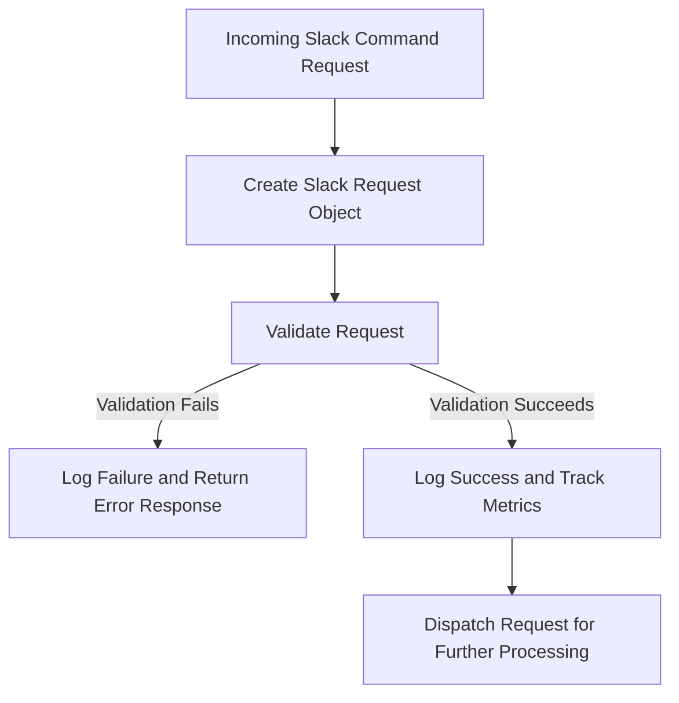

This document will cover the process of handling Slack command requests, which includes:

1. Validating the Slack request
2. Tracking metrics for success and failure
3. Dispatching the request for further processing.

Technical document: <SwmLink doc-title="Handling Slack Command Requests">[Handling Slack Command Requests](/.swm/handling-slack-command-requests.01x8hlcm.sw.md)</SwmLink>

# [Validating the Slack Request](https://app.swimm.io/repos/Z2l0aHViJTNBJTNBc2VudHJ5LWRlbW8tMSUzQSUzQVN3aW1tLURlbW8=/docs/01x8hlcm#validating-slack-requests)

When a Slack command request is received, the first step is to validate the request. This involves ensuring that the request contains all the necessary information for processing. The validation process includes logging the request, retrieving the context, authorizing the request, validating the data, and checking the integration. This comprehensive validation helps maintain the integrity and security of the request processing. If any of these checks fail, the request is considered invalid, and an error response is generated.

# [Tracking Metrics for Success and Failure](https://app.swimm.io/repos/Z2l0aHViJTNBJTNBc2VudHJ5LWRlbW8tMSUzQSUzQVN3aW1tLURlbW8=/docs/01x8hlcm#handling-slack-command-requests)

After validating the Slack request, the system tracks metrics to monitor the success or failure of the request handling. If the validation fails, the system increments the appropriate failure metrics and returns a response indicating the error. This helps in identifying and analyzing the reasons for failures. If the validation succeeds, the system increments the success metrics. This tracking is crucial for maintaining a high level of service quality and for identifying areas that may need improvement.

# [Dispatching the Request for Further Processing](https://app.swimm.io/repos/Z2l0aHViJTNBJTNBc2VudHJ5LWRlbW8tMSUzQSUzQVN3aW1tLURlbW8=/docs/01x8hlcm#handling-slack-commands)

Once the Slack request is validated and the success metrics are tracked, the request is dispatched for further processing. This involves determining the specific command and its arguments from the request. The system supports various commands such as 'help', 'link', and 'unlink'. Depending on the command, the request is routed to the appropriate handler. For example, a 'link' command without arguments will link a user, while a 'link team' command will link a team. This step ensures that the correct action is taken based on the user's command, providing a responsive and accurate interaction with the Slack integration.

&nbsp;

*This is an auto-generated document by Swimm AI 🌊 and has not yet been verified by a human*

<SwmMeta version="3.0.0" repo-id="Z2l0aHViJTNBJTNBc2VudHJ5LWRlbW8tMSUzQSUzQVN3aW1tLURlbW8=" repo-name="sentry-demo-1" doc-type="product-flows">Powered by [Swimm](/)</SwmMeta>
