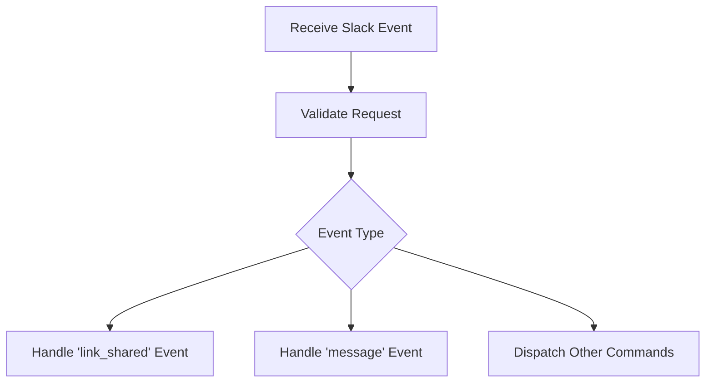

This document will cover the process of handling Slack events, focusing on the following aspects:

1. Validating incoming Slack events
2. Handling 'link_shared' events
3. Handling 'message' events
4. Dispatching other commands.

Technical document: <SwmLink doc-title="Handling Slack Events">[Handling Slack Events](/.swm/handling-slack-events.j4okfnjr.sw.md)</SwmLink>

# [Validating Incoming Slack Events](https://app.swimm.io/repos/Z2l0aHViJTNBJTNBc2VudHJ5LWRlbW8tMSUzQSUzQVN3aW1tLURlbW8=/docs/j4okfnjr#handling-slack-events)

When a Slack event is received, the first step is to validate the request to ensure it is legitimate. This involves checking the authenticity of the request to prevent unauthorized or malicious events from being processed. If the validation fails, the request is rejected, and an appropriate response is sent back to Slack.

# [Handling 'link_shared' Events](https://app.swimm.io/repos/Z2l0aHViJTNBJTNBc2VudHJ5LWRlbW8tMSUzQSUzQVN3aW1tLURlbW8=/docs/j4okfnjr#processing-link-shared-events)

If the event type is 'link_shared', the system calls the function responsible for handling link unfurling. This function extracts the links from the event data and matches them to known link types. It then sends the appropriate data back to Slack to unfurl the links, providing a richer user experience by displaying additional information about the links directly within Slack.

# [Handling 'message' Events](https://app.swimm.io/repos/Z2l0aHViJTNBJTNBc2VudHJ5LWRlbW8tMSUzQSUzQVN3aW1tLURlbW8=/docs/j4okfnjr#handling-slack-events)

For 'message' events, the system first checks if the message is from a bot. If it is, the message is ignored to prevent automated responses from bots. If the message is from a user, the system processes it accordingly, which may involve responding to the message or performing other actions based on the message content.

# [Dispatching Other Commands](https://app.swimm.io/repos/Z2l0aHViJTNBJTNBc2VudHJ5LWRlbW8tMSUzQSUzQVN3aW1tLURlbW8=/docs/j4okfnjr#handling-slack-events)

For other types of commands, the system uses a dispatcher to handle them. This involves identifying the command and executing the corresponding function to perform the required action. This modular approach allows for easy addition of new commands and functionalities in the future.

&nbsp;

*This is an auto-generated document by Swimm AI 🌊 and has not yet been verified by a human*

<SwmMeta version="3.0.0" repo-id="Z2l0aHViJTNBJTNBc2VudHJ5LWRlbW8tMSUzQSUzQVN3aW1tLURlbW8=" repo-name="sentry-demo-1" doc-type="product-flows">Powered by [Swimm](/)</SwmMeta>
