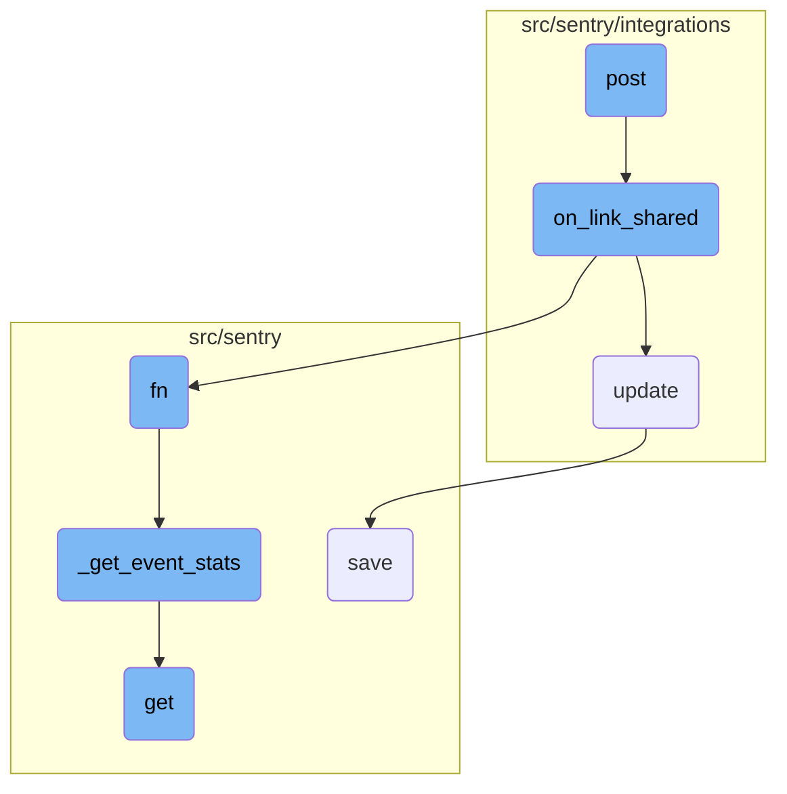

This document explains the process of handling Slack events, particularly focusing on the <SwmToken path="src/sentry/integrations/slack/webhooks/event.py" pos="264:3:3" line-data="    def post(self, request: Request) -&gt; Response:">`post`</SwmToken> function. The <SwmToken path="src/sentry/integrations/slack/webhooks/event.py" pos="264:3:3" line-data="    def post(self, request: Request) -&gt; Response:">`post`</SwmToken> function is responsible for processing incoming Slack events, validating the requests, and determining the type of event to handle it appropriately.

The flow starts with the <SwmToken path="src/sentry/integrations/slack/webhooks/event.py" pos="264:3:3" line-data="    def post(self, request: Request) -&gt; Response:">`post`</SwmToken> function receiving an incoming Slack event. It first validates the request to ensure it's legitimate. If the event is a <SwmToken path="src/sentry/integrations/slack/webhooks/event.py" pos="273:10:10" line-data="        if slack_request.type == &quot;link_shared&quot;:">`link_shared`</SwmToken> type, it calls the <SwmToken path="src/sentry/integrations/slack/webhooks/event.py" pos="153:3:3" line-data="    def on_link_shared(self, request: Request, slack_request: SlackDMRequest) -&gt; bool:">`on_link_shared`</SwmToken> function to handle the link unfurling. The <SwmToken path="src/sentry/integrations/slack/webhooks/event.py" pos="153:3:3" line-data="    def on_link_shared(self, request: Request, slack_request: SlackDMRequest) -&gt; bool:">`on_link_shared`</SwmToken> function extracts the links from the event data, matches them to known link types, and sends the appropriate data back to Slack. If the event type is 'message', it checks if the message is from a bot and responds accordingly. For other commands, it uses a dispatcher to handle them.

# Flow drill down



<SwmSnippet path="/src/sentry/integrations/slack/webhooks/event.py" line="264">

---

## Handling Slack Link Sharing Events

The <SwmToken path="src/sentry/integrations/slack/webhooks/event.py" pos="264:3:3" line-data="    def post(self, request: Request) -&gt; Response:">`post`</SwmToken> function processes incoming Slack events. It validates the request and determines the type of event. If the event is a <SwmToken path="src/sentry/integrations/slack/webhooks/event.py" pos="273:10:10" line-data="        if slack_request.type == &quot;link_shared&quot;:">`link_shared`</SwmToken> type, it calls the <SwmToken path="src/sentry/integrations/slack/webhooks/event.py" pos="274:5:5" line-data="            if self.on_link_shared(request, slack_request):">`on_link_shared`</SwmToken> function to handle the link unfurling.

```python
    def post(self, request: Request) -> Response:
        try:
            slack_request = self.slack_request_class(request)
            slack_request.validate()
        except SlackRequestError as e:
            return self.respond(status=e.status)

        if slack_request.is_challenge():
            return self.on_url_verification(request, slack_request.data)
        if slack_request.type == "link_shared":
            if self.on_link_shared(request, slack_request):
                return self.respond()

        if slack_request.type == "message":
            if slack_request.is_bot():
                return self.respond()

            command, _ = slack_request.get_command_and_args()

            if command in COMMANDS:
                resp = super().post_dispatcher(slack_request)
```

---

</SwmSnippet>

<SwmSnippet path="/src/sentry/integrations/slack/webhooks/event.py" line="153">

---

### Processing Link Shared Events

The <SwmToken path="src/sentry/integrations/slack/webhooks/event.py" pos="153:3:3" line-data="    def on_link_shared(self, request: Request, slack_request: SlackDMRequest) -&gt; bool:">`on_link_shared`</SwmToken> function processes <SwmToken path="src/sentry/integrations/slack/webhooks/event.py" pos="273:10:10" line-data="        if slack_request.type == &quot;link_shared&quot;:">`link_shared`</SwmToken> events from Slack. It extracts the links from the event data, matches them to known link types, and unfurls them by sending the appropriate data back to Slack.

```python
    def on_link_shared(self, request: Request, slack_request: SlackDMRequest) -> bool:
        """Returns true on success"""
        matches: MutableMapping[LinkType, list[UnfurlableUrl]] = defaultdict(list)
        links_seen = set()

        data = slack_request.data.get("event", {})

        logger_params = {
            "integration_id": slack_request.integration.id,
            "team_id": slack_request.team_id,
            "channel_id": slack_request.channel_id,
            "user_id": slack_request.user_id,
            "channel": slack_request.channel_id,
            **data,
        }

        # An unfurl may have multiple links to unfurl
        for item in data.get("links", []):
            try:
                url = item["url"]
            except Exception:
```

---

</SwmSnippet>

<SwmSnippet path="/src/sentry/integrations/api/bases/external_actor.py" line="102">

---

## Updating External Actors

The <SwmToken path="src/sentry/integrations/api/bases/external_actor.py" pos="102:3:3" line-data="    def update(">`update`</SwmToken> function updates an <SwmToken path="src/sentry/integrations/api/bases/external_actor.py" pos="103:7:7" line-data="        self, instance: ExternalActor, validated_data: MutableMapping[str, Any]">`ExternalActor`</SwmToken> instance with validated data. It ensures the instance is of the correct type and saves the updated instance, handling any integrity errors that may arise.

```python
    def update(
        self, instance: ExternalActor, validated_data: MutableMapping[str, Any]
    ) -> ExternalActor:
        # Discard the object ID passed by the API.
        if "id" in validated_data:
            validated_data.pop("id")

        if self._actor_key in validated_data:
            validated_data.update(self.get_actor_params({**validated_data}))

        for key, value in validated_data.items():
            setattr(self.instance, key, value)
        try:
            assert type(self.instance) is ExternalActor, "Instance type must be ExternalActor"
            self.instance.save()
            return self.instance
        except IntegrityError:
            raise serializers.ValidationError(
                "There already exists an external association with this external_name and provider."
            )
```

---

</SwmSnippet>

&nbsp;

*This is an auto-generated document by Swimm AI 🌊 and has not yet been verified by a human*

<SwmMeta version="3.0.0" repo-id="Z2l0aHViJTNBJTNBc2VudHJ5LWRlbW8tMSUzQSUzQVN3aW1tLURlbW8=" repo-name="sentry-demo-1" doc-type="flows"><sup>Powered by [Swimm](/)</sup></SwmMeta>
