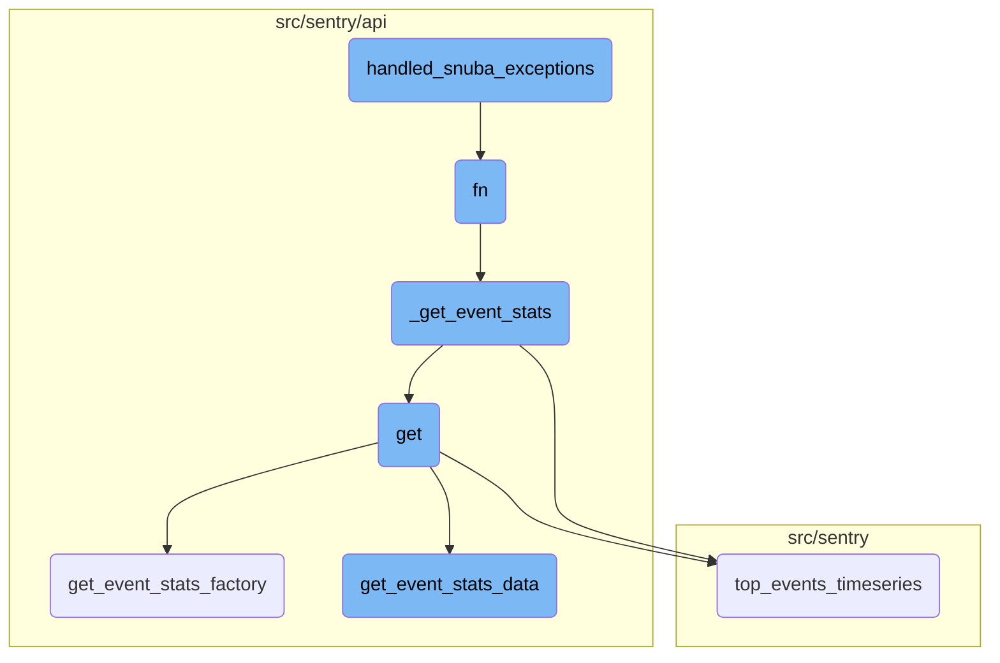
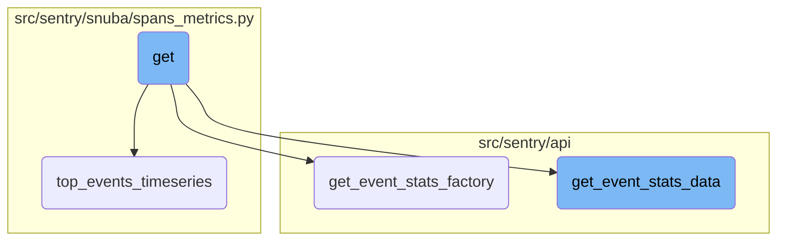

In this document, we will explain the role and functionality of <SwmToken path="src/sentry/replays/usecases/errors.py" pos="21:2:2" line-data="def handled_snuba_exceptions(fn):">`handled_snuba_exceptions`</SwmToken>. This function is crucial for managing exceptions that occur during Snuba queries, ensuring that errors are handled gracefully and appropriate responses are returned.

The flow starts with the <SwmToken path="src/sentry/replays/usecases/errors.py" pos="21:2:2" line-data="def handled_snuba_exceptions(fn):">`handled_snuba_exceptions`</SwmToken> function, which wraps around another function to catch and handle various exceptions that might occur during Snuba queries. If an exception is caught, it returns an appropriate error response. This ensures that the system can handle errors gracefully without crashing. The wrapped function, <SwmToken path="src/sentry/replays/usecases/errors.py" pos="21:4:4" line-data="def handled_snuba_exceptions(fn):">`fn`</SwmToken>, is responsible for querying event statistics, checking conditions, and calling <SwmToken path="src/sentry/api/endpoints/organization_events_stats.py" pos="276:3:3" line-data="        def _get_event_stats(">`_get_event_stats`</SwmToken> if necessary. <SwmToken path="src/sentry/api/endpoints/organization_events_stats.py" pos="276:3:3" line-data="        def _get_event_stats(">`_get_event_stats`</SwmToken> then queries the scoped dataset and either calls <SwmToken path="src/sentry/api/endpoints/organization_events_stats.py" pos="286:5:5" line-data="                return scoped_dataset.top_events_timeseries(">`top_events_timeseries`</SwmToken> or performs a timeseries query. Finally, the results are processed and returned to the user.

Here is a high level diagram of the flow, showing only the most important functions:



# Flow drill down

First, we'll zoom into this section of the flow:

```mermaid
graph TD;
      subgraph src/sentry
35a06839cf48e05d165c8b51df27fd1f1391c1318419609951207610a1b06e87(handled_snuba_exceptions):::mainFlowStyle --> 780bcbb7f1ba504427a19b761ba7a3bd49ed1d66d66daa8ef3d67ccaf80a796b(fn):::mainFlowStyle
end

subgraph src/sentry
780bcbb7f1ba504427a19b761ba7a3bd49ed1d66d66daa8ef3d67ccaf80a796b(fn):::mainFlowStyle --> ad78852d294414355cc4c1d586c85e1393b026807c627189ee95bfe783a81e9d(_get_event_stats):::mainFlowStyle
end

subgraph src/sentry
ad78852d294414355cc4c1d586c85e1393b026807c627189ee95bfe783a81e9d(_get_event_stats):::mainFlowStyle --> bc6d31d72bc18284a8d977c0ed48626395c14e576180df10f123120acbdabb9b(top_events_timeseries)
end

subgraph src/sentry
ad78852d294414355cc4c1d586c85e1393b026807c627189ee95bfe783a81e9d(_get_event_stats):::mainFlowStyle --> abc6480ff9e6702434a01780407f1b1b353e9678808b51b4270e726788e2f826(get):::mainFlowStyle
end

subgraph src/sentry
abc6480ff9e6702434a01780407f1b1b353e9678808b51b4270e726788e2f826(get):::mainFlowStyle --> 44jdz(...)
end


      classDef mainFlowStyle color:#000000,fill:#7CB9F4
classDef rootsStyle color:#000000,fill:#00FFF4
classDef Style1 color:#000000,fill:#00FFAA
classDef Style2 color:#000000,fill:#FFFF00
classDef Style3 color:#000000,fill:#AA7CB9

%% Swimm:
%% graph TD;
%%       subgraph <SwmPath>[src/sentry/](src/sentry/)</SwmPath>
%% 35a06839cf48e05d165c8b51df27fd1f1391c1318419609951207610a1b06e87(handled_snuba_exceptions):::mainFlowStyle --> 780bcbb7f1ba504427a19b761ba7a3bd49ed1d66d66daa8ef3d67ccaf80a796b(fn):::mainFlowStyle
%% end
%% 
%% subgraph <SwmPath>[src/sentry/](src/sentry/)</SwmPath>
%% 780bcbb7f1ba504427a19b761ba7a3bd49ed1d66d66daa8ef3d67ccaf80a796b(fn):::mainFlowStyle --> ad78852d294414355cc4c1d586c85e1393b026807c627189ee95bfe783a81e9d(_get_event_stats):::mainFlowStyle
%% end
%% 
%% subgraph <SwmPath>[src/sentry/](src/sentry/)</SwmPath>
%% ad78852d294414355cc4c1d586c85e1393b026807c627189ee95bfe783a81e9d(_get_event_stats):::mainFlowStyle --> bc6d31d72bc18284a8d977c0ed48626395c14e576180df10f123120acbdabb9b(top_events_timeseries)
%% end
%% 
%% subgraph <SwmPath>[src/sentry/](src/sentry/)</SwmPath>
%% ad78852d294414355cc4c1d586c85e1393b026807c627189ee95bfe783a81e9d(_get_event_stats):::mainFlowStyle --> abc6480ff9e6702434a01780407f1b1b353e9678808b51b4270e726788e2f826(get):::mainFlowStyle
%% end
%% 
%% subgraph <SwmPath>[src/sentry/](src/sentry/)</SwmPath>
%% abc6480ff9e6702434a01780407f1b1b353e9678808b51b4270e726788e2f826(get):::mainFlowStyle --> 44jdz(...)
%% end
%% 
%% 
%%       classDef mainFlowStyle color:#000000,fill:#7CB9F4
%% classDef rootsStyle color:#000000,fill:#00FFF4
%% classDef Style1 color:#000000,fill:#00FFAA
%% classDef Style2 color:#000000,fill:#FFFF00
%% classDef Style3 color:#000000,fill:#AA7CB9
```



<SwmSnippet path="/src/sentry/replays/usecases/errors.py" line="21">

---

## Handling Snuba Exceptions

The <SwmToken path="src/sentry/replays/usecases/errors.py" pos="21:2:2" line-data="def handled_snuba_exceptions(fn):">`handled_snuba_exceptions`</SwmToken> function is a decorator that wraps around another function to handle various exceptions that might occur during Snuba queries. It catches specific exceptions like <SwmToken path="src/sentry/replays/usecases/errors.py" pos="26:3:3" line-data="        except DatasetSelectionError as exc:">`DatasetSelectionError`</SwmToken>, <SwmToken path="src/sentry/replays/usecases/errors.py" pos="28:3:3" line-data="        except QueryConnectionFailed as exc:">`QueryConnectionFailed`</SwmToken>, and others, and returns appropriate error responses using the <SwmToken path="src/sentry/replays/usecases/errors.py" pos="27:3:3" line-data="            return respond_logged(ENGINEER_ERROR, exc, status=500)">`respond_logged`</SwmToken> function.

```python
def handled_snuba_exceptions(fn):
    @functools.wraps(fn)
    def decorator(*args, **kwargs):
        try:
            return fn(*args, **kwargs)
        except DatasetSelectionError as exc:
            return respond_logged(ENGINEER_ERROR, exc, status=500)
        except QueryConnectionFailed as exc:
            return respond_logged("Server unavailable. Please try again.", exc, status=400)
        except QueryExecutionTimeMaximum as exc:
            return respond_logged(RESOURCE_LIMIT, exc, status=400)
        except QueryIllegalTypeOfArgument as exc:
            return respond_logged(ENGINEER_ERROR, exc, status=500)
        except QueryMemoryLimitExceeded as exc:
            return respond_logged(RESOURCE_LIMIT, exc, status=400)
        except QueryMissingColumn as exc:
            return respond_logged(ENGINEER_ERROR, exc, status=500)
        except QuerySizeExceeded as exc:
            return respond_logged(ENGINEER_ERROR, exc, status=500)
        except QueryTooManySimultaneous as exc:
            return respond_logged("Server overloaded. Please try again.", exc, status=400)
```

---

</SwmSnippet>

<SwmSnippet path="/src/sentry/api/endpoints/organization_events_stats.py" line="340">

---

## Querying Event Statistics

The <SwmToken path="src/sentry/api/endpoints/organization_events_stats.py" pos="340:3:3" line-data="            def fn(">`fn`</SwmToken> function is responsible for querying event statistics. It first checks if metrics are enhanced and if a dashboard widget ID is present. Depending on these conditions, it either calls <SwmToken path="src/sentry/api/endpoints/organization_events_stats.py" pos="350:3:3" line-data="                    return _get_event_stats(">`_get_event_stats`</SwmToken> directly or performs additional logic to handle widget splits and error checks. It ensures that the correct dataset is queried and handles potential errors gracefully.

```python
            def fn(
                query_columns: Sequence[str],
                query: str,
                snuba_params: SnubaParams,
                rollup: int,
                zerofill_results: bool,
                comparison_delta: datetime | None,
            ) -> SnubaTSResult | dict[str, SnubaTSResult]:

                if not (metrics_enhanced and dashboard_widget_id):
                    return _get_event_stats(
                        scoped_dataset,
                        query_columns,
                        query,
                        snuba_params,
                        rollup,
                        zerofill_results,
                        comparison_delta,
                    )

                try:
```

---

</SwmSnippet>

<SwmSnippet path="/src/sentry/api/endpoints/organization_events_stats.py" line="276">

---

### Getting Event Statistics

The <SwmToken path="src/sentry/api/endpoints/organization_events_stats.py" pos="276:3:3" line-data="        def _get_event_stats(">`_get_event_stats`</SwmToken> function queries event statistics from the scoped dataset. It either calls <SwmToken path="src/sentry/api/endpoints/organization_events_stats.py" pos="286:5:5" line-data="                return scoped_dataset.top_events_timeseries(">`top_events_timeseries`</SwmToken> if top events are specified or performs a timeseries query. This function is crucial for retrieving the necessary event data based on the provided query parameters.

```python
        def _get_event_stats(
            scoped_dataset: Any,
            query_columns: Sequence[str],
            query: str,
            snuba_params: SnubaParams,
            rollup: int,
            zerofill_results: bool,
            comparison_delta: datetime | None,
        ) -> SnubaTSResult | dict[str, SnubaTSResult]:
            if top_events > 0:
                return scoped_dataset.top_events_timeseries(
                    timeseries_columns=query_columns,
                    selected_columns=self.get_field_list(organization, request),
                    equations=self.get_equation_list(organization, request),
                    user_query=query,
                    snuba_params=snuba_params,
                    orderby=self.get_orderby(request),
                    rollup=rollup,
                    limit=top_events,
                    organization=organization,
                    referrer=referrer + ".find-topn",
```

---

</SwmSnippet>

<SwmSnippet path="/src/sentry/snuba/spans_metrics.py" line="144">

---

### Top Events Timeseries

The <SwmToken path="src/sentry/snuba/spans_metrics.py" pos="144:2:2" line-data="def top_events_timeseries(">`top_events_timeseries`</SwmToken> function performs timeseries queries for a limited number of top events. It constructs the query, executes it, and processes the results to return a dictionary of <SwmToken path="src/sentry/api/endpoints/organization_events_stats.py" pos="284:5:5" line-data="        ) -&gt; SnubaTSResult | dict[str, SnubaTSResult]:">`SnubaTSResult`</SwmToken> objects. This function is essential for generating timeseries data for the top events based on the user's query.

```python
def top_events_timeseries(
    timeseries_columns,
    selected_columns,
    user_query,
    snuba_params,
    orderby,
    rollup,
    limit,
    organization,
    equations=None,
    referrer=None,
    top_events=None,
    allow_empty=True,
    zerofill_results=True,
    include_other=False,
    functions_acl=None,
    on_demand_metrics_enabled=False,
    on_demand_metrics_type: MetricSpecType | None = None,
    query_source: QuerySource | None = None,
):
    """
```

---

</SwmSnippet>

Now, lets zoom into this section of the flow:



<SwmSnippet path="/src/sentry/api/endpoints/organization_events_stats.py" line="183">

---

## Handling Event Statistics

The <SwmToken path="src/sentry/api/endpoints/organization_events_stats.py" pos="183:3:3" line-data="    def get(self, request: Request, organization: Organization) -&gt; Response:">`get`</SwmToken> function is responsible for handling the request to fetch event statistics for a given organization. It processes the request parameters and delegates the task to other helper functions to gather and format the event statistics data.

```python
    def get(self, request: Request, organization: Organization) -> Response:
        query_source = self.get_request_source(request)
        with sentry_sdk.start_span(op="discover.endpoint", description="filter_params") as span:
            span.set_data("organization", organization)

            top_events = 0

            if "topEvents" in request.GET:
                try:
                    top_events = int(request.GET.get("topEvents", 0))
                except ValueError:
                    return Response({"detail": "topEvents must be an integer"}, status=400)
                if top_events > MAX_TOP_EVENTS:
                    return Response(
                        {"detail": f"Can only get up to {MAX_TOP_EVENTS} top events"},
                        status=400,
                    )
                elif top_events <= 0:
                    return Response({"detail": "If topEvents needs to be at least 1"}, status=400)

            comparison_delta = None
```

---

</SwmSnippet>

<SwmSnippet path="/src/sentry/api/endpoints/organization_events_stats.py" line="331">

---

### Event Statistics Factory

The <SwmToken path="src/sentry/api/endpoints/organization_events_stats.py" pos="331:3:3" line-data="        def get_event_stats_factory(scoped_dataset):">`get_event_stats_factory`</SwmToken> function creates a factory that generates event statistics based on the dataset. It handles special cases such as dashboard widgets and splits the dataset if necessary. It ensures that the correct dataset is queried and processes the results accordingly.

```python
        def get_event_stats_factory(scoped_dataset):
            """
            This factory closes over dataset in order to make an additional request to the errors dataset
            in the case that this request is from a dashboard widget and we're trying to split their discover dataset.

            This should be removed once the discover dataset is completely split in dashboards.
            """
            dashboard_widget_id = request.GET.get("dashboardWidgetId", None)

            def fn(
                query_columns: Sequence[str],
                query: str,
                snuba_params: SnubaParams,
                rollup: int,
                zerofill_results: bool,
                comparison_delta: datetime | None,
            ) -> SnubaTSResult | dict[str, SnubaTSResult]:

                if not (metrics_enhanced and dashboard_widget_id):
                    return _get_event_stats(
                        scoped_dataset,
```

---

</SwmSnippet>

<SwmSnippet path="/src/sentry/api/bases/organization_events.py" line="388">

---

### Fetching Event Statistics Data

The <SwmToken path="src/sentry/api/bases/organization_events.py" pos="388:3:3" line-data="    def get_event_stats_data(">`get_event_stats_data`</SwmToken> function fetches the event statistics data based on the provided parameters. It constructs the query, handles errors, and processes the results to return a serialized response. This function ensures that the data is correctly formatted and includes any necessary metadata.

```python
    def get_event_stats_data(
        self,
        request: Request,
        organization: Organization,
        get_event_stats: Callable[
            [Sequence[str], str, SnubaParams, int, bool, timedelta | None], SnubaTSResult
        ],
        top_events: int = 0,
        query_column: str = "count()",
        snuba_params: SnubaParams | None = None,
        query: str | None = None,
        allow_partial_buckets: bool = False,
        zerofill_results: bool = True,
        comparison_delta: timedelta | None = None,
        additional_query_column: str | None = None,
        dataset: Any | None = None,
    ) -> dict[str, Any]:
        with handle_query_errors():
            with sentry_sdk.start_span(
                op="discover.endpoint", description="base.stats_query_creation"
            ):
```

---

</SwmSnippet>

&nbsp;

*This is an auto-generated document by Swimm AI 🌊 and has not yet been verified by a human*

<SwmMeta version="3.0.0" repo-id="Z2l0aHViJTNBJTNBc2VudHJ5LWRlbW8tMSUzQSUzQVN3aW1tLURlbW8=" repo-name="sentry-demo-1" doc-type="flows"><sup>Powered by [Swimm](/)</sup></SwmMeta>
