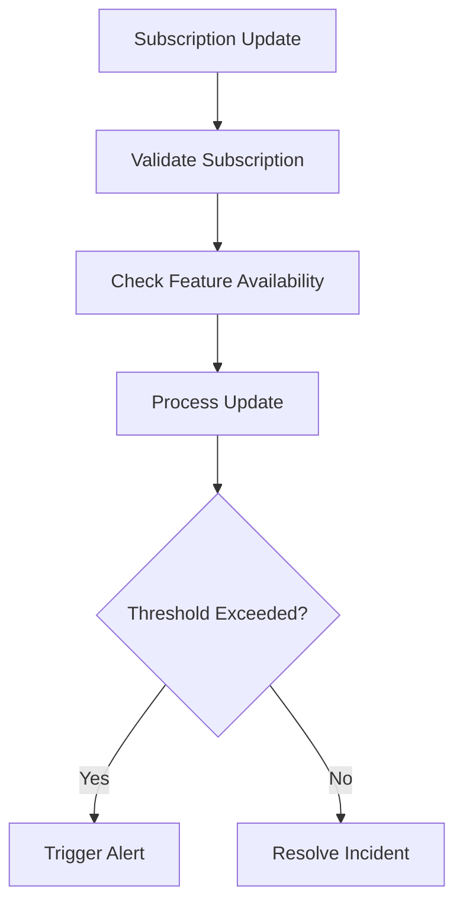

This document will cover the process of handling subscription updates, which includes:

1. Validating the subscription
2. Checking feature availability
3. Processing the update
4. Triggering alerts or resolving incidents.

Technical document: <SwmLink doc-title="Handling Subscription Updates">[Handling Subscription Updates](/.swm/handling-subscription-updates.ja6uvibm.sw.md)</SwmLink>

# [Validating the Subscription](https://app.swimm.io/repos/Z2l0aHViJTNBJTNBc2VudHJ5LWRlbW8tMSUzQSUzQVN3aW1tLURlbW8=/docs/ja6uvibm#handling-snuba-query-update)

When a subscription update occurs, the system first validates the subscription. This step ensures that the subscription is still active and relevant. If the subscription is no longer valid, the update process is halted to prevent unnecessary processing.

# [Checking Feature Availability](https://app.swimm.io/repos/Z2l0aHViJTNBJTNBc2VudHJ5LWRlbW8tMSUzQSUzQVN3aW1tLURlbW8=/docs/ja6uvibm#processing-the-update)

After validating the subscription, the system checks if the necessary features are available for the subscription. This involves verifying that the organization associated with the subscription has access to the required features. If the features are not available, the update is ignored.

# [Processing the Update](https://app.swimm.io/repos/Z2l0aHViJTNBJTNBc2VudHJ5LWRlbW8tMSUzQSUzQVN3aW1tLURlbW8=/docs/ja6uvibm#processing-the-update)

Once the subscription is validated and feature availability is confirmed, the system processes the update. This step involves updating the subscription data and ensuring that any changes are accurately reflected in the system. If the update has already been processed, it is skipped to avoid duplication.

# [Triggering Alerts or Resolving Incidents](https://app.swimm.io/repos/Z2l0aHViJTNBJTNBc2VudHJ5LWRlbW8tMSUzQSUzQVN3aW1tLURlbW8=/docs/ja6uvibm#triggering-alert-threshold)

If the update exceeds certain thresholds, the system triggers alerts or resolves incidents as necessary. This involves checking if the update surpasses predefined alert thresholds. If it does, an alert is triggered, and an incident is created if one does not already exist. Conversely, if the update resolves an existing issue, the incident is marked as resolved.

&nbsp;

*This is an auto-generated document by Swimm AI 🌊 and has not yet been verified by a human*

<SwmMeta version="3.0.0" repo-id="Z2l0aHViJTNBJTNBc2VudHJ5LWRlbW8tMSUzQSUzQVN3aW1tLURlbW8=" repo-name="sentry-demo-1" doc-type="product-flows">Powered by [Swimm](/)</SwmMeta>
