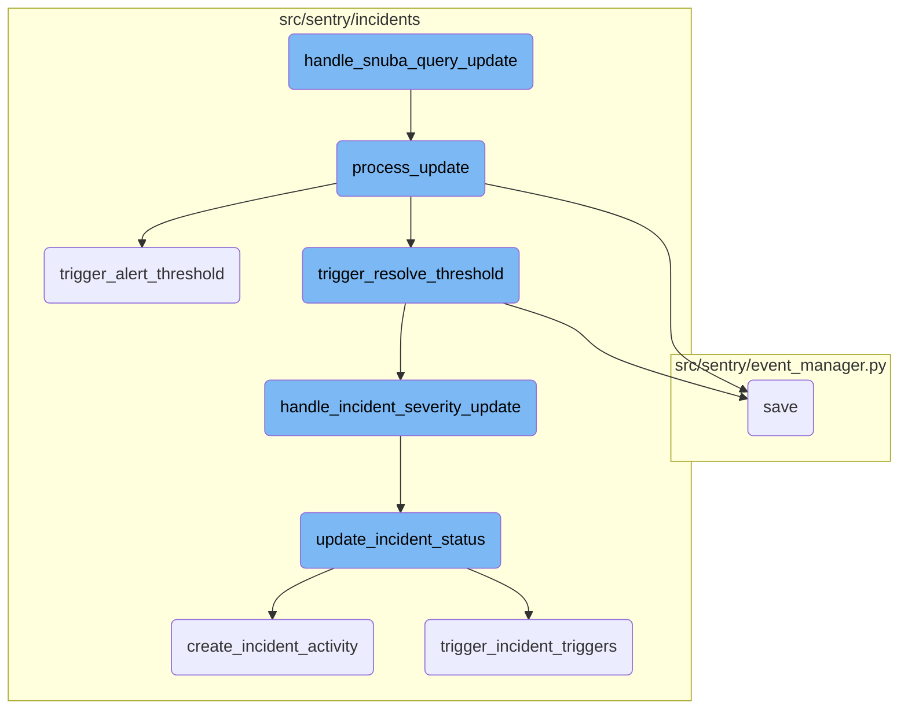
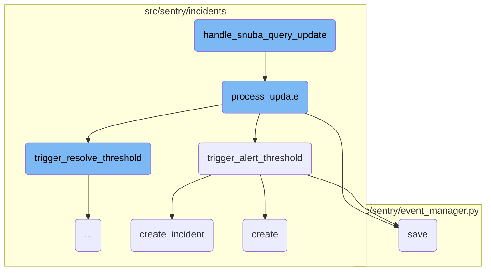
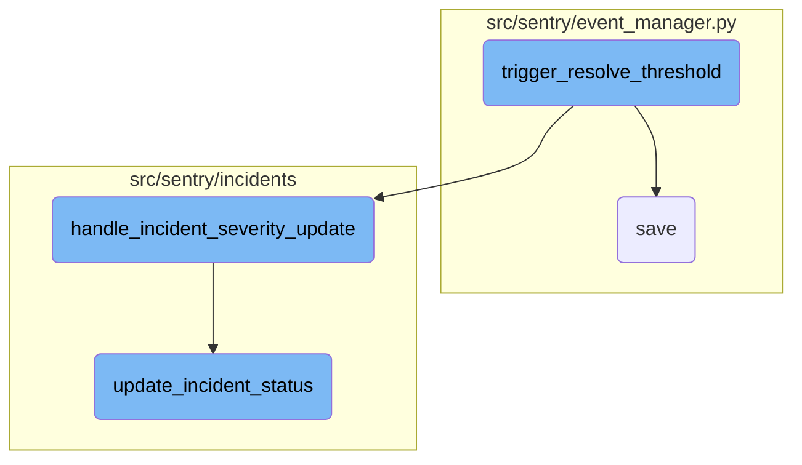

This document provides an overview of how subscription updates are handled within the system. It explains the role of the <SwmToken path="src/sentry/incidents/tasks.py" pos="165:2:2" line-data="def handle_snuba_query_update(">`handle_snuba_query_update`</SwmToken> function and the subsequent steps involved in processing these updates.

When a subscription update occurs, the <SwmToken path="src/sentry/incidents/tasks.py" pos="165:2:2" line-data="def handle_snuba_query_update(">`handle_snuba_query_update`</SwmToken> function is called to manage the update. This function uses the <SwmToken path="src/sentry/incidents/tasks.py" pos="171:11:11" line-data="    from sentry.incidents.subscription_processor import SubscriptionProcessor">`SubscriptionProcessor`</SwmToken> to process the update. The processor validates the subscription, checks for feature availability, and processes the update if it hasn't been processed already. If the update exceeds certain thresholds, it triggers alerts or resolves incidents as necessary. The process ensures that the system responds appropriately to changes in subscription data, maintaining the accuracy and reliability of incident management.

Here is a high level diagram of the flow, showing only the most important functions:



# Flow drill down

First, we'll zoom into this section of the flow:



<SwmSnippet path="/src/sentry/incidents/tasks.py" line="165">

---

## Handling Snuba Query Update

The function <SwmToken path="src/sentry/incidents/tasks.py" pos="165:2:2" line-data="def handle_snuba_query_update(">`handle_snuba_query_update`</SwmToken> is responsible for handling subscription updates for a <SwmToken path="src/sentry/incidents/tasks.py" pos="166:10:10" line-data="    subscription_update: QuerySubscriptionUpdate, subscription: QuerySubscription">`QuerySubscription`</SwmToken>. It uses the <SwmToken path="src/sentry/incidents/tasks.py" pos="171:11:11" line-data="    from sentry.incidents.subscription_processor import SubscriptionProcessor">`SubscriptionProcessor`</SwmToken> to process the update.

```python
def handle_snuba_query_update(
    subscription_update: QuerySubscriptionUpdate, subscription: QuerySubscription
) -> None:
    """
    Handles a subscription update for a `QuerySubscription`.
    """
    from sentry.incidents.subscription_processor import SubscriptionProcessor

    # noinspection SpellCheckingInspection
    with metrics.timer("incidents.subscription_procesor.process_update"):
        SubscriptionProcessor(subscription).process_update(subscription_update)
```

---

</SwmSnippet>

<SwmSnippet path="/src/sentry/incidents/subscription_processor.py" line="461">

---

## Processing the Update

The function <SwmToken path="src/sentry/incidents/subscription_processor.py" pos="461:3:3" line-data="    def process_update(self, subscription_update: QuerySubscriptionUpdate) -&gt; None:">`process_update`</SwmToken> is the core processing method used when the Query Subscription Consumer fetches updates from Kafka. It validates the subscription, checks for feature availability, and processes the update if it hasn't been processed already. It also triggers callbacks for any <SwmToken path="src/sentry/incidents/subscription_processor.py" pos="526:11:11" line-data="        # Trigger callbacks for any AlertRules that may need to know about the subscription update">`AlertRules`</SwmToken> that need to know about the subscription update.

```python
    def process_update(self, subscription_update: QuerySubscriptionUpdate) -> None:
        """
        This is the core processing method utilized when Query Subscription Consumer fetches updates from kafka
        """
        dataset = self.subscription.snuba_query.dataset
        try:
            # Check that the project exists
            self.subscription.project
        except Project.DoesNotExist:
            metrics.incr("incidents.alert_rules.ignore_deleted_project")
            return
        if dataset == "events" and not features.has(
            "organizations:incidents", self.subscription.project.organization
        ):
            # They have downgraded since these subscriptions have been created. So we just ignore updates for now.
            metrics.incr("incidents.alert_rules.ignore_update_missing_incidents")
            return
        elif dataset == "transactions" and not features.has(
            "organizations:performance-view", self.subscription.project.organization
        ):
            # They have downgraded since these subscriptions have been created. So we just ignore updates for now.
```

---

</SwmSnippet>

<SwmSnippet path="/src/sentry/incidents/subscription_processor.py" line="769">

---

### Triggering Alert Threshold

The function <SwmToken path="src/sentry/incidents/subscription_processor.py" pos="769:3:3" line-data="    def trigger_alert_threshold(">`trigger_alert_threshold`</SwmToken> is called when a subscription update exceeds the value defined in the <SwmToken path="src/sentry/incidents/subscription_processor.py" pos="774:2:4" line-data="        `trigger.alert_threshold`, and the trigger hasn&#39;t already been activated.">`trigger.alert_threshold`</SwmToken>. It increments the count of how many times the threshold has been exceeded and, if above the defined <SwmToken path="src/sentry/incidents/subscription_processor.py" pos="776:6:6" line-data="        above the `threshold_period` defined in the alert rule then mark the trigger as">`threshold_period`</SwmToken>, marks the trigger as activated and creates an incident if there isn't already one.

```python
    def trigger_alert_threshold(
        self, trigger: AlertRuleTrigger, metric_value: float
    ) -> IncidentTrigger | None:
        """
        Called when a subscription update exceeds the value defined in the
        `trigger.alert_threshold`, and the trigger hasn't already been activated.
        Increments the count of how many times we've consecutively exceeded the threshold, and if
        above the `threshold_period` defined in the alert rule then mark the trigger as
        activated, and create an incident if there isn't already one.
        :return:
        """
        self.trigger_alert_counts[trigger.id] += 1

        # If an incident was created for this rule, trigger type, and subscription
        # within the last 10 minutes, don't make another one
        last_it = (
            IncidentTrigger.objects.filter(alert_rule_trigger=trigger)
            .order_by("-incident_id")
            .select_related("incident")
            .first()
        )
```

---

</SwmSnippet>

<SwmSnippet path="/src/sentry/event_manager.py" line="448">

---

## Saving the Event

The function <SwmToken path="src/sentry/event_manager.py" pos="448:3:3" line-data="    def save(">`save`</SwmToken> in <SwmPath>[src/sentry/event_manager.py](src/sentry/event_manager.py)</SwmPath> is responsible for normalizing and processing an event, saving adjacent models such as releases and environments to Postgres, and writing the event into the event stream. This ensures that the event is picked up by Snuba and <SwmToken path="src/sentry/event_manager.py" pos="462:1:3" line-data="        post-processing.">`post-processing`</SwmToken>.

```python
    def save(
        self,
        project_id: int | None,
        raw: bool = False,
        assume_normalized: bool = False,
        start_time: float | None = None,
        cache_key: str | None = None,
        skip_send_first_transaction: bool = False,
        has_attachments: bool = False,
    ) -> Event:
        """
        After normalizing and processing an event, save adjacent models such as
        releases and environments to postgres and write the event into
        eventstream. From there it will be picked up by Snuba and
        post-processing.

        We re-insert events with duplicate IDs into Snuba, which is responsible
        for deduplicating events. Since deduplication in Snuba is on the primary
        key (based on event ID, project ID and day), events with same IDs are only
        deduplicated if their timestamps fall on the same day. The latest event
        always wins and overwrites the value of events received earlier in that day.
```

---

</SwmSnippet>

<SwmSnippet path="/src/sentry/incidents/logic.py" line="128">

---

## Creating an Incident

The function <SwmToken path="src/sentry/incidents/logic.py" pos="128:2:2" line-data="def create_incident(">`create_incident`</SwmToken> is used to create a new incident. It takes various parameters such as organization, type, title, date started, and others. It creates the incident and any associated projects, and records the incident creation in analytics.

```python
def create_incident(
    organization,
    type_,
    title,
    date_started,
    date_detected=None,
    # TODO: Probably remove detection_uuid?
    detection_uuid=None,
    projects=None,
    user=None,
    alert_rule=None,
    activation=None,
    subscription=None,
):
    if date_detected is None:
        date_detected = date_started

    with transaction.atomic(router.db_for_write(Incident)):
        incident = Incident.objects.create(
            organization=organization,
            detection_uuid=detection_uuid,
```

---

</SwmSnippet>

<SwmSnippet path="/src/sentry/incidents/serializers/alert_rule_trigger.py" line="40">

---

## Creating Alert Rule Trigger

The function <SwmToken path="src/sentry/incidents/serializers/alert_rule_trigger.py" pos="40:3:3" line-data="    def create(self, validated_data):">`create`</SwmToken> in <SwmPath>[src/sentry/incidents/serializers/alert_rule_trigger.py](src/sentry/incidents/serializers/alert_rule_trigger.py)</SwmPath> is responsible for creating an alert rule trigger. It handles the actions associated with the alert rule trigger and raises validation errors if any issues occur during the creation process.

```python
    def create(self, validated_data):
        try:
            actions = validated_data.pop("actions", None)
            alert_rule_trigger = create_alert_rule_trigger(
                alert_rule=self.context["alert_rule"], **validated_data
            )
            self._handle_actions(alert_rule_trigger, actions)

            return alert_rule_trigger
        except forms.ValidationError as e:
            # if we fail in create_alert_rule_trigger, then only one message is ever returned
            raise serializers.ValidationError(e.error_list[0].message)
        except AlertRuleTriggerLabelAlreadyUsedError:
            raise serializers.ValidationError("This label is already in use for this alert rule")
```

---

</SwmSnippet>

Now, lets zoom into this section of the flow:



<SwmSnippet path="/src/sentry/incidents/subscription_processor.py" line="882">

---

## Trigger Resolve Threshold

The <SwmToken path="src/sentry/incidents/subscription_processor.py" pos="882:3:3" line-data="    def trigger_resolve_threshold(">`trigger_resolve_threshold`</SwmToken> function is responsible for handling the logic when a subscription update exceeds the trigger resolve threshold and the trigger is currently active. It increments the resolve count for the trigger and checks if it meets the threshold period. If it does, it updates the incident trigger status to resolved and saves it. If all triggers are resolved, it updates the incident status to closed; otherwise, it calls <SwmToken path="src/sentry/incidents/subscription_processor.py" pos="992:3:3" line-data="    def handle_incident_severity_update(self) -&gt; None:">`handle_incident_severity_update`</SwmToken>.

```python
    def trigger_resolve_threshold(
        self, trigger: AlertRuleTrigger, metric_value: float
    ) -> IncidentTrigger | None:
        """
        Called when a subscription update exceeds the trigger resolve threshold and the
        trigger is currently ACTIVE.
        :return:
        """
        self.trigger_resolve_counts[trigger.id] += 1
        if self.trigger_resolve_counts[trigger.id] >= self.alert_rule.threshold_period:
            metrics.incr("incidents.alert_rules.trigger", tags={"type": "resolve"})
            incident_trigger = self.incident_trigger_map[trigger.id]
            incident_trigger.status = TriggerStatus.RESOLVED.value
            incident_trigger.save()
            self.trigger_resolve_counts[trigger.id] = 0

            if self.check_triggers_resolved():
                update_incident_status(
                    self.active_incident,
                    IncidentStatus.CLOSED,
                    status_method=IncidentStatusMethod.RULE_TRIGGERED,
```

---

</SwmSnippet>

<SwmSnippet path="/src/sentry/incidents/subscription_processor.py" line="992">

---

## Handle Incident Severity Update

The <SwmToken path="src/sentry/incidents/subscription_processor.py" pos="992:3:3" line-data="    def handle_incident_severity_update(self) -&gt; None:">`handle_incident_severity_update`</SwmToken> function updates the severity of an active incident based on the status of its triggers. It filters active incident triggers and determines the severity level (critical or warning) based on the trigger labels. If a severity level is determined, it calls <SwmToken path="src/sentry/incidents/subscription_processor.py" pos="1007:1:1" line-data="                update_incident_status(">`update_incident_status`</SwmToken> to update the incident's status accordingly.

```python
    def handle_incident_severity_update(self) -> None:
        if self.active_incident:
            active_incident_triggers = IncidentTrigger.objects.filter(
                incident=self.active_incident, status=TriggerStatus.ACTIVE.value
            )
            severity = None
            for active_incident_trigger in active_incident_triggers:
                trigger = active_incident_trigger.alert_rule_trigger
                if trigger.label == CRITICAL_TRIGGER_LABEL:
                    severity = IncidentStatus.CRITICAL
                    break
                elif trigger.label == WARNING_TRIGGER_LABEL:
                    severity = IncidentStatus.WARNING

            if severity:
                update_incident_status(
                    self.active_incident,
                    severity,
                    status_method=IncidentStatusMethod.RULE_TRIGGERED,
                )
```

---

</SwmSnippet>

<SwmSnippet path="/src/sentry/incidents/logic.py" line="183">

---

## Update Incident Status

The <SwmToken path="src/sentry/incidents/logic.py" pos="183:2:2" line-data="def update_incident_status(">`update_incident_status`</SwmToken> function updates the status of an incident and logs the change by creating an <SwmToken path="src/sentry/incidents/logic.py" pos="192:19:19" line-data="    Updates the status of an Incident and write an IncidentActivity row to log">`IncidentActivity`</SwmToken> row. It handles different status transitions, such as closing an incident and setting the closed date or reopening an incident and unsetting the closed date. It also records the status change event for analytics and triggers incident triggers if the status change was manual or rule-updated.

```python
def update_incident_status(
    incident,
    status,
    user=None,
    comment=None,
    status_method=IncidentStatusMethod.RULE_TRIGGERED,
    date_closed=None,
):
    """
    Updates the status of an Incident and write an IncidentActivity row to log
    the change. When the status is CLOSED we also set the date closed to the
    current time and take a snapshot of the current incident state.
    """
    if incident.status == status.value:
        # If the status isn't actually changing just no-op.
        return incident
    with transaction.atomic(router.db_for_write(Incident)):
        create_incident_activity(
            incident,
            IncidentActivityType.STATUS_CHANGE,
            user=user,
```

---

</SwmSnippet>

&nbsp;

*This is an auto-generated document by Swimm AI 🌊 and has not yet been verified by a human*

<SwmMeta version="3.0.0" repo-id="Z2l0aHViJTNBJTNBc2VudHJ5LWRlbW8tMSUzQSUzQVN3aW1tLURlbW8=" repo-name="sentry-demo-1" doc-type="flows"><sup>Powered by [Swimm](/)</sup></SwmMeta>
