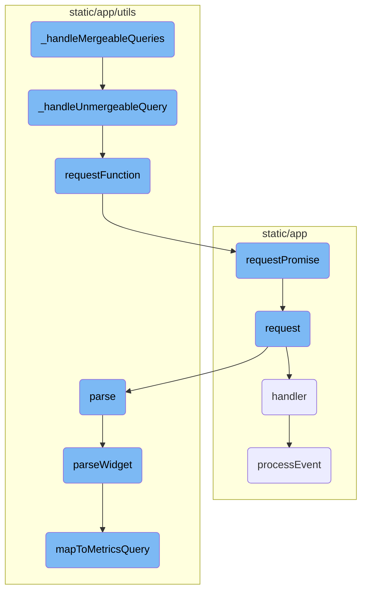

This document explains the <SwmToken path="static/app/components/modals/metricWidgetViewerModal/queries.tsx" pos="296:1:1" line-data="      onAction: () =&gt; {">`onAction`</SwmToken> function, which is triggered by user actions such as clicking a button. It details how the function initiates a series of processes to handle queries efficiently.

When a user clicks a button, the <SwmToken path="static/app/components/modals/metricWidgetViewerModal/queries.tsx" pos="296:1:1" line-data="      onAction: () =&gt; {">`onAction`</SwmToken> function starts working. It first adds a query to a batch and sets a timer to handle these queries together. The queries are then processed in batches, with some being merged and others handled individually. This helps in reducing the number of requests sent to the server, making the application more efficient.

Here is a high level diagram of the flow, showing only the most important functions:

```mermaid
graph TD;
      subgraph static/app/utils
4608918fe087b6a1f2ed9ef51f1c161db05ed453441acb8f951480ffa6fe6243(onAction):::mainFlowStyle --> e2b67c983350bd142a5aaa1f1017d4bb264a9702d05bb48934bfa23cd89dfb08(addQuery):::mainFlowStyle
end

subgraph static/app/utils
e2b67c983350bd142a5aaa1f1017d4bb264a9702d05bb48934bfa23cd89dfb08(addQuery):::mainFlowStyle --> 5b8c3af4c29605a7099831493304f29e9563c92a87bbc1501f00c37a627ee007(handleBatching):::mainFlowStyle
end

subgraph static/app/utils
5b8c3af4c29605a7099831493304f29e9563c92a87bbc1501f00c37a627ee007(handleBatching):::mainFlowStyle --> 4828141d547f5f2e5afec5603e540d98fdbd67e4d4c1471cbb0eae026cd0cfbf(_handleUnmergeableQueries)
end

subgraph static/app/utils
5b8c3af4c29605a7099831493304f29e9563c92a87bbc1501f00c37a627ee007(handleBatching):::mainFlowStyle --> 90ff9374397a0adb357fe4c2249524c2149f81c211a4b8b1f471066ba428f2de(_handleMergeableQueries):::mainFlowStyle
end

subgraph static/app/utils
90ff9374397a0adb357fe4c2249524c2149f81c211a4b8b1f471066ba428f2de(_handleMergeableQueries):::mainFlowStyle --> b06d6a338d77963cde2551f503a2ce3b3530fa37719ed3615534229f27eaf648(_handleUnmergeableQuery):::mainFlowStyle
end

subgraph static/app/utils
b06d6a338d77963cde2551f503a2ce3b3530fa37719ed3615534229f27eaf648(_handleUnmergeableQuery):::mainFlowStyle --> c4380a03d42ac0c65470f5ea342d4dce126f01939798968b2931ae3e5837aea5(requestFunction):::mainFlowStyle
end

subgraph static/app/api.tsx
c4380a03d42ac0c65470f5ea342d4dce126f01939798968b2931ae3e5837aea5(requestFunction):::mainFlowStyle --> 1025c11ff078741e3a52849e4dc81510d630800b045c60aea951683433a1c993(requestPromise):::mainFlowStyle
end

subgraph static/app/api.tsx
1025c11ff078741e3a52849e4dc81510d630800b045c60aea951683433a1c993(requestPromise):::mainFlowStyle --> 4f5a67a71dfb71654db327ed24d5e8187187a49b58963a473eec18ecb0aef026(request):::mainFlowStyle
end

subgraph static/app/components
4f5a67a71dfb71654db327ed24d5e8187187a49b58963a473eec18ecb0aef026(request):::mainFlowStyle --> 2cd409575454572c7b228bde73d6eb55227f3d7b14d37cc7ca5415bbcb81e4e5(handler)
end

subgraph static/app/utils
4f5a67a71dfb71654db327ed24d5e8187187a49b58963a473eec18ecb0aef026(request):::mainFlowStyle --> 4b2faee236c2e651d9932fa234f72966df49f7aa0f85eb9909d65f4b6d8ce1a6(parse):::mainFlowStyle
end

subgraph static/app/utils
4b2faee236c2e651d9932fa234f72966df49f7aa0f85eb9909d65f4b6d8ce1a6(parse):::mainFlowStyle --> b2b47f6077e96a1ff47606d77c3fe70b18a84edc0ab0fa1349f7face4165d2ea(parseWidget):::mainFlowStyle
end

subgraph static/app/utils
b2b47f6077e96a1ff47606d77c3fe70b18a84edc0ab0fa1349f7face4165d2ea(parseWidget):::mainFlowStyle --> 05bf2ddeab316943d2187e10bc3886949b4b03ae946f68d4f27a5bfc0025e132(mapToMetricsQuery):::mainFlowStyle
end

subgraph static/app/utils
05bf2ddeab316943d2187e10bc3886949b4b03ae946f68d4f27a5bfc0025e132(mapToMetricsQuery):::mainFlowStyle --> 635bb507b11255a8fd7c2375dac3b6c46b736470cf89007061c6861fc973e73b(fetchAvailableTags)
end


      classDef mainFlowStyle color:#000000,fill:#7CB9F4
classDef rootsStyle color:#000000,fill:#00FFF4
classDef Style1 color:#000000,fill:#00FFAA
classDef Style2 color:#000000,fill:#FFFF00
classDef Style3 color:#000000,fill:#AA7CB9

%% Swimm:
%% graph TD;
%%       subgraph <SwmPath>[static/app/utils/](static/app/utils/)</SwmPath>
%% 4608918fe087b6a1f2ed9ef51f1c161db05ed453441acb8f951480ffa6fe6243(onAction):::mainFlowStyle --> e2b67c983350bd142a5aaa1f1017d4bb264a9702d05bb48934bfa23cd89dfb08(addQuery):::mainFlowStyle
%% end
%% 
%% subgraph <SwmPath>[static/app/utils/](static/app/utils/)</SwmPath>
%% e2b67c983350bd142a5aaa1f1017d4bb264a9702d05bb48934bfa23cd89dfb08(addQuery):::mainFlowStyle --> 5b8c3af4c29605a7099831493304f29e9563c92a87bbc1501f00c37a627ee007(handleBatching):::mainFlowStyle
%% end
%% 
%% subgraph <SwmPath>[static/app/utils/](static/app/utils/)</SwmPath>
%% 5b8c3af4c29605a7099831493304f29e9563c92a87bbc1501f00c37a627ee007(handleBatching):::mainFlowStyle --> 4828141d547f5f2e5afec5603e540d98fdbd67e4d4c1471cbb0eae026cd0cfbf(_handleUnmergeableQueries)
%% end
%% 
%% subgraph <SwmPath>[static/app/utils/](static/app/utils/)</SwmPath>
%% 5b8c3af4c29605a7099831493304f29e9563c92a87bbc1501f00c37a627ee007(handleBatching):::mainFlowStyle --> 90ff9374397a0adb357fe4c2249524c2149f81c211a4b8b1f471066ba428f2de(_handleMergeableQueries):::mainFlowStyle
%% end
%% 
%% subgraph <SwmPath>[static/app/utils/](static/app/utils/)</SwmPath>
%% 90ff9374397a0adb357fe4c2249524c2149f81c211a4b8b1f471066ba428f2de(_handleMergeableQueries):::mainFlowStyle --> b06d6a338d77963cde2551f503a2ce3b3530fa37719ed3615534229f27eaf648(_handleUnmergeableQuery):::mainFlowStyle
%% end
%% 
%% subgraph <SwmPath>[static/app/utils/](static/app/utils/)</SwmPath>
%% b06d6a338d77963cde2551f503a2ce3b3530fa37719ed3615534229f27eaf648(_handleUnmergeableQuery):::mainFlowStyle --> c4380a03d42ac0c65470f5ea342d4dce126f01939798968b2931ae3e5837aea5(requestFunction):::mainFlowStyle
%% end
%% 
%% subgraph <SwmPath>[static/app/api.tsx](static/app/api.tsx)</SwmPath>
%% c4380a03d42ac0c65470f5ea342d4dce126f01939798968b2931ae3e5837aea5(requestFunction):::mainFlowStyle --> 1025c11ff078741e3a52849e4dc81510d630800b045c60aea951683433a1c993(requestPromise):::mainFlowStyle
%% end
%% 
%% subgraph <SwmPath>[static/app/api.tsx](static/app/api.tsx)</SwmPath>
%% 1025c11ff078741e3a52849e4dc81510d630800b045c60aea951683433a1c993(requestPromise):::mainFlowStyle --> 4f5a67a71dfb71654db327ed24d5e8187187a49b58963a473eec18ecb0aef026(request):::mainFlowStyle
%% end
%% 
%% subgraph <SwmPath>[static/app/components/](static/app/components/)</SwmPath>
%% 4f5a67a71dfb71654db327ed24d5e8187187a49b58963a473eec18ecb0aef026(request):::mainFlowStyle --> 2cd409575454572c7b228bde73d6eb55227f3d7b14d37cc7ca5415bbcb81e4e5(handler)
%% end
%% 
%% subgraph <SwmPath>[static/app/utils/](static/app/utils/)</SwmPath>
%% 4f5a67a71dfb71654db327ed24d5e8187187a49b58963a473eec18ecb0aef026(request):::mainFlowStyle --> 4b2faee236c2e651d9932fa234f72966df49f7aa0f85eb9909d65f4b6d8ce1a6(parse):::mainFlowStyle
%% end
%% 
%% subgraph <SwmPath>[static/app/utils/](static/app/utils/)</SwmPath>
%% 4b2faee236c2e651d9932fa234f72966df49f7aa0f85eb9909d65f4b6d8ce1a6(parse):::mainFlowStyle --> b2b47f6077e96a1ff47606d77c3fe70b18a84edc0ab0fa1349f7face4165d2ea(parseWidget):::mainFlowStyle
%% end
%% 
%% subgraph <SwmPath>[static/app/utils/](static/app/utils/)</SwmPath>
%% b2b47f6077e96a1ff47606d77c3fe70b18a84edc0ab0fa1349f7face4165d2ea(parseWidget):::mainFlowStyle --> 05bf2ddeab316943d2187e10bc3886949b4b03ae946f68d4f27a5bfc0025e132(mapToMetricsQuery):::mainFlowStyle
%% end
%% 
%% subgraph <SwmPath>[static/app/utils/](static/app/utils/)</SwmPath>
%% 05bf2ddeab316943d2187e10bc3886949b4b03ae946f68d4f27a5bfc0025e132(mapToMetricsQuery):::mainFlowStyle --> 635bb507b11255a8fd7c2375dac3b6c46b736470cf89007061c6861fc973e73b(fetchAvailableTags)
%% end
%% 
%% 
%%       classDef mainFlowStyle color:#000000,fill:#7CB9F4
%% classDef rootsStyle color:#000000,fill:#00FFF4
%% classDef Style1 color:#000000,fill:#00FFAA
%% classDef Style2 color:#000000,fill:#FFFF00
%% classDef Style3 color:#000000,fill:#AA7CB9
```



# Flow drill down

First, we'll zoom into this section of the flow:

```mermaid
graph TD;
      subgraph static/app
4608918fe087b6a1f2ed9ef51f1c161db05ed453441acb8f951480ffa6fe6243(onAction):::mainFlowStyle --> e2b67c983350bd142a5aaa1f1017d4bb264a9702d05bb48934bfa23cd89dfb08(addQuery):::mainFlowStyle
end

subgraph static/app
e2b67c983350bd142a5aaa1f1017d4bb264a9702d05bb48934bfa23cd89dfb08(addQuery):::mainFlowStyle --> 5b8c3af4c29605a7099831493304f29e9563c92a87bbc1501f00c37a627ee007(handleBatching):::mainFlowStyle
end

subgraph static/app
5b8c3af4c29605a7099831493304f29e9563c92a87bbc1501f00c37a627ee007(handleBatching):::mainFlowStyle --> 4828141d547f5f2e5afec5603e540d98fdbd67e4d4c1471cbb0eae026cd0cfbf(_handleUnmergeableQueries)
end

subgraph static/app
5b8c3af4c29605a7099831493304f29e9563c92a87bbc1501f00c37a627ee007(handleBatching):::mainFlowStyle --> 90ff9374397a0adb357fe4c2249524c2149f81c211a4b8b1f471066ba428f2de(_handleMergeableQueries):::mainFlowStyle
end

subgraph static/app
90ff9374397a0adb357fe4c2249524c2149f81c211a4b8b1f471066ba428f2de(_handleMergeableQueries):::mainFlowStyle --> i8p53(...)
end


      classDef mainFlowStyle color:#000000,fill:#7CB9F4
classDef rootsStyle color:#000000,fill:#00FFF4
classDef Style1 color:#000000,fill:#00FFAA
classDef Style2 color:#000000,fill:#FFFF00
classDef Style3 color:#000000,fill:#AA7CB9

%% Swimm:
%% graph TD;
%%       subgraph <SwmPath>[static/app/](static/app/)</SwmPath>
%% 4608918fe087b6a1f2ed9ef51f1c161db05ed453441acb8f951480ffa6fe6243(onAction):::mainFlowStyle --> e2b67c983350bd142a5aaa1f1017d4bb264a9702d05bb48934bfa23cd89dfb08(addQuery):::mainFlowStyle
%% end
%% 
%% subgraph <SwmPath>[static/app/](static/app/)</SwmPath>
%% e2b67c983350bd142a5aaa1f1017d4bb264a9702d05bb48934bfa23cd89dfb08(addQuery):::mainFlowStyle --> 5b8c3af4c29605a7099831493304f29e9563c92a87bbc1501f00c37a627ee007(handleBatching):::mainFlowStyle
%% end
%% 
%% subgraph <SwmPath>[static/app/](static/app/)</SwmPath>
%% 5b8c3af4c29605a7099831493304f29e9563c92a87bbc1501f00c37a627ee007(handleBatching):::mainFlowStyle --> 4828141d547f5f2e5afec5603e540d98fdbd67e4d4c1471cbb0eae026cd0cfbf(_handleUnmergeableQueries)
%% end
%% 
%% subgraph <SwmPath>[static/app/](static/app/)</SwmPath>
%% 5b8c3af4c29605a7099831493304f29e9563c92a87bbc1501f00c37a627ee007(handleBatching):::mainFlowStyle --> 90ff9374397a0adb357fe4c2249524c2149f81c211a4b8b1f471066ba428f2de(_handleMergeableQueries):::mainFlowStyle
%% end
%% 
%% subgraph <SwmPath>[static/app/](static/app/)</SwmPath>
%% 90ff9374397a0adb357fe4c2249524c2149f81c211a4b8b1f471066ba428f2de(_handleMergeableQueries):::mainFlowStyle --> i8p53(...)
%% end
%% 
%% 
%%       classDef mainFlowStyle color:#000000,fill:#7CB9F4
%% classDef rootsStyle color:#000000,fill:#00FFF4
%% classDef Style1 color:#000000,fill:#00FFAA
%% classDef Style2 color:#000000,fill:#FFFF00
%% classDef Style3 color:#000000,fill:#AA7CB9
```



<SwmSnippet path="/static/app/components/modals/metricWidgetViewerModal/queries.tsx" line="295">

---

## Handling Action

The <SwmToken path="static/app/components/modals/metricWidgetViewerModal/queries.tsx" pos="296:1:1" line-data="      onAction: () =&gt; {">`onAction`</SwmToken> function is triggered by a user action, such as clicking a button labeled 'Duplicate'. This function initiates the process by calling <SwmToken path="static/app/components/modals/metricWidgetViewerModal/queries.tsx" pos="297:1:1" line-data="        addQuery(queryIndex);">`addQuery`</SwmToken> with a specific <SwmToken path="static/app/components/modals/metricWidgetViewerModal/queries.tsx" pos="297:3:3" line-data="        addQuery(queryIndex);">`queryIndex`</SwmToken>.

```tsx
      label: t('Duplicate'),
      onAction: () => {
        addQuery(queryIndex);
      },
    };
```

---

</SwmSnippet>

<SwmSnippet path="/static/app/utils/performance/contexts/genericQueryBatcher.tsx" line="188">

---

## Adding Query

The <SwmToken path="static/app/utils/performance/contexts/genericQueryBatcher.tsx" pos="188:3:3" line-data="  const addQuery = (q: BatchQueryDefinition, id: symbol) =&gt; {">`addQuery`</SwmToken> function adds a query to a batch. It stores the query in a current queries object and sets a timeout to handle batching of these queries. This ensures that all requests within the same frame are aggregated.

```tsx
  const addQuery = (q: BatchQueryDefinition, id: symbol) => {
    queries.current[id] = q;

    window.clearTimeout(timeoutRef.current);
    // Put batch function in the next macro task to aggregate all requests in this frame.
    timeoutRef.current = window.setTimeout(() => {
      handleBatching(organization, queries.current);
      timeoutRef.current = undefined;
    }, 0);
  };
```

---

</SwmSnippet>

<SwmSnippet path="/static/app/utils/performance/contexts/genericQueryBatcher.tsx" line="153">

---

## Handling Batching

The <SwmToken path="static/app/utils/performance/contexts/genericQueryBatcher.tsx" pos="153:2:2" line-data="function handleBatching(">`handleBatching`</SwmToken> function processes the batched queries. It converts the queries into a merge map and then handles both mergeable and unmergeable queries. It also tracks analytics for the number of queries collected, saved, and sent.

```tsx
function handleBatching(
  organization: Organization,
  queries: Record<symbol, BatchQueryDefinition>
) {
  const mergeMap = queriesToMap(queries);

  if (!mergeMap) {
    return;
  }

  let queriesSent = 0;
  queriesSent += _handleUnmergeableQueries(mergeMap);
  queriesSent += _handleMergeableQueries(mergeMap);

  const queriesCollected = Object.values(mergeMap).reduce(
    (acc, mergeList) => acc + mergeList.length,
    0
  );

  const queriesSaved = queriesCollected - queriesSent;

```

---

</SwmSnippet>

<SwmSnippet path="/static/app/utils/performance/contexts/genericQueryBatcher.tsx" line="80">

---

### Handling Unmergeable Queries

The <SwmToken path="static/app/utils/performance/contexts/genericQueryBatcher.tsx" pos="80:2:2" line-data="function _handleUnmergeableQueries(mergeMap: MergeMap) {">`_handleUnmergeableQueries`</SwmToken> function processes queries that cannot be merged. It iterates over the merge map and handles each unmergeable query individually, ensuring that these queries are sent out.

```tsx
function _handleUnmergeableQueries(mergeMap: MergeMap) {
  let queriesSent = 0;
  Object.keys(mergeMap).forEach(k => {
    // Using async forEach to ensure calls start in parallel.
    const mergeList = mergeMap[k];

    if (mergeList.length === 1) {
      const [queryDefinition] = mergeList;
      queriesSent++;
      _handleUnmergeableQuery(queryDefinition);
    }
  });

  return queriesSent;
}
```

---

</SwmSnippet>

Now, lets zoom into this section of the flow:



<SwmSnippet path="/static/app/utils/performance/contexts/genericQueryBatcher.tsx" line="96">

---

## Handling Mergeable Queries

The function <SwmToken path="static/app/utils/performance/contexts/genericQueryBatcher.tsx" pos="96:2:2" line-data="function _handleMergeableQueries(mergeMap: MergeMap) {">`_handleMergeableQueries`</SwmToken> processes queries that can be batched together. It iterates over the <SwmToken path="static/app/utils/performance/contexts/genericQueryBatcher.tsx" pos="96:4:4" line-data="function _handleMergeableQueries(mergeMap: MergeMap) {">`mergeMap`</SwmToken>, checks if the queries can be merged based on their properties, and sends a single request for the batch. If a query cannot be merged, it delegates the processing to <SwmToken path="static/app/utils/performance/contexts/genericQueryBatcher.tsx" pos="71:2:2" line-data="function _handleUnmergeableQuery(queryDefinition: BatchQueryDefinition) {">`_handleUnmergeableQuery`</SwmToken>. This function helps in reducing the number of requests sent to the server, thereby optimizing performance.

```tsx
function _handleMergeableQueries(mergeMap: MergeMap) {
  let queriesSent = 0;
  Object.keys(mergeMap).forEach(async k => {
    const mergeList = mergeMap[k];

    if (mergeList.length <= 1) {
      return;
    }

    const [exampleDefinition] = mergeList;
    const batchProperty = exampleDefinition.batchProperty;
    const query = {...exampleDefinition.requestQueryObject.query};
    const requestQueryObject = {...exampleDefinition.requestQueryObject, query};

    const batchValues: string[] = [];

    mergeList.forEach(q => {
      const batchFieldValue = q.requestQueryObject.query[batchProperty];
      if (Array.isArray(batchFieldValue)) {
        if (batchFieldValue.length > 1) {
          // Omit multiple requests with multi fields (eg. yAxis) for now and run them as single queries
```

---

</SwmSnippet>

<SwmSnippet path="/static/app/utils/performance/contexts/genericQueryBatcher.tsx" line="71">

---

### Handling Unmergeable Queries

The function <SwmToken path="static/app/utils/performance/contexts/genericQueryBatcher.tsx" pos="71:2:2" line-data="function _handleUnmergeableQuery(queryDefinition: BatchQueryDefinition) {">`_handleUnmergeableQuery`</SwmToken> handles queries that cannot be merged. It sends an individual request for each unmergeable query using the <SwmToken path="static/app/utils/performance/contexts/genericQueryBatcher.tsx" pos="72:7:7" line-data="  const result = requestFunction(">`requestFunction`</SwmToken> and resolves the query with the result. This ensures that even queries that cannot be batched are processed correctly.

```tsx
function _handleUnmergeableQuery(queryDefinition: BatchQueryDefinition) {
  const result = requestFunction(
    queryDefinition.api,
    queryDefinition.path,
    queryDefinition.requestQueryObject
  );
  queryDefinition.resolve(result);
}
```

---

</SwmSnippet>

<SwmSnippet path="/static/app/utils/performance/contexts/genericQueryBatcher.tsx" line="67">

---

### Sending Requests

The function <SwmToken path="static/app/utils/performance/contexts/genericQueryBatcher.tsx" pos="67:2:2" line-data="function requestFunction(api: Client, path: string, queryObject: QueryObject) {">`requestFunction`</SwmToken> is responsible for sending requests to the server. It uses the <SwmToken path="static/app/utils/performance/contexts/genericQueryBatcher.tsx" pos="68:3:5" line-data="  return api.requestPromise(path, queryObject);">`api.requestPromise`</SwmToken> method to send the request and returns the promise. This function abstracts the details of making the request and is used by both <SwmToken path="static/app/utils/performance/contexts/genericQueryBatcher.tsx" pos="96:2:2" line-data="function _handleMergeableQueries(mergeMap: MergeMap) {">`_handleMergeableQueries`</SwmToken> and <SwmToken path="static/app/utils/performance/contexts/genericQueryBatcher.tsx" pos="71:2:2" line-data="function _handleUnmergeableQuery(queryDefinition: BatchQueryDefinition) {">`_handleUnmergeableQuery`</SwmToken>.

```tsx
function requestFunction(api: Client, path: string, queryObject: QueryObject) {
  return api.requestPromise(path, queryObject);
}
```

---

</SwmSnippet>

<SwmSnippet path="/static/app/api.tsx" line="656">

---

### Request Promise

The method <SwmToken path="static/app/api.tsx" pos="656:1:1" line-data="  requestPromise&lt;IncludeAllArgsType extends boolean&gt;(">`requestPromise`</SwmToken> in <SwmPath>[static/app/api.tsx](static/app/api.tsx)</SwmPath> sends an API request and returns a promise. It handles the success and error cases, resolving the promise with the data on success and rejecting it with an error object on failure. This method is used by <SwmToken path="static/app/utils/performance/contexts/genericQueryBatcher.tsx" pos="67:2:2" line-data="function requestFunction(api: Client, path: string, queryObject: QueryObject) {">`requestFunction`</SwmToken> to send requests.

```tsx
  requestPromise<IncludeAllArgsType extends boolean>(
    path: string,
    {
      includeAllArgs,
      ...options
    }: {includeAllArgs?: IncludeAllArgsType} & Readonly<RequestOptions> = {}
  ): Promise<IncludeAllArgsType extends true ? ApiResult : any> {
    // Create an error object here before we make any async calls so that we
    // have a helpful stack trace if it errors
    //
    // This *should* get logged to Sentry only if the promise rejection is not handled
    // (since SDK captures unhandled rejections). Ideally we explicitly ignore rejection
    // or handle with a user friendly error message
    const preservedError = new Error('API Request Error');

    return new Promise((resolve, reject) =>
      this.request(path, {
        ...options,
        preservedError,
        success: (data, textStatus, resp) => {
          if (includeAllArgs) {
```

---

</SwmSnippet>

&nbsp;

*This is an auto-generated document by Swimm AI 🌊 and has not yet been verified by a human*

<SwmMeta version="3.0.0" repo-id="Z2l0aHViJTNBJTNBc2VudHJ5LWRlbW8tMSUzQSUzQVN3aW1tLURlbW8=" repo-name="sentry-demo-1" doc-type="flows"><sup>Powered by [Swimm](/)</sup></SwmMeta>
