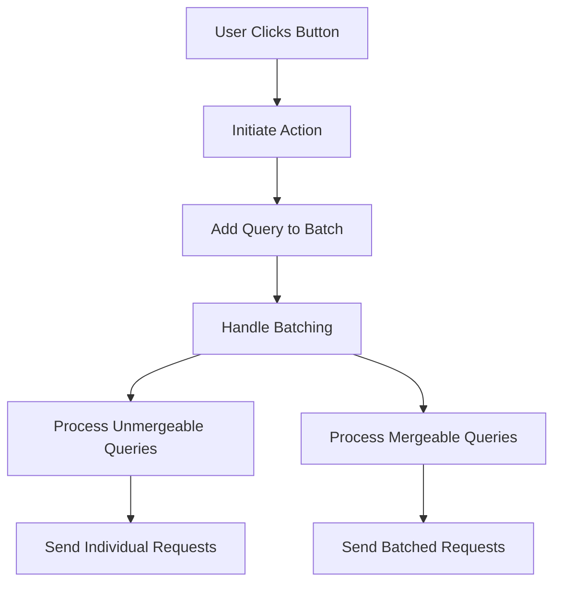

This document will cover the process of handling user actions in the application, specifically focusing on the flow initiated by user interactions such as clicking a button. We'll cover:

1. Initiating the Action
2. Adding the Query
3. Handling Batching
4. Processing Unmergeable Queries
5. Processing Mergeable Queries
6. Sending Requests

Technical document: <SwmLink doc-title="Handling User Actions">[Handling User Actions](/.swm/handling-user-actions.kmrw6qxf.sw.md)</SwmLink>

# [Initiating the Action](https://app.swimm.io/repos/Z2l0aHViJTNBJTNBc2VudHJ5LWRlbW8tMSUzQSUzQVN3aW1tLURlbW8=/docs/kmrw6qxf#handling-action)

When a user clicks a button, such as one labeled 'Duplicate', the system initiates the action by calling a function that starts the process. This function is responsible for adding a query to a batch, which will be processed later. This initial step is crucial as it sets the stage for efficient query handling by batching multiple user actions together.

# [Adding the Query](https://app.swimm.io/repos/Z2l0aHViJTNBJTNBc2VudHJ5LWRlbW8tMSUzQSUzQVN3aW1tLURlbW8=/docs/kmrw6qxf#adding-query)

The next step involves adding the query to a batch. This is done by storing the query in a current queries object and setting a timeout to handle batching. The purpose of this step is to aggregate all requests within the same frame, which helps in reducing the number of individual requests sent to the server. This aggregation is essential for optimizing the application's performance.

# [Handling Batching](https://app.swimm.io/repos/Z2l0aHViJTNBJTNBc2VudHJ5LWRlbW8tMSUzQSUzQVN3aW1tLURlbW8=/docs/kmrw6qxf#handling-batching)

Once the queries are added to the batch, the system processes them through a batching function. This function converts the queries into a merge map and handles both mergeable and unmergeable queries. It also tracks analytics for the number of queries collected, saved, and sent. This step is vital for ensuring that the queries are processed efficiently, either by merging them or handling them individually.

# [Processing Unmergeable Queries](https://app.swimm.io/repos/Z2l0aHViJTNBJTNBc2VudHJ5LWRlbW8tMSUzQSUzQVN3aW1tLURlbW8=/docs/kmrw6qxf#handling-unmergeable-queries)

For queries that cannot be merged, the system processes them individually. This involves iterating over the merge map and handling each unmergeable query separately. The goal here is to ensure that even queries that cannot be batched are sent out and processed correctly. This step is crucial for maintaining the integrity of the query processing system.

# [Processing Mergeable Queries](https://app.swimm.io/repos/Z2l0aHViJTNBJTNBc2VudHJ5LWRlbW8tMSUzQSUzQVN3aW1tLURlbW8=/docs/kmrw6qxf#handling-mergeable-queries)

For queries that can be merged, the system processes them together. This involves iterating over the merge map, checking if the queries can be merged based on their properties, and sending a single request for the batch. If a query cannot be merged, it is delegated to the unmergeable query handler. This step helps in reducing the number of requests sent to the server, thereby optimizing performance.

# [Sending Requests](https://app.swimm.io/repos/Z2l0aHViJTNBJTNBc2VudHJ5LWRlbW8tMSUzQSUzQVN3aW1tLURlbW8=/docs/kmrw6qxf#sending-requests)

The final step involves sending the requests to the server. This is done using a request function that abstracts the details of making the request. The function sends the request and returns a promise, which is resolved with the data on success or rejected with an error object on failure. This step ensures that all queries, whether batched or individual, are sent to the server and processed accordingly.

&nbsp;

*This is an auto-generated document by Swimm AI 🌊 and has not yet been verified by a human*

<SwmMeta version="3.0.0" repo-id="Z2l0aHViJTNBJTNBc2VudHJ5LWRlbW8tMSUzQSUzQVN3aW1tLURlbW8=" repo-name="sentry-demo-1" doc-type="product-flows">Powered by [Swimm](/)</SwmMeta>
