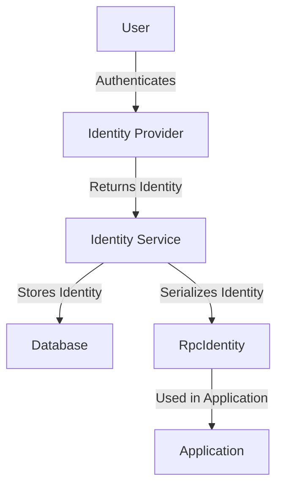

# Overview

Identity in application modules refers to the mechanisms and services that handle user authentication and authorization. It includes various providers such as GitHub, GitLab, Google, and others, which are responsible for integrating with external identity services.

# Core Components

The `identity_service` is a core component that interacts with these providers to manage user identities. The <SwmToken path="src/sentry/identity/google/provider.py" pos="6:10:10" line-data="from sentry.identity.oauth2 import OAuth2Provider">`OAuth2Provider`</SwmToken> is used to facilitate <SwmToken path="src/sentry/identity/google/provider.py" pos="6:6:6" line-data="from sentry.identity.oauth2 import OAuth2Provider">`oauth2`</SwmToken> authentication flows with these external services. The <SwmToken path="src/sentry/identity/services/identity/serial.py" pos="17:14:14" line-data="def serialize_identity(identity: &quot;Identity&quot;) -&gt; RpcIdentity:">`RpcIdentity`</SwmToken> and <SwmToken path="src/sentry/identity/services/identity/impl.py" pos="42:13:13" line-data="    def get_identities(self, *, filter: IdentityFilterArgs) -&gt; list[RpcIdentity]:">`IdentityFilterArgs`</SwmToken> are part of the data models used to represent and filter identity information. The `IdentityManager` is responsible for managing the overall identity lifecycle, including creation, retrieval, and validation of identities.

<SwmSnippet path="/src/sentry/identity/services/identity/serial.py" line="17">

---

## Identity Serialization

The <SwmToken path="src/sentry/identity/services/identity/serial.py" pos="17:2:2" line-data="def serialize_identity(identity: &quot;Identity&quot;) -&gt; RpcIdentity:">`serialize_identity`</SwmToken> function converts an <SwmToken path="src/sentry/identity/services/identity/serial.py" pos="17:4:4" line-data="def serialize_identity(identity: &quot;Identity&quot;) -&gt; RpcIdentity:">`identity`</SwmToken> object into an <SwmToken path="src/sentry/identity/services/identity/serial.py" pos="17:14:14" line-data="def serialize_identity(identity: &quot;Identity&quot;) -&gt; RpcIdentity:">`RpcIdentity`</SwmToken> format, which is used for data transfer.

```python
def serialize_identity(identity: "Identity") -> RpcIdentity:
    return RpcIdentity(
        id=identity.id,
        idp_id=identity.idp_id,
        user_id=identity.user_id,
        external_id=identity.external_id,
        data=identity.data,
    )
```

---

</SwmSnippet>

<SwmSnippet path="/src/sentry/identity/google/provider.py" line="31">

---

## Building Identity

The <SwmToken path="src/sentry/identity/google/provider.py" pos="31:3:3" line-data="    def build_identity(self, state):">`build_identity`</SwmToken> function constructs an identity mapping from the <SwmToken path="src/sentry/identity/google/provider.py" pos="37:12:12" line-data="            raise IdentityNotValid(&quot;Missing id_token in OAuth response: %s&quot; % data)">`OAuth`</SwmToken> state data, ensuring the necessary fields are present and valid.

```python
    def build_identity(self, state):
        data = state.get("data", {})

        try:
            id_token = data["id_token"]
        except KeyError:
            raise IdentityNotValid("Missing id_token in OAuth response: %s" % data)

        try:
            _, payload, _ = map(urlsafe_b64decode, id_token.split(".", 2))
        except Exception as exc:
            raise IdentityNotValid("Unable to decode id_token: %s" % exc)

        try:
            user_data = orjson.loads(payload)
        except ValueError as exc:
            raise IdentityNotValid("Unable to decode id_token payload: %s" % exc)

        # XXX(epurkhiser): This is carryover from the AuthProvider version of
        # google identity. Because we will have code that handles interop
        # between newstyle generic Identity, and oldstyle AuthProviders, we
```

---

</SwmSnippet>

<SwmSnippet path="/src/sentry/identity/pipeline.py" line="38">

---

## Finishing the Identity Pipeline

The <SwmToken path="src/sentry/identity/pipeline.py" pos="38:3:3" line-data="    def finish_pipeline(self):">`finish_pipeline`</SwmToken> function finalizes the identity linking process, associating the external identity with the user's Sentry account and updating relevant metrics.

```python
    def finish_pipeline(self):
        # NOTE: only reached in the case of linking a new identity
        # via Social Auth pipelines
        identity = self.provider.build_identity(self.state.data)

        Identity.objects.link_identity(
            user=self.request.user,
            idp=self.provider_model,
            external_id=identity["id"],
            should_reattach=False,
            defaults={
                "scopes": identity.get("scopes", []),
                "data": identity.get("data", {}),
            },
        )

        messages.add_message(
            self.request,
            messages.SUCCESS,
            IDENTITY_LINKED.format(identity_provider=self.provider.name),
        )
```

---

</SwmSnippet>

# Main Functions

There are several main functions in this folder. Some of them are <SwmToken path="src/sentry/identity/services/identity/impl.py" pos="42:3:3" line-data="    def get_identities(self, *, filter: IdentityFilterArgs) -&gt; list[RpcIdentity]:">`get_identities`</SwmToken>, <SwmToken path="src/sentry/identity/services/identity/impl.py" pos="45:3:3" line-data="    def get_identity(self, *, filter: IdentityFilterArgs) -&gt; RpcIdentity | None:">`get_identity`</SwmToken>, <SwmToken path="src/sentry/identity/services/identity/impl.py" pos="72:3:3" line-data="    def delete_identities(self, user_id: int, organization_id: int) -&gt; None:">`delete_identities`</SwmToken>, and <SwmToken path="src/sentry/identity/services/identity/impl.py" pos="81:3:3" line-data="    def update_data(self, *, identity_id: int, data: Any) -&gt; RpcIdentity | None:">`update_data`</SwmToken>. We will dive a little into <SwmToken path="src/sentry/identity/services/identity/impl.py" pos="42:3:3" line-data="    def get_identities(self, *, filter: IdentityFilterArgs) -&gt; list[RpcIdentity]:">`get_identities`</SwmToken> and <SwmToken path="src/sentry/identity/services/identity/impl.py" pos="45:3:3" line-data="    def get_identity(self, *, filter: IdentityFilterArgs) -&gt; RpcIdentity | None:">`get_identity`</SwmToken>.

<SwmSnippet path="/src/sentry/identity/services/identity/impl.py" line="42">

---

## <SwmToken path="src/sentry/identity/services/identity/impl.py" pos="42:3:3" line-data="    def get_identities(self, *, filter: IdentityFilterArgs) -&gt; list[RpcIdentity]:">`get_identities`</SwmToken>

The <SwmToken path="src/sentry/identity/services/identity/impl.py" pos="42:3:3" line-data="    def get_identities(self, *, filter: IdentityFilterArgs) -&gt; list[RpcIdentity]:">`get_identities`</SwmToken> function returns a list of <SwmToken path="src/sentry/identity/services/identity/impl.py" pos="42:20:20" line-data="    def get_identities(self, *, filter: IdentityFilterArgs) -&gt; list[RpcIdentity]:">`RpcIdentity`</SwmToken> based on the given filters. It calls the <SwmToken path="src/sentry/identity/services/identity/impl.py" pos="43:7:7" line-data="        return self._FQ.get_many(filter=filter)">`get_many`</SwmToken> method to retrieve the identities from the database.

```python
    def get_identities(self, *, filter: IdentityFilterArgs) -> list[RpcIdentity]:
        return self._FQ.get_many(filter=filter)
```

---

</SwmSnippet>

<SwmSnippet path="/src/sentry/identity/services/identity/impl.py" line="45">

---

## <SwmToken path="src/sentry/identity/services/identity/impl.py" pos="45:3:3" line-data="    def get_identity(self, *, filter: IdentityFilterArgs) -&gt; RpcIdentity | None:">`get_identity`</SwmToken>

The <SwmToken path="src/sentry/identity/services/identity/impl.py" pos="45:3:3" line-data="    def get_identity(self, *, filter: IdentityFilterArgs) -&gt; RpcIdentity | None:">`get_identity`</SwmToken> function returns the first <SwmToken path="src/sentry/identity/services/identity/impl.py" pos="45:18:18" line-data="    def get_identity(self, *, filter: IdentityFilterArgs) -&gt; RpcIdentity | None:">`RpcIdentity`</SwmToken> based on the given filters. It calls the <SwmToken path="src/sentry/identity/services/identity/impl.py" pos="46:7:7" line-data="        identities = self.get_identities(filter=filter)">`get_identities`</SwmToken> function and returns the first identity from the list.

```python
    def get_identity(self, *, filter: IdentityFilterArgs) -> RpcIdentity | None:
        identities = self.get_identities(filter=filter)
        if len(identities) == 0:
            return None
        return identities[0]
```

---

</SwmSnippet>

<SwmSnippet path="/src/sentry/identity/services/identity/impl.py" line="72">

---

## <SwmToken path="src/sentry/identity/services/identity/impl.py" pos="72:3:3" line-data="    def delete_identities(self, user_id: int, organization_id: int) -&gt; None:">`delete_identities`</SwmToken>

The <SwmToken path="src/sentry/identity/services/identity/impl.py" pos="72:3:3" line-data="    def delete_identities(self, user_id: int, organization_id: int) -&gt; None:">`delete_identities`</SwmToken> function deletes the set of identities associated with a user and organization context. It iterates over the <SwmToken path="src/sentry/identity/services/identity/impl.py" pos="76:7:7" line-data="        for ai in AuthIdentity.objects.filter(">`AuthIdentity`</SwmToken> objects and deletes them.

```python
    def delete_identities(self, user_id: int, organization_id: int) -> None:
        """
        Deletes the set of identities associated with a user and organization context.
        """
        for ai in AuthIdentity.objects.filter(
            user_id=user_id, auth_provider__organization_id=organization_id
        ):
            ai.delete()
```

---

</SwmSnippet>

<SwmSnippet path="/src/sentry/identity/services/identity/impl.py" line="81">

---

## <SwmToken path="src/sentry/identity/services/identity/impl.py" pos="81:3:3" line-data="    def update_data(self, *, identity_id: int, data: Any) -&gt; RpcIdentity | None:">`update_data`</SwmToken>

The <SwmToken path="src/sentry/identity/services/identity/impl.py" pos="81:3:3" line-data="    def update_data(self, *, identity_id: int, data: Any) -&gt; RpcIdentity | None:">`update_data`</SwmToken> function updates an identity's data. It retrieves the identity by its ID, updates the data, and returns the serialized identity.

```python
    def update_data(self, *, identity_id: int, data: Any) -> RpcIdentity | None:
        identity: Identity | None = Identity.objects.filter(id=identity_id).first()
        if identity is None:
            return None
        identity.update(data=data)
        return serialize_identity(identity)
```

---

</SwmSnippet>

# Identity Endpoints

Identity Endpoints provide various functionalities to interact with identity providers and user identities.

<SwmSnippet path="/src/sentry/identity/services/identity/impl.py" line="22">

---

## <SwmToken path="src/sentry/identity/services/identity/impl.py" pos="22:3:3" line-data="    def get_provider(">`get_provider`</SwmToken>

The <SwmToken path="src/sentry/identity/services/identity/impl.py" pos="22:3:3" line-data="    def get_provider(">`get_provider`</SwmToken> function retrieves an identity provider based on the provided filters such as <SwmToken path="src/sentry/identity/services/identity/impl.py" pos="25:1:1" line-data="        provider_id: int | None = None,">`provider_id`</SwmToken>, <SwmToken path="src/sentry/identity/services/identity/impl.py" pos="26:1:1" line-data="        provider_type: str | None = None,">`provider_type`</SwmToken>, or <SwmToken path="src/sentry/identity/services/identity/impl.py" pos="27:1:1" line-data="        provider_ext_id: str | None = None,">`provider_ext_id`</SwmToken>. It queries the <SwmToken path="src/sentry/identity/services/identity/impl.py" pos="29:13:13" line-data="        from sentry.users.models.identity import IdentityProvider">`IdentityProvider`</SwmToken> model and returns the serialized identity provider if found.

```python
    def get_provider(
        self,
        *,
        provider_id: int | None = None,
        provider_type: str | None = None,
        provider_ext_id: str | None = None,
    ) -> RpcIdentityProvider | None:
        from sentry.users.models.identity import IdentityProvider

        # If an id is provided, use that -- otherwise, use the type and external_id
        idp_kwargs: Any = (
            {"id": provider_id}
            if provider_id
            else {"type": provider_type, "external_id": provider_ext_id}
        )

        idp = IdentityProvider.objects.filter(**idp_kwargs).first()

        return serialize_identity_provider(idp) if idp else None
```

---

</SwmSnippet>

<SwmSnippet path="/src/sentry/identity/services/identity/impl.py" line="51">

---

## <SwmToken path="src/sentry/identity/services/identity/impl.py" pos="51:3:3" line-data="    def get_user_identities_by_provider_type(">`get_user_identities_by_provider_type`</SwmToken>

The <SwmToken path="src/sentry/identity/services/identity/impl.py" pos="51:3:3" line-data="    def get_user_identities_by_provider_type(">`get_user_identities_by_provider_type`</SwmToken> function fetches a list of user identities filtered by the provider type. It can also exclude identities with matching external IDs if specified. This function queries the <SwmToken path="src/sentry/identity/services/identity/impl.py" pos="60:9:9" line-data="        from sentry.users.models.identity import Identity">`identity`</SwmToken> model and returns a list of serialized identities.

```python
    def get_user_identities_by_provider_type(
        self,
        *,
        user_id: int,
        provider_type: str,
        exclude_matching_external_ids: bool = False,
    ) -> list[RpcIdentity]:
        from django.db.models import F

        from sentry.users.models.identity import Identity

        identities = Identity.objects.filter(user=user_id, idp__type=provider_type)

        if exclude_matching_external_ids:
            # For Microsoft Teams integration, initially we create rows in the
            # identity table with the external_id as a team_id instead of the user_id.
            # We need to exclude rows where this is NOT updated to the user_id later.
            identities = identities.exclude(external_id=F("idp__external_id"))

        return [serialize_identity(identity) for identity in identities]
```

---

</SwmSnippet>

&nbsp;

*This is an auto-generated document by Swimm AI 🌊 and has not yet been verified by a human*

<SwmMeta version="3.0.0" repo-id="Z2l0aHViJTNBJTNBc2VudHJ5LWRlbW8tMSUzQSUzQVN3aW1tLURlbW8=" repo-name="sentry-demo-1" doc-type="overview"><sup>Powered by [Swimm](/)</sup></SwmMeta>
