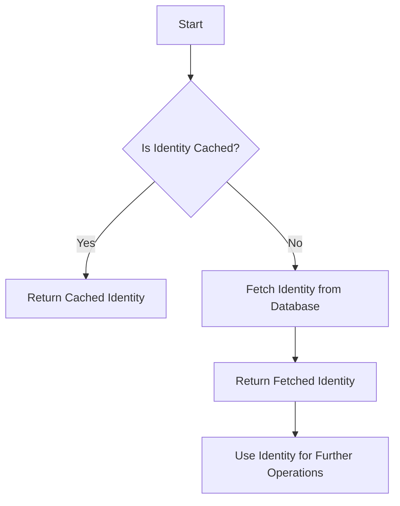

This document will cover the Identity Retrieval and Usage feature, which includes:

1. Checking for cached identity
2. Fetching identity from the database
3. Using the retrieved identity for further operations.

Technical document: <SwmLink doc-title="Identity Retrieval and Usage">[Identity Retrieval and Usage](/.swm/identity-retrieval-and-usage.fuqcelre.sw.md)</SwmLink>

# [Checking for Cached Identity](https://app.swimm.io/repos/Z2l0aHViJTNBJTNBc2VudHJ5LWRlbW8tMSUzQSUzQVN3aW1tLURlbW8=/docs/fuqcelre#identity-verification)

The process begins by checking if the identity object is already cached. If the identity is cached, it means that it has been previously retrieved and stored for quick access. This step is crucial for improving performance and reducing the need for repeated database queries. If the identity is found in the cache, it is immediately returned for use in subsequent operations.

# [Fetching Identity from the Database](https://app.swimm.io/repos/Z2l0aHViJTNBJTNBc2VudHJ5LWRlbW8tMSUzQSUzQVN3aW1tLURlbW8=/docs/fuqcelre#identity-verification)

If the identity is not found in the cache, the system proceeds to fetch it from the database using the identity ID. This step ensures that the most up-to-date identity information is retrieved. The identity ID is a unique identifier that allows the system to locate the correct identity record in the database. Once retrieved, the identity is stored in the cache for future use, optimizing subsequent retrievals.

# [Using the Retrieved Identity for Further Operations](https://app.swimm.io/repos/Z2l0aHViJTNBJTNBc2VudHJ5LWRlbW8tMSUzQSUzQVN3aW1tLURlbW8=/docs/fuqcelre#identity-verification)

After the identity is either retrieved from the cache or fetched from the database, it is used for further operations. These operations can include various tasks that require identity verification, such as accessing user-specific data, performing actions on behalf of the user, or integrating with other systems that require authenticated identity information. Ensuring that the identity is always up-to-date and readily available is essential for maintaining the integrity and security of these operations.

&nbsp;

*This is an auto-generated document by Swimm AI 🌊 and has not yet been verified by a human*

<SwmMeta version="3.0.0" repo-id="Z2l0aHViJTNBJTNBc2VudHJ5LWRlbW8tMSUzQSUzQVN3aW1tLURlbW8=" repo-name="sentry-demo-1" doc-type="product-flows">Powered by [Swimm](/)</SwmMeta>
