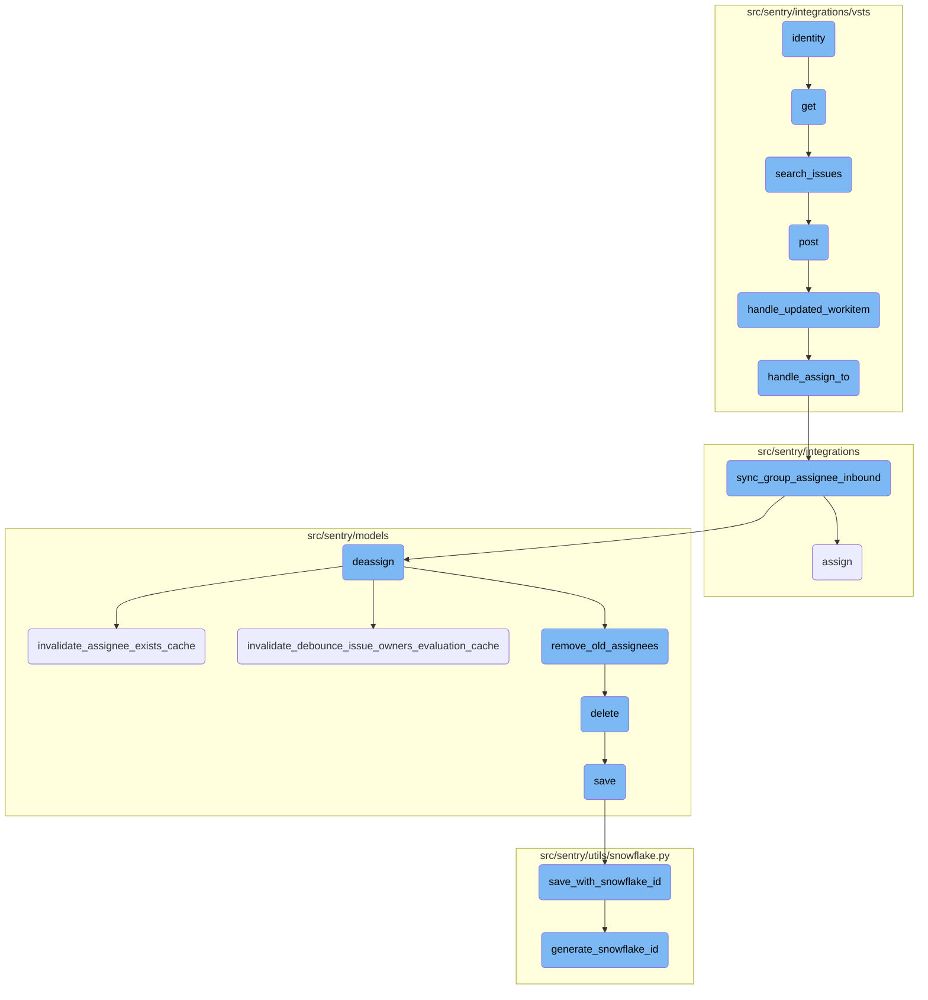
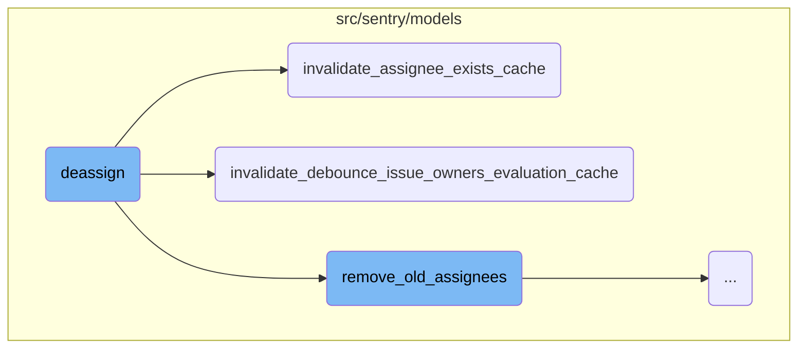
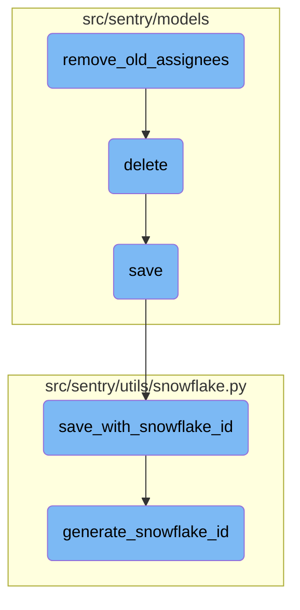

This document explains the process of identity retrieval and its subsequent usage. The identity function is responsible for fetching the identity object associated with the current instance. If the identity is already cached, it returns the cached object; otherwise, it fetches the identity from the database using the identity ID.

The flow starts by checking if the identity is already cached. If it is, the cached identity is returned. If not, the system fetches the identity from the database using the identity ID. This ensures that the identity is always up-to-date and available for further operations.

Here is a high level diagram of the flow, showing only the most important functions:



# Flow drill down

First, we'll zoom into this section of the flow:

```mermaid
graph TD;
      subgraph src/sentry/integrations/vsts
a0ceee58ad157d1eb23804409c9f2d3c53a8070d60980a0037d3a80e23540e4d(identity):::mainFlowStyle --> c9f1b6abd5b86b248deafac3aa63eb8d055350bf49cbe100c54a0d94ee13361a(get):::mainFlowStyle
end

subgraph src/sentry/integrations/vsts
c9f1b6abd5b86b248deafac3aa63eb8d055350bf49cbe100c54a0d94ee13361a(get):::mainFlowStyle --> fc4a2a7e5f1b5a9d6230778920f9b62f4b7f3caa80ebd97c89444e007895b382(search_issues):::mainFlowStyle
end

subgraph src/sentry/integrations/vsts
fc4a2a7e5f1b5a9d6230778920f9b62f4b7f3caa80ebd97c89444e007895b382(search_issues):::mainFlowStyle --> a0445eff32744589c21cfe40b46d7b4346893653994134be4a340aaaf32b3f6d(post):::mainFlowStyle
end

subgraph src/sentry/integrations/vsts
a0445eff32744589c21cfe40b46d7b4346893653994134be4a340aaaf32b3f6d(post):::mainFlowStyle --> 66e049c83c1ca3a7a23933e320651f77196243d817b62c1a401dfd7205f9a929(handle_updated_workitem):::mainFlowStyle
end

subgraph src/sentry/integrations/vsts
66e049c83c1ca3a7a23933e320651f77196243d817b62c1a401dfd7205f9a929(handle_updated_workitem):::mainFlowStyle --> 66c307c65db74ab637ed0ed1623cc34d22110f0911938f86a52ccb8f5e8009dd(handle_assign_to):::mainFlowStyle
end

subgraph src/sentry/integrations/utils/sync.py
66c307c65db74ab637ed0ed1623cc34d22110f0911938f86a52ccb8f5e8009dd(handle_assign_to):::mainFlowStyle --> dd6f2c6555a3ad00a0aed3ab34055c7026063e3a2a74b2537fcf2a1223ffa577(sync_group_assignee_inbound):::mainFlowStyle
end

subgraph src/sentry/integrations/discord/webhooks
dd6f2c6555a3ad00a0aed3ab34055c7026063e3a2a74b2537fcf2a1223ffa577(sync_group_assignee_inbound):::mainFlowStyle --> 56621b0838f35e2e3d298b3ec08199d7d5798cf4ceebb767aed231b8ab67c192(assign)
end

subgraph src/sentry/models/groupassignee.py
dd6f2c6555a3ad00a0aed3ab34055c7026063e3a2a74b2537fcf2a1223ffa577(sync_group_assignee_inbound):::mainFlowStyle --> c745dbcbd32c9f5374c257f26bdc9092c08fc103acaae49568a75a0568d76364(deassign):::mainFlowStyle
end

subgraph src/sentry/models/groupassignee.py
c745dbcbd32c9f5374c257f26bdc9092c08fc103acaae49568a75a0568d76364(deassign):::mainFlowStyle --> j2vec(...)
end

subgraph src/sentry/integrations/discord/webhooks
56621b0838f35e2e3d298b3ec08199d7d5798cf4ceebb767aed231b8ab67c192(assign) --> 5abb0782c5d50dc9bb2caef009ed5c564204afbedcccbd9f32c823400ee85c55(send_message)
end

subgraph src/sentry/integrations/discord/webhooks
56621b0838f35e2e3d298b3ec08199d7d5798cf4ceebb767aed231b8ab67c192(assign) --> a271e8523b1abc0b56bbfadd68e43785ec00b67c66b83a39e948e72bd3ba52bd(update_group)
end


      classDef mainFlowStyle color:#000000,fill:#7CB9F4
classDef rootsStyle color:#000000,fill:#00FFF4
classDef Style1 color:#000000,fill:#00FFAA
classDef Style2 color:#000000,fill:#FFFF00
classDef Style3 color:#000000,fill:#AA7CB9

%% Swimm:
%% graph TD;
%%       subgraph <SwmPath>[src/sentry/integrations/vsts/](src/sentry/integrations/vsts/)</SwmPath>
%% a0ceee58ad157d1eb23804409c9f2d3c53a8070d60980a0037d3a80e23540e4d(identity):::mainFlowStyle --> c9f1b6abd5b86b248deafac3aa63eb8d055350bf49cbe100c54a0d94ee13361a(get):::mainFlowStyle
%% end
%% 
%% subgraph <SwmPath>[src/sentry/integrations/vsts/](src/sentry/integrations/vsts/)</SwmPath>
%% c9f1b6abd5b86b248deafac3aa63eb8d055350bf49cbe100c54a0d94ee13361a(get):::mainFlowStyle --> fc4a2a7e5f1b5a9d6230778920f9b62f4b7f3caa80ebd97c89444e007895b382(search_issues):::mainFlowStyle
%% end
%% 
%% subgraph <SwmPath>[src/sentry/integrations/vsts/](src/sentry/integrations/vsts/)</SwmPath>
%% fc4a2a7e5f1b5a9d6230778920f9b62f4b7f3caa80ebd97c89444e007895b382(search_issues):::mainFlowStyle --> a0445eff32744589c21cfe40b46d7b4346893653994134be4a340aaaf32b3f6d(post):::mainFlowStyle
%% end
%% 
%% subgraph <SwmPath>[src/sentry/integrations/vsts/](src/sentry/integrations/vsts/)</SwmPath>
%% a0445eff32744589c21cfe40b46d7b4346893653994134be4a340aaaf32b3f6d(post):::mainFlowStyle --> 66e049c83c1ca3a7a23933e320651f77196243d817b62c1a401dfd7205f9a929(handle_updated_workitem):::mainFlowStyle
%% end
%% 
%% subgraph <SwmPath>[src/sentry/integrations/vsts/](src/sentry/integrations/vsts/)</SwmPath>
%% 66e049c83c1ca3a7a23933e320651f77196243d817b62c1a401dfd7205f9a929(handle_updated_workitem):::mainFlowStyle --> 66c307c65db74ab637ed0ed1623cc34d22110f0911938f86a52ccb8f5e8009dd(handle_assign_to):::mainFlowStyle
%% end
%% 
%% subgraph <SwmPath>[src/sentry/integrations/utils/sync.py](src/sentry/integrations/utils/sync.py)</SwmPath>
%% 66c307c65db74ab637ed0ed1623cc34d22110f0911938f86a52ccb8f5e8009dd(handle_assign_to):::mainFlowStyle --> dd6f2c6555a3ad00a0aed3ab34055c7026063e3a2a74b2537fcf2a1223ffa577(sync_group_assignee_inbound):::mainFlowStyle
%% end
%% 
%% subgraph <SwmPath>[src/sentry/integrations/discord/webhooks/](src/sentry/integrations/discord/webhooks/)</SwmPath>
%% dd6f2c6555a3ad00a0aed3ab34055c7026063e3a2a74b2537fcf2a1223ffa577(sync_group_assignee_inbound):::mainFlowStyle --> 56621b0838f35e2e3d298b3ec08199d7d5798cf4ceebb767aed231b8ab67c192(assign)
%% end
%% 
%% subgraph <SwmPath>[src/sentry/models/groupassignee.py](src/sentry/models/groupassignee.py)</SwmPath>
%% dd6f2c6555a3ad00a0aed3ab34055c7026063e3a2a74b2537fcf2a1223ffa577(sync_group_assignee_inbound):::mainFlowStyle --> c745dbcbd32c9f5374c257f26bdc9092c08fc103acaae49568a75a0568d76364(deassign):::mainFlowStyle
%% end
%% 
%% subgraph <SwmPath>[src/sentry/models/groupassignee.py](src/sentry/models/groupassignee.py)</SwmPath>
%% c745dbcbd32c9f5374c257f26bdc9092c08fc103acaae49568a75a0568d76364(deassign):::mainFlowStyle --> j2vec(...)
%% end
%% 
%% subgraph <SwmPath>[src/sentry/integrations/discord/webhooks/](src/sentry/integrations/discord/webhooks/)</SwmPath>
%% 56621b0838f35e2e3d298b3ec08199d7d5798cf4ceebb767aed231b8ab67c192(assign) --> 5abb0782c5d50dc9bb2caef009ed5c564204afbedcccbd9f32c823400ee85c55(send_message)
%% end
%% 
%% subgraph <SwmPath>[src/sentry/integrations/discord/webhooks/](src/sentry/integrations/discord/webhooks/)</SwmPath>
%% 56621b0838f35e2e3d298b3ec08199d7d5798cf4ceebb767aed231b8ab67c192(assign) --> a271e8523b1abc0b56bbfadd68e43785ec00b67c66b83a39e948e72bd3ba52bd(update_group)
%% end
%% 
%% 
%%       classDef mainFlowStyle color:#000000,fill:#7CB9F4
%% classDef rootsStyle color:#000000,fill:#00FFF4
%% classDef Style1 color:#000000,fill:#00FFAA
%% classDef Style2 color:#000000,fill:#FFFF00
%% classDef Style3 color:#000000,fill:#AA7CB9
```



<SwmSnippet path="/src/sentry/integrations/vsts/client.py" line="175">

---

## Identity Verification

The <SwmToken path="src/sentry/integrations/vsts/client.py" pos="175:3:3" line-data="    def identity(self):">`identity`</SwmToken> function retrieves the identity object associated with the current instance. If the identity is already cached, it returns it; otherwise, it fetches the identity from the database using the <SwmToken path="src/sentry/integrations/vsts/client.py" pos="178:17:17" line-data="        self._identity = Identity.objects.get(id=self.identity_id)">`identity_id`</SwmToken>.

```python
    def identity(self):
        if self._identity:
            return self._identity
        self._identity = Identity.objects.get(id=self.identity_id)
        return self._identity
```

---

</SwmSnippet>

<SwmSnippet path="/src/sentry/integrations/vsts/search.py" line="23">

---

## Retrieving Integration

The <SwmToken path="src/sentry/integrations/vsts/search.py" pos="23:3:3" line-data="    def get(">`get`</SwmToken> function starts by attempting to retrieve the integration object based on the organization and integration ID. If the integration does not exist, it returns a 404 response.

```python
    def get(
        self, request: Request, organization: RpcOrganization, integration_id: int, **kwds: Any
    ) -> Response:
        try:
            integration = Integration.objects.get(
                organizationintegration__organization_id=coerce_id_from(organization),
                id=integration_id,
                provider="vsts",
            )
        except Integration.DoesNotExist:
```

---

</SwmSnippet>

<SwmSnippet path="/src/sentry/integrations/vsts/search.py" line="35">

---

### Validating Request Parameters

The function then checks for the presence of required parameters <SwmToken path="src/sentry/integrations/vsts/search.py" pos="35:1:1" line-data="        field = request.GET.get(&quot;field&quot;)">`field`</SwmToken> and <SwmToken path="src/sentry/integrations/vsts/search.py" pos="36:1:1" line-data="        query = request.GET.get(&quot;query&quot;)">`query`</SwmToken> in the request. If either is missing, it returns a 400 response with an appropriate error message.

```python
        field = request.GET.get("field")
        query = request.GET.get("query")
        if field is None:
            return Response({"detail": "field is a required parameter"}, status=400)
        if not query:
            return Response({"detail": "query is a required parameter"}, status=400)
```

---

</SwmSnippet>

<SwmSnippet path="/src/sentry/integrations/vsts/search.py" line="49">

---

### Searching Issues

If the <SwmToken path="src/sentry/integrations/vsts/search.py" pos="35:1:1" line-data="        field = request.GET.get(&quot;field&quot;)">`field`</SwmToken> parameter is <SwmToken path="src/sentry/integrations/vsts/search.py" pos="45:8:8" line-data="        if field == &quot;externalIssue&quot;:">`externalIssue`</SwmToken>, the function calls <SwmToken path="src/sentry/integrations/vsts/search.py" pos="49:7:7" line-data="            resp = installation.search_issues(query=query)">`search_issues`</SwmToken> on the integration installation to search for issues matching the query. It then formats and returns the search results.

```python
            resp = installation.search_issues(query=query)
            return Response(
                [
                    {
                        "label": f'({i["fields"]["system.id"]}) {i["fields"]["system.title"]}',
                        "value": i["fields"]["system.id"],
                    }
                    for i in resp.get("results", [])
                ]
            )
```

---

</SwmSnippet>

<SwmSnippet path="/src/sentry/integrations/vsts/client.py" line="417">

---

## Issue Search Implementation

The <SwmToken path="src/sentry/integrations/vsts/client.py" pos="417:3:3" line-data="    def search_issues(self, account_name: str, query: str | None = None) -&gt; Response:">`search_issues`</SwmToken> function sends a POST request to the VSTS API to search for work items based on the provided query. It returns the response from the API.

```python
    def search_issues(self, account_name: str, query: str | None = None) -> Response:
        return self.post(
            VstsApiPath.work_item_search.format(account_name=account_name),
            data={"searchText": query, "$top": 1000},
            api_preview=True,
        )
```

---

</SwmSnippet>

Now, lets zoom into this section of the flow:



<SwmSnippet path="/src/sentry/models/groupassignee.py" line="197">

---

## Deassign Function

The <SwmToken path="src/sentry/models/groupassignee.py" pos="197:3:3" line-data="    def deassign(">`deassign`</SwmToken> function is responsible for removing the current assignee from a group. It first attempts to retrieve the current assignee and then deletes the assignee record. If an assignee was found and deleted, it logs this activity and updates the group history. Additionally, it clears relevant caches and synchronizes the change with external systems if necessary.

```python
    def deassign(
        self,
        group: Group,
        acting_user: User | RpcUser | None = None,
        assigned_to: Team | RpcUser | None = None,
        extra: dict[str, str] | None = None,
    ) -> None:
        from sentry.integrations.utils import sync_group_assignee_outbound
        from sentry.models.activity import Activity
        from sentry.models.projectownership import ProjectOwnership

        try:
            previous_groupassignee = self.get(group=group)
        except GroupAssignee.DoesNotExist:
            previous_groupassignee = None

        affected = self.filter(group=group)[:1].count()
        self.filter(group=group).delete()

        if affected > 0:
            Activity.objects.create_group_activity(group, ActivityType.UNASSIGNED, user=acting_user)
```

---

</SwmSnippet>

<SwmSnippet path="/src/sentry/models/groupassignee.py" line="225">

---

### Cache Invalidation

The <SwmToken path="src/sentry/models/groupassignee.py" pos="197:3:3" line-data="    def deassign(">`deassign`</SwmToken> function calls <SwmToken path="src/sentry/models/groupassignee.py" pos="225:3:3" line-data="            GroupOwner.invalidate_assignee_exists_cache(group.project.id, group.id)">`invalidate_assignee_exists_cache`</SwmToken> to clear the cache that tracks whether an assignee exists for the group.

```python
            GroupOwner.invalidate_assignee_exists_cache(group.project.id, group.id)
            GroupOwner.invalidate_debounce_issue_owners_evaluation_cache(group.project.id, group.id)
```

---

</SwmSnippet>

<SwmSnippet path="/src/sentry/models/groupassignee.py" line="226">

---

The <SwmToken path="src/sentry/models/groupassignee.py" pos="197:3:3" line-data="    def deassign(">`deassign`</SwmToken> function also calls <SwmToken path="src/sentry/models/groupassignee.py" pos="226:3:3" line-data="            GroupOwner.invalidate_debounce_issue_owners_evaluation_cache(group.project.id, group.id)">`invalidate_debounce_issue_owners_evaluation_cache`</SwmToken> to clear the cache related to issue owners' evaluation.

```python
            GroupOwner.invalidate_debounce_issue_owners_evaluation_cache(group.project.id, group.id)

```

---

</SwmSnippet>

<SwmSnippet path="/src/sentry/models/groupowner.py" line="150">

---

## Invalidate Assignee Exists Cache

The <SwmToken path="src/sentry/models/groupowner.py" pos="150:3:3" line-data="    def invalidate_assignee_exists_cache(cls, project_id, group_id=None):">`invalidate_assignee_exists_cache`</SwmToken> function clears the cache that indicates whether an assignee exists for a specific group or for all groups within a project that had recent events. This ensures that any subsequent queries for assignee existence will fetch fresh data.

```python
    def invalidate_assignee_exists_cache(cls, project_id, group_id=None):
        """
        If `group_id` is provided, clear the assignee exists cache for that group, else
        clear the cache of all groups for a project that had an event within the
        ASSIGNEE_EXISTS_DURATION window.
        """
        if group_id:
            cache.delete(ASSIGNEE_EXISTS_KEY(group_id))
            return

        # Get all the groups for a project that had an event within the ASSIGNEE_EXISTS_DURATION window.
        # Any groups without events in that window would have expired their TTL in the cache.
        queryset = Group.objects.filter(
            project_id=project_id,
            last_seen__gte=timezone.now() - timedelta(seconds=ASSIGNEE_EXISTS_DURATION),
        ).values_list("id", flat=True)

        # Run cache invalidation in batches
        group_id_iter = queryset.iterator(chunk_size=1000)
        while True:
            group_ids = list(itertools.islice(group_id_iter, 1000))
```

---

</SwmSnippet>

<SwmSnippet path="/src/sentry/models/groupowner.py" line="123">

---

## Invalidate Debounce Issue Owners Evaluation Cache

The <SwmToken path="src/sentry/models/groupowner.py" pos="123:3:3" line-data="    def invalidate_debounce_issue_owners_evaluation_cache(cls, project_id, group_id=None):">`invalidate_debounce_issue_owners_evaluation_cache`</SwmToken> function clears the cache related to the debounce evaluation of issue owners for a specific group or for all groups within a project that had recent events. This ensures that the evaluation logic will be re-executed with fresh data.

```python
    def invalidate_debounce_issue_owners_evaluation_cache(cls, project_id, group_id=None):
        """
        If `group_id` is provided, clear the debounce issue owners cache for that group, else clear
        the cache of all groups for a project that had an event within the
        ISSUE_OWNERS_DEBOUNCE_DURATION window.
        """
        if group_id:
            cache.delete(ISSUE_OWNERS_DEBOUNCE_KEY(group_id))
            return

        # Get all the groups for a project that had an event within the ISSUE_OWNERS_DEBOUNCE_DURATION window.
        # Any groups without events in that window would have expired their TTL in the cache.
        queryset = Group.objects.filter(
            project_id=project_id,
            last_seen__gte=timezone.now() - timedelta(seconds=ISSUE_OWNERS_DEBOUNCE_DURATION),
        ).values_list("id", flat=True)

        # Run cache invalidation in batches
        group_id_iter = queryset.iterator(chunk_size=1000)
        while True:
            group_ids = list(itertools.islice(group_id_iter, 1000))
```

---

</SwmSnippet>

Now, lets zoom into this section of the flow:



<SwmSnippet path="/src/sentry/models/groupassignee.py" line="65">

---

## Removing Old Assignees

The function <SwmToken path="src/sentry/models/groupassignee.py" pos="65:3:3" line-data="    def remove_old_assignees(">`remove_old_assignees`</SwmToken> is responsible for cleaning up old assignees from a group. It checks if the previous assignee is a team and if the feature <SwmToken path="src/sentry/models/groupassignee.py" pos="78:6:12" line-data="            features.has(&quot;organizations:team-workflow-notifications&quot;, group.organization)">`organizations:team-workflow-notifications`</SwmToken> is enabled, it removes the team from the group subscriptions. If the previous assignee is a user, it ensures that the user is not part of the new assignee team before removing them from the group subscriptions.

```python
    def remove_old_assignees(
        self,
        group: Group,
        previous_assignee: GroupAssignee | None,
        new_assignee_id: int | None = None,
        new_assignee_type: str | None = None,
    ) -> None:
        from sentry.models.team import Team

        if not previous_assignee:
            return

        if (
            features.has("organizations:team-workflow-notifications", group.organization)
            and previous_assignee.team
        ):
            GroupSubscription.objects.filter(
                group=group,
                project=group.project,
                team=previous_assignee.team,
                reason=GroupSubscriptionReason.assigned,
```

---

</SwmSnippet>

<SwmSnippet path="/src/sentry/models/project.py" line="718">

---

## Deleting a Project

The <SwmToken path="src/sentry/models/project.py" pos="718:3:3" line-data="    def delete(self, *args, **kwargs):">`delete`</SwmToken> function in the <SwmToken path="src/sentry/models/project.py" pos="722:13:13" line-data="        with outbox_context(transaction.atomic(router.db_for_write(Project))):">`Project`</SwmToken> model handles the deletion of a project. It manually cascades the deletion to remove notification settings associated with the project and ensures that the deletion is performed within a transaction context to maintain data integrity.

```python
    def delete(self, *args, **kwargs):
        # There is no foreign key relationship so we have to manually cascade.
        notifications_service.remove_notification_settings_for_project(project_id=self.id)

        with outbox_context(transaction.atomic(router.db_for_write(Project))):
            Project.outbox_for_update(self.id, self.organization_id).save()
            return super().delete(*args, **kwargs)
```

---

</SwmSnippet>

<SwmSnippet path="/src/sentry/models/project.py" line="365">

---

## Saving a Project

The <SwmToken path="src/sentry/models/project.py" pos="365:3:3" line-data="    def save(self, *args, **kwargs):">`save`</SwmToken> function in the <SwmToken path="src/sentry/models/project.py" pos="368:5:5" line-data="                f&quot;slug:project:{self.organization_id}&quot;, duration=5, name=&quot;project_slug&quot;">`project`</SwmToken> model ensures that the project has a unique slug before saving. If the <SwmToken path="src/sentry/models/project.py" pos="379:3:3" line-data="        if SENTRY_USE_SNOWFLAKE:">`SENTRY_USE_SNOWFLAKE`</SwmToken> setting is enabled, it uses the <SwmToken path="src/sentry/models/project.py" pos="381:1:1" line-data="            save_with_snowflake_id(">`save_with_snowflake_id`</SwmToken> function to generate a unique ID for the project using the Snowflake algorithm.

```python
    def save(self, *args, **kwargs):
        if not self.slug:
            lock = locks.get(
                f"slug:project:{self.organization_id}", duration=5, name="project_slug"
            )
            with TimedRetryPolicy(10)(lock.acquire):
                slugify_instance(
                    self,
                    self.name,
                    organization=self.organization,
                    reserved=RESERVED_PROJECT_SLUGS,
                    max_length=50,
                )

        if SENTRY_USE_SNOWFLAKE:
            snowflake_redis_key = "project_snowflake_key"
            save_with_snowflake_id(
                instance=self,
                snowflake_redis_key=snowflake_redis_key,
                save_callback=lambda: super(Project, self).save(*args, **kwargs),
            )
```

---

</SwmSnippet>

<SwmSnippet path="/src/sentry/utils/snowflake.py" line="47">

---

### Saving with Snowflake ID

The <SwmToken path="src/sentry/utils/snowflake.py" pos="47:2:2" line-data="def save_with_snowflake_id(">`save_with_snowflake_id`</SwmToken> function generates a unique Snowflake ID for the project and attempts to save it. If an integrity error occurs, it retries the operation up to a maximum number of times defined by <SwmToken path="src/sentry/utils/snowflake.py" pos="54:9:11" line-data="    for _ in range(settings.MAX_REDIS_SNOWFLAKE_RETRY_COUNTER):">`settings.MAX_REDIS_SNOWFLAKE_RETRY_COUNTER`</SwmToken>.

```python
def save_with_snowflake_id(
    instance: BaseModel, snowflake_redis_key: str, save_callback: Callable[[], object]
) -> None:
    assert uses_snowflake_id(
        instance.__class__
    ), "Only models decorated with uses_snowflake_id can be saved with save_with_snowflake_id()"

    for _ in range(settings.MAX_REDIS_SNOWFLAKE_RETRY_COUNTER):
        if not instance.id:
            instance.id = generate_snowflake_id(snowflake_redis_key)
        try:
            with enforce_constraints(transaction.atomic(using=router.db_for_write(type(instance)))):
                save_callback()
            return
        except IntegrityError:
            instance.id = None  # type: ignore[assignment]  # see typeddjango/django-stubs#2014
    raise MaxSnowflakeRetryError
```

---

</SwmSnippet>

<SwmSnippet path="/src/sentry/utils/snowflake.py" line="113">

---

### Generating Snowflake ID

The <SwmToken path="src/sentry/utils/snowflake.py" pos="113:2:2" line-data="def generate_snowflake_id(redis_key: str) -&gt; int:">`generate_snowflake_id`</SwmToken> function generates a unique Snowflake ID based on the current timestamp, region ID, and a sequence value retrieved from Redis. This ID is used to uniquely identify records in a distributed system.

```python
def generate_snowflake_id(redis_key: str) -> int:
    segment_values = {}

    segment_values[VERSION_ID] = msb_0_ordering(settings.SNOWFLAKE_VERSION_ID, VERSION_ID.length)

    try:
        segment_values[REGION_ID] = get_local_region().snowflake_id
    except RegionContextError:  # expected if running in monolith mode
        segment_values[REGION_ID] = NULL_REGION_ID

    current_time = datetime.now().timestamp()
    # supports up to 130 years
    segment_values[TIME_DIFFERENCE] = int(current_time - settings.SENTRY_SNOWFLAKE_EPOCH_START)

    snowflake_id = 0
    (
        segment_values[TIME_DIFFERENCE],
        segment_values[REGION_SEQUENCE],
    ) = get_sequence_value_from_redis(redis_key, segment_values[TIME_DIFFERENCE])

    for segment in BIT_SEGMENT_SCHEMA:
```

---

</SwmSnippet>

&nbsp;

*This is an auto-generated document by Swimm AI 🌊 and has not yet been verified by a human*

<SwmMeta version="3.0.0" repo-id="Z2l0aHViJTNBJTNBc2VudHJ5LWRlbW8tMSUzQSUzQVN3aW1tLURlbW8=" repo-name="sentry-demo-1" doc-type="flows"><sup>Powered by [Swimm](/)</sup></SwmMeta>
