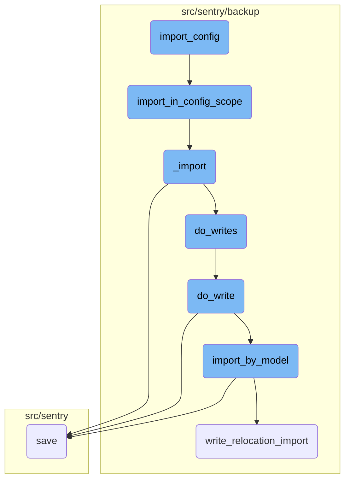
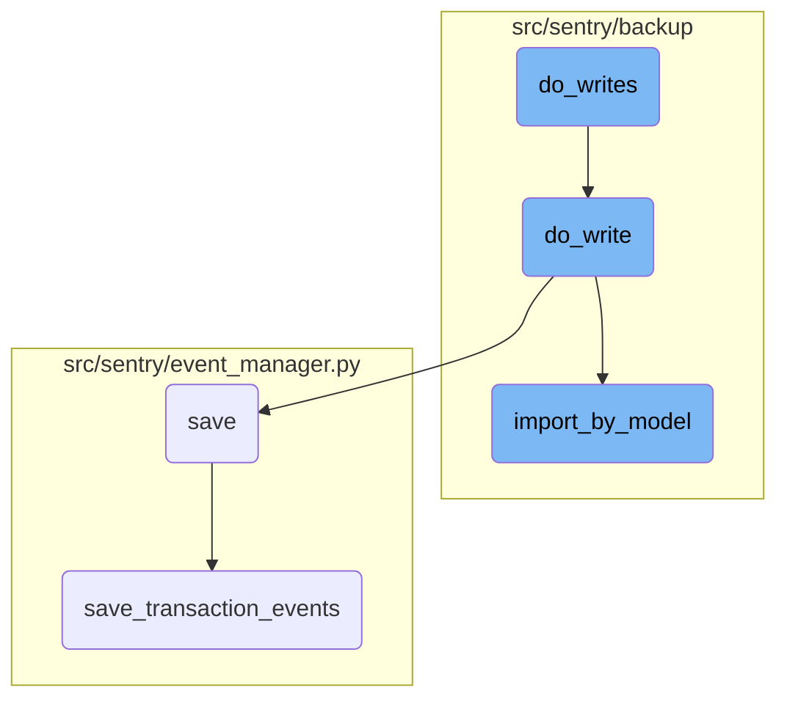

In this document, we will explain the process of importing configuration and administrator accounts using the <SwmToken path="src/sentry/runner/commands/backup.py" pos="812:2:2" line-data="def import_config(">`import_config`</SwmToken> function. This process involves initializing necessary components, decrypting data, and importing models required for configuring and administrating a Sentry instance.

The flow starts with the <SwmToken path="src/sentry/runner/commands/backup.py" pos="812:2:2" line-data="def import_config(">`import_config`</SwmToken> function, which sets up the necessary components and calls <SwmToken path="src/sentry/runner/commands/backup.py" pos="826:11:11" line-data="    from sentry.backup.imports import import_in_config_scope">`import_in_config_scope`</SwmToken> to handle the actual import process. This involves decrypting the data and importing all required models, including users with administrator privileges. The <SwmToken path="src/sentry/backup/imports.py" pos="87:2:2" line-data="def _import(">`_import`</SwmToken> function then processes the JSON content, iterates over the models, and writes the data to the database. Finally, the <SwmToken path="src/sentry/event_manager.py" pos="448:3:3" line-data="    def save(">`save`</SwmToken> function ensures that the imported data is correctly processed and stored.

Here is a high level diagram of the flow, showing only the most important functions:



# Flow drill down

First, we'll zoom into this section of the flow:

```mermaid
graph TD;
      subgraph src/sentry
c64108beb1a895840ee2b3b6c379ae0fa9a6ce61bbad0bdf154a59301c0e79bf(import_config):::mainFlowStyle --> 88f0f028220db434259922f6741fa1d356e61bd7202749ffd46640adc1127e23(import_in_config_scope):::mainFlowStyle
end

subgraph src/sentry
88f0f028220db434259922f6741fa1d356e61bd7202749ffd46640adc1127e23(import_in_config_scope):::mainFlowStyle --> e51390835e25abe9700c58ce684275b91c592cbc3798916fccfb8d5e98213501(_import):::mainFlowStyle
end

subgraph src/sentry
e51390835e25abe9700c58ce684275b91c592cbc3798916fccfb8d5e98213501(_import):::mainFlowStyle --> 5086692df24257d76a0adf892eba843feac14033d92b4a32022b125d5a725f9b(save)
end

subgraph src/sentry
e51390835e25abe9700c58ce684275b91c592cbc3798916fccfb8d5e98213501(_import):::mainFlowStyle --> 26207a08d7fb570302a7c1ba260755115f33628088a15b2009f16110f8f0dae8(do_writes):::mainFlowStyle
end

subgraph src/sentry
26207a08d7fb570302a7c1ba260755115f33628088a15b2009f16110f8f0dae8(do_writes):::mainFlowStyle --> xixvg(...)
end

subgraph src/sentry
5086692df24257d76a0adf892eba843feac14033d92b4a32022b125d5a725f9b(save) --> b8052a0e9cf4dd2783dd9f9b401321908e36ff05fa95ad9dd7944757173348b4(save_transaction_events)
end


      classDef mainFlowStyle color:#000000,fill:#7CB9F4
classDef rootsStyle color:#000000,fill:#00FFF4
classDef Style1 color:#000000,fill:#00FFAA
classDef Style2 color:#000000,fill:#FFFF00
classDef Style3 color:#000000,fill:#AA7CB9

%% Swimm:
%% graph TD;
%%       subgraph <SwmPath>[src/sentry/](src/sentry/)</SwmPath>
%% c64108beb1a895840ee2b3b6c379ae0fa9a6ce61bbad0bdf154a59301c0e79bf(import_config):::mainFlowStyle --> 88f0f028220db434259922f6741fa1d356e61bd7202749ffd46640adc1127e23(import_in_config_scope):::mainFlowStyle
%% end
%% 
%% subgraph <SwmPath>[src/sentry/](src/sentry/)</SwmPath>
%% 88f0f028220db434259922f6741fa1d356e61bd7202749ffd46640adc1127e23(import_in_config_scope):::mainFlowStyle --> e51390835e25abe9700c58ce684275b91c592cbc3798916fccfb8d5e98213501(_import):::mainFlowStyle
%% end
%% 
%% subgraph <SwmPath>[src/sentry/](src/sentry/)</SwmPath>
%% e51390835e25abe9700c58ce684275b91c592cbc3798916fccfb8d5e98213501(_import):::mainFlowStyle --> 5086692df24257d76a0adf892eba843feac14033d92b4a32022b125d5a725f9b(save)
%% end
%% 
%% subgraph <SwmPath>[src/sentry/](src/sentry/)</SwmPath>
%% e51390835e25abe9700c58ce684275b91c592cbc3798916fccfb8d5e98213501(_import):::mainFlowStyle --> 26207a08d7fb570302a7c1ba260755115f33628088a15b2009f16110f8f0dae8(do_writes):::mainFlowStyle
%% end
%% 
%% subgraph <SwmPath>[src/sentry/](src/sentry/)</SwmPath>
%% 26207a08d7fb570302a7c1ba260755115f33628088a15b2009f16110f8f0dae8(do_writes):::mainFlowStyle --> xixvg(...)
%% end
%% 
%% subgraph <SwmPath>[src/sentry/](src/sentry/)</SwmPath>
%% 5086692df24257d76a0adf892eba843feac14033d92b4a32022b125d5a725f9b(save) --> b8052a0e9cf4dd2783dd9f9b401321908e36ff05fa95ad9dd7944757173348b4(save_transaction_events)
%% end
%% 
%% 
%%       classDef mainFlowStyle color:#000000,fill:#7CB9F4
%% classDef rootsStyle color:#000000,fill:#00FFF4
%% classDef Style1 color:#000000,fill:#00FFAA
%% classDef Style2 color:#000000,fill:#FFFF00
%% classDef Style3 color:#000000,fill:#AA7CB9
```



<SwmSnippet path="/src/sentry/runner/commands/backup.py" line="812">

---

## <SwmToken path="src/sentry/runner/commands/backup.py" pos="812:2:2" line-data="def import_config(">`import_config`</SwmToken>

The <SwmToken path="src/sentry/runner/commands/backup.py" pos="812:2:2" line-data="def import_config(">`import_config`</SwmToken> function is responsible for importing all configuration and administrator accounts needed to set up a Sentry instance. It initializes a printer for output, sets up the decryption mechanism, and calls <SwmToken path="src/sentry/runner/commands/backup.py" pos="826:11:11" line-data="    from sentry.backup.imports import import_in_config_scope">`import_in_config_scope`</SwmToken> to handle the actual import process.

```python
def import_config(
    src: IO[bytes],
    decrypt_with: IO[bytes],
    decrypt_with_gcp_kms: IO[bytes],
    findings_file: IO[str],
    merge_users: bool,
    no_prompt: bool,
    overwrite_configs: bool,
    silent: bool,
) -> None:
    """
    Import all configuration and administrator accounts needed to set up this Sentry instance.
    """

    from sentry.backup.imports import import_in_config_scope

    printer = get_printer(silent=silent, no_prompt=no_prompt)
    with write_import_findings(findings_file, printer):
        import_in_config_scope(
            src,
            decryptor=get_decryptor_from_flags(decrypt_with, decrypt_with_gcp_kms),
```

---

</SwmSnippet>

<SwmSnippet path="/src/sentry/backup/imports.py" line="552">

---

## <SwmToken path="src/sentry/backup/imports.py" pos="552:2:2" line-data="def import_in_config_scope(">`import_in_config_scope`</SwmToken>

The <SwmToken path="src/sentry/backup/imports.py" pos="552:2:2" line-data="def import_in_config_scope(">`import_in_config_scope`</SwmToken> function performs the import within the <SwmToken path="src/sentry/backup/imports.py" pos="561:12:12" line-data="    Perform an import in the `Config` scope, meaning that we will import all models required to">`Config`</SwmToken> scope. This means it imports all models required to globally configure and administrate a Sentry instance from the provided source file. It ensures that all users, including those with administrator privileges, are imported.

```python
def import_in_config_scope(
    src: IO[bytes],
    *,
    decryptor: Decryptor | None = None,
    flags: ImportFlags | None = None,
    user_filter: set[str] | None = None,
    printer: Printer,
):
    """
    Perform an import in the `Config` scope, meaning that we will import all models required to
    globally configure and administrate a Sentry instance from the provided `src` file. This
    requires importing all users in the supplied file, including those with administrator
    privileges.

    Like imports in the `Global` scope, superuser and administrator privileges are not sanitized.
    Unlike the `Global` scope, however, user-specific authentication information 2FA methods and
    social login connections are not retained.
    """

    # Import here to prevent circular module resolutions.
    from sentry.users.models.user import User
```

---

</SwmSnippet>

<SwmSnippet path="/src/sentry/backup/imports.py" line="87">

---

## \_import

The <SwmToken path="src/sentry/backup/imports.py" pos="87:2:2" line-data="def _import(">`_import`</SwmToken> function handles the core logic of importing data. It processes the JSON content, iterates over the models, and performs the necessary writes to the database. This function ensures that the data is correctly imported and mapped to the appropriate models.

```python
def _import(
    src: IO[bytes],
    scope: ImportScope,
    *,
    decryptor: Decryptor | None = None,
    flags: ImportFlags | None = None,
    filter_by: Filter | None = None,
    printer: Printer,
):
    """
    Imports core data for a Sentry installation.

    It is generally preferable to avoid calling this function directly, as there are certain
    combinations of input parameters that should not be used together. Instead, use one of the other
    wrapper functions in this file, named `import_in_XXX_scope()`.
    """

    # Import here to prevent circular module resolutions.
    from sentry.models.organization import Organization
    from sentry.models.organizationmember import OrganizationMember
    from sentry.users.models.email import Email
```

---

</SwmSnippet>

<SwmSnippet path="/src/sentry/event_manager.py" line="448">

---

## save

The <SwmToken path="src/sentry/event_manager.py" pos="448:3:3" line-data="    def save(">`save`</SwmToken> function in the <SwmToken path="src/sentry/event_manager.py" pos="361:2:2" line-data="class EventManager:">`EventManager`</SwmToken> class is responsible for normalizing and processing an event, saving adjacent models such as releases and environments to the database, and writing the event into the event stream. This function ensures that events are correctly processed and stored.

```python
    def save(
        self,
        project_id: int | None,
        raw: bool = False,
        assume_normalized: bool = False,
        start_time: float | None = None,
        cache_key: str | None = None,
        skip_send_first_transaction: bool = False,
        has_attachments: bool = False,
    ) -> Event:
        """
        After normalizing and processing an event, save adjacent models such as
        releases and environments to postgres and write the event into
        eventstream. From there it will be picked up by Snuba and
        post-processing.

        We re-insert events with duplicate IDs into Snuba, which is responsible
        for deduplicating events. Since deduplication in Snuba is on the primary
        key (based on event ID, project ID and day), events with same IDs are only
        deduplicated if their timestamps fall on the same day. The latest event
        always wins and overwrites the value of events received earlier in that day.
```

---

</SwmSnippet>

<SwmSnippet path="/src/sentry/event_manager.py" line="3040">

---

## <SwmToken path="src/sentry/event_manager.py" pos="3040:2:2" line-data="def save_transaction_events(jobs: Sequence[Job], projects: ProjectsMapping) -&gt; Sequence[Job]:">`save_transaction_events`</SwmToken>

The <SwmToken path="src/sentry/event_manager.py" pos="3040:2:2" line-data="def save_transaction_events(jobs: Sequence[Job], projects: ProjectsMapping) -&gt; Sequence[Job]:">`save_transaction_events`</SwmToken> function handles the saving of transaction events. It processes the jobs, sets up necessary measurements, and performs various operations such as creating releases, deriving tags, and inserting events into the event stream. This function ensures that transaction events are correctly processed and stored.

```python
def save_transaction_events(jobs: Sequence[Job], projects: ProjectsMapping) -> Sequence[Job]:
    organization_ids = {project.organization_id for project in projects.values()}
    organizations = {o.id: o for o in Organization.objects.get_many_from_cache(organization_ids)}

    for project in projects.values():
        try:
            project.set_cached_field_value("organization", organizations[project.organization_id])
        except KeyError:
            continue

    set_measurement(measurement_name="jobs", value=len(jobs))
    set_measurement(measurement_name="projects", value=len(projects))

    _get_or_create_release_many(jobs, projects)
    _get_event_user_many(jobs, projects)
    _derive_plugin_tags_many(jobs, projects)
    _derive_interface_tags_many(jobs)
    _calculate_span_grouping(jobs, projects)
    _materialize_metadata_many(jobs)
    _get_or_create_environment_many(jobs, projects)
    _get_or_create_release_associated_models(jobs, projects)
```

---

</SwmSnippet>

Now, lets zoom into this section of the flow:



<SwmSnippet path="/src/sentry/backup/imports.py" line="399">

---

## Handling deferred organization authentication tokens

The <SwmToken path="src/sentry/backup/imports.py" pos="396:3:3" line-data="    def do_writes(pk_map: PrimaryKeyMap) -&gt; None:">`do_writes`</SwmToken> function iterates over the JSON models yielded by <SwmToken path="src/sentry/backup/imports.py" pos="399:13:13" line-data="        for model_name, json_data, offset in yield_json_models(content):">`yield_json_models`</SwmToken>. If the model name matches <SwmToken path="src/sentry/backup/imports.py" pos="400:7:7" line-data="            if model_name == org_auth_token_model_name:">`org_auth_token_model_name`</SwmToken>, the JSON data is appended to <SwmToken path="src/sentry/backup/imports.py" pos="401:1:1" line-data="                deferred_org_auth_tokens.append(json_data)">`deferred_org_auth_tokens`</SwmToken> and the loop continues without processing this data immediately.

```python
        for model_name, json_data, offset in yield_json_models(content):
            if model_name == org_auth_token_model_name:
                deferred_org_auth_tokens.append(json_data)
                continue
```

---

</SwmSnippet>

<SwmSnippet path="/src/sentry/backup/imports.py" line="404">

---

## Performing model writes

For other models, the <SwmToken path="src/sentry/backup/imports.py" pos="396:3:3" line-data="    def do_writes(pk_map: PrimaryKeyMap) -&gt; None:">`do_writes`</SwmToken> function calls <SwmToken path="src/sentry/backup/imports.py" pos="404:1:1" line-data="            do_write(import_write_context, pk_map, model_name, json_data, offset)">`do_write`</SwmToken> to handle the actual writing process. This ensures that each model's data is processed and written appropriately.

```python
            do_write(import_write_context, pk_map, model_name, json_data, offset)
```

---

</SwmSnippet>

<SwmSnippet path="/src/sentry/backup/imports.py" line="320">

---

### Importing by model

The <SwmToken path="src/sentry/backup/imports.py" pos="404:1:1" line-data="            do_write(import_write_context, pk_map, model_name, json_data, offset)">`do_write`</SwmToken> function uses <SwmToken path="src/sentry/backup/imports.py" pos="320:5:5" line-data="        result = import_by_model(">`import_by_model`</SwmToken> to import the model data. This function handles the specifics of importing data for a given model, including partitioning the primary key map and managing import flags.

```python
        result = import_by_model(
            import_model_name=model_name_str,
            scope=import_write_context.scope,
            flags=import_write_context.flags,
            filter_by=import_write_context.filter_by,
            pk_map=RpcPrimaryKeyMap.into_rpc(pk_map.partition(dep_models)),
            json_data=json_data,
            min_ordinal=min_ordinal,
        )
```

---

</SwmSnippet>

<SwmSnippet path="/src/sentry/backup/imports.py" line="330">

---

### Handling import errors

If <SwmToken path="src/sentry/backup/imports.py" pos="320:5:5" line-data="        result = import_by_model(">`import_by_model`</SwmToken> returns an <SwmToken path="src/sentry/backup/imports.py" pos="330:8:8" line-data="        if isinstance(result, RpcImportError):">`RpcImportError`</SwmToken>, <SwmToken path="src/sentry/backup/imports.py" pos="404:1:1" line-data="            do_write(import_write_context, pk_map, model_name, json_data, offset)">`do_write`</SwmToken> logs the error and raises an <SwmToken path="src/sentry/backup/imports.py" pos="335:3:3" line-data="            raise ImportingError(result)">`ImportingError`</SwmToken>. This ensures that any issues during the import process are properly reported and handled.

```python
        if isinstance(result, RpcImportError):
            printer.echo(result.pretty(), err=True)
            if result.get_kind() == RpcImportErrorKind.IntegrityError:
                warningText = ">> Are you restoring from a backup of the same version of Sentry?\n>> Are you restoring onto a clean database?\n>> If so then this IntegrityError might be our fault, you can open an issue here:\n>> https://github.com/getsentry/sentry/issues/new/choose"
                printer.echo(warningText, err=True)
            raise ImportingError(result)
```

---

</SwmSnippet>

<SwmSnippet path="/src/sentry/backup/imports.py" line="337">

---

### Extending primary key map

Upon successful import, <SwmToken path="src/sentry/backup/imports.py" pos="404:1:1" line-data="            do_write(import_write_context, pk_map, model_name, json_data, offset)">`do_write`</SwmToken> extends the primary key map with the results from <SwmToken path="src/sentry/backup/imports.py" pos="320:5:5" line-data="        result = import_by_model(">`import_by_model`</SwmToken>. This updates the primary key mappings to reflect the newly imported data.

```python
        out_pk_map: PrimaryKeyMap = result.mapped_pks.from_rpc()
        pk_map.extend(out_pk_map)
```

---

</SwmSnippet>

<SwmSnippet path="/src/sentry/backup/imports.py" line="344">

---

### Creating control import chunk replica

If the imported model lives in the control silo, <SwmToken path="src/sentry/backup/imports.py" pos="404:1:1" line-data="            do_write(import_write_context, pk_map, model_name, json_data, offset)">`do_write`</SwmToken> creates a <SwmToken path="src/sentry/backup/imports.py" pos="346:4:4" line-data="            # `ControlImportChunkReplica` already exists, and only write it if it does not. There">`ControlImportChunkReplica`</SwmToken> to ensure accurate import results across RPC divides. This involves checking for existing replicas and saving new ones if necessary.

```python
        if result.min_ordinal is not None and SiloMode.CONTROL in deps[model_name].silos:
            # Maybe we are resuming an import on a retry. Check to see if this
            # `ControlImportChunkReplica` already exists, and only write it if it does not. There
            # can't be races here, since there is only one celery task running at a time, pushing
            # updates in a synchronous manner.
            existing_control_import_chunk_replica = ControlImportChunkReplica.objects.filter(
                import_uuid=flags.import_uuid, model=model_name_str, min_ordinal=result.min_ordinal
            ).first()
            if existing_control_import_chunk_replica is not None:
                logger.info("import_by_model.control_replica_already_exists", extra=extra)
            else:
                # If `min_ordinal` is not null, these values must not be either.
                assert result.max_ordinal is not None
                assert result.min_source_pk is not None
                assert result.max_source_pk is not None

                inserted = out_pk_map.partition({model_name}, {ImportKind.Inserted}).mapping[
                    model_name_str
                ]
                existing = out_pk_map.partition({model_name}, {ImportKind.Existing}).mapping[
                    model_name_str
```

---

</SwmSnippet>

<SwmSnippet path="/src/sentry/backup/services/import_export/impl.py" line="124">

---

### Validating model existence

The <SwmToken path="src/sentry/backup/imports.py" pos="320:5:5" line-data="        result = import_by_model(">`import_by_model`</SwmToken> function validates the existence of the model to be imported. If the model cannot be found, it returns an <SwmToken path="src/sentry/backup/services/import_export/impl.py" pos="127:3:3" line-data="            return RpcImportError(">`RpcImportError`</SwmToken> indicating an unknown model.

```python
        batch_model_name = NormalizedModelName(import_model_name)
        model = get_model(batch_model_name)
        if model is None:
            return RpcImportError(
                kind=RpcImportErrorKind.UnknownModel,
                on=InstanceID(import_model_name),
                reason=f"The model `{import_model_name}` could not be found",
            )
```

---

</SwmSnippet>

<SwmSnippet path="/src/sentry/backup/services/import_export/impl.py" line="133">

---

### Checking silo mode

The <SwmToken path="src/sentry/backup/imports.py" pos="320:5:5" line-data="        result = import_by_model(">`import_by_model`</SwmToken> function checks if the current silo mode is appropriate for the model being imported. If not, it returns an <SwmToken path="src/sentry/backup/services/import_export/impl.py" pos="136:3:3" line-data="            return RpcImportError(">`RpcImportError`</SwmToken> indicating an incorrect silo mode.

```python
        silo_mode = SiloMode.get_current_mode()
        model_modes = model._meta.silo_limit.modes  # type: ignore[attr-defined]
        if silo_mode != SiloMode.MONOLITH and silo_mode not in model_modes:
            return RpcImportError(
                kind=RpcImportErrorKind.IncorrectSiloModeForModel,
                on=InstanceID(import_model_name),
                reason=f"The model `{import_model_name}` was forwarded to the incorrect silo (it cannot be imported from the {silo_mode} silo)",
            )
```

---

</SwmSnippet>

<SwmSnippet path="/src/sentry/backup/services/import_export/impl.py" line="211">

---

### Deserializing JSON data

The <SwmToken path="src/sentry/backup/imports.py" pos="320:5:5" line-data="        result = import_by_model(">`import_by_model`</SwmToken> function deserializes the JSON data into Django model instances. If the deserialization fails, it returns an <SwmToken path="src/sentry/backup/services/import_export/impl.py" pos="216:3:3" line-data="                        return RpcImportError(">`RpcImportError`</SwmToken> indicating a deserialization failure.

```python
                for deserialized_object in deserialize("json", json_data, use_natural_keys=False):
                    model_instance = deserialized_object.object
                    inst_model_name = get_model_name(model_instance)

                    if not isinstance(model_instance, BaseModel):
                        return RpcImportError(
                            kind=RpcImportErrorKind.UnexpectedModel,
                            on=InstanceID(model=str(inst_model_name), ordinal=None),
                            left_pk=model_instance.pk,
                            reason=f"Received non-sentry model of kind `{inst_model_name}`",
                        )
```

---

</SwmSnippet>

&nbsp;

*This is an auto-generated document by Swimm AI 🌊 and has not yet been verified by a human*

<SwmMeta version="3.0.0" repo-id="Z2l0aHViJTNBJTNBc2VudHJ5LWRlbW8tMSUzQSUzQVN3aW1tLURlbW8=" repo-name="sentry-demo-1" doc-type="flows"><sup>Powered by [Swimm](/)</sup></SwmMeta>
