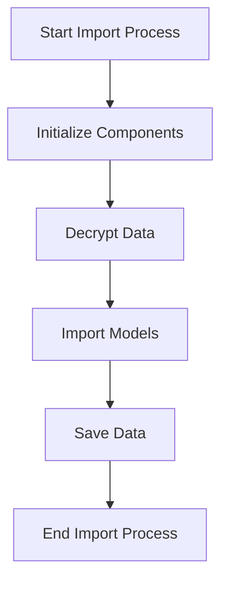

This document will cover the process of importing configuration and administrator accounts, which includes:

1. Initializing necessary components
2. Decrypting data
3. Importing models required for configuring and administrating a Sentry instance.

Technical document: <SwmLink doc-title="Importing Configuration and Administrator Accounts">[Importing Configuration and Administrator Accounts](/.swm/importing-configuration-and-administrator-accounts.98an8cp0.sw.md)</SwmLink>

# [Initializing necessary components](https://app.swimm.io/repos/Z2l0aHViJTNBJTNBc2VudHJ5LWRlbW8tMSUzQSUzQVN3aW1tLURlbW8=/docs/98an8cp0#import_config)

The import process begins with setting up the necessary components. This includes initializing a printer for output, which helps in providing feedback during the import process. Additionally, the decryption mechanism is set up to handle encrypted data. This step ensures that all the tools and mechanisms required for the import are ready and configured properly.

# [Decrypting data](https://app.swimm.io/repos/Z2l0aHViJTNBJTNBc2VudHJ5LWRlbW8tMSUzQSUzQVN3aW1tLURlbW8=/docs/98an8cp0#import_in_config_scope)

Once the components are initialized, the next step is to decrypt the data. This is crucial because the configuration and administrator account data are often encrypted for security reasons. The decryption process ensures that the data is in a readable format, which can then be processed further. This step involves using the decryption keys or mechanisms that were set up in the previous step.

# [Importing models required for configuring and administrating a Sentry instance](https://app.swimm.io/repos/Z2l0aHViJTNBJTNBc2VudHJ5LWRlbW8tMSUzQSUzQVN3aW1tLURlbW8=/docs/98an8cp0#_import)

After decrypting the data, the next step is to import the models required for configuring and administrating a Sentry instance. This involves processing the JSON content that contains the configuration and administrator account details. The import process iterates over the models and writes the data to the database. This step ensures that all necessary configurations and administrator accounts are correctly imported and mapped to the appropriate models.

# [Saving the imported data](https://app.swimm.io/repos/Z2l0aHViJTNBJTNBc2VudHJ5LWRlbW8tMSUzQSUzQVN3aW1tLURlbW8=/docs/98an8cp0#save)

The final step in the import process is to save the imported data. This involves normalizing and processing the data, saving adjacent models such as releases and environments to the database, and writing the data into the event stream. This step ensures that the imported data is correctly processed and stored, making it available for use in the Sentry instance.

&nbsp;

*This is an auto-generated document by Swimm AI 🌊 and has not yet been verified by a human*

<SwmMeta version="3.0.0" repo-id="Z2l0aHViJTNBJTNBc2VudHJ5LWRlbW8tMSUzQSUzQVN3aW1tLURlbW8=" repo-name="sentry-demo-1" doc-type="product-flows">Powered by [Swimm](/)</SwmMeta>
