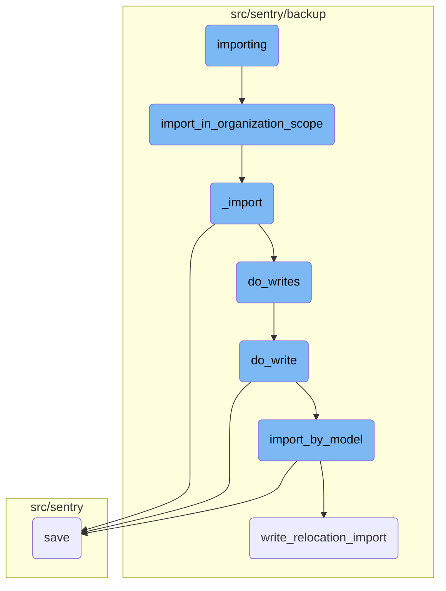
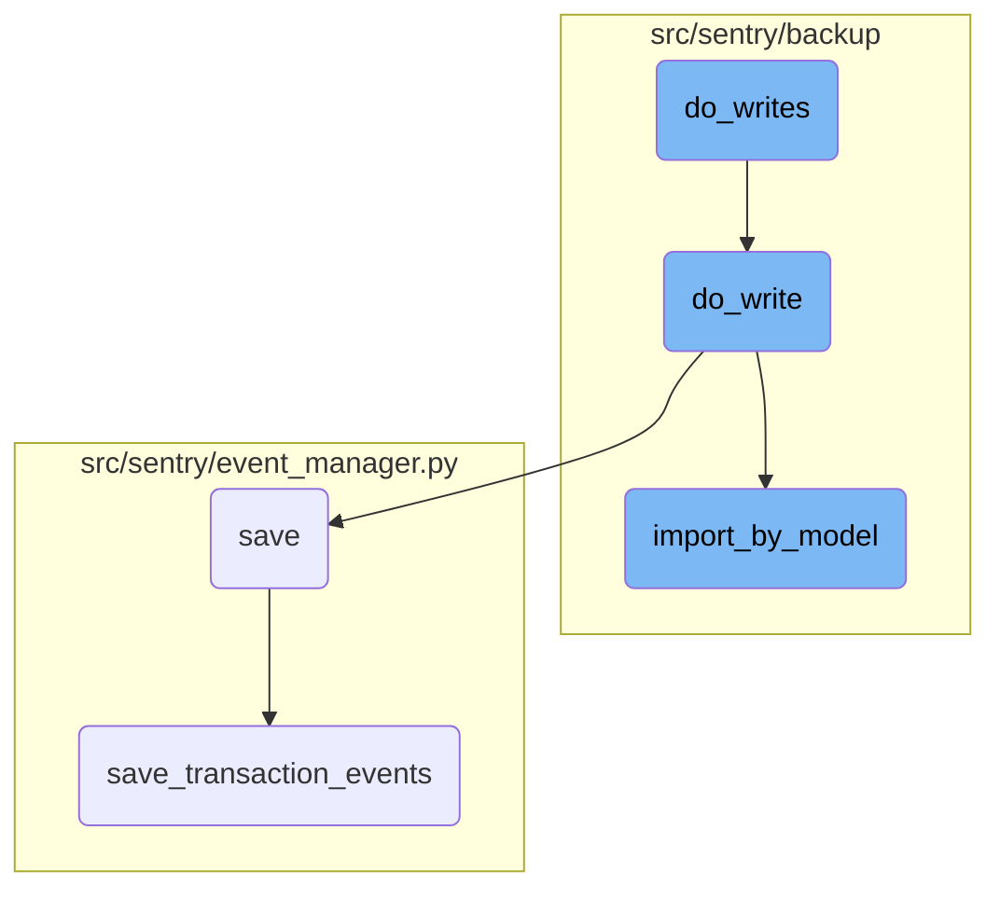

In this document, we will explain the process of importing data. The process involves several steps, including initiating the import task, handling the import within the organization scope, processing the core import logic, and saving the imported data.

The importing process starts by initiating the import task, which involves starting the relocation task and verifying the relocation file. Next, the import is handled within the organization scope, meaning only specific models are imported. The core logic of the import processes the data, writes it, and resolves any necessary mappings. Finally, the imported data is saved by normalizing and processing it, saving related models, and writing the event into the event stream.

Here is a high level diagram of the flow, showing only the most important functions:



# Flow drill down

First, we'll zoom into this section of the flow:

```mermaid
graph TD;
      subgraph src/sentry
f07020ee204fa9fe39f2a80e561caf81728c4f6a13467c0aff3129cae411b9b0(importing):::mainFlowStyle --> 20e0eac63d1cddcd23f6c106821a93f45c0d11e1567aa82f3d931f691489b917(import_in_organization_scope):::mainFlowStyle
end

subgraph src/sentry
20e0eac63d1cddcd23f6c106821a93f45c0d11e1567aa82f3d931f691489b917(import_in_organization_scope):::mainFlowStyle --> e51390835e25abe9700c58ce684275b91c592cbc3798916fccfb8d5e98213501(_import):::mainFlowStyle
end

subgraph src/sentry
e51390835e25abe9700c58ce684275b91c592cbc3798916fccfb8d5e98213501(_import):::mainFlowStyle --> 5086692df24257d76a0adf892eba843feac14033d92b4a32022b125d5a725f9b(save)
end

subgraph src/sentry
e51390835e25abe9700c58ce684275b91c592cbc3798916fccfb8d5e98213501(_import):::mainFlowStyle --> 26207a08d7fb570302a7c1ba260755115f33628088a15b2009f16110f8f0dae8(do_writes):::mainFlowStyle
end

subgraph src/sentry
26207a08d7fb570302a7c1ba260755115f33628088a15b2009f16110f8f0dae8(do_writes):::mainFlowStyle --> 7qkx4(...)
end

subgraph src/sentry
5086692df24257d76a0adf892eba843feac14033d92b4a32022b125d5a725f9b(save) --> b8052a0e9cf4dd2783dd9f9b401321908e36ff05fa95ad9dd7944757173348b4(save_transaction_events)
end


      classDef mainFlowStyle color:#000000,fill:#7CB9F4
classDef rootsStyle color:#000000,fill:#00FFF4
classDef Style1 color:#000000,fill:#00FFAA
classDef Style2 color:#000000,fill:#FFFF00
classDef Style3 color:#000000,fill:#AA7CB9

%% Swimm:
%% graph TD;
%%       subgraph <SwmPath>[src/sentry/](src/sentry/)</SwmPath>
%% f07020ee204fa9fe39f2a80e561caf81728c4f6a13467c0aff3129cae411b9b0(importing):::mainFlowStyle --> 20e0eac63d1cddcd23f6c106821a93f45c0d11e1567aa82f3d931f691489b917(import_in_organization_scope):::mainFlowStyle
%% end
%% 
%% subgraph <SwmPath>[src/sentry/](src/sentry/)</SwmPath>
%% 20e0eac63d1cddcd23f6c106821a93f45c0d11e1567aa82f3d931f691489b917(import_in_organization_scope):::mainFlowStyle --> e51390835e25abe9700c58ce684275b91c592cbc3798916fccfb8d5e98213501(_import):::mainFlowStyle
%% end
%% 
%% subgraph <SwmPath>[src/sentry/](src/sentry/)</SwmPath>
%% e51390835e25abe9700c58ce684275b91c592cbc3798916fccfb8d5e98213501(_import):::mainFlowStyle --> 5086692df24257d76a0adf892eba843feac14033d92b4a32022b125d5a725f9b(save)
%% end
%% 
%% subgraph <SwmPath>[src/sentry/](src/sentry/)</SwmPath>
%% e51390835e25abe9700c58ce684275b91c592cbc3798916fccfb8d5e98213501(_import):::mainFlowStyle --> 26207a08d7fb570302a7c1ba260755115f33628088a15b2009f16110f8f0dae8(do_writes):::mainFlowStyle
%% end
%% 
%% subgraph <SwmPath>[src/sentry/](src/sentry/)</SwmPath>
%% 26207a08d7fb570302a7c1ba260755115f33628088a15b2009f16110f8f0dae8(do_writes):::mainFlowStyle --> 7qkx4(...)
%% end
%% 
%% subgraph <SwmPath>[src/sentry/](src/sentry/)</SwmPath>
%% 5086692df24257d76a0adf892eba843feac14033d92b4a32022b125d5a725f9b(save) --> b8052a0e9cf4dd2783dd9f9b401321908e36ff05fa95ad9dd7944757173348b4(save_transaction_events)
%% end
%% 
%% 
%%       classDef mainFlowStyle color:#000000,fill:#7CB9F4
%% classDef rootsStyle color:#000000,fill:#00FFF4
%% classDef Style1 color:#000000,fill:#00FFAA
%% classDef Style2 color:#000000,fill:#FFFF00
%% classDef Style3 color:#000000,fill:#AA7CB9
```



<SwmSnippet path="/src/sentry/tasks/relocation.py" line="1363">

---

## Initiating the Import Task

The <SwmToken path="src/sentry/tasks/relocation.py" pos="1363:2:2" line-data="def importing(uuid: UUID) -&gt; None:">`importing`</SwmToken> function initiates the import task by starting the relocation task and verifying that the relocation file is ready for use. It then calls the <SwmToken path="src/sentry/backup/imports.py" pos="521:2:2" line-data="def import_in_organization_scope(">`import_in_organization_scope`</SwmToken> function to proceed with the import within the organization scope.

```python
def importing(uuid: UUID) -> None:
    """
    Perform the import on the actual live instance we are targeting.

    This function is NOT idempotent - if an import breaks, we should just abandon it rather than
    trying it again!
    """

    (relocation, attempts_left) = start_relocation_task(
        uuid=uuid,
        task=OrderedTask.IMPORTING,
        allowed_task_attempts=MAX_SLOW_TASK_ATTEMPTS,
    )
    if relocation is None:
        return

    with retry_task_or_fail_relocation(
        relocation,
        OrderedTask.IMPORTING,
        attempts_left,
        ERR_IMPORTING_INTERNAL,
```

---

</SwmSnippet>

<SwmSnippet path="/src/sentry/backup/imports.py" line="521">

---

## Importing in Organization Scope

The <SwmToken path="src/sentry/backup/imports.py" pos="521:2:2" line-data="def import_in_organization_scope(">`import_in_organization_scope`</SwmToken> function performs the import within the organization scope, meaning only models with <SwmToken path="src/sentry/backup/imports.py" pos="531:2:4" line-data="    `RelocationScope.User` or `RelocationScope.Organization` will be imported from the provided">`RelocationScope.User`</SwmToken> or <SwmToken path="src/sentry/backup/imports.py" pos="531:10:12" line-data="    `RelocationScope.User` or `RelocationScope.Organization` will be imported from the provided">`RelocationScope.Organization`</SwmToken> are imported. It calls the <SwmToken path="src/sentry/backup/imports.py" pos="87:2:2" line-data="def _import(">`_import`</SwmToken> function to handle the actual import logic.

```python
def import_in_organization_scope(
    src: IO[bytes],
    *,
    decryptor: Decryptor | None = None,
    flags: ImportFlags | None = None,
    org_filter: set[str] | None = None,
    printer: Printer,
):
    """
    Perform an import in the `Organization` scope, meaning that only models with
    `RelocationScope.User` or `RelocationScope.Organization` will be imported from the provided
    `src` file.

    The `org_filter` argument allows imports to be filtered by organization slug. If the argument
    is set to `None`, there is no filtering, meaning all encountered organizations and users are
    imported.
    """

    # Import here to prevent circular module resolutions.
    from sentry.models.organization import Organization

```

---

</SwmSnippet>

<SwmSnippet path="/src/sentry/backup/imports.py" line="87">

---

## Handling the Import Logic

The <SwmToken path="src/sentry/backup/imports.py" pos="87:2:2" line-data="def _import(">`_import`</SwmToken> function contains the core logic for importing data. It processes the JSON models, writes the data, and resolves organization slugs from the primary key map.

```python
def _import(
    src: IO[bytes],
    scope: ImportScope,
    *,
    decryptor: Decryptor | None = None,
    flags: ImportFlags | None = None,
    filter_by: Filter | None = None,
    printer: Printer,
):
    """
    Imports core data for a Sentry installation.

    It is generally preferable to avoid calling this function directly, as there are certain
    combinations of input parameters that should not be used together. Instead, use one of the other
    wrapper functions in this file, named `import_in_XXX_scope()`.
    """

    # Import here to prevent circular module resolutions.
    from sentry.models.organization import Organization
    from sentry.models.organizationmember import OrganizationMember
    from sentry.users.models.email import Email
```

---

</SwmSnippet>

<SwmSnippet path="/src/sentry/event_manager.py" line="448">

---

## Saving Imported Data

The <SwmToken path="src/sentry/event_manager.py" pos="448:3:3" line-data="    def save(">`save`</SwmToken> function saves the imported data by normalizing and processing the event, saving adjacent models to the database, and writing the event into the event stream.

```python
    def save(
        self,
        project_id: int | None,
        raw: bool = False,
        assume_normalized: bool = False,
        start_time: float | None = None,
        cache_key: str | None = None,
        skip_send_first_transaction: bool = False,
        has_attachments: bool = False,
    ) -> Event:
        """
        After normalizing and processing an event, save adjacent models such as
        releases and environments to postgres and write the event into
        eventstream. From there it will be picked up by Snuba and
        post-processing.

        We re-insert events with duplicate IDs into Snuba, which is responsible
        for deduplicating events. Since deduplication in Snuba is on the primary
        key (based on event ID, project ID and day), events with same IDs are only
        deduplicated if their timestamps fall on the same day. The latest event
        always wins and overwrites the value of events received earlier in that day.
```

---

</SwmSnippet>

<SwmSnippet path="/src/sentry/event_manager.py" line="3040">

---

## Processing Transaction Events

The <SwmToken path="src/sentry/event_manager.py" pos="3040:2:2" line-data="def save_transaction_events(jobs: Sequence[Job], projects: ProjectsMapping) -&gt; Sequence[Job]:">`save_transaction_events`</SwmToken> function processes transaction events by setting cached field values, creating releases, deriving tags, calculating span grouping, saving to the nodestore, and inserting into the event stream.

```python
def save_transaction_events(jobs: Sequence[Job], projects: ProjectsMapping) -> Sequence[Job]:
    organization_ids = {project.organization_id for project in projects.values()}
    organizations = {o.id: o for o in Organization.objects.get_many_from_cache(organization_ids)}

    for project in projects.values():
        try:
            project.set_cached_field_value("organization", organizations[project.organization_id])
        except KeyError:
            continue

    set_measurement(measurement_name="jobs", value=len(jobs))
    set_measurement(measurement_name="projects", value=len(projects))

    _get_or_create_release_many(jobs, projects)
    _get_event_user_many(jobs, projects)
    _derive_plugin_tags_many(jobs, projects)
    _derive_interface_tags_many(jobs)
    _calculate_span_grouping(jobs, projects)
    _materialize_metadata_many(jobs)
    _get_or_create_environment_many(jobs, projects)
    _get_or_create_release_associated_models(jobs, projects)
```

---

</SwmSnippet>

Now, lets zoom into this section of the flow:



<SwmSnippet path="/src/sentry/backup/imports.py" line="399">

---

## Handling deferred organization authentication tokens

The function <SwmToken path="src/sentry/backup/imports.py" pos="396:3:3" line-data="    def do_writes(pk_map: PrimaryKeyMap) -&gt; None:">`do_writes`</SwmToken> iterates over the JSON models yielded by <SwmToken path="src/sentry/backup/imports.py" pos="399:13:13" line-data="        for model_name, json_data, offset in yield_json_models(content):">`yield_json_models`</SwmToken>. If the model name matches <SwmToken path="src/sentry/backup/imports.py" pos="400:7:7" line-data="            if model_name == org_auth_token_model_name:">`org_auth_token_model_name`</SwmToken>, the JSON data is appended to <SwmToken path="src/sentry/backup/imports.py" pos="401:1:1" line-data="                deferred_org_auth_tokens.append(json_data)">`deferred_org_auth_tokens`</SwmToken> and the loop continues without processing this data immediately.

```python
        for model_name, json_data, offset in yield_json_models(content):
            if model_name == org_auth_token_model_name:
                deferred_org_auth_tokens.append(json_data)
                continue
```

---

</SwmSnippet>

<SwmSnippet path="/src/sentry/backup/imports.py" line="404">

---

## Performing model writes

For other models, the function <SwmToken path="src/sentry/backup/imports.py" pos="404:1:1" line-data="            do_write(import_write_context, pk_map, model_name, json_data, offset)">`do_write`</SwmToken> is called to handle the actual writing process. This ensures that each model's data is processed and written appropriately.

```python
            do_write(import_write_context, pk_map, model_name, json_data, offset)
```

---

</SwmSnippet>

<SwmSnippet path="/src/sentry/backup/imports.py" line="320">

---

### Importing by model

The <SwmToken path="src/sentry/backup/imports.py" pos="404:1:1" line-data="            do_write(import_write_context, pk_map, model_name, json_data, offset)">`do_write`</SwmToken> function calls <SwmToken path="src/sentry/backup/imports.py" pos="320:5:5" line-data="        result = import_by_model(">`import_by_model`</SwmToken> to import the model data. This function handles the specifics of importing data for a given model, including partitioning the primary key map and managing the import scope and flags.

```python
        result = import_by_model(
            import_model_name=model_name_str,
            scope=import_write_context.scope,
            flags=import_write_context.flags,
            filter_by=import_write_context.filter_by,
            pk_map=RpcPrimaryKeyMap.into_rpc(pk_map.partition(dep_models)),
            json_data=json_data,
            min_ordinal=min_ordinal,
        )
```

---

</SwmSnippet>

<SwmSnippet path="/src/sentry/backup/imports.py" line="330">

---

### Handling import errors

If an error occurs during the import, such as an <SwmToken path="src/sentry/backup/imports.py" pos="330:8:8" line-data="        if isinstance(result, RpcImportError):">`RpcImportError`</SwmToken>, it is logged and an appropriate error message is displayed. This helps in diagnosing issues during the import process.

```python
        if isinstance(result, RpcImportError):
            printer.echo(result.pretty(), err=True)
            if result.get_kind() == RpcImportErrorKind.IntegrityError:
                warningText = ">> Are you restoring from a backup of the same version of Sentry?\n>> Are you restoring onto a clean database?\n>> If so then this IntegrityError might be our fault, you can open an issue here:\n>> https://github.com/getsentry/sentry/issues/new/choose"
                printer.echo(warningText, err=True)
            raise ImportingError(result)
```

---

</SwmSnippet>

<SwmSnippet path="/src/sentry/backup/imports.py" line="344">

---

### Creating control import chunk replicas

If the imported model lives in the control silo, a replica of the <SwmToken path="src/sentry/backup/imports.py" pos="342:23:23" line-data="        # the RPC divide, we create a replica of the `ControlImportChunk` that successful import">`ControlImportChunk`</SwmToken> is created to ensure consistency across RPC divides. This involves checking for existing replicas and saving new ones if necessary.

```python
        if result.min_ordinal is not None and SiloMode.CONTROL in deps[model_name].silos:
            # Maybe we are resuming an import on a retry. Check to see if this
            # `ControlImportChunkReplica` already exists, and only write it if it does not. There
            # can't be races here, since there is only one celery task running at a time, pushing
            # updates in a synchronous manner.
            existing_control_import_chunk_replica = ControlImportChunkReplica.objects.filter(
                import_uuid=flags.import_uuid, model=model_name_str, min_ordinal=result.min_ordinal
            ).first()
            if existing_control_import_chunk_replica is not None:
                logger.info("import_by_model.control_replica_already_exists", extra=extra)
            else:
                # If `min_ordinal` is not null, these values must not be either.
                assert result.max_ordinal is not None
                assert result.min_source_pk is not None
                assert result.max_source_pk is not None

                inserted = out_pk_map.partition({model_name}, {ImportKind.Inserted}).mapping[
                    model_name_str
                ]
                existing = out_pk_map.partition({model_name}, {ImportKind.Existing}).mapping[
                    model_name_str
```

---

</SwmSnippet>

<SwmSnippet path="/src/sentry/backup/services/import_export/impl.py" line="211">

---

### Validating and writing model instances

The <SwmToken path="src/sentry/backup/imports.py" pos="320:5:5" line-data="        result = import_by_model(">`import_by_model`</SwmToken> function validates and writes each model instance. It ensures that the model instance is of the correct type, applies any necessary filters, and performs the actual database write. This step is crucial for maintaining data integrity during the import process.

```python
                for deserialized_object in deserialize("json", json_data, use_natural_keys=False):
                    model_instance = deserialized_object.object
                    inst_model_name = get_model_name(model_instance)

                    if not isinstance(model_instance, BaseModel):
                        return RpcImportError(
                            kind=RpcImportErrorKind.UnexpectedModel,
                            on=InstanceID(model=str(inst_model_name), ordinal=None),
                            left_pk=model_instance.pk,
                            reason=f"Received non-sentry model of kind `{inst_model_name}`",
                        )

                    if model_instance._meta.app_label not in EXCLUDED_APPS or model_instance:
                        if model_instance.get_possible_relocation_scopes() & ok_relocation_scopes:
                            if inst_model_name != batch_model_name:
                                return RpcImportError(
                                    kind=RpcImportErrorKind.UnexpectedModel,
                                    on=InstanceID(model=str(inst_model_name), ordinal=None),
                                    left_pk=model_instance.pk,
                                    reason=f"Received model of kind `{inst_model_name}` when `{batch_model_name}` was expected",
                                )
```

---

</SwmSnippet>

&nbsp;

*This is an auto-generated document by Swimm AI 🌊 and has not yet been verified by a human*

<SwmMeta version="3.0.0" repo-id="Z2l0aHViJTNBJTNBc2VudHJ5LWRlbW8tMSUzQSUzQVN3aW1tLURlbW8=" repo-name="sentry-demo-1" doc-type="flows"><sup>Powered by [Swimm](/)</sup></SwmMeta>
