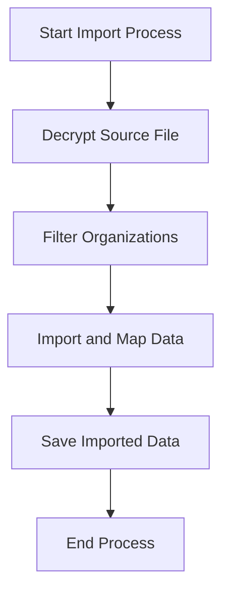

This document will cover the Importing Organizations Flow, which includes:

1. Initializing the import process
2. Decrypting the source file
3. Filtering organizations
4. Importing and mapping data
5. Saving the imported data.

Technical document: <SwmLink doc-title="Importing Organizations Flow">[Importing Organizations Flow](/.swm/importing-organizations-flow.bmt4i4sh.sw.md)</SwmLink>

# [Initializing the import process](https://app.swimm.io/repos/Z2l0aHViJTNBJTNBc2VudHJ5LWRlbW8tMSUzQSUzQVN3aW1tLURlbW8=/docs/bmt4i4sh#import_organizations)

The import process begins with initializing the logging system to track the progress and any issues that arise during the import. This step ensures that all actions are recorded, providing a clear audit trail and facilitating troubleshooting if needed. The system then prepares to handle the import within the organization scope, setting up necessary parameters such as the source file, decryptor, import flags, organization filter, and logging printer.

# [Decrypting the source file](https://app.swimm.io/repos/Z2l0aHViJTNBJTNBc2VudHJ5LWRlbW8tMSUzQSUzQVN3aW1tLURlbW8=/docs/bmt4i4sh#import_in_organization_scope)

The source file containing the organization data is encrypted for security reasons. Before any data can be processed, the file must be decrypted. This step involves using a decryptor, which could be a specific key or a service like Google Cloud KMS, to unlock the file's contents. Decrypting the file ensures that the data is accessible and ready for the next steps in the import process.

# [Filtering organizations](https://app.swimm.io/repos/Z2l0aHViJTNBJTNBc2VudHJ5LWRlbW8tMSUzQSUzQVN3aW1tLURlbW8=/docs/bmt4i4sh#import_in_organization_scope)

Once the file is decrypted, the system filters the organizations based on specific criteria. This filtering can be done using organization slugs, which are unique identifiers for each organization. If no filter is applied, all organizations in the file will be processed. Filtering helps in targeting specific organizations for import, making the process more efficient and relevant.

# [Importing and mapping data](https://app.swimm.io/repos/Z2l0aHViJTNBJTNBc2VudHJ5LWRlbW8tMSUzQSUzQVN3aW1tLURlbW8=/docs/bmt4i4sh#_import)

The core of the import process involves reading the JSON models from the decrypted file and mapping them to the appropriate data structures within the system. This step ensures that the data is correctly interpreted and aligned with the existing database schema. The system processes each model, handling any necessary transformations and validations to ensure data integrity and consistency.

# [Saving the imported data](https://app.swimm.io/repos/Z2l0aHViJTNBJTNBc2VudHJ5LWRlbW8tMSUzQSUzQVN3aW1tLURlbW8=/docs/bmt4i4sh#save)

After the data has been imported and mapped, it needs to be saved into the database. This step involves writing the data into the appropriate tables, ensuring that all relationships and dependencies are correctly maintained. The system also handles any adjacent models, such as user accounts and permissions, to ensure a complete and functional import. Saving the data finalizes the import process, making the new organizations and their users available for use within the application.

&nbsp;

*This is an auto-generated document by Swimm AI 🌊 and has not yet been verified by a human*

<SwmMeta version="3.0.0" repo-id="Z2l0aHViJTNBJTNBc2VudHJ5LWRlbW8tMSUzQSUzQVN3aW1tLURlbW8=" repo-name="sentry-demo-1" doc-type="product-flows">Powered by [Swimm](/)</SwmMeta>
