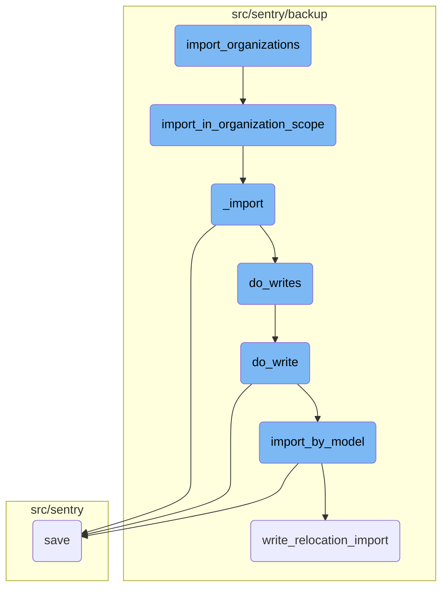
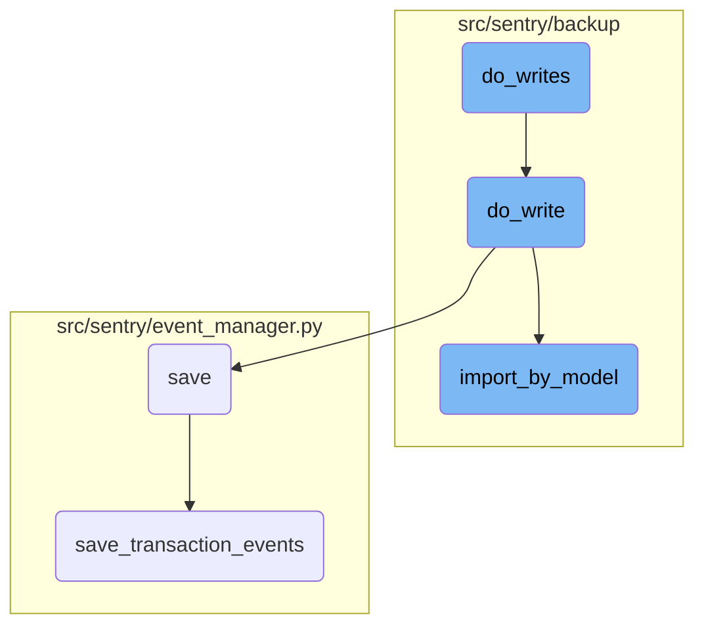

This document explains the process of importing organizations and their users from an exported JSON file. The process involves several steps, including initializing logging, decrypting the source file, filtering organizations, and saving the imported data.

The flow starts with the <SwmToken path="src/sentry/runner/commands/backup.py" pos="742:2:2" line-data="def import_organizations(">`import_organizations`</SwmToken> function, which initializes logging and calls another function to handle the import within the organization scope. This function ensures that only relevant models are imported and allows filtering by organization slug. The core import logic reads the JSON models and processes them, ensuring the data is correctly imported and mapped. Finally, the data is saved, and any necessary adjacent models are processed and stored.

Here is a high level diagram of the flow, showing only the most important functions:



# Flow drill down

First, we'll zoom into this section of the flow:

```mermaid
graph TD;
      subgraph src/sentry
e7c06a232a4928c947b8820868bc7448ffb82e38c2a6ac9a8bb289a6faac6c05(import_organizations):::mainFlowStyle --> 20e0eac63d1cddcd23f6c106821a93f45c0d11e1567aa82f3d931f691489b917(import_in_organization_scope):::mainFlowStyle
end

subgraph src/sentry
20e0eac63d1cddcd23f6c106821a93f45c0d11e1567aa82f3d931f691489b917(import_in_organization_scope):::mainFlowStyle --> e51390835e25abe9700c58ce684275b91c592cbc3798916fccfb8d5e98213501(_import):::mainFlowStyle
end

subgraph src/sentry
e51390835e25abe9700c58ce684275b91c592cbc3798916fccfb8d5e98213501(_import):::mainFlowStyle --> 5086692df24257d76a0adf892eba843feac14033d92b4a32022b125d5a725f9b(save)
end

subgraph src/sentry
e51390835e25abe9700c58ce684275b91c592cbc3798916fccfb8d5e98213501(_import):::mainFlowStyle --> 26207a08d7fb570302a7c1ba260755115f33628088a15b2009f16110f8f0dae8(do_writes):::mainFlowStyle
end

subgraph src/sentry
26207a08d7fb570302a7c1ba260755115f33628088a15b2009f16110f8f0dae8(do_writes):::mainFlowStyle --> 2pass(...)
end

subgraph src/sentry
5086692df24257d76a0adf892eba843feac14033d92b4a32022b125d5a725f9b(save) --> b8052a0e9cf4dd2783dd9f9b401321908e36ff05fa95ad9dd7944757173348b4(save_transaction_events)
end


      classDef mainFlowStyle color:#000000,fill:#7CB9F4
classDef rootsStyle color:#000000,fill:#00FFF4
classDef Style1 color:#000000,fill:#00FFAA
classDef Style2 color:#000000,fill:#FFFF00
classDef Style3 color:#000000,fill:#AA7CB9

%% Swimm:
%% graph TD;
%%       subgraph <SwmPath>[src/sentry/](src/sentry/)</SwmPath>
%% e7c06a232a4928c947b8820868bc7448ffb82e38c2a6ac9a8bb289a6faac6c05(import_organizations):::mainFlowStyle --> 20e0eac63d1cddcd23f6c106821a93f45c0d11e1567aa82f3d931f691489b917(import_in_organization_scope):::mainFlowStyle
%% end
%% 
%% subgraph <SwmPath>[src/sentry/](src/sentry/)</SwmPath>
%% 20e0eac63d1cddcd23f6c106821a93f45c0d11e1567aa82f3d931f691489b917(import_in_organization_scope):::mainFlowStyle --> e51390835e25abe9700c58ce684275b91c592cbc3798916fccfb8d5e98213501(_import):::mainFlowStyle
%% end
%% 
%% subgraph <SwmPath>[src/sentry/](src/sentry/)</SwmPath>
%% e51390835e25abe9700c58ce684275b91c592cbc3798916fccfb8d5e98213501(_import):::mainFlowStyle --> 5086692df24257d76a0adf892eba843feac14033d92b4a32022b125d5a725f9b(save)
%% end
%% 
%% subgraph <SwmPath>[src/sentry/](src/sentry/)</SwmPath>
%% e51390835e25abe9700c58ce684275b91c592cbc3798916fccfb8d5e98213501(_import):::mainFlowStyle --> 26207a08d7fb570302a7c1ba260755115f33628088a15b2009f16110f8f0dae8(do_writes):::mainFlowStyle
%% end
%% 
%% subgraph <SwmPath>[src/sentry/](src/sentry/)</SwmPath>
%% 26207a08d7fb570302a7c1ba260755115f33628088a15b2009f16110f8f0dae8(do_writes):::mainFlowStyle --> 2pass(...)
%% end
%% 
%% subgraph <SwmPath>[src/sentry/](src/sentry/)</SwmPath>
%% 5086692df24257d76a0adf892eba843feac14033d92b4a32022b125d5a725f9b(save) --> b8052a0e9cf4dd2783dd9f9b401321908e36ff05fa95ad9dd7944757173348b4(save_transaction_events)
%% end
%% 
%% 
%%       classDef mainFlowStyle color:#000000,fill:#7CB9F4
%% classDef rootsStyle color:#000000,fill:#00FFF4
%% classDef Style1 color:#000000,fill:#00FFAA
%% classDef Style2 color:#000000,fill:#FFFF00
%% classDef Style3 color:#000000,fill:#AA7CB9
```



<SwmSnippet path="/src/sentry/runner/commands/backup.py" line="742">

---

## <SwmToken path="src/sentry/runner/commands/backup.py" pos="742:2:2" line-data="def import_organizations(">`import_organizations`</SwmToken>

The <SwmToken path="src/sentry/runner/commands/backup.py" pos="742:2:2" line-data="def import_organizations(">`import_organizations`</SwmToken> function is responsible for importing Sentry organizations and their users from an exported JSON file. It initializes a printer for logging and calls <SwmToken path="src/sentry/runner/commands/backup.py" pos="756:11:11" line-data="    from sentry.backup.imports import import_in_organization_scope">`import_in_organization_scope`</SwmToken> with the necessary parameters, including the source file, decryptor, import flags, organization filter, and printer.

```python
def import_organizations(
    src: IO[bytes],
    decrypt_with: IO[bytes],
    decrypt_with_gcp_kms: IO[bytes],
    filter_org_slugs: str,
    findings_file: IO[str],
    merge_users: bool,
    no_prompt: bool,
    silent: bool,
) -> None:
    """
    Import the Sentry organizations, and all constituent Sentry users, from an exported JSON file.
    """

    from sentry.backup.imports import import_in_organization_scope

    printer = get_printer(silent=silent, no_prompt=no_prompt)
    with write_import_findings(findings_file, printer):
        import_in_organization_scope(
            src,
            decryptor=get_decryptor_from_flags(decrypt_with, decrypt_with_gcp_kms),
```

---

</SwmSnippet>

<SwmSnippet path="/src/sentry/backup/imports.py" line="521">

---

## <SwmToken path="src/sentry/backup/imports.py" pos="521:2:2" line-data="def import_in_organization_scope(">`import_in_organization_scope`</SwmToken>

The <SwmToken path="src/sentry/backup/imports.py" pos="521:2:2" line-data="def import_in_organization_scope(">`import_in_organization_scope`</SwmToken> function performs the import within the <SwmToken path="src/sentry/backup/imports.py" pos="530:12:12" line-data="    Perform an import in the `Organization` scope, meaning that only models with">`Organization`</SwmToken> scope. It ensures that only models with <SwmToken path="src/sentry/backup/imports.py" pos="531:2:4" line-data="    `RelocationScope.User` or `RelocationScope.Organization` will be imported from the provided">`RelocationScope.User`</SwmToken> or <SwmToken path="src/sentry/backup/imports.py" pos="531:10:12" line-data="    `RelocationScope.User` or `RelocationScope.Organization` will be imported from the provided">`RelocationScope.Organization`</SwmToken> are imported. It also allows filtering by organization slug if the <SwmToken path="src/sentry/backup/imports.py" pos="526:1:1" line-data="    org_filter: set[str] | None = None,">`org_filter`</SwmToken> argument is provided. This function calls <SwmToken path="src/sentry/backup/imports.py" pos="87:2:2" line-data="def _import(">`_import`</SwmToken> with the appropriate parameters.

```python
def import_in_organization_scope(
    src: IO[bytes],
    *,
    decryptor: Decryptor | None = None,
    flags: ImportFlags | None = None,
    org_filter: set[str] | None = None,
    printer: Printer,
):
    """
    Perform an import in the `Organization` scope, meaning that only models with
    `RelocationScope.User` or `RelocationScope.Organization` will be imported from the provided
    `src` file.

    The `org_filter` argument allows imports to be filtered by organization slug. If the argument
    is set to `None`, there is no filtering, meaning all encountered organizations and users are
    imported.
    """

    # Import here to prevent circular module resolutions.
    from sentry.models.organization import Organization

```

---

</SwmSnippet>

<SwmSnippet path="/src/sentry/backup/imports.py" line="87">

---

## \_import

The <SwmToken path="src/sentry/backup/imports.py" pos="87:2:2" line-data="def _import(">`_import`</SwmToken> function handles the core import logic. It reads the JSON models from the provided content and processes them. The function includes several helper functions like <SwmToken path="src/sentry/backup/imports.py" pos="399:13:13" line-data="        for model_name, json_data, offset in yield_json_models(content):">`yield_json_models`</SwmToken> to parse the JSON and <SwmToken path="src/sentry/backup/imports.py" pos="396:3:3" line-data="    def do_writes(pk_map: PrimaryKeyMap) -&gt; None:">`do_writes`</SwmToken> to handle the writing of models. It ensures that the data is correctly imported and mapped.

```python
def _import(
    src: IO[bytes],
    scope: ImportScope,
    *,
    decryptor: Decryptor | None = None,
    flags: ImportFlags | None = None,
    filter_by: Filter | None = None,
    printer: Printer,
):
    """
    Imports core data for a Sentry installation.

    It is generally preferable to avoid calling this function directly, as there are certain
    combinations of input parameters that should not be used together. Instead, use one of the other
    wrapper functions in this file, named `import_in_XXX_scope()`.
    """

    # Import here to prevent circular module resolutions.
    from sentry.models.organization import Organization
    from sentry.models.organizationmember import OrganizationMember
    from sentry.users.models.email import Email
```

---

</SwmSnippet>

<SwmSnippet path="/src/sentry/event_manager.py" line="448">

---

## save

The <SwmToken path="src/sentry/event_manager.py" pos="448:3:3" line-data="    def save(">`save`</SwmToken> function in the <SwmToken path="src/sentry/event_manager.py" pos="361:2:2" line-data="class EventManager:">`EventManager`</SwmToken> class is responsible for normalizing and processing an event, saving adjacent models such as releases and environments to PostgreSQL, and writing the event into the event stream. This function ensures that events are correctly inserted into Snuba and handles deduplication of events with the same ID.

```python
    def save(
        self,
        project_id: int | None,
        raw: bool = False,
        assume_normalized: bool = False,
        start_time: float | None = None,
        cache_key: str | None = None,
        skip_send_first_transaction: bool = False,
        has_attachments: bool = False,
    ) -> Event:
        """
        After normalizing and processing an event, save adjacent models such as
        releases and environments to postgres and write the event into
        eventstream. From there it will be picked up by Snuba and
        post-processing.

        We re-insert events with duplicate IDs into Snuba, which is responsible
        for deduplicating events. Since deduplication in Snuba is on the primary
        key (based on event ID, project ID and day), events with same IDs are only
        deduplicated if their timestamps fall on the same day. The latest event
        always wins and overwrites the value of events received earlier in that day.
```

---

</SwmSnippet>

<SwmSnippet path="/src/sentry/event_manager.py" line="3040">

---

## <SwmToken path="src/sentry/event_manager.py" pos="3040:2:2" line-data="def save_transaction_events(jobs: Sequence[Job], projects: ProjectsMapping) -&gt; Sequence[Job]:">`save_transaction_events`</SwmToken>

The <SwmToken path="src/sentry/event_manager.py" pos="3040:2:2" line-data="def save_transaction_events(jobs: Sequence[Job], projects: ProjectsMapping) -&gt; Sequence[Job]:">`save_transaction_events`</SwmToken> function processes and saves transaction events. It handles various tasks such as creating releases, deriving tags, calculating span grouping, and inserting events into the event stream. This function ensures that transaction events are correctly processed and stored.

```python
def save_transaction_events(jobs: Sequence[Job], projects: ProjectsMapping) -> Sequence[Job]:
    organization_ids = {project.organization_id for project in projects.values()}
    organizations = {o.id: o for o in Organization.objects.get_many_from_cache(organization_ids)}

    for project in projects.values():
        try:
            project.set_cached_field_value("organization", organizations[project.organization_id])
        except KeyError:
            continue

    set_measurement(measurement_name="jobs", value=len(jobs))
    set_measurement(measurement_name="projects", value=len(projects))

    _get_or_create_release_many(jobs, projects)
    _get_event_user_many(jobs, projects)
    _derive_plugin_tags_many(jobs, projects)
    _derive_interface_tags_many(jobs)
    _calculate_span_grouping(jobs, projects)
    _materialize_metadata_many(jobs)
    _get_or_create_environment_many(jobs, projects)
    _get_or_create_release_associated_models(jobs, projects)
```

---

</SwmSnippet>

Now, lets zoom into this section of the flow:



<SwmSnippet path="/src/sentry/backup/imports.py" line="399">

---

## Handling deferred organization authentication tokens

The <SwmToken path="src/sentry/backup/imports.py" pos="396:3:3" line-data="    def do_writes(pk_map: PrimaryKeyMap) -&gt; None:">`do_writes`</SwmToken> function iterates over the JSON models yielded by <SwmToken path="src/sentry/backup/imports.py" pos="399:13:13" line-data="        for model_name, json_data, offset in yield_json_models(content):">`yield_json_models`</SwmToken>. If the model name matches <SwmToken path="src/sentry/backup/imports.py" pos="400:7:7" line-data="            if model_name == org_auth_token_model_name:">`org_auth_token_model_name`</SwmToken>, the JSON data is appended to <SwmToken path="src/sentry/backup/imports.py" pos="401:1:1" line-data="                deferred_org_auth_tokens.append(json_data)">`deferred_org_auth_tokens`</SwmToken> and the loop continues. This ensures that organization authentication tokens are handled separately and deferred for later processing.

```python
        for model_name, json_data, offset in yield_json_models(content):
            if model_name == org_auth_token_model_name:
                deferred_org_auth_tokens.append(json_data)
                continue
```

---

</SwmSnippet>

<SwmSnippet path="/src/sentry/backup/imports.py" line="404">

---

## Writing model data

For other models, the <SwmToken path="src/sentry/backup/imports.py" pos="404:1:1" line-data="            do_write(import_write_context, pk_map, model_name, json_data, offset)">`do_write`</SwmToken> function is called with the necessary context and data. This function is responsible for performing the actual write operation for a single model.

```python
            do_write(import_write_context, pk_map, model_name, json_data, offset)
```

---

</SwmSnippet>

<SwmSnippet path="/src/sentry/backup/imports.py" line="320">

---

### Importing by model

Within <SwmToken path="src/sentry/backup/imports.py" pos="404:1:1" line-data="            do_write(import_write_context, pk_map, model_name, json_data, offset)">`do_write`</SwmToken>, the <SwmToken path="src/sentry/backup/imports.py" pos="320:5:5" line-data="        result = import_by_model(">`import_by_model`</SwmToken> function is invoked to handle the import of the model data. This function takes various parameters including the model name, scope, flags, primary key map, JSON data, and minimum ordinal. It returns the result of the import operation, which includes mapped primary keys and any errors encountered.

```python
        result = import_by_model(
            import_model_name=model_name_str,
            scope=import_write_context.scope,
            flags=import_write_context.flags,
            filter_by=import_write_context.filter_by,
            pk_map=RpcPrimaryKeyMap.into_rpc(pk_map.partition(dep_models)),
            json_data=json_data,
            min_ordinal=min_ordinal,
        )
```

---

</SwmSnippet>

&nbsp;

*This is an auto-generated document by Swimm AI 🌊 and has not yet been verified by a human*

<SwmMeta version="3.0.0" repo-id="Z2l0aHViJTNBJTNBc2VudHJ5LWRlbW8tMSUzQSUzQVN3aW1tLURlbW8=" repo-name="sentry-demo-1" doc-type="flows"><sup>Powered by [Swimm](/)</sup></SwmMeta>
