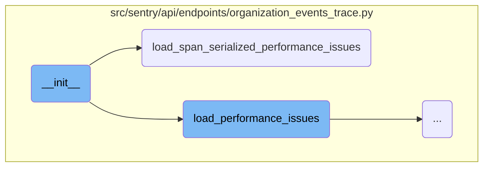
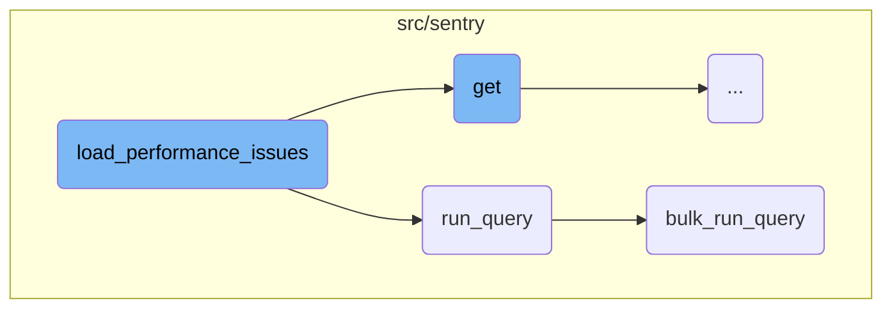
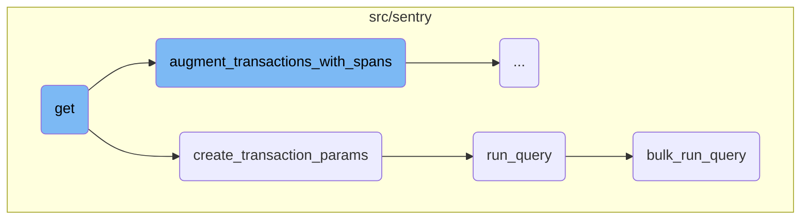
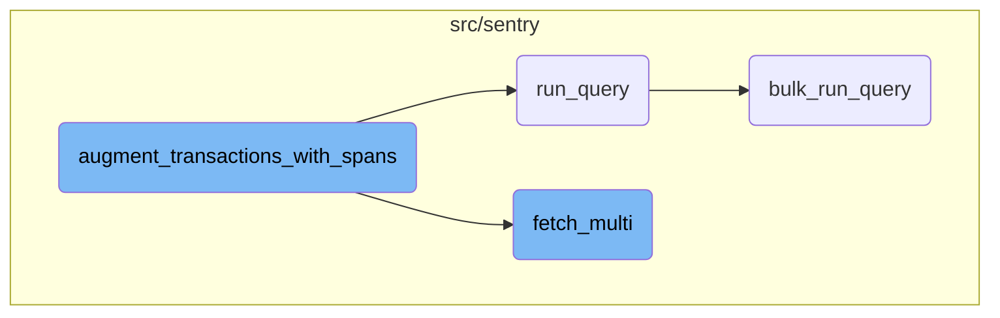

This document explains the initialization process of an object, detailing how it sets up its initial state and prepares for further operations. It covers the key steps involved in initializing the object, including setting up lists for errors, children, and performance issues, and calling specific functions based on certain conditions.

The initialization process starts by setting up the initial state of an object, including lists for errors, children, and performance issues. Depending on a condition, it calls one of two functions to load performance issues. This setup ensures that the object is ready for further operations and can handle performance-related data effectively.

Here is a high level diagram of the flow, showing only the most important functions:

```mermaid
graph TD;
      subgraph src/sentry
45d69200aad241b5a438ed0ebff40a3a0b0a250960753036dac78193c55955c2(__init__):::mainFlowStyle --> aa7f900de537f8fe3a92289802736f75199d02cc469cb07efe9dc544bd3660aa(load_span_serialized_performance_issues)
end

subgraph src/sentry
45d69200aad241b5a438ed0ebff40a3a0b0a250960753036dac78193c55955c2(__init__):::mainFlowStyle --> deaa6096d91915f41f76a4a011a221133d1fff163b18cf6154f0a4c02bc88aa5(load_performance_issues):::mainFlowStyle
end

subgraph src/sentry
deaa6096d91915f41f76a4a011a221133d1fff163b18cf6154f0a4c02bc88aa5(load_performance_issues):::mainFlowStyle --> 0855223e36ac882841bbf2e0ef2fb632f98281c9458dac000c15db12ffb5feef(run_query)
end

subgraph src/sentry
deaa6096d91915f41f76a4a011a221133d1fff163b18cf6154f0a4c02bc88aa5(load_performance_issues):::mainFlowStyle --> 3da7767b5222652e93f261724fdf130b96c0b8288cb4e36bbf4a3c9e5437aa42(get):::mainFlowStyle
end

subgraph src/sentry
3da7767b5222652e93f261724fdf130b96c0b8288cb4e36bbf4a3c9e5437aa42(get):::mainFlowStyle --> 4c7692519df09d4c46be59f648713ad5a41348c97bd3917a4c1e5f5b0ef9f13c(create_transaction_params)
end

subgraph src/sentry
3da7767b5222652e93f261724fdf130b96c0b8288cb4e36bbf4a3c9e5437aa42(get):::mainFlowStyle --> a6eada0bdf28a3123cbd3ae32fc333c6da9d7cbe7dd4799e0de128983768aca5(augment_transactions_with_spans):::mainFlowStyle
end

subgraph src/sentry
a6eada0bdf28a3123cbd3ae32fc333c6da9d7cbe7dd4799e0de128983768aca5(augment_transactions_with_spans):::mainFlowStyle --> 0855223e36ac882841bbf2e0ef2fb632f98281c9458dac000c15db12ffb5feef(run_query)
end

subgraph src/sentry
a6eada0bdf28a3123cbd3ae32fc333c6da9d7cbe7dd4799e0de128983768aca5(augment_transactions_with_spans):::mainFlowStyle --> 5463d9c7f22de30a02d48b89affe8e15db78e49c3e6f1f4071aaaf84e7553f50(fetch_multi):::mainFlowStyle
end


      classDef mainFlowStyle color:#000000,fill:#7CB9F4
classDef rootsStyle color:#000000,fill:#00FFF4
classDef Style1 color:#000000,fill:#00FFAA
classDef Style2 color:#000000,fill:#FFFF00
classDef Style3 color:#000000,fill:#AA7CB9

%% Swimm:
%% graph TD;
%%       subgraph <SwmPath>[src/sentry/](src/sentry/)</SwmPath>
%% 45d69200aad241b5a438ed0ebff40a3a0b0a250960753036dac78193c55955c2(__init__):::mainFlowStyle --> aa7f900de537f8fe3a92289802736f75199d02cc469cb07efe9dc544bd3660aa(load_span_serialized_performance_issues)
%% end
%% 
%% subgraph <SwmPath>[src/sentry/](src/sentry/)</SwmPath>
%% 45d69200aad241b5a438ed0ebff40a3a0b0a250960753036dac78193c55955c2(__init__):::mainFlowStyle --> deaa6096d91915f41f76a4a011a221133d1fff163b18cf6154f0a4c02bc88aa5(load_performance_issues):::mainFlowStyle
%% end
%% 
%% subgraph <SwmPath>[src/sentry/](src/sentry/)</SwmPath>
%% deaa6096d91915f41f76a4a011a221133d1fff163b18cf6154f0a4c02bc88aa5(load_performance_issues):::mainFlowStyle --> 0855223e36ac882841bbf2e0ef2fb632f98281c9458dac000c15db12ffb5feef(run_query)
%% end
%% 
%% subgraph <SwmPath>[src/sentry/](src/sentry/)</SwmPath>
%% deaa6096d91915f41f76a4a011a221133d1fff163b18cf6154f0a4c02bc88aa5(load_performance_issues):::mainFlowStyle --> 3da7767b5222652e93f261724fdf130b96c0b8288cb4e36bbf4a3c9e5437aa42(get):::mainFlowStyle
%% end
%% 
%% subgraph <SwmPath>[src/sentry/](src/sentry/)</SwmPath>
%% 3da7767b5222652e93f261724fdf130b96c0b8288cb4e36bbf4a3c9e5437aa42(get):::mainFlowStyle --> 4c7692519df09d4c46be59f648713ad5a41348c97bd3917a4c1e5f5b0ef9f13c(create_transaction_params)
%% end
%% 
%% subgraph <SwmPath>[src/sentry/](src/sentry/)</SwmPath>
%% 3da7767b5222652e93f261724fdf130b96c0b8288cb4e36bbf4a3c9e5437aa42(get):::mainFlowStyle --> a6eada0bdf28a3123cbd3ae32fc333c6da9d7cbe7dd4799e0de128983768aca5(augment_transactions_with_spans):::mainFlowStyle
%% end
%% 
%% subgraph <SwmPath>[src/sentry/](src/sentry/)</SwmPath>
%% a6eada0bdf28a3123cbd3ae32fc333c6da9d7cbe7dd4799e0de128983768aca5(augment_transactions_with_spans):::mainFlowStyle --> 0855223e36ac882841bbf2e0ef2fb632f98281c9458dac000c15db12ffb5feef(run_query)
%% end
%% 
%% subgraph <SwmPath>[src/sentry/](src/sentry/)</SwmPath>
%% a6eada0bdf28a3123cbd3ae32fc333c6da9d7cbe7dd4799e0de128983768aca5(augment_transactions_with_spans):::mainFlowStyle --> 5463d9c7f22de30a02d48b89affe8e15db78e49c3e6f1f4071aaaf84e7553f50(fetch_multi):::mainFlowStyle
%% end
%% 
%% 
%%       classDef mainFlowStyle color:#000000,fill:#7CB9F4
%% classDef rootsStyle color:#000000,fill:#00FFF4
%% classDef Style1 color:#000000,fill:#00FFAA
%% classDef Style2 color:#000000,fill:#FFFF00
%% classDef Style3 color:#000000,fill:#AA7CB9
```



# Flow drill down

First, we'll zoom into this section of the flow:



<SwmSnippet path="/src/sentry/api/endpoints/organization_events_trace.py" line="188">

---

## Initialization

The <SwmToken path="src/sentry/api/endpoints/organization_events_trace.py" pos="188:3:3" line-data="    def __init__(">`__init__`</SwmToken> function initializes the object with various parameters such as <SwmToken path="src/sentry/api/endpoints/organization_events_trace.py" pos="190:1:1" line-data="        event: SnubaTransaction,">`event`</SwmToken>, <SwmToken path="src/sentry/api/endpoints/organization_events_trace.py" pos="191:1:1" line-data="        parent: str | None,">`parent`</SwmToken>, <SwmToken path="src/sentry/api/endpoints/organization_events_trace.py" pos="192:1:1" line-data="        generation: int | None,">`generation`</SwmToken>, and others. It sets up the initial state of the object, including lists for errors, children, and performance issues. Depending on whether <SwmToken path="src/sentry/api/endpoints/organization_events_trace.py" pos="195:1:1" line-data="        span_serialized: bool = False,">`span_serialized`</SwmToken> is true, it calls either <SwmToken path="src/sentry/api/endpoints/organization_events_trace.py" pos="228:3:3" line-data="    def load_span_serialized_performance_issues(self, light: bool) -&gt; None:">`load_span_serialized_performance_issues`</SwmToken> or <SwmToken path="src/sentry/api/endpoints/organization_events_trace.py" pos="229:6:6" line-data="        &quot;&quot;&quot;Rewriting load_performance_issues from scratch so the logic is more independent&quot;&quot;&quot;">`load_performance_issues`</SwmToken>.

```python
    def __init__(
        self,
        event: SnubaTransaction,
        parent: str | None,
        generation: int | None,
        light: bool = False,
        snuba_params: SnubaParams | None = None,
        span_serialized: bool = False,
        query_source: QuerySource | None = QuerySource.SENTRY_BACKEND,
    ) -> None:
        self.event: SnubaTransaction = event
        self.errors: list[TraceError] = []
        self.children: list[TraceEvent] = []
        self.performance_issues: list[TracePerformanceIssue] = []
        self.query_source = query_source

        # Can be None on the light trace when we don't know the parent
        self.parent_event_id: str | None = parent
        self.generation: int | None = generation

        # Added as required because getting the nodestore_event is expensive
```

---

</SwmSnippet>

<SwmSnippet path="/src/sentry/api/endpoints/organization_events_trace.py" line="228">

---

## Loading Span Serialized Performance Issues

The <SwmToken path="src/sentry/api/endpoints/organization_events_trace.py" pos="228:3:3" line-data="    def load_span_serialized_performance_issues(self, light: bool) -&gt; None:">`load_span_serialized_performance_issues`</SwmToken> function processes performance issues by iterating over <SwmToken path="src/sentry/api/endpoints/organization_events_trace.py" pos="231:3:3" line-data="        for event_span in self.event[&quot;occurrence_spans&quot;]:">`event_span`</SwmToken> in the <SwmToken path="src/sentry/api/endpoints/organization_events_trace.py" pos="231:9:9" line-data="        for event_span in self.event[&quot;occurrence_spans&quot;]:">`event`</SwmToken>. It collects data such as <SwmToken path="src/sentry/api/endpoints/organization_events_trace.py" pos="232:1:1" line-data="            unique_spans: set[str] = set()">`unique_spans`</SwmToken>, <SwmToken path="src/sentry/api/endpoints/organization_events_trace.py" pos="235:1:1" line-data="            suspect_spans: list[str] = []">`suspect_spans`</SwmToken>, and timestamps. It also retrieves group information and constructs a dictionary of performance issues, which is appended to the <SwmToken path="src/sentry/api/endpoints/organization_events_trace.py" pos="201:3:3" line-data="        self.performance_issues: list[TracePerformanceIssue] = []">`performance_issues`</SwmToken> list.

```python
    def load_span_serialized_performance_issues(self, light: bool) -> None:
        """Rewriting load_performance_issues from scratch so the logic is more independent"""
        memoized_groups = {}
        for event_span in self.event["occurrence_spans"]:
            unique_spans: set[str] = set()
            start: float | None = None
            end: float | None = None
            suspect_spans: list[str] = []
            problem = event_span["problem"]
            offender_span_ids = problem.evidence_data.get("offender_span_ids", [])
            for group_id in self.event["occurrence_to_issue_id"][problem.id]:
                if group_id not in memoized_groups:
                    memoized_groups[group_id] = Group.objects.get(
                        id=group_id, project=self.event["project.id"]
                    )
                group = memoized_groups[group_id]
                if event_span.get("span_id") in offender_span_ids:
                    start_timestamp = float(event_span["precise.start_ts"])
                    if start is None:
                        start = start_timestamp
                    else:
```

---

</SwmSnippet>

Now, lets zoom into this section of the flow:



<SwmSnippet path="/src/sentry/api/endpoints/organization_events_trace.py" line="286">

---

## Loading Performance Issues

The function <SwmToken path="src/sentry/api/endpoints/organization_events_trace.py" pos="286:3:3" line-data="    def load_performance_issues(self, light: bool, snuba_params: SnubaParams | None) -&gt; None:">`load_performance_issues`</SwmToken> is responsible for identifying and loading performance-related issues for a given event. It processes the event data to extract relevant spans and issues, and then appends this information to the <SwmToken path="src/sentry/api/endpoints/organization_events_trace.py" pos="201:3:3" line-data="        self.performance_issues: list[TracePerformanceIssue] = []">`performance_issues`</SwmToken> list. This function ensures that the necessary performance data is available for further analysis or display.

```python
    def load_performance_issues(self, light: bool, snuba_params: SnubaParams | None) -> None:
        """Doesn't get suspect spans, since we don't need that for the light view"""
        for group_id in self.event["issue.ids"]:
            group = Group.objects.filter(id=group_id, project=self.event["project.id"]).first()
            if group is None:
                continue

            suspect_spans: list[str] = []
            unique_spans: set[str] = set()
            start: float | None = None
            end: float | None = None
            if light:
                # This value doesn't matter for the light view
                span = [self.event["trace.span"]]
            else:
                if self.nodestore_event is not None:
                    occurrence_query = DiscoverQueryBuilder(
                        Dataset.IssuePlatform,
                        # Params is ignored if snuba_params is passed
                        params={},
                        snuba_params=snuba_params,
```

---

</SwmSnippet>

<SwmSnippet path="/src/sentry/snuba/metrics_layer/query.py" line="143">

---

## Running a Query

The function <SwmToken path="src/sentry/snuba/metrics_layer/query.py" pos="143:2:2" line-data="def run_query(request: Request) -&gt; Mapping[str, Any]:">`run_query`</SwmToken> serves as an entry point for executing a single metrics query in Snuba. It delegates the actual execution to the <SwmToken path="src/sentry/snuba/metrics_layer/query.py" pos="147:3:3" line-data="    return bulk_run_query([request])[0]">`bulk_run_query`</SwmToken> function, which handles multiple queries, and returns the first result.

```python
def run_query(request: Request) -> Mapping[str, Any]:
    """
    Entrypoint for executing a metrics query in Snuba.
    """
    return bulk_run_query([request])[0]
```

---

</SwmSnippet>

<SwmSnippet path="/src/sentry/snuba/metrics_layer/query.py" line="81">

---

## Bulk Running Queries

The function <SwmToken path="src/sentry/snuba/metrics_layer/query.py" pos="81:2:2" line-data="def bulk_run_query(requests: list[Request]) -&gt; list[Mapping[str, Any]]:">`bulk_run_query`</SwmToken> is designed to execute multiple metrics queries in a single request to Snuba. It sets up the queries, resolves them, and processes the results. This function is crucial for efficiently handling multiple metrics queries and returning their results in a consolidated manner.

```python
def bulk_run_query(requests: list[Request]) -> list[Mapping[str, Any]]:
    """
    Entrypoint for executing a list of metrics queries in Snuba.

    This function is used to execute multiple metrics queries in a single request.
    """
    if not requests:
        return []

    queries = []
    for request in requests:
        request, start, end = _setup_metrics_query(request)
        queries.append([request, start, end])

    logging_tags = {"referrer": request.tenant_ids["referrer"] or "unknown", "lang": "mql"}

    for q in queries:
        q[0], reverse_mappings, mappings = _resolve_metrics_query(q[0], logging_tags)
        q.extend([reverse_mappings, mappings])

    try:
```

---

</SwmSnippet>

Now, lets zoom into this section of the flow:



<SwmSnippet path="/src/sentry/api/endpoints/organization_events_trace.py" line="1045">

---

## Handling the Request

The <SwmToken path="src/sentry/api/endpoints/organization_events_trace.py" pos="1045:3:3" line-data="    def get(self, request: Request, organization: Organization, trace_id: str) -&gt; HttpResponse:">`get`</SwmToken> function starts by checking if the feature is enabled for the organization and request. It then attempts to get Snuba parameters, handling the case where no projects are found. The function also processes request parameters like <SwmToken path="src/sentry/api/endpoints/organization_events_trace.py" pos="1055:3:3" line-data="        # Detailed is deprecated now that we want to use spans instead">`Detailed`</SwmToken> and <SwmToken path="src/sentry/api/endpoints/organization_events_trace.py" pos="1058:12:12" line-data="        use_spans = request.GET.get(&quot;useSpans&quot;, &quot;0&quot;) == &quot;1&quot;">`useSpans`</SwmToken>, and updates Snuba parameters with the timestamp.

```python
    def get(self, request: Request, organization: Organization, trace_id: str) -> HttpResponse:
        if not self.has_feature(organization, request):
            return Response(status=404)

        try:
            # The trace view isn't useful without global views, so skipping the check here
            snuba_params = self.get_snuba_params(request, organization, check_global_views=False)
        except NoProjects:
            return Response(status=404)

        # Detailed is deprecated now that we want to use spans instead
        detailed = request.GET.get("detailed", "0") == "1"
        # Temporary url params until we finish migrating the frontend
        use_spans = request.GET.get("useSpans", "0") == "1"
        update_snuba_params_with_timestamp(request, snuba_params)

        sentry_sdk.set_tag("trace_view.using_spans", str(use_spans))
        if detailed and use_spans:
            raise ParseError("Cannot return a detailed response while using spans")
        limit = min(int(request.GET.get("limit", MAX_TRACE_SIZE)), 10_000)
        event_id = request.GET.get("event_id") or request.GET.get("eventId")
```

---

</SwmSnippet>

<SwmSnippet path="/src/sentry/api/endpoints/organization_events_trace.py" line="1073">

---

### Creating Transaction Parameters

The function <SwmToken path="src/sentry/api/endpoints/organization_events_trace.py" pos="1073:5:5" line-data="            transaction_params = create_transaction_params(">`create_transaction_params`</SwmToken> is called to generate parameters for querying transactions. This is crucial for fetching the relevant trace data.

```python
            transaction_params = create_transaction_params(
                trace_id, snuba_params, query_source=query_source
            )
```

---

</SwmSnippet>

<SwmSnippet path="/src/sentry/api/endpoints/organization_events_trace.py" line="528">

---

## Creating Transaction Parameters

The <SwmToken path="src/sentry/api/endpoints/organization_events_trace.py" pos="528:2:2" line-data="def create_transaction_params(">`create_transaction_params`</SwmToken> function constructs Snuba parameters for querying transaction data. It fetches metadata, processes results to determine the time range and project <SwmToken path="src/sentry/api/endpoints/organization_events_trace.py" pos="288:14:14" line-data="        for group_id in self.event[&quot;issue.ids&quot;]:">`ids`</SwmToken>, and adjusts the Snuba parameters accordingly.

```python
def create_transaction_params(
    trace_id: str,
    snuba_params: SnubaParams,
    query_source: QuerySource | None = QuerySource.SENTRY_BACKEND,
) -> SnubaParams:
    """Can't use the transaction params for errors since traces can be errors only"""
    query_metadata = options.get("performance.traces.query_timestamp_projects")
    sentry_sdk.set_tag("trace_view.queried_timestamp_projects", query_metadata)
    if not query_metadata:
        return snuba_params

    metadata_query = DiscoverQueryBuilder(
        Dataset.Discover,
        params={},
        snuba_params=snuba_params,
        query=f"trace:{trace_id}",
        selected_columns=[
            "min(timestamp)",
            "max(timestamp)",
            "project.id",
        ],
```

---

</SwmSnippet>

Now, lets zoom into this section of the flow:



<SwmSnippet path="/src/sentry/api/endpoints/organization_events_trace.py" line="793">

---

## Augmenting Transactions with Spans

The function <SwmToken path="src/sentry/api/endpoints/organization_events_trace.py" pos="785:2:2" line-data="def augment_transactions_with_spans(">`augment_transactions_with_spans`</SwmToken> augments a list of transactions with parent, error, and problem data. It starts by initializing various sets and maps to store span <SwmToken path="src/sentry/api/endpoints/organization_events_trace.py" pos="794:15:15" line-data="        trace_parent_spans = set()  # parent span ids of segment spans">`ids`</SwmToken>, transaction problems, and issue occurrences. It then iterates over the provided errors to extract span <SwmToken path="src/sentry/api/endpoints/organization_events_trace.py" pos="794:15:15" line-data="        trace_parent_spans = set()  # parent span ids of segment spans">`ids`</SwmToken> and project <SwmToken path="src/sentry/api/endpoints/organization_events_trace.py" pos="794:15:15" line-data="        trace_parent_spans = set()  # parent span ids of segment spans">`ids`</SwmToken>. Timestamp parameters are adjusted based on the transactions, and spans are queried in chunks if their number exceeds a certain threshold. The function then links parent transactions, performance issues, and errors to the transactions, enriching them with additional context.

```python
    with sentry_sdk.start_span(op="augment.transactions", description="setup"):
        trace_parent_spans = set()  # parent span ids of segment spans
        transaction_problem_map: dict[str, SnubaTransaction] = {}
        problem_project_map: dict[int, list[str]] = {}
        issue_occurrences = []
        occurrence_spans: set[str] = set()
        error_spans = set()
        projects = set()
        for error in errors:
            if "trace.span" in error:
                error["trace.span"] = pad_span_id(error["trace.span"])
                error_spans.add(error["trace.span"])
            projects.add(error["project.id"])
        ts_params = find_timestamp_params(transactions)
        time_buffer = options.get("performance.traces.span_query_timebuffer_hours")
        sentry_sdk.set_measurement("trace_view.spans.time_buffer", time_buffer)
        if ts_params["min"]:
            params.start = ts_params["min"] - timedelta(hours=time_buffer)
        if ts_params["max"]:
            params.end = ts_params["max"] + timedelta(hours=time_buffer)

```

---

</SwmSnippet>

<SwmSnippet path="/src/sentry/issues/issue_occurrence.py" line="207">

---

### Fetching Multiple Issue Occurrences

The function <SwmToken path="src/sentry/issues/issue_occurrence.py" pos="207:3:3" line-data="    def fetch_multi(cls, ids: Sequence[str], project_id: int) -&gt; list[IssueOccurrence | None]:">`fetch_multi`</SwmToken> retrieves multiple issue occurrences based on their <SwmToken path="src/sentry/issues/issue_occurrence.py" pos="207:8:8" line-data="    def fetch_multi(cls, ids: Sequence[str], project_id: int) -&gt; list[IssueOccurrence | None]:">`ids`</SwmToken> and project ID. It builds storage identifiers for each ID and queries the nodestore backend to fetch the corresponding data. The results are then converted into <SwmToken path="src/sentry/issues/issue_occurrence.py" pos="207:27:27" line-data="    def fetch_multi(cls, ids: Sequence[str], project_id: int) -&gt; list[IssueOccurrence | None]:">`IssueOccurrence`</SwmToken> objects and returned as a list. This function is used within <SwmToken path="src/sentry/api/endpoints/organization_events_trace.py" pos="785:2:2" line-data="def augment_transactions_with_spans(">`augment_transactions_with_spans`</SwmToken> to fetch issue occurrences and link them to the relevant transactions.

```python
    def fetch_multi(cls, ids: Sequence[str], project_id: int) -> list[IssueOccurrence | None]:
        ids = [cls.build_storage_identifier(id, project_id) for id in ids]
        results = nodestore.backend.get_multi(ids)
        ret: list[IssueOccurrence | None] = []
        for _id in ids:
            result = results.get(_id)
            if result:
                ret.append(IssueOccurrence.from_dict(result))
            else:
                ret.append(None)
        return ret
```

---

</SwmSnippet>

&nbsp;

*This is an auto-generated document by Swimm AI 🌊 and has not yet been verified by a human*

<SwmMeta version="3.0.0" repo-id="Z2l0aHViJTNBJTNBc2VudHJ5LWRlbW8tMSUzQSUzQVN3aW1tLURlbW8=" repo-name="sentry-demo-1" doc-type="flows"><sup>Powered by [Swimm](/)</sup></SwmMeta>
