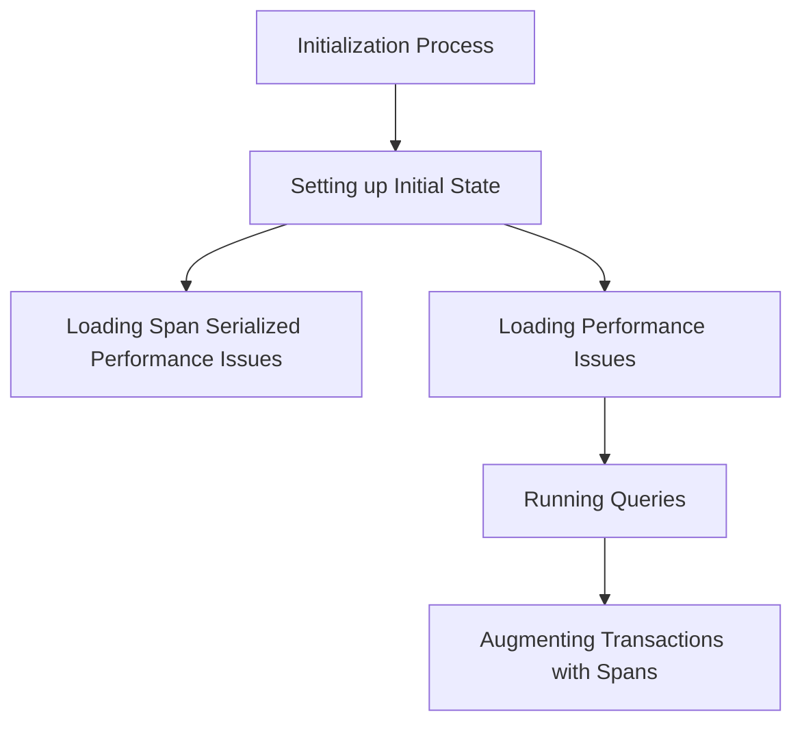

This document will cover the Initialization Process Overview, which includes:

1. Setting up the initial state
2. Loading span serialized performance issues
3. Loading performance issues
4. Running queries
5. Augmenting transactions with spans.

Technical document: <SwmLink doc-title="Initialization Process Overview">[Initialization Process Overview](/.swm/initialization-process-overview.b2np65p9.sw.md)</SwmLink>

# [Setting up the Initial State](https://app.swimm.io/repos/Z2l0aHViJTNBJTNBc2VudHJ5LWRlbW8tMSUzQSUzQVN3aW1tLURlbW8=/docs/b2np65p9#initialization)

The initialization process begins by setting up the initial state of an object. This involves creating lists for errors, children, and performance issues. This setup ensures that the object is prepared to handle any performance-related data effectively. The initial state is crucial for the object to function correctly in subsequent operations.

# [Loading Span Serialized Performance Issues](https://app.swimm.io/repos/Z2l0aHViJTNBJTNBc2VudHJ5LWRlbW8tMSUzQSUzQVN3aW1tLURlbW8=/docs/b2np65p9#loading-span-serialized-performance-issues)

If the condition `span_serialized` is true, the system will load span serialized performance issues. This involves processing performance issues by iterating over `event_span` in the `event`. It collects data such as `unique_spans`, `suspect_spans`, and timestamps. Additionally, it retrieves group information and constructs a dictionary of performance issues, which is then appended to the `performance_issues` list. This step ensures that all relevant performance data is captured and organized for further analysis.

# [Loading Performance Issues](https://app.swimm.io/repos/Z2l0aHViJTNBJTNBc2VudHJ5LWRlbW8tMSUzQSUzQVN3aW1tLURlbW8=/docs/b2np65p9#loading-performance-issues)

If `span_serialized` is false, the system will load performance issues through a different process. This involves identifying and loading performance-related issues for a given event. The system processes the event data to extract relevant spans and issues, and then appends this information to the `performance_issues` list. This ensures that the necessary performance data is available for further analysis or display.

# [Running Queries](https://app.swimm.io/repos/Z2l0aHViJTNBJTNBc2VudHJ5LWRlbW8tMSUzQSUzQVN3aW1tLURlbW8=/docs/b2np65p9#running-a-query)

The system runs queries to fetch the necessary data. The `run_query` function serves as an entry point for executing a single metrics query. It delegates the actual execution to the `bulk_run_query` function, which handles multiple queries and returns the first result. This step is essential for retrieving the required data efficiently.

# [Augmenting Transactions with Spans](https://app.swimm.io/repos/Z2l0aHViJTNBJTNBc2VudHJ5LWRlbW8tMSUzQSUzQVN3aW1tLURlbW8=/docs/b2np65p9#augmenting-transactions-with-spans)

The final step involves augmenting transactions with spans. This process enriches a list of transactions with additional context such as parent, error, and problem data. It starts by initializing various sets and maps to store span IDs, transaction problems, and issue occurrences. The system then iterates over the provided errors to extract span IDs and project IDs. Timestamp parameters are adjusted based on the transactions, and spans are queried in chunks if their number exceeds a certain threshold. This step ensures that transactions are enriched with all relevant data, providing a comprehensive view for further analysis.

&nbsp;

*This is an auto-generated document by Swimm AI 🌊 and has not yet been verified by a human*

<SwmMeta version="3.0.0" repo-id="Z2l0aHViJTNBJTNBc2VudHJ5LWRlbW8tMSUzQSUzQVN3aW1tLURlbW8=" repo-name="sentry-demo-1" doc-type="product-flows">Powered by [Swimm](/)</SwmMeta>
