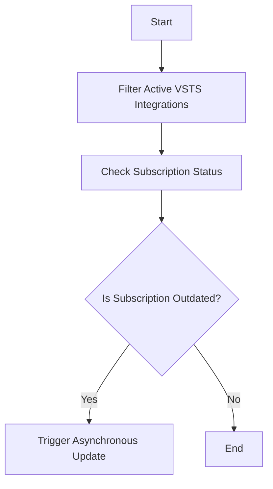

This document will cover the process of initiating a VSTS subscription check, which includes:

1. Filtering active VSTS integrations
2. Checking the subscription status
3. Updating outdated subscriptions.

Technical document: <SwmLink doc-title="Initiating VSTS Subscription Check">[Initiating VSTS Subscription Check](/.swm/initiating-vsts-subscription-check.v5q2m4cv.sw.md)</SwmLink>

# [Filtering Active VSTS Integrations](https://app.swimm.io/repos/Z2l0aHViJTNBJTNBc2VudHJ5LWRlbW8tMSUzQSUzQVN3aW1tLURlbW8=/docs/v5q2m4cv#kickoff_vsts_subscription_check)

The process begins by identifying all active VSTS integrations. This involves filtering through the integrations to find those that are currently active. Active integrations are those that have not been disabled or deleted. This step ensures that only relevant integrations are considered for the subscription check.

# [Checking Subscription Status](https://app.swimm.io/repos/Z2l0aHViJTNBJTNBc2VudHJ5LWRlbW8tMSUzQSUzQVN3aW1tLURlbW8=/docs/v5q2m4cv#kickoff_vsts_subscription_check)

Once the active integrations are identified, the next step is to check the subscription status of each integration. This involves retrieving the subscription details and determining if the subscription check is up-to-date. The subscription status is considered outdated if the last check was performed more than six hours ago. This step ensures that the subscription status is current and accurate.

# [Updating Outdated Subscriptions](https://app.swimm.io/repos/Z2l0aHViJTNBJTNBc2VudHJ5LWRlbW8tMSUzQSUzQVN3aW1tLURlbW8=/docs/v5q2m4cv#kickoff_vsts_subscription_check)

If a subscription check is found to be outdated, an asynchronous task is triggered to update the subscription. This task runs in the background and updates the subscription status without interrupting the main workflow. This step ensures that all VSTS integrations have up-to-date subscription statuses, which is crucial for maintaining the integrity and reliability of the integration.

&nbsp;

*This is an auto-generated document by Swimm AI 🌊 and has not yet been verified by a human*

<SwmMeta version="3.0.0" repo-id="Z2l0aHViJTNBJTNBc2VudHJ5LWRlbW8tMSUzQSUzQVN3aW1tLURlbW8=" repo-name="sentry-demo-1" doc-type="product-flows">Powered by [Swimm](/)</SwmMeta>
