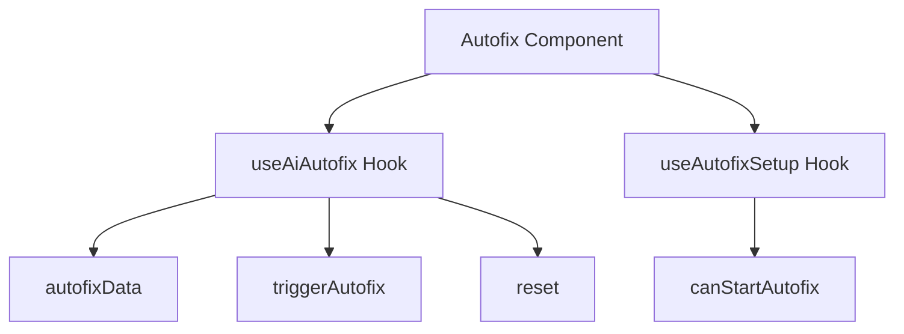

# Introduction to Autofix

Autofix is a feature that automatically attempts to resolve issues in the application by applying predefined fixes. This document will cover the main components and functions involved in the Autofix process, including the <SwmToken path="static/app/components/events/autofix/index.tsx" pos="15:4:4" line-data="export function Autofix({event, group}: Props) {">`Autofix`</SwmToken> component, <SwmToken path="static/app/components/events/autofix/index.tsx" pos="16:15:15" line-data="  const {autofixData, triggerAutofix, reset} = useAiAutofix(group, event);">`useAiAutofix`</SwmToken> hook, <SwmToken path="static/app/components/events/autofix/index.tsx" pos="16:4:4" line-data="  const {autofixData, triggerAutofix, reset} = useAiAutofix(group, event);">`autofixData`</SwmToken> constant, and the <SwmToken path="static/app/components/events/autofix/index.tsx" pos="18:9:9" line-data="  const {canStartAutofix} = useAutofixSetup({">`useAutofixSetup`</SwmToken> hook.

# Autofix Component

The <SwmToken path="static/app/components/events/autofix/index.tsx" pos="15:4:4" line-data="export function Autofix({event, group}: Props) {">`Autofix`</SwmToken> component is responsible for rendering the UI elements related to the autofix functionality, such as the <SwmToken path="static/app/components/events/autofix/index.tsx" pos="30:2:2" line-data="          &lt;AutofixCard data={autofixData} onRetry={reset} groupId={group.id} /&gt;">`AutofixCard`</SwmToken> and <SwmToken path="static/app/components/events/autofix/index.tsx" pos="32:2:2" line-data="          &lt;AutofixBanner">`AutofixBanner`</SwmToken>. It uses the <SwmToken path="static/app/components/events/autofix/index.tsx" pos="16:15:15" line-data="  const {autofixData, triggerAutofix, reset} = useAiAutofix(group, event);">`useAiAutofix`</SwmToken> hook to manage the state and logic for triggering autofix actions and polling for their status.

<SwmSnippet path="/static/app/components/events/autofix/index.tsx" line="15">

---

The <SwmToken path="static/app/components/events/autofix/index.tsx" pos="15:4:4" line-data="export function Autofix({event, group}: Props) {">`Autofix`</SwmToken> component initializes the <SwmToken path="static/app/components/events/autofix/index.tsx" pos="16:4:4" line-data="  const {autofixData, triggerAutofix, reset} = useAiAutofix(group, event);">`autofixData`</SwmToken>, <SwmToken path="static/app/components/events/autofix/index.tsx" pos="16:7:7" line-data="  const {autofixData, triggerAutofix, reset} = useAiAutofix(group, event);">`triggerAutofix`</SwmToken>, and <SwmToken path="static/app/components/events/autofix/index.tsx" pos="16:10:10" line-data="  const {autofixData, triggerAutofix, reset} = useAiAutofix(group, event);">`reset`</SwmToken> functions using the <SwmToken path="static/app/components/events/autofix/index.tsx" pos="16:15:15" line-data="  const {autofixData, triggerAutofix, reset} = useAiAutofix(group, event);">`useAiAutofix`</SwmToken> hook. It also checks if the necessary conditions are met to start the autofix process using the <SwmToken path="static/app/components/events/autofix/index.tsx" pos="18:9:9" line-data="  const {canStartAutofix} = useAutofixSetup({">`useAutofixSetup`</SwmToken> hook.

```tsx
export function Autofix({event, group}: Props) {
  const {autofixData, triggerAutofix, reset} = useAiAutofix(group, event);

  const {canStartAutofix} = useAutofixSetup({
    groupId: group.id,
  });

  useRouteAnalyticsParams({
    autofix_status: autofixData?.status ?? 'none',
  });

  return (
    <ErrorBoundary mini>
      <div>
        {autofixData ? (
          <AutofixCard data={autofixData} onRetry={reset} groupId={group.id} />
        ) : (
          <AutofixBanner
            groupId={group.id}
            projectId={group.project.id}
```

---

</SwmSnippet>

# Autofix Data

The <SwmToken path="static/app/components/events/autofix/index.tsx" pos="16:4:4" line-data="  const {autofixData, triggerAutofix, reset} = useAiAutofix(group, event);">`autofixData`</SwmToken> constant holds the current state of the autofix process, including its status and any relevant data.

<SwmSnippet path="/static/app/components/events/autofix/useAutofix.tsx" line="17">

---

The <SwmToken path="static/app/components/events/autofix/useAutofix.tsx" pos="18:4:4" line-data="  autofix: AutofixData | null;">`AutofixData`</SwmToken> type definition includes the status and any relevant data of the autofix process.

```tsx
export type AutofixResponse = {
  autofix: AutofixData | null;
};
```

---

</SwmSnippet>

# Autofix Setup

The <SwmToken path="static/app/components/events/autofix/index.tsx" pos="18:9:9" line-data="  const {canStartAutofix} = useAutofixSetup({">`useAutofixSetup`</SwmToken> hook checks if the necessary conditions are met to start the autofix process, such as integration and consent statuses.

<SwmSnippet path="/static/app/components/events/autofix/useAutofixSetup.tsx" line="13">

---

The <SwmToken path="static/app/components/events/autofix/index.tsx" pos="18:9:9" line-data="  const {canStartAutofix} = useAutofixSetup({">`useAutofixSetup`</SwmToken> hook ensures that all necessary conditions, such as integration and consent statuses, are met before starting the autofix process.

```tsx
export type AutofixSetupResponse = {
  genAIConsent: {
    ok: boolean;
  };
  githubWriteIntegration: {
    ok: boolean;
    repos: AutofixSetupRepoDefinition[];
  };
  integration: {
    ok: boolean;
    reason: string | null;
  };
  subprocessorConsent: {
    ok: boolean;
  };
};

export function makeAutofixSetupQueryKey(groupId: string): ApiQueryKey {
  return [`/issues/${groupId}/autofix/setup/`];
}
```

---

</SwmSnippet>

# Main Functions

There are several main functions related to Autofix. Some of them are <SwmToken path="static/app/components/events/autofix/autofixSteps.tsx" pos="322:4:4" line-data="export function AutofixSteps({data, groupId, runId, onRetry}: AutofixStepsProps) {">`AutofixSteps`</SwmToken>, <SwmToken path="static/app/components/events/autofix/index.tsx" pos="5:17:17" line-data="import {useAiAutofix} from &#39;sentry/components/events/autofix/useAutofix&#39;;">`useAutofix`</SwmToken>, and <SwmToken path="static/app/components/events/autofix/autofixChanges.tsx" pos="199:4:4" line-data="export function AutofixChanges({">`AutofixChanges`</SwmToken>. We will dive a little into these functions.

## <SwmToken path="static/app/components/events/autofix/autofixSteps.tsx" pos="322:4:4" line-data="export function AutofixSteps({data, groupId, runId, onRetry}: AutofixStepsProps) {">`AutofixSteps`</SwmToken>

The <SwmToken path="static/app/components/events/autofix/autofixSteps.tsx" pos="322:4:4" line-data="export function AutofixSteps({data, groupId, runId, onRetry}: AutofixStepsProps) {">`AutofixSteps`</SwmToken> function is responsible for rendering the steps involved in the autofix process. It maps over the steps data and renders each step using the <SwmToken path="static/app/components/events/autofix/autofixSteps.tsx" pos="335:7:7" line-data="      {steps.map((step, index) =&gt; (">`step`</SwmToken> component.

<SwmSnippet path="/static/app/components/events/autofix/autofixSteps.tsx" line="322">

---

The <SwmToken path="static/app/components/events/autofix/autofixSteps.tsx" pos="322:4:4" line-data="export function AutofixSteps({data, groupId, runId, onRetry}: AutofixStepsProps) {">`AutofixSteps`</SwmToken> function iterates over the steps data and renders each step using the <SwmToken path="static/app/components/events/autofix/autofixSteps.tsx" pos="335:7:7" line-data="      {steps.map((step, index) =&gt; (">`step`</SwmToken> component.

```tsx
export function AutofixSteps({data, groupId, runId, onRetry}: AutofixStepsProps) {
  const steps = data.steps;
  const repos = data.repositories;

  if (!steps) {
    return null;
  }

  const showInputField =
    data.options?.iterative_feedback && steps.at(-1)?.type === AutofixStepType.CHANGES;

  return (
    <div>
      {steps.map((step, index) => (
        <Step
          step={step}
          key={step.id}
          stepNumber={index + 1}
          groupId={groupId}
          runId={runId}
          onRetry={onRetry}
```

---

</SwmSnippet>

## <SwmToken path="static/app/components/events/autofix/index.tsx" pos="5:17:17" line-data="import {useAiAutofix} from &#39;sentry/components/events/autofix/useAutofix&#39;;">`useAutofix`</SwmToken>

The <SwmToken path="static/app/components/events/autofix/index.tsx" pos="5:17:17" line-data="import {useAiAutofix} from &#39;sentry/components/events/autofix/useAutofix&#39;;">`useAutofix`</SwmToken> hook manages the state and logic for triggering autofix actions and polling for their status. It initializes the autofix data and provides functions to update the state based on the autofix process.

<SwmSnippet path="/static/app/components/events/autofix/useAutofix.tsx" line="27">

---

The <SwmToken path="static/app/components/events/autofix/index.tsx" pos="5:17:17" line-data="import {useAiAutofix} from &#39;sentry/components/events/autofix/useAutofix&#39;;">`useAutofix`</SwmToken> hook initializes the autofix data and provides functions to update the state based on the autofix process.

```tsx
const makeInitialAutofixData = (): AutofixResponse => ({
  autofix: {
    status: 'PROCESSING',
    run_id: '',
    steps: [
      {
        type: AutofixStepType.DEFAULT,
        id: '1',
        index: 0,
        status: 'PROCESSING',
        title: 'Starting Autofix...',
        progress: [],
      },
    ],
    created_at: new Date().toISOString(),
    repositories: [],
  },
});
```

---

</SwmSnippet>

## <SwmToken path="static/app/components/events/autofix/autofixChanges.tsx" pos="199:4:4" line-data="export function AutofixChanges({">`AutofixChanges`</SwmToken>

The <SwmToken path="static/app/components/events/autofix/autofixChanges.tsx" pos="199:4:4" line-data="export function AutofixChanges({">`AutofixChanges`</SwmToken> function handles the rendering of changes suggested by the autofix process. It checks the status of the step and displays appropriate messages or the changes themselves.

<SwmSnippet path="/static/app/components/events/autofix/autofixChanges.tsx" line="199">

---

The <SwmToken path="static/app/components/events/autofix/autofixChanges.tsx" pos="199:4:4" line-data="export function AutofixChanges({">`AutofixChanges`</SwmToken> function checks the status of the step and displays appropriate messages or the changes suggested by the autofix process.

```tsx
export function AutofixChanges({
  step,
  onRetry,
  groupId,
  isLastStep,
}: AutofixChangesProps) {
  const data = useAutofixData({groupId});

  if (step.status === 'ERROR' || data?.status === 'ERROR') {
    return (
      <Content>
        <PreviewContent>
          {data?.error_message ? (
            <Fragment>
              <PrefixText>{t('Something went wrong')}</PrefixText>
              <span>{data.error_message}</span>
            </Fragment>
          ) : (
            <span>{t('Something went wrong.')}</span>
          )}
        </PreviewContent>
```

---

</SwmSnippet>

# Autofix Endpoints

Autofix involves several endpoints for updating and setting up the autofix process.

### Autofix Update Endpoint

The Autofix update endpoint is used to send user instructions to the Autofix service. The endpoint `/issues/${groupId}/autofix/update/` is called with a POST request containing the run ID and the instruction payload.

<SwmSnippet path="/static/app/components/events/autofix/autofixInputField.tsx" line="28">

---

The Autofix update endpoint sends user instructions to the Autofix service using a POST request.

```tsx
      return api.requestPromise(`/issues/${groupId}/autofix/update/`, {
        method: 'POST',
        data: {
          run_id: runId,
          payload: {
            type: 'instruction',
            content: {
              type: 'text',
              text: params.instruction,
            },
          },
        },
      });
```

---

</SwmSnippet>

### Autofix Setup Endpoint

The Autofix setup endpoint is used to initialize the Autofix process. The endpoint `/issues/${group.id}/autofix/setup/` is called to check the integration and consent statuses required to start the Autofix process.

<SwmSnippet path="/static/app/components/events/autofix/index.spec.tsx" line="20">

---

The Autofix setup endpoint checks the integration and consent statuses required to start the Autofix process.

```tsx
      url: `/issues/${group.id}/autofix/setup/`,
      body: {
        genAIConsent: {ok: true},
        integration: {ok: true},
        githubWriteIntegration: {
          ok: true,
          repos: [
            {
              provider: 'integrations:github',
              owner: 'getsentry',
              name: 'sentry',
              external_id: '123',
            },
          ],
        },
      },
    });
```

---

</SwmSnippet>

&nbsp;

*This is an auto-generated document by Swimm AI 🌊 and has not yet been verified by a human*

<SwmMeta version="3.0.0" repo-id="Z2l0aHViJTNBJTNBc2VudHJ5LWRlbW8tMSUzQSUzQVN3aW1tLURlbW8=" repo-name="sentry-demo-1" doc-type="overview"><sup>Powered by [Swimm](/)</sup></SwmMeta>
