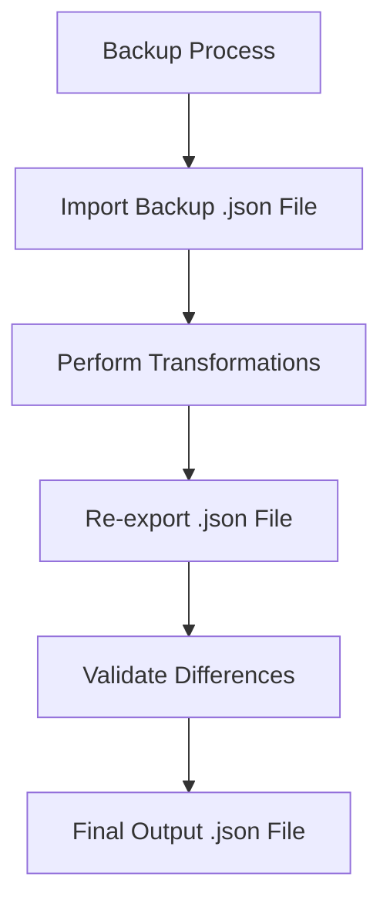

# Introduction

Backup refers to the process of taking an empty database, importing a given backup `.json` file, optionally performing some transformations, re-exporting it, and validating the differences. The expected result of the backup process is that only the changes made during the transformation are reflected in the final diff between the original input `.json` file and the final output `.json` file.

# Backup Tests

This section explains the process of testing backups by importing a backup `.json` file, performing transformations, re-exporting, and validating the differences.

# Comparators

Comparators are used in the backup process to handle fields in the export JSON format that are not easily compared before and after running through an import/export cycle. They provide custom, model-specific ways of comparing portions of two JSON files, taking into account more nuanced validations beyond simple character-for-character matching.

# Snapshots

Snapshots are default starter snapshots provided to bootstrap the test flow. For example, `fresh_install.json` represents the state of the database immediately after running `./install.sh` to create a new instance of `self-hosted`.

# Main Functions

There are several main functions in this folder. Some of them are <SwmToken path="src/sentry/backup/imports.py" pos="584:2:2" line-data="def import_in_global_scope(">`import_in_global_scope`</SwmToken>, <SwmToken path="src/sentry/backup/imports.py" pos="87:2:2" line-data="def _import(">`_import`</SwmToken>, and `comparators`. We will dive a little into <SwmToken path="src/sentry/backup/imports.py" pos="584:2:2" line-data="def import_in_global_scope(">`import_in_global_scope`</SwmToken> and <SwmToken path="src/sentry/backup/imports.py" pos="87:2:2" line-data="def _import(">`_import`</SwmToken>.

<SwmSnippet path="/src/sentry/backup/imports.py" line="584">

---

## <SwmToken path="src/sentry/backup/imports.py" pos="584:2:2" line-data="def import_in_global_scope(">`import_in_global_scope`</SwmToken>

The <SwmToken path="src/sentry/backup/imports.py" pos="584:2:2" line-data="def import_in_global_scope(">`import_in_global_scope`</SwmToken> function performs an import in the `Global` scope, meaning that all models will be imported from the provided source file. This method is useful when restoring to a fresh Sentry instance, as it serializes and deserializes a snapshot of the database state.

```python
def import_in_global_scope(
    src: IO[bytes],
    *,
    decryptor: Decryptor | None = None,
    flags: ImportFlags | None = None,
    printer: Printer,
):
    """
    Perform an import in the `Global` scope, meaning that all models will be imported from the
    provided source file. Because a `Global` import is really only useful when restoring to a fresh
    Sentry instance, some behaviors in this scope are different from the others. In particular,
    superuser privileges are not sanitized. This method can be thought of as a "pure"
    backup/restore, simply serializing and deserializing a (partial) snapshot of the database state.
    """

    return _import(
        src,
        ImportScope.Global,
        decryptor=decryptor,
        flags=flags,
        printer=printer,
```

---

</SwmSnippet>

<SwmSnippet path="/src/sentry/backup/imports.py" line="87">

---

## \_import

The <SwmToken path="src/sentry/backup/imports.py" pos="87:2:2" line-data="def _import(">`_import`</SwmToken> function is a core function for importing data for a Sentry installation. It is generally preferable to avoid calling this function directly, as there are certain combinations of input parameters that should not be used together. Instead, use one of the wrapper functions like <SwmToken path="src/sentry/backup/imports.py" pos="584:2:2" line-data="def import_in_global_scope(">`import_in_global_scope`</SwmToken>.

```python
def _import(
    src: IO[bytes],
    scope: ImportScope,
    *,
    decryptor: Decryptor | None = None,
    flags: ImportFlags | None = None,
    filter_by: Filter | None = None,
    printer: Printer,
):
    """
    Imports core data for a Sentry installation.

    It is generally preferable to avoid calling this function directly, as there are certain
    combinations of input parameters that should not be used together. Instead, use one of the other
    wrapper functions in this file, named `import_in_XXX_scope()`.
    """

    # Import here to prevent circular module resolutions.
    from sentry.models.organization import Organization
    from sentry.models.organizationmember import OrganizationMember
    from sentry.users.models.email import Email
```

---

</SwmSnippet>

&nbsp;

*This is an auto-generated document by Swimm AI 🌊 and has not yet been verified by a human*

<SwmMeta version="3.0.0" repo-id="Z2l0aHViJTNBJTNBc2VudHJ5LWRlbW8tMSUzQSUzQVN3aW1tLURlbW8=" repo-name="sentry-demo-1" doc-type="overview"><sup>Powered by [Swimm](/)</sup></SwmMeta>
