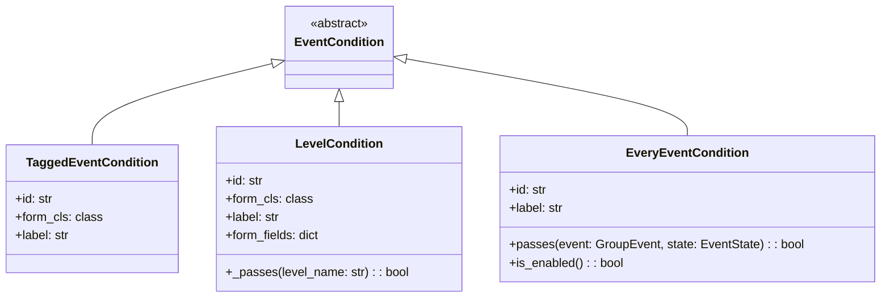

# Introduction to Conditions in Rules

Conditions are used to define specific criteria that must be met for a rule to be triggered. They are implemented as classes that inherit from the <SwmToken path="src/sentry/rules/conditions/tagged_event.py" pos="37:4:4" line-data="class TaggedEventCondition(EventCondition):">`EventCondition`</SwmToken> base class. Each condition class specifies the type of event it handles and the logic to determine if the condition is met. Conditions are a crucial part of the rule evaluation process, allowing for fine-grained control over when rules are applied.

# <SwmToken path="src/sentry/rules/conditions/tagged_event.py" pos="37:2:2" line-data="class TaggedEventCondition(EventCondition):">`TaggedEventCondition`</SwmToken>

The <SwmToken path="src/sentry/rules/conditions/tagged_event.py" pos="37:2:2" line-data="class TaggedEventCondition(EventCondition):">`TaggedEventCondition`</SwmToken> class is an example of a condition that checks if an event's tags match specific criteria. It inherits from <SwmToken path="src/sentry/rules/conditions/tagged_event.py" pos="37:4:4" line-data="class TaggedEventCondition(EventCondition):">`EventCondition`</SwmToken> and defines the <SwmToken path="src/sentry/rules/conditions/tagged_event.py" pos="38:1:1" line-data="    id = &quot;sentry.rules.conditions.tagged_event.TaggedEventCondition&quot;">`id`</SwmToken>, <SwmToken path="src/sentry/rules/conditions/tagged_event.py" pos="39:1:1" line-data="    form_cls = TaggedEventForm">`form_cls`</SwmToken>, and <SwmToken path="src/sentry/rules/conditions/tagged_event.py" pos="40:1:1" line-data="    label = &quot;The event&#39;s tags match {key} {match} {value}&quot;">`label`</SwmToken> attributes.

<SwmSnippet path="/src/sentry/rules/conditions/tagged_event.py" line="37">

---

The <SwmToken path="src/sentry/rules/conditions/tagged_event.py" pos="37:2:2" line-data="class TaggedEventCondition(EventCondition):">`TaggedEventCondition`</SwmToken> class defines the <SwmToken path="src/sentry/rules/conditions/tagged_event.py" pos="38:1:1" line-data="    id = &quot;sentry.rules.conditions.tagged_event.TaggedEventCondition&quot;">`id`</SwmToken>, <SwmToken path="src/sentry/rules/conditions/tagged_event.py" pos="39:1:1" line-data="    form_cls = TaggedEventForm">`form_cls`</SwmToken>, and <SwmToken path="src/sentry/rules/conditions/tagged_event.py" pos="40:1:1" line-data="    label = &quot;The event&#39;s tags match {key} {match} {value}&quot;">`label`</SwmToken> attributes to specify the condition's unique identifier, form class, and label respectively.

```python
class TaggedEventCondition(EventCondition):
    id = "sentry.rules.conditions.tagged_event.TaggedEventCondition"
    form_cls = TaggedEventForm
    label = "The event's tags match {key} {match} {value}"
```

---

</SwmSnippet>

# <SwmToken path="src/sentry/rules/conditions/level.py" pos="27:2:2" line-data="class LevelCondition(EventCondition):">`LevelCondition`</SwmToken>

The <SwmToken path="src/sentry/rules/conditions/level.py" pos="27:2:2" line-data="class LevelCondition(EventCondition):">`LevelCondition`</SwmToken> class is used to check if an event's level matches a specified condition. It inherits from <SwmToken path="src/sentry/rules/conditions/tagged_event.py" pos="37:4:4" line-data="class TaggedEventCondition(EventCondition):">`EventCondition`</SwmToken> and includes methods to determine if the condition passes based on the event's level.

<SwmSnippet path="/src/sentry/rules/conditions/level.py" line="27">

---

The <SwmToken path="src/sentry/rules/conditions/level.py" pos="27:2:2" line-data="class LevelCondition(EventCondition):">`LevelCondition`</SwmToken> class defines the <SwmToken path="src/sentry/rules/conditions/level.py" pos="28:1:1" line-data="    id = &quot;sentry.rules.conditions.level.LevelCondition&quot;">`id`</SwmToken>, <SwmToken path="src/sentry/rules/conditions/level.py" pos="29:1:1" line-data="    form_cls = LevelEventForm">`form_cls`</SwmToken>, <SwmToken path="src/sentry/rules/conditions/level.py" pos="30:1:1" line-data="    label = &quot;The event&#39;s level is {match} {level}&quot;">`label`</SwmToken>, and <SwmToken path="src/sentry/rules/conditions/level.py" pos="31:1:1" line-data="    form_fields = {">`form_fields`</SwmToken> attributes. It also includes the <SwmToken path="src/sentry/rules/conditions/level.py" pos="36:3:3" line-data="    def _passes(self, level_name: str) -&gt; bool:">`_passes`</SwmToken> method to determine if the event's level meets the specified condition.

```python
class LevelCondition(EventCondition):
    id = "sentry.rules.conditions.level.LevelCondition"
    form_cls = LevelEventForm
    label = "The event's level is {match} {level}"
    form_fields = {
        "level": {"type": "choice", "choices": list(LEVEL_CHOICES.items())},
        "match": {"type": "choice", "choices": list(MATCH_CHOICES.items())},
    }

    def _passes(self, level_name: str) -> bool:
        desired_level_raw = self.get_option("level")
        desired_match = self.get_option("match")

        if not (desired_level_raw and desired_match):
            return False

        desired_level = int(desired_level_raw)
        # Fetch the event level from the tags since event.level is
        # event.group.level which may have changed
        try:
            level: int = LOG_LEVELS_MAP[level_name]
```

---

</SwmSnippet>

# <SwmToken path="src/sentry/rules/conditions/every_event.py" pos="6:2:2" line-data="class EveryEventCondition(EventCondition):">`EveryEventCondition`</SwmToken>

The <SwmToken path="src/sentry/rules/conditions/every_event.py" pos="6:2:2" line-data="class EveryEventCondition(EventCondition):">`EveryEventCondition`</SwmToken> class is a simple condition that always returns true, indicating that the condition is met for every event. It also inherits from <SwmToken path="src/sentry/rules/conditions/tagged_event.py" pos="37:4:4" line-data="class TaggedEventCondition(EventCondition):">`EventCondition`</SwmToken>.

<SwmSnippet path="/src/sentry/rules/conditions/every_event.py" line="6">

---

The <SwmToken path="src/sentry/rules/conditions/every_event.py" pos="6:2:2" line-data="class EveryEventCondition(EventCondition):">`EveryEventCondition`</SwmToken> class defines the <SwmToken path="src/sentry/rules/conditions/every_event.py" pos="7:1:1" line-data="    id = &quot;sentry.rules.conditions.every_event.EveryEventCondition&quot;">`id`</SwmToken> and <SwmToken path="src/sentry/rules/conditions/every_event.py" pos="8:1:1" line-data="    label = &quot;The event occurs&quot;">`label`</SwmToken> attributes. The <SwmToken path="src/sentry/rules/conditions/every_event.py" pos="10:3:3" line-data="    def passes(self, event: GroupEvent, state: EventState) -&gt; bool:">`passes`</SwmToken> method always returns true, and the <SwmToken path="src/sentry/rules/conditions/every_event.py" pos="13:3:3" line-data="    def is_enabled(self) -&gt; bool:">`is_enabled`</SwmToken> method returns false.

```python
class EveryEventCondition(EventCondition):
    id = "sentry.rules.conditions.every_event.EveryEventCondition"
    label = "The event occurs"

    def passes(self, event: GroupEvent, state: EventState) -> bool:
        return True

    def is_enabled(self) -> bool:
        return False
```

---

</SwmSnippet>

&nbsp;

*This is an auto-generated document by Swimm AI 🌊 and has not yet been verified by a human*

<SwmMeta version="3.0.0" repo-id="Z2l0aHViJTNBJTNBc2VudHJ5LWRlbW8tMSUzQSUzQVN3aW1tLURlbW8=" repo-name="sentry-demo-1" doc-type="overview"><sup>Powered by [Swimm](/)</sup></SwmMeta>
