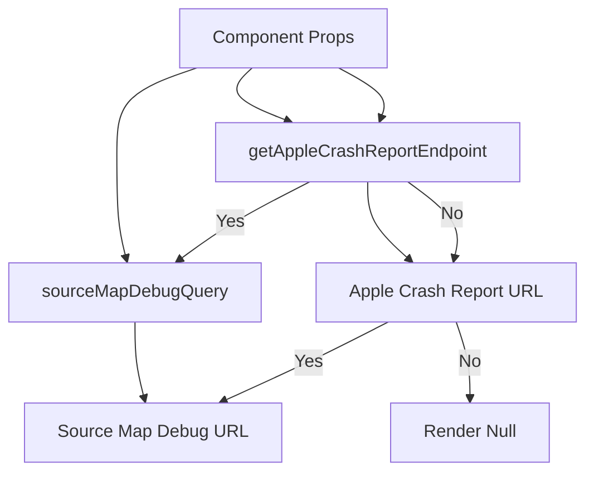

# Introduction to Crash Details

Crash content refers to the detailed information about an application's crash event. It includes data such as stack traces, exception details, and platform-specific crash reports.

# Rendering Crash Content

The <SwmToken path="static/app/components/events/interfaces/crashContent/index.tsx" pos="21:4:4" line-data="export function CrashContent({">`CrashContent`</SwmToken> component is responsible for rendering the crash details. It checks if the crash event contains an exception or a stack trace and then renders the appropriate content using <SwmToken path="static/app/components/events/interfaces/crashContent/index.tsx" pos="33:2:2" line-data="      &lt;ExceptionContent">`ExceptionContent`</SwmToken> or <SwmToken path="static/app/components/events/interfaces/crashContent/index.tsx" pos="5:3:3" line-data="import {StackTraceContent} from &#39;./stackTrace&#39;;">`StackTraceContent`</SwmToken> components.

<SwmSnippet path="/static/app/components/events/interfaces/crashContent/index.tsx" line="21">

---

The <SwmToken path="static/app/components/events/interfaces/crashContent/index.tsx" pos="21:4:4" line-data="export function CrashContent({">`CrashContent`</SwmToken> component checks if the crash event contains an exception or a stack trace and renders the appropriate content using <SwmToken path="static/app/components/events/interfaces/crashContent/index.tsx" pos="33:2:2" line-data="      &lt;ExceptionContent">`ExceptionContent`</SwmToken> or <SwmToken path="static/app/components/events/interfaces/crashContent/index.tsx" pos="5:3:3" line-data="import {StackTraceContent} from &#39;./stackTrace&#39;;">`StackTraceContent`</SwmToken> components.

```tsx
export function CrashContent({
  event,
  stackView,
  stackType,
  newestFirst,
  projectSlug,
  groupingCurrentLevel,
  exception,
  stacktrace,
}: Props) {
  if (exception) {
    return (
      <ExceptionContent
        stackType={stackType}
        stackView={stackView}
        projectSlug={projectSlug}
        newestFirst={newestFirst}
        event={event}
        values={exception.values}
        groupingCurrentLevel={groupingCurrentLevel}
      />
```

---

</SwmSnippet>

# Fetching Apple Crash Reports

The <SwmToken path="static/app/components/events/interfaces/crashContent/exception/rawContent.tsx" pos="129:3:3" line-data="  async fetchAppleCrashReport() {">`fetchAppleCrashReport`</SwmToken> method is used to retrieve crash reports specific to Apple platforms. It makes an API request to fetch the crash report and updates the component's state with the retrieved data.

<SwmSnippet path="/static/app/components/events/interfaces/crashContent/exception/rawContent.tsx" line="129">

---

The <SwmToken path="static/app/components/events/interfaces/crashContent/exception/rawContent.tsx" pos="129:3:3" line-data="  async fetchAppleCrashReport() {">`fetchAppleCrashReport`</SwmToken> method retrieves crash reports specific to Apple platforms by making an API request and updating the component's state with the retrieved data.

```tsx
  async fetchAppleCrashReport() {
    const {api, organization} = this.props;

    // Shared issues do not have access to organization
    if (!organization) {
      return;
    }

    this.setState({
      loading: true,
      error: false,
      crashReport: '',
    });

    try {
      const data = await api.requestPromise(
        this.getAppleCrashReportEndpoint(organization),
        {headers: {Accept: '*/*; charset=utf-8'}}
      );
      this.setState({
        error: false,
```

---

</SwmSnippet>

# Determining Stacktrace Platform

The <SwmToken path="static/app/components/events/interfaces/crashContent/index.tsx" pos="1:3:3" line-data="import {getStacktracePlatform} from &#39;sentry/components/events/interfaces/utils&#39;;">`getStacktracePlatform`</SwmToken> function determines the platform of the stack trace by checking the frames for a defined platform or falling back to the event's platform.

# Crash Content Endpoints

Crash content endpoints are used to construct URLs for fetching crash reports and debugging source maps.

## <SwmToken path="static/app/components/events/interfaces/crashContent/exception/rawContent.tsx" pos="60:1:1" line-data="  getAppleCrashReportEndpoint(organization: Organization) {">`getAppleCrashReportEndpoint`</SwmToken>

The <SwmToken path="static/app/components/events/interfaces/crashContent/exception/rawContent.tsx" pos="60:1:1" line-data="  getAppleCrashReportEndpoint(organization: Organization) {">`getAppleCrashReportEndpoint`</SwmToken> function constructs the endpoint URL for fetching Apple crash reports. It uses the organization slug, project slug, and event ID from the component's props to build the URL.

<SwmSnippet path="/static/app/components/events/interfaces/crashContent/exception/rawContent.tsx" line="60">

---

The <SwmToken path="static/app/components/events/interfaces/crashContent/exception/rawContent.tsx" pos="60:1:1" line-data="  getAppleCrashReportEndpoint(organization: Organization) {">`getAppleCrashReportEndpoint`</SwmToken> function constructs the endpoint URL for fetching Apple crash reports using the organization slug, project slug, and event ID from the component's props.

```tsx
  getAppleCrashReportEndpoint(organization: Organization) {
    const {type, projectSlug, eventId} = this.props;

    const minified = type === 'minified';
    return `/projects/${organization.slug}/${projectSlug}/events/${eventId}/apple-crash-report?minified=${minified}`;
  }
```

---

</SwmSnippet>

## <SwmToken path="static/app/components/events/interfaces/crashContent/exception/useSourceMapDebug.tsx" pos="75:2:2" line-data="const sourceMapDebugQuery = ({">`sourceMapDebugQuery`</SwmToken>

The <SwmToken path="static/app/components/events/interfaces/crashContent/exception/useSourceMapDebug.tsx" pos="75:2:2" line-data="const sourceMapDebugQuery = ({">`sourceMapDebugQuery`</SwmToken> function constructs the endpoint URL for debugging source maps. It takes several parameters such as organization slug, project slug, event ID, frame index, and exception index to build the query.

<SwmSnippet path="/static/app/components/events/interfaces/crashContent/exception/useSourceMapDebug.tsx" line="75">

---

The <SwmToken path="static/app/components/events/interfaces/crashContent/exception/useSourceMapDebug.tsx" pos="75:2:2" line-data="const sourceMapDebugQuery = ({">`sourceMapDebugQuery`</SwmToken> function constructs the endpoint URL for debugging source maps using parameters such as organization slug, project slug, event ID, frame index, and exception index.

```tsx
const sourceMapDebugQuery = ({
  orgSlug,
  projectSlug,
  eventId,
  frameIdx,
  exceptionIdx,
}: UseSourceMapDebugProps): ApiQueryKey => [
  `/projects/${orgSlug}/${projectSlug}/events/${eventId}/source-map-debug/`,
  {
    query: {
      frame_idx: `${frameIdx}`,
      exception_idx: `${exceptionIdx}`,
    },
  },
];
```

---

</SwmSnippet>

&nbsp;

*This is an auto-generated document by Swimm AI 🌊 and has not yet been verified by a human*

<SwmMeta version="3.0.0" repo-id="Z2l0aHViJTNBJTNBc2VudHJ5LWRlbW8tMSUzQSUzQVN3aW1tLURlbW8=" repo-name="sentry-demo-1" doc-type="overview"><sup>Powered by [Swimm](/)</sup></SwmMeta>
