```mermaid
graph TD;
 A[Client Request] --> B[getEndpoints];
 B --> C[Check discover-query feature];
 C -->|Enabled| D[Add '/discover/homepage/' endpoint];
 A --> E[handleCreateQuery];
 E --> F[Construct payload];
 F --> G[Track analytics event];
 G --> H[POST request to '/discover/saved/'];

%% Swimm:
%% graph TD;
%%  A[Client Request] --> B[getEndpoints];
%%  B --> C[Check <SwmToken path="static/app/views/discover/homepage.tsx" pos="94:11:13" line-data="    if (organization.features.includes(&#39;discover-query&#39;)) {">`discover-query`</SwmToken> feature];
%%  C -->|Enabled| D[Add '/discover/homepage/' endpoint];
%%  A --> E[handleCreateQuery];
%%  E --> F[Construct payload];
%%  F --> G[Track analytics event];
%%  G --> H[POST request to '/discover/saved/'];
```

# Introduction to Discover Feature

Discover is a feature that provides users with the ability to query and analyze event data within the application. It allows users to create custom queries, visualize results, and save these queries for future use.

<SwmSnippet path="/static/app/views/discover/index.tsx" line="14">

---

The <SwmToken path="static/app/views/discover/index.tsx" pos="14:2:2" line-data="function DiscoverContainer({organization, children}: Props) {">`DiscoverContainer`</SwmToken> component checks for the necessary permissions and renders the appropriate content. If the user does not have access to the Discover feature, a warning message is displayed.

```tsx
function DiscoverContainer({organization, children}: Props) {
  function renderNoAccess() {
    return (
      <Layout.Page withPadding>
        <Alert type="warning">{t("You don't have access to this feature")}</Alert>
      </Layout.Page>
    );
  }

  return (
    <Feature
      features="discover-basic"
      organization={organization}
      hookName="feature-disabled:discover2-page"
      renderDisabled={renderNoAccess}
    >
      <NoProjectMessage organization={organization}>{children}</NoProjectMessage>
    </Feature>
  );
}
```

---

</SwmSnippet>

# Transaction Summary Link

The <SwmToken path="static/app/views/discover/utils.tsx" pos="740:4:4" line-data="export function getTargetForTransactionSummaryLink(">`getTargetForTransactionSummaryLink`</SwmToken> function is used to generate a link to the transaction summary page, taking into account the selected project and query parameters.

<SwmSnippet path="/static/app/views/discover/utils.tsx" line="740">

---

The <SwmToken path="static/app/views/discover/utils.tsx" pos="740:4:4" line-data="export function getTargetForTransactionSummaryLink(">`getTargetForTransactionSummaryLink`</SwmToken> function generates a link to the transaction summary page based on the selected project and query parameters.

```tsx
export function getTargetForTransactionSummaryLink(
  dataRow: EventData,
  organization: Organization,
  projects?: Project[],
  nextView?: EventView,
  location?: Location
) {
  let projectID: string | string[] | undefined;
  const filterProjects = location?.query.project;

  if (typeof filterProjects === 'string' && filterProjects !== '-1') {
    // Project selector in discover has just one selected project
    projectID = filterProjects;
  } else {
    const projectMatch = projects?.find(
      project =>
        project.slug && [dataRow['project.name'], dataRow.project].includes(project.slug)
    );
    projectID = projectMatch ? [projectMatch.id] : undefined;
  }
```

---

</SwmSnippet>

# Discover Endpoints

The <SwmToken path="static/app/views/discover/homepage.tsx" pos="90:1:1" line-data="  getEndpoints(): ReturnType&lt;DeprecatedAsyncComponent[&#39;getEndpoints&#39;]&gt; {">`getEndpoints`</SwmToken> method in the <SwmToken path="static/app/views/discover/homepage.tsx" pos="38:2:2" line-data="class HomepageQueryAPI extends DeprecatedAsyncComponent&lt;Props, HomepageQueryState&gt; {">`HomepageQueryAPI`</SwmToken> class defines the endpoints used to fetch data for the Discover homepage. It checks if the organization has the <SwmToken path="static/app/views/discover/homepage.tsx" pos="94:11:13" line-data="    if (organization.features.includes(&#39;discover-query&#39;)) {">`discover-query`</SwmToken> feature enabled and, if so, adds the endpoint for fetching saved queries.

<SwmSnippet path="/static/app/views/discover/homepage.tsx" line="90">

---

The <SwmToken path="static/app/views/discover/homepage.tsx" pos="90:1:1" line-data="  getEndpoints(): ReturnType&lt;DeprecatedAsyncComponent[&#39;getEndpoints&#39;]&gt; {">`getEndpoints`</SwmToken> method checks if the organization has the <SwmToken path="static/app/views/discover/homepage.tsx" pos="94:11:13" line-data="    if (organization.features.includes(&#39;discover-query&#39;)) {">`discover-query`</SwmToken> feature enabled and adds the endpoint for fetching saved queries.

```tsx
  getEndpoints(): ReturnType<DeprecatedAsyncComponent['getEndpoints']> {
    const {organization} = this.props;

    const endpoints: ReturnType<DeprecatedAsyncComponent['getEndpoints']> = [];
    if (organization.features.includes('discover-query')) {
      endpoints.push([
        'savedQuery',
        `/organizations/${organization.slug}/discover/homepage/`,
      ]);
    }
    return endpoints;
  }
```

---

</SwmSnippet>

# Creating a New Saved Query

The <SwmToken path="static/app/views/discover/savedQuery/utils.tsx" pos="29:4:4" line-data="export function handleCreateQuery(">`handleCreateQuery`</SwmToken> function is responsible for creating a new saved query. It constructs the payload from the <SwmToken path="static/app/views/discover/utils.tsx" pos="744:4:4" line-data="  nextView?: EventView,">`EventView`</SwmToken> and <SwmToken path="static/app/views/discover/savedQuery/utils.tsx" pos="33:1:1" line-data="  yAxis: string[],">`yAxis`</SwmToken>, tracks the analytics event, and sends a POST request to the `/discover/saved/` endpoint.

<SwmSnippet path="/static/app/views/discover/savedQuery/utils.tsx" line="29">

---

The <SwmToken path="static/app/views/discover/savedQuery/utils.tsx" pos="29:4:4" line-data="export function handleCreateQuery(">`handleCreateQuery`</SwmToken> function constructs the payload, tracks the analytics event, and sends a POST request to save the query.

```tsx
export function handleCreateQuery(
  api: Client,
  organization: Organization,
  eventView: EventView,
  yAxis: string[],
  // True if this is a brand new query being saved
  // False if this is a modification from a saved query
  isNewQuery: boolean = true
): Promise<SavedQuery> {
  const payload = eventView.toNewQuery();
  payload.yAxis = yAxis;

  trackAnalytics(getAnalyticsCreateEventKeyName(isNewQuery, 'request'), {
    organization,
    ...extractAnalyticsQueryFields(payload),
  });
  const promise = createSavedQuery(api, organization.slug, payload);

  promise
    .then((savedQuery: SavedQuery) => {
      addSuccessMessage(t('Query saved'));
```

---

</SwmSnippet>

&nbsp;

*This is an auto-generated document by Swimm AI 🌊 and has not yet been verified by a human*

<SwmMeta version="3.0.0" repo-id="Z2l0aHViJTNBJTNBc2VudHJ5LWRlbW8tMSUzQSUzQVN3aW1tLURlbW8=" repo-name="sentry-demo-1" doc-type="overview"><sup>Powered by [Swimm](/)</sup></SwmMeta>
