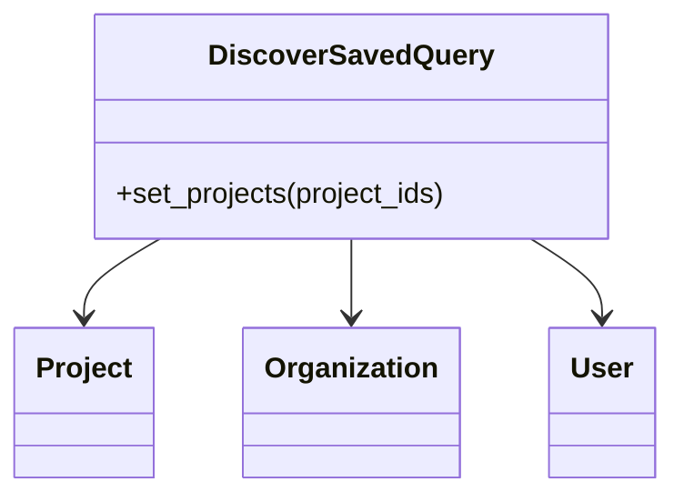

# Introduction to Discover Functionality

Discover functionality allows users to create, save, and manage custom queries for analyzing data. This feature is essential for flexible data analysis and visualization within the application.

# <SwmToken path="src/sentry/migrations/0522_migrate_discover_savedquery_worldmaps.py" pos="13:1:1" line-data="    DiscoverSavedQuery = apps.get_model(&quot;sentry&quot;, &quot;DiscoverSavedQuery&quot;)">`DiscoverSavedQuery`</SwmToken> Class

The <SwmToken path="src/sentry/migrations/0522_migrate_discover_savedquery_worldmaps.py" pos="13:1:1" line-data="    DiscoverSavedQuery = apps.get_model(&quot;sentry&quot;, &quot;DiscoverSavedQuery&quot;)">`DiscoverSavedQuery`</SwmToken> class represents a saved Discover query. It includes attributes such as the organization it belongs to, the user who created it, the query details, and metadata like creation and update timestamps. Additionally, it has methods for managing the projects associated with a saved query.

# Usage in Migrations

The <SwmToken path="src/sentry/migrations/0522_migrate_discover_savedquery_worldmaps.py" pos="13:1:1" line-data="    DiscoverSavedQuery = apps.get_model(&quot;sentry&quot;, &quot;DiscoverSavedQuery&quot;)">`DiscoverSavedQuery`</SwmToken> class is used in migrations to filter and manipulate saved queries. For example, it can filter queries containing specific display types like 'worldmap'.

<SwmSnippet path="/src/sentry/migrations/0522_migrate_discover_savedquery_worldmaps.py" line="12">

---

In migrations, the <SwmToken path="src/sentry/migrations/0522_migrate_discover_savedquery_worldmaps.py" pos="13:1:1" line-data="    DiscoverSavedQuery = apps.get_model(&quot;sentry&quot;, &quot;DiscoverSavedQuery&quot;)">`DiscoverSavedQuery`</SwmToken> class is used to filter saved queries that contain specific display types, such as 'worldmap'.

```python
) -> None:
    DiscoverSavedQuery = apps.get_model("sentry", "DiscoverSavedQuery")
    savedQueries = DiscoverSavedQuery.objects.filter(query__contains={"display": "worldmap"})
```

---

</SwmSnippet>

# Managing Projects

The <SwmToken path="src/sentry/discover/models.py" pos="121:3:3" line-data="    def set_projects(self, project_ids):">`set_projects`</SwmToken> method in the <SwmToken path="src/sentry/migrations/0522_migrate_discover_savedquery_worldmaps.py" pos="13:1:1" line-data="    DiscoverSavedQuery = apps.get_model(&quot;sentry&quot;, &quot;DiscoverSavedQuery&quot;)">`DiscoverSavedQuery`</SwmToken> class manages the projects associated with a saved query. This ensures that the query is linked to the correct projects within the organization.

<SwmSnippet path="/src/sentry/discover/models.py" line="121">

---

The <SwmToken path="src/sentry/discover/models.py" pos="121:3:3" line-data="    def set_projects(self, project_ids):">`set_projects`</SwmToken> method handles the association of projects with a saved query. It ensures that only the correct projects are linked to the query by adding new projects and removing those that are no longer relevant.

```python
    def set_projects(self, project_ids):
        with transaction.atomic(router.db_for_write(DiscoverSavedQueryProject)):
            DiscoverSavedQueryProject.objects.filter(discover_saved_query=self).exclude(
                project__in=project_ids
            ).delete()

            existing_project_ids = DiscoverSavedQueryProject.objects.filter(
                discover_saved_query=self
            ).values_list("project", flat=True)

            new_project_ids = sorted(set(project_ids) - set(existing_project_ids))

            DiscoverSavedQueryProject.objects.bulk_create(
                [
                    DiscoverSavedQueryProject(project_id=project_id, discover_saved_query=self)
                    for project_id in new_project_ids
                ]
            )
```

---

</SwmSnippet>



# Discover APIs

Discover APIs provide endpoints for managing saved queries and homepage queries within an organization. These APIs facilitate the retrieval, creation, updating, and deletion of queries.

## <SwmToken path="src/sentry/discover/endpoints/discover_saved_queries.py" pos="37:2:2" line-data="class DiscoverSavedQueriesEndpoint(OrganizationEndpoint):">`DiscoverSavedQueriesEndpoint`</SwmToken>

The <SwmToken path="src/sentry/discover/endpoints/discover_saved_queries.py" pos="37:2:2" line-data="class DiscoverSavedQueriesEndpoint(OrganizationEndpoint):">`DiscoverSavedQueriesEndpoint`</SwmToken> class handles the retrieval and creation of saved queries for a given organization. The <SwmToken path="src/sentry/discover/endpoints/discover_saved_queries.py" pos="39:2:2" line-data="        &quot;GET&quot;: ApiPublishStatus.PUBLIC,">`GET`</SwmToken> method retrieves a list of saved queries, while the <SwmToken path="src/sentry/discover/endpoints/discover_saved_queries.py" pos="40:2:2" line-data="        &quot;POST&quot;: ApiPublishStatus.PUBLIC,">`POST`</SwmToken> method allows for the creation of a new saved query.

<SwmSnippet path="/src/sentry/discover/endpoints/discover_saved_queries.py" line="37">

---

The <SwmToken path="src/sentry/discover/endpoints/discover_saved_queries.py" pos="37:2:2" line-data="class DiscoverSavedQueriesEndpoint(OrganizationEndpoint):">`DiscoverSavedQueriesEndpoint`</SwmToken> class defines methods for retrieving and creating saved queries. It includes permission checks and feature flags to ensure proper access control.

```python
class DiscoverSavedQueriesEndpoint(OrganizationEndpoint):
    publish_status = {
        "GET": ApiPublishStatus.PUBLIC,
        "POST": ApiPublishStatus.PUBLIC,
    }
    owner = ApiOwner.PERFORMANCE
    permission_classes = (DiscoverSavedQueryPermission,)

    def has_feature(self, organization, request):
        return features.has(
            "organizations:discover", organization, actor=request.user
        ) or features.has("organizations:discover-query", organization, actor=request.user)

    @extend_schema(
        operation_id="List an Organization's Discover Saved Queries",
        parameters=[
            GlobalParams.ORG_ID_OR_SLUG,
            VisibilityParams.PER_PAGE,
            CursorQueryParam,
            DiscoverSavedQueriesParams.QUERY,
            DiscoverSavedQueriesParams.SORT,
```

---

</SwmSnippet>

## <SwmToken path="src/sentry/discover/endpoints/discover_homepage_query.py" pos="26:2:2" line-data="class DiscoverHomepageQueryEndpoint(OrganizationEndpoint):">`DiscoverHomepageQueryEndpoint`</SwmToken>

The <SwmToken path="src/sentry/discover/endpoints/discover_homepage_query.py" pos="26:2:2" line-data="class DiscoverHomepageQueryEndpoint(OrganizationEndpoint):">`DiscoverHomepageQueryEndpoint`</SwmToken> class manages the homepage query for an organization. The <SwmToken path="src/sentry/discover/endpoints/discover_saved_queries.py" pos="39:2:2" line-data="        &quot;GET&quot;: ApiPublishStatus.PUBLIC,">`GET`</SwmToken> method retrieves the homepage query, the <SwmToken path="src/sentry/discover/endpoints/discover_homepage_query.py" pos="30:2:2" line-data="        &quot;PUT&quot;: ApiPublishStatus.PRIVATE,">`PUT`</SwmToken> method updates it, and the <SwmToken path="src/sentry/discover/models.py" pos="125:3:3" line-data="            ).delete()">`delete`</SwmToken> method removes it.

<SwmSnippet path="/src/sentry/discover/endpoints/discover_homepage_query.py" line="26">

---

The <SwmToken path="src/sentry/discover/endpoints/discover_homepage_query.py" pos="26:2:2" line-data="class DiscoverHomepageQueryEndpoint(OrganizationEndpoint):">`DiscoverHomepageQueryEndpoint`</SwmToken> class provides methods for managing the homepage query of an organization. It includes permission checks and feature flags to ensure proper access control.

```python
class DiscoverHomepageQueryEndpoint(OrganizationEndpoint):
    publish_status = {
        "DELETE": ApiPublishStatus.PRIVATE,
        "GET": ApiPublishStatus.PRIVATE,
        "PUT": ApiPublishStatus.PRIVATE,
    }
    owner = ApiOwner.PERFORMANCE

    permission_classes = (
        IsAuthenticated,
        DiscoverSavedQueryPermission,
    )

    def has_feature(self, organization, request):
        return features.has(
            "organizations:discover", organization, actor=request.user
        ) or features.has("organizations:discover-query", organization, actor=request.user)

    def get(self, request: Request, organization) -> Response:
        if not self.has_feature(organization, request):
            return self.respond(status=status.HTTP_404_NOT_FOUND)
```

---

</SwmSnippet>

&nbsp;

*This is an auto-generated document by Swimm AI 🌊 and has not yet been verified by a human*

<SwmMeta version="3.0.0" repo-id="Z2l0aHViJTNBJTNBc2VudHJ5LWRlbW8tMSUzQSUzQVN3aW1tLURlbW8=" repo-name="sentry-demo-1" doc-type="overview"><sup>Powered by [Swimm](/)</sup></SwmMeta>
