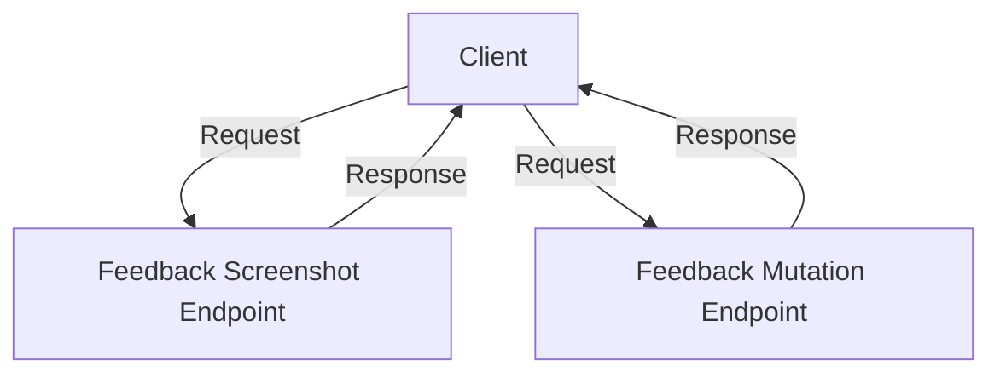

# Introduction

Feedback is a component that collects user input and responses related to their experience with the application. It is used to gather insights and issues reported by users, which can then be analyzed and addressed by the development team.

# Feedback API

The Feedback API allows for creating, fetching, updating, and deleting feedback items. It provides endpoints for browsing feedback, fetching specific feedback, and ingesting new feedback.

# Feedback Data

Feedback data includes detailed information about the feedback, such as tags and suspect commits, which help in understanding the context and specifics of the feedback provided by users.

# Feedback Actions

Feedback actions include marking feedback as read, resolving feedback, and handling spam. These actions help in managing and categorizing feedback efficiently.

<SwmSnippet path="/static/app/components/feedback/feedbackItem/useFeedbackActions.ts" line="28">

---

The <SwmToken path="static/app/components/feedback/feedbackItem/useFeedbackActions.ts" pos="28:6:6" line-data="export default function useFeedbackActions({feedbackItem}: Props) {">`useFeedbackActions`</SwmToken> function is used to handle various actions related to feedback items, such as marking feedback as read, resolving feedback, and marking feedback as spam. It utilizes hooks like <SwmToken path="static/app/components/feedback/feedbackItem/useFeedbackActions.ts" pos="39:7:7" line-data="  const onResolveClick = useCallback(() =&gt; {">`useCallback`</SwmToken> to manage these actions efficiently.

```typescript
export default function useFeedbackActions({feedbackItem}: Props) {
  const organization = useOrganization();

  const {markAsRead, resolve} = useMutateFeedback({
    feedbackIds: [feedbackItem.id],
    organization,
    projectIds: feedbackItem.project ? [feedbackItem.project.id] : [],
  });

  // reuse the issues ignored category for spam feedbacks
  const isResolved = feedbackItem.status === GroupStatus.RESOLVED;
  const onResolveClick = useCallback(() => {
    addLoadingMessage(t('Updating feedback...'));
    const newStatus = isResolved ? GroupStatus.UNRESOLVED : GroupStatus.RESOLVED;
    resolve(newStatus, mutationOptions);
  }, [isResolved, resolve]);

  const isSpam = feedbackItem.status === GroupStatus.IGNORED;
  const onSpamClick = useCallback(() => {
    addLoadingMessage(t('Updating feedback...'));
    const newStatus = isSpam ? GroupStatus.UNRESOLVED : GroupStatus.IGNORED;
```

---

</SwmSnippet>

# Feedback Integration

Feedback integration involves configuring the feedback component with options like color scheme, button labels, and placeholders. This ensures a consistent and user-friendly feedback collection process.

<SwmSnippet path="/static/app/components/feedback/widget/useFeedback.tsx" line="21">

---

The configuration options for the feedback component include color scheme, button labels, and placeholders, ensuring a consistent and user-friendly feedback collection process.

```tsx
  const config = useLegacyStore(ConfigStore);
  const {state} = useAsyncSDKIntegrationStore();

  const feedback = state.Feedback as FeedbackIntegration | undefined;

  const options = useMemo(() => {
    return {
      colorScheme: config.theme === 'dark' ? ('dark' as const) : ('light' as const),
      buttonLabel: t('Give Feedback'),
      submitButtonLabel: t('Send Feedback'),
      messagePlaceholder: messagePlaceholder ?? t('What did you expect?'),
      formTitle: formTitle ?? t('Give Feedback'),
      tags,
    };
  }, [config.theme, formTitle, messagePlaceholder, tags]);

  return {feedback, options};
```

---

</SwmSnippet>

# <SwmToken path="static/app/components/feedback/feedbackItem/feedbackReplay.tsx" pos="22:6:6" line-data="export default function FeedbackReplay({eventData, feedbackItem, organization}: Props) {">`FeedbackReplay`</SwmToken>

The <SwmToken path="static/app/components/feedback/feedbackItem/feedbackReplay.tsx" pos="22:6:6" line-data="export default function FeedbackReplay({eventData, feedbackItem, organization}: Props) {">`FeedbackReplay`</SwmToken> function is used to display a linked replay for a feedback item. It checks if a replay ID is available and if the platform supports replay. If both conditions are met, it renders the replay section.

<SwmSnippet path="/static/app/components/feedback/feedbackItem/feedbackReplay.tsx" line="22">

---

The <SwmToken path="static/app/components/feedback/feedbackItem/feedbackReplay.tsx" pos="22:6:6" line-data="export default function FeedbackReplay({eventData, feedbackItem, organization}: Props) {">`FeedbackReplay`</SwmToken> function checks for a replay ID and platform support before rendering the replay section.

```tsx
export default function FeedbackReplay({eventData, feedbackItem, organization}: Props) {
  const {feedbackHasReplay} = useReplayCountForFeedbacks();
  const hasReplayId = feedbackHasReplay(feedbackItem.id);

  // replay ID can be found in three places
  const replayId =
    eventData?.contexts?.feedback?.replay_id ??
    eventData?.contexts?.replay?.replay_id ??
    eventData?.tags?.find(({key}) => key === 'replayId')?.value;
  const {hasSentOneReplay, fetching: isFetchingSentOneReplay} =
    useHaveSelectedProjectsSentAnyReplayEvents();
  const platformSupported = replayPlatforms.includes(
    feedbackItem.project?.platform as PlatformKey
  );

  if (replayId && hasReplayId) {
    return (
      <Section icon={<IconPlay size="xs" />} title={t('Linked Replay')}>
        <ErrorBoundary mini>
          <ReplaySection
            eventTimestampMs={new Date(feedbackItem.firstSeen).getTime()}
```

---

</SwmSnippet>

# Feedback APIs

Feedback APIs provide endpoints for various feedback-related operations, such as downloading feedback screenshots and mutating feedback issues.

## Feedback Screenshot Endpoint

The endpoint `/api/0/projects/${organization.slug}/${projectSlug}/events/${screenshot.event_id}/attachments/${screenshot.id}/?download=1` is used to download a feedback screenshot attachment. This endpoint is constructed dynamically using the organization slug, project slug, event ID, and screenshot ID.

<SwmSnippet path="/static/app/components/feedback/feedbackItem/feedbackScreenshot.tsx" line="70">

---

The endpoint for downloading feedback screenshot attachments is dynamically constructed using the organization slug, project slug, event ID, and screenshot ID.

```tsx
          href={`/api/0/projects/${organization.slug}/${projectSlug}/events/${screenshot.event_id}/attachments/${screenshot.id}/?download=1`}
        >
          <TextOverflow>{screenshot.name}</TextOverflow>
        </FileDownload>
```

---

</SwmSnippet>

## Feedback Mutation Endpoint

The endpoint `/organizations/${organization.slug}/issues/${ids[0]}/` is used to mutate feedback issues. This endpoint is constructed dynamically using the organization slug and issue ID.

<SwmSnippet path="/static/app/components/feedback/useMutateFeedback.tsx" line="42">

---

The endpoint for mutating feedback issues is dynamically constructed using the organization slug and issue ID.

```tsx
      const url = isSingleId
        ? `/organizations/${organization.slug}/issues/${ids[0]}/`
        : `/organizations/${organization.slug}/issues/`;
```

---

</SwmSnippet>

&nbsp;

*This is an auto-generated document by Swimm AI 🌊 and has not yet been verified by a human*

<SwmMeta version="3.0.0" repo-id="Z2l0aHViJTNBJTNBc2VudHJ5LWRlbW8tMSUzQSUzQVN3aW1tLURlbW8=" repo-name="sentry-demo-1" doc-type="overview"><sup>Powered by [Swimm](/)</sup></SwmMeta>
