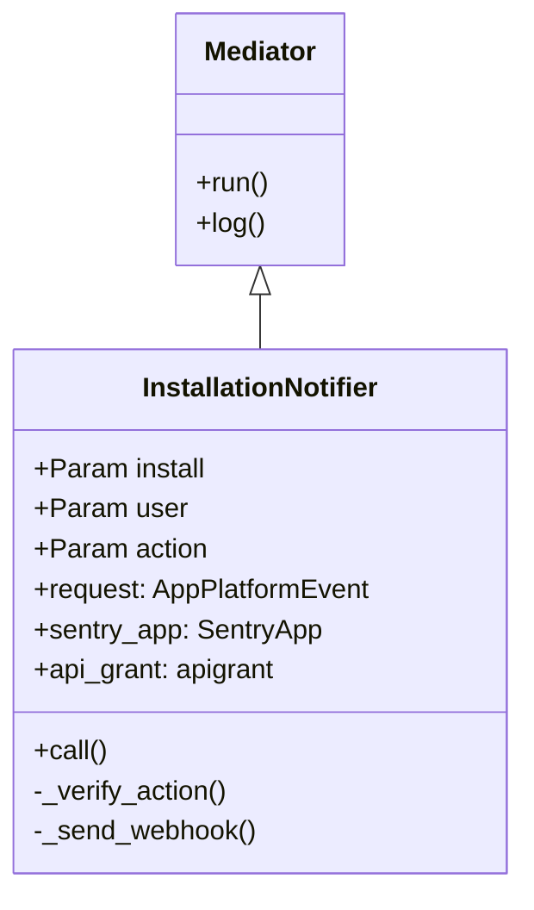

# Introduction to Mediators

Mediators are objects that encapsulate domain logic. They provide a layer between user-accessible components like endpoints and the database. Mediators encapsulate the logic necessary to create domain objects, including all dependent objects and <SwmToken path="src/sentry/mediators/mediator.py" pos="21:13:15" line-data="    objects, including all dependent objects, cross-object validations, etc.">`cross-object`</SwmToken> validations. They are intended to be composable and make it obvious where a piece of domain logic resides.

# Mediator Class

The <SwmToken path="src/sentry/mediators/mediator.py" pos="15:2:2" line-data="class Mediator:">`Mediator`</SwmToken> class encapsulates domain logic and provides a layer between user-accessible components and the database. It includes methods for invocation, parameter declaration, and logging.

<SwmSnippet path="/src/sentry/mediators/mediator.py" line="15">

---

The <SwmToken path="src/sentry/mediators/mediator.py" pos="15:2:2" line-data="class Mediator:">`Mediator`</SwmToken> class defines the structure and behavior of mediators, including the <SwmToken path="src/sentry/mediators/mediator.py" pos="27:10:10" line-data="        Invoke Mediators through their ``run`` class method. This essentially">`run`</SwmToken> method for invocation and the <SwmToken path="src/sentry/mediators/mediator.py" pos="34:20:20" line-data="        Mediators should define two things - a set of ``Param``s and a ``call``">`Param`</SwmToken> class for parameter validation.

```python
class Mediator:
    """
    Objects that encapsulate domain logic.

    Mediators provide a layer between User accessible components like Endpoints
    and the database. They encapsulate the logic necessary to create domain
    objects, including all dependent objects, cross-object validations, etc.

    Mediators are intended to be composable and make it obvious where a piece
    of domain logic resides.

    Invocation:
        Invoke Mediators through their ``run`` class method. This essentially
        just wraps ``__init__(**kwargs).call()`` with some useful stuff,
        namely a DB transaction.

        >>> Mediator.run(**kwargs)

    Declaration:
        Mediators should define two things - a set of ``Param``s and a ``call``
        function.
```

---

</SwmSnippet>

# Example Usage

This example demonstrates how to define a Mediator with parameters and a <SwmToken path="src/sentry/mediators/mediator.py" pos="28:12:12" line-data="        just wraps ``__init__(**kwargs).call()`` with some useful stuff,">`call`</SwmToken> function. The <SwmToken path="src/sentry/mediators/mediator.py" pos="34:20:20" line-data="        Mediators should define two things - a set of ``Param``s and a ``call``">`Param`</SwmToken> class is used to validate arguments and set defaults.

<SwmSnippet path="/src/sentry/mediators/param.py" line="14">

---

The <SwmToken path="src/sentry/mediators/param.py" pos="19:7:7" line-data="        &gt;&gt;&gt;     name = Param(str, default=&#39;example&#39;)">`Param`</SwmToken> class offers a way to validate the arguments passed to a Mediator and set defaults. This example shows how to use the <SwmToken path="src/sentry/mediators/param.py" pos="19:7:7" line-data="        &gt;&gt;&gt;     name = Param(str, default=&#39;example&#39;)">`Param`</SwmToken> class to define parameters for a Mediator.

```python
    Params offer a way to validate the arguments passed to a Mediator as well
    as set defaults.

    Example Usage:
        >>> class Creator(Mediator):
        >>>     name = Param(str, default='example')
        >>>
        >>> c = Creator(name='foo')
        >>> c.name
        'foo'

        >>> c = Creator()
        >>> c.name
        'example'

        >>> c = Creator(name=False)
        Traceback (most recent call last):
            ...
        TypeError: `name` must be a <type 'str'>

    Type Validation:
```

---

</SwmSnippet>

# Main Functions

There are several main functions in the Mediator class. Some of them are <SwmToken path="src/sentry/mediators/mediator.py" pos="27:10:10" line-data="        Invoke Mediators through their ``run`` class method. This essentially">`run`</SwmToken>, <SwmToken path="src/sentry/mediators/mediator.py" pos="28:12:12" line-data="        just wraps ``__init__(**kwargs).call()`` with some useful stuff,">`call`</SwmToken>, <SwmToken path="src/sentry/mediators/mediator.py" pos="133:3:3" line-data="    def _prepare_params(cls):">`_prepare_params`</SwmToken>, and <SwmToken path="src/sentry/mediators/mediator.py" pos="189:3:3" line-data="    def _validate_params(self, **kwargs):">`_validate_params`</SwmToken>. We will dive a little into <SwmToken path="src/sentry/mediators/mediator.py" pos="27:10:10" line-data="        Invoke Mediators through their ``run`` class method. This essentially">`run`</SwmToken> and <SwmToken path="src/sentry/mediators/mediator.py" pos="28:12:12" line-data="        just wraps ``__init__(**kwargs).call()`` with some useful stuff,">`call`</SwmToken>.

## run

The <SwmToken path="src/sentry/mediators/mediator.py" pos="27:10:10" line-data="        Invoke Mediators through their ``run`` class method. This essentially">`run`</SwmToken> function is the entry point for invoking a Mediator. It wraps the initialization and execution of the Mediator in a database transaction. This ensures that all operations performed by the Mediator are atomic and can be rolled back if any part of the process fails.

<SwmSnippet path="/src/sentry/mediators/mediator.py" line="141">

---

The <SwmToken path="src/sentry/mediators/mediator.py" pos="141:3:3" line-data="    def run(cls, *args, **kwargs):">`run`</SwmToken> method wraps the initialization and execution of the Mediator in a database transaction, ensuring atomic operations.

```python
    def run(cls, *args, **kwargs):
        def _inner():
            obj = cls(*args, **kwargs)

            with obj.log():
                result = obj.call()
                obj.audit()
                obj.record_analytics()
            obj.post_commit()
            return result

        if cls.using:
            with transaction.atomic(cls.using):
                return _inner()
        else:
            return _inner()
```

---

</SwmSnippet>

## call

The <SwmToken path="src/sentry/mediators/mediator.py" pos="28:12:12" line-data="        just wraps ``__init__(**kwargs).call()`` with some useful stuff,">`call`</SwmToken> function is an abstract method that must be implemented by any subclass of Mediator. It contains the core logic that the Mediator is responsible for executing. This function is called within the <SwmToken path="src/sentry/mediators/mediator.py" pos="27:10:10" line-data="        Invoke Mediators through their ``run`` class method. This essentially">`run`</SwmToken> method after the Mediator has been initialized and parameters have been validated.

<SwmSnippet path="/src/sentry/mediators/mediator.py" line="176">

---

The <SwmToken path="src/sentry/mediators/mediator.py" pos="176:3:3" line-data="    def call(self):">`call`</SwmToken> method is an abstract method that must be implemented by subclasses to define the core logic of the Mediator.

```python
    def call(self):
        raise NotImplementedError
```

---

</SwmSnippet>

## <SwmToken path="src/sentry/mediators/mediator.py" pos="133:3:3" line-data="    def _prepare_params(cls):">`_prepare_params`</SwmToken>

The <SwmToken path="src/sentry/mediators/mediator.py" pos="133:3:3" line-data="    def _prepare_params(cls):">`_prepare_params`</SwmToken> function processes the parameter declarations for the Mediator. It sets up each parameter by calling the <SwmToken path="src/sentry/mediators/mediator.py" pos="137:3:3" line-data="                param.setup(cls, name)">`setup`</SwmToken> method on the <SwmToken path="src/sentry/mediators/mediator.py" pos="34:20:20" line-data="        Mediators should define two things - a set of ``Param``s and a ``call``">`Param`</SwmToken> instances. This function ensures that all parameters are correctly initialized before the Mediator is executed.

<SwmSnippet path="/src/sentry/mediators/mediator.py" line="133">

---

The <SwmToken path="src/sentry/mediators/mediator.py" pos="133:3:3" line-data="    def _prepare_params(cls):">`_prepare_params`</SwmToken> method processes and sets up each parameter for the Mediator by calling the <SwmToken path="src/sentry/mediators/mediator.py" pos="137:3:3" line-data="                param.setup(cls, name)">`setup`</SwmToken> method on the <SwmToken path="src/sentry/mediators/mediator.py" pos="135:37:37" line-data="            params = [(k, v) for k, v in cls.__dict__.items() if isinstance(v, Param)]">`Param`</SwmToken> instances.

```python
    def _prepare_params(cls):
        if sentry.mediators.mediator.Mediator in cls.__bases__ and not cls._params_prepared:
            params = [(k, v) for k, v in cls.__dict__.items() if isinstance(v, Param)]
            for name, param in params:
                param.setup(cls, name)
            cls._params_prepared = True
```

---

</SwmSnippet>

## <SwmToken path="src/sentry/mediators/mediator.py" pos="189:3:3" line-data="    def _validate_params(self, **kwargs):">`_validate_params`</SwmToken>

The <SwmToken path="src/sentry/mediators/mediator.py" pos="189:3:3" line-data="    def _validate_params(self, **kwargs):">`_validate_params`</SwmToken> function validates the parameters passed to the Mediator. It checks that all required parameters are present and of the correct type. This function is called during the initialization of the Mediator to ensure that all inputs are valid before execution.

<SwmSnippet path="/src/sentry/mediators/mediator.py" line="189">

---

The <SwmToken path="src/sentry/mediators/mediator.py" pos="189:3:3" line-data="    def _validate_params(self, **kwargs):">`_validate_params`</SwmToken> method checks that all required parameters are present and of the correct type, ensuring valid inputs before execution.

```python
    def _validate_params(self, **kwargs):
        for name, param in self._params.items():
            if param.is_required:
                param.validate(self, name, self.__getattr__(name))
```

---

</SwmSnippet>

# Endpoints of Mediators

Endpoints of Mediators are specific implementations that handle particular domain processes. One such example is the <SwmToken path="src/sentry/mediators/sentry_app_installations/installation_notifier.py" pos="15:2:2" line-data="class InstallationNotifier(Mediator):">`InstallationNotifier`</SwmToken>.

## <SwmToken path="src/sentry/mediators/sentry_app_installations/installation_notifier.py" pos="15:2:2" line-data="class InstallationNotifier(Mediator):">`InstallationNotifier`</SwmToken>

The <SwmToken path="src/sentry/mediators/sentry_app_installations/installation_notifier.py" pos="15:2:2" line-data="class InstallationNotifier(Mediator):">`InstallationNotifier`</SwmToken> mediator handles the logic for notifying about the installation of a Sentry app. It verifies the action (either 'created' or 'deleted') and sends a webhook request with the installation details. The <SwmToken path="src/sentry/mediators/mediator.py" pos="28:12:12" line-data="        just wraps ``__init__(**kwargs).call()`` with some useful stuff,">`call`</SwmToken> method is the entry point, which invokes <SwmToken path="src/sentry/mediators/sentry_app_installations/installation_notifier.py" pos="22:3:3" line-data="        self._verify_action()">`_verify_action`</SwmToken> and <SwmToken path="src/sentry/mediators/sentry_app_installations/installation_notifier.py" pos="23:3:3" line-data="        self._send_webhook()">`_send_webhook`</SwmToken>. The <SwmToken path="src/sentry/mediators/sentry_app_installations/installation_notifier.py" pos="30:10:10" line-data="        send_and_save_webhook_request(self.sentry_app, self.request)">`request`</SwmToken> property constructs the payload for the webhook, including serialized installation data and the user who performed the action.

<SwmSnippet path="/src/sentry/mediators/sentry_app_installations/installation_notifier.py" line="15">

---

The <SwmToken path="src/sentry/mediators/sentry_app_installations/installation_notifier.py" pos="15:2:2" line-data="class InstallationNotifier(Mediator):">`InstallationNotifier`</SwmToken> mediator handles the logic for notifying about the installation of a Sentry app, including verifying the action and sending a webhook request.

```python
class InstallationNotifier(Mediator):
    install = Param(SentryAppInstallation)
    user = Param(RpcUser)
    action = Param(str)
    using = router.db_for_write(SentryAppInstallation)

    def call(self) -> None:
        self._verify_action()
        self._send_webhook()

    def _verify_action(self) -> None:
        if self.action not in ["created", "deleted"]:
            raise APIUnauthorized(f"Invalid action '{self.action}'")

    def _send_webhook(self) -> None:
        send_and_save_webhook_request(self.sentry_app, self.request)

    @property
    def request(self) -> AppPlatformEvent:
        data = serialize(
            [self.install], user=self.user, serializer=SentryAppInstallationSerializer()
```

---

</SwmSnippet>

&nbsp;

*This is an auto-generated document by Swimm AI 🌊 and has not yet been verified by a human*

<SwmMeta version="3.0.0" repo-id="Z2l0aHViJTNBJTNBc2VudHJ5LWRlbW8tMSUzQSUzQVN3aW1tLURlbW8=" repo-name="sentry-demo-1" doc-type="overview"><sup>Powered by [Swimm](/)</sup></SwmMeta>
