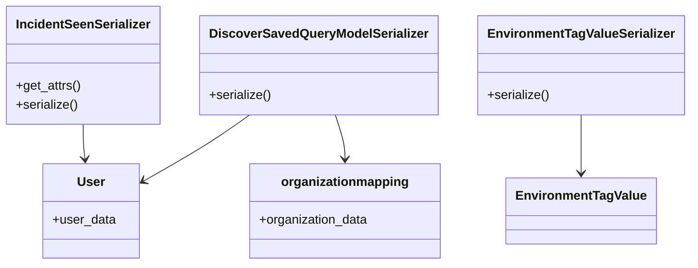

# Introduction to Models in Serializers

Models in serializers are used to define how data from the database should be transformed and presented in the API responses. They ensure that the data is serialized in a consistent and structured format, making it easier for the frontend to consume.

# Example of Model Usage

For example, the `DiscoverSavedQueryModelSerializer` class is responsible for serializing the `DiscoverSavedQuery` model, transforming its attributes into a JSON-compatible format. This includes converting complex data types, such as query parameters and timestamps, into a format that can be easily used by the client.

<SwmSnippet path="/src/sentry/api/serializers/models/team.py" line="28">

---

The <SwmToken path="src/sentry/api/serializers/models/team.py" pos="30:8:8" line-data="from sentry.users.models.user import User">`user`</SwmToken> model from <SwmToken path="src/sentry/api/serializers/models/team.py" pos="30:2:8" line-data="from sentry.users.models.user import User">`sentry.users.models.user`</SwmToken> is imported and used to handle user-related data in the team serializer.

```python
from sentry.roles import organization_roles, team_roles
from sentry.scim.endpoints.constants import SCIM_SCHEMA_GROUP
from sentry.users.models.user import User
from sentry.utils.query import RangeQuerySetWrapper
```

---

</SwmSnippet>

# Handling Related Data

Additionally, models in serializers often include methods to handle related data, such as user information or project details, ensuring that all necessary information is included in the serialized output.

<SwmSnippet path="/src/sentry/api/serializers/models/user.py" line="20">

---

The <SwmToken path="src/sentry/api/serializers/models/user.py" pos="22:6:6" line-data="from sentry.models.organizationmapping import OrganizationMapping">`organizationmapping`</SwmToken> model from <SwmToken path="src/sentry/api/serializers/models/user.py" pos="22:2:6" line-data="from sentry.models.organizationmapping import OrganizationMapping">`sentry.models.organizationmapping`</SwmToken> is used to include organization-related information in the user serializer.

```python
from sentry.models.authidentity import AuthIdentity
from sentry.models.organization import OrganizationStatus
from sentry.models.organizationmapping import OrganizationMapping
from sentry.models.organizationmembermapping import OrganizationMemberMapping
from sentry.organizations.services.organization import RpcOrganizationSummary
```

---

</SwmSnippet>

# Model Endpoints

Endpoints of Models

## <SwmToken path="src/sentry/api/serializers/models/incidentseen.py" pos="8:2:2" line-data="class IncidentSeenSerializer(Serializer):">`IncidentSeenSerializer`</SwmToken>

The <SwmToken path="src/sentry/api/serializers/models/incidentseen.py" pos="8:2:2" line-data="class IncidentSeenSerializer(Serializer):">`IncidentSeenSerializer`</SwmToken> is responsible for serializing the <SwmToken path="src/sentry/api/serializers/models/incidentseen.py" pos="7:3:3" line-data="@register(IncidentSeen)">`IncidentSeen`</SwmToken> model. It includes methods to get attributes and serialize the object. The <SwmToken path="src/sentry/api/serializers/models/incidentseen.py" pos="9:3:3" line-data="    def get_attrs(self, item_list, user, **kwargs):">`get_attrs`</SwmToken> method fetches user data related to the incidents, and the <SwmToken path="src/sentry/api/serializers/models/incidentseen.py" pos="23:3:3" line-data="    def serialize(self, obj, attrs, user, **kwargs):">`serialize`</SwmToken> method formats the incident data, including the last seen timestamp.

<SwmSnippet path="/src/sentry/api/serializers/models/incidentseen.py" line="7">

---

The <SwmToken path="src/sentry/api/serializers/models/incidentseen.py" pos="8:2:2" line-data="class IncidentSeenSerializer(Serializer):">`IncidentSeenSerializer`</SwmToken> class includes methods to fetch user data related to incidents and format the incident data, including the last seen timestamp.

```python
@register(IncidentSeen)
class IncidentSeenSerializer(Serializer):
    def get_attrs(self, item_list, user, **kwargs):
        item_users = user_service.serialize_many(
            filter={
                "user_ids": [i.user_id for i in item_list],
            },
            as_user=serialize_generic_user(user),
        )
        user_map = {d["id"]: d for d in item_users}

        result = {}
        for item in item_list:
            result[item] = {"user": user_map[str(item.user_id)]}
        return result

    def serialize(self, obj, attrs, user, **kwargs):
        data = attrs["user"]
        data["lastSeen"] = obj.last_seen
        return data
```

---

</SwmSnippet>

## <SwmToken path="src/sentry/api/serializers/models/tagvalue.py" pos="6:2:2" line-data="class EnvironmentTagValueSerializer(Serializer):">`EnvironmentTagValueSerializer`</SwmToken>

The <SwmToken path="src/sentry/api/serializers/models/tagvalue.py" pos="6:2:2" line-data="class EnvironmentTagValueSerializer(Serializer):">`EnvironmentTagValueSerializer`</SwmToken> is used to serialize the `EnvironmentTagValue` model. It converts the object into a dictionary with <SwmToken path="src/sentry/api/serializers/models/incidentseen.py" pos="16:9:9" line-data="        user_map = {d[&quot;id&quot;]: d for d in item_users}">`id`</SwmToken> and <SwmToken path="src/sentry/api/serializers/models/tagvalue.py" pos="8:18:18" line-data="        return {&quot;id&quot;: str(obj.id), &quot;name&quot;: obj.value}">`name`</SwmToken> fields.

<SwmSnippet path="/src/sentry/api/serializers/models/tagvalue.py" line="6">

---

The <SwmToken path="src/sentry/api/serializers/models/tagvalue.py" pos="6:2:2" line-data="class EnvironmentTagValueSerializer(Serializer):">`EnvironmentTagValueSerializer`</SwmToken> class converts the `EnvironmentTagValue` object into a dictionary with <SwmToken path="src/sentry/api/serializers/models/tagvalue.py" pos="8:5:5" line-data="        return {&quot;id&quot;: str(obj.id), &quot;name&quot;: obj.value}">`id`</SwmToken> and <SwmToken path="src/sentry/api/serializers/models/tagvalue.py" pos="8:18:18" line-data="        return {&quot;id&quot;: str(obj.id), &quot;name&quot;: obj.value}">`name`</SwmToken> fields.

```python
class EnvironmentTagValueSerializer(Serializer):
    def serialize(self, obj, attrs, user, **kwargs):
        return {"id": str(obj.id), "name": obj.value}
```

---

</SwmSnippet>

&nbsp;

*This is an auto-generated document by Swimm AI 🌊 and has not yet been verified by a human*

<SwmMeta version="3.0.0" repo-id="Z2l0aHViJTNBJTNBc2VudHJ5LWRlbW8tMSUzQSUzQVN3aW1tLURlbW8=" repo-name="sentry-demo-1" doc-type="overview"><sup>Powered by [Swimm](/)</sup></SwmMeta>
