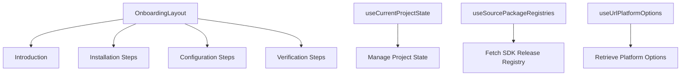

# Introduction to Onboarding in Components

Onboarding in the Components directory refers to the process of guiding new users through the initial setup and configuration of their projects. This document will cover the main components and hooks involved in the onboarding process, including <SwmToken path="static/app/components/onboarding/gettingStartedDoc/onboardingLayout.tsx" pos="47:4:4" line-data="export function OnboardingLayout({">`OnboardingLayout`</SwmToken>, <SwmToken path="static/app/components/onboarding/gettingStartedDoc/utils/useCurrentProjectState.tsx" pos="18:2:2" line-data="function useCurrentProjectState({">`useCurrentProjectState`</SwmToken>, <SwmToken path="static/app/components/onboarding/gettingStartedDoc/onboardingLayout.tsx" pos="59:1:1" line-data="    useSourcePackageRegistries(organization);">`useSourcePackageRegistries`</SwmToken>, and <SwmToken path="static/app/components/onboarding/gettingStartedDoc/onboardingLayout.tsx" pos="60:7:7" line-data="  const selectedOptions = useUrlPlatformOptions(docsConfig.platformOptions);">`useUrlPlatformOptions`</SwmToken>.

## Onboarding Layout

The <SwmToken path="static/app/components/onboarding/gettingStartedDoc/onboardingLayout.tsx" pos="47:4:4" line-data="export function OnboardingLayout({">`OnboardingLayout`</SwmToken> component provides a structured layout for the onboarding process, including introduction, installation, configuration, and verification steps. It uses various hooks like <SwmToken path="static/app/components/onboarding/gettingStartedDoc/onboardingLayout.tsx" pos="57:7:7" line-data="  const organization = useOrganization();">`useOrganization`</SwmToken>, <SwmToken path="static/app/components/onboarding/gettingStartedDoc/onboardingLayout.tsx" pos="59:1:1" line-data="    useSourcePackageRegistries(organization);">`useSourcePackageRegistries`</SwmToken>, and <SwmToken path="static/app/components/onboarding/gettingStartedDoc/onboardingLayout.tsx" pos="60:7:7" line-data="  const selectedOptions = useUrlPlatformOptions(docsConfig.platformOptions);">`useUrlPlatformOptions`</SwmToken> to fetch necessary data and manage state.

<SwmSnippet path="/static/app/components/onboarding/gettingStartedDoc/onboardingLayout.tsx" line="47">

---

The <SwmToken path="static/app/components/onboarding/gettingStartedDoc/onboardingLayout.tsx" pos="47:4:4" line-data="export function OnboardingLayout({">`OnboardingLayout`</SwmToken> function is central to the onboarding process, providing a structured layout that includes an introduction, installation steps, configuration steps, and verification steps.

```tsx
export function OnboardingLayout({
  docsConfig,
  dsn,
  platformKey,
  projectId,
  projectSlug,
  activeProductSelection = EMPTY_ARRAY,
  newOrg,
  configType = 'onboarding',
}: OnboardingLayoutProps) {
  const organization = useOrganization();
  const {isPending: isLoadingRegistry, data: registryData} =
    useSourcePackageRegistries(organization);
  const selectedOptions = useUrlPlatformOptions(docsConfig.platformOptions);
  const {platformOptions} = docsConfig;

  const {introduction, steps, nextSteps} = useMemo(() => {
    const doc = docsConfig[configType] ?? docsConfig.onboarding;

    const docParams: DocsParams<any> = {
      dsn,
```

---

</SwmSnippet>

## Managing Project State

The <SwmToken path="static/app/components/onboarding/gettingStartedDoc/utils/useCurrentProjectState.tsx" pos="18:2:2" line-data="function useCurrentProjectState({">`useCurrentProjectState`</SwmToken> hook manages the state of the current project during onboarding. It ensures that the correct project is selected and that its onboarding instructions are followed. It uses hooks like <SwmToken path="static/app/components/onboarding/gettingStartedDoc/utils/useCurrentProjectState.tsx" pos="24:15:15" line-data="  const {projects, initiallyLoaded: projectsLoaded} = useProjects();">`useProjects`</SwmToken>, <SwmToken path="static/app/components/onboarding/gettingStartedDoc/utils/useCurrentProjectState.tsx" pos="25:12:12" line-data="  const {selection, isReady} = useLegacyStore(PageFiltersStore);">`useLegacyStore`</SwmToken>, and <SwmToken path="static/app/components/onboarding/gettingStartedDoc/utils/useCurrentProjectState.tsx" pos="27:12:12" line-data="  const {getParamValue: projectIds} = useUrlParams(&#39;project&#39;);">`useUrlParams`</SwmToken> to fetch and manage project data.

<SwmSnippet path="/static/app/components/onboarding/gettingStartedDoc/utils/useCurrentProjectState.tsx" line="18">

---

The <SwmToken path="static/app/components/onboarding/gettingStartedDoc/utils/useCurrentProjectState.tsx" pos="18:2:2" line-data="function useCurrentProjectState({">`useCurrentProjectState`</SwmToken> hook manages the state of the current project during onboarding, ensuring the correct project is selected and its onboarding instructions are followed.

```tsx
function useCurrentProjectState({
  currentPanel,
  targetPanel,
  onboardingPlatforms,
  allPlatforms,
}: Props) {
  const {projects, initiallyLoaded: projectsLoaded} = useProjects();
  const {selection, isReady} = useLegacyStore(PageFiltersStore);
  const [currentProject, setCurrentProject] = useState<Project | undefined>(undefined);
  const {getParamValue: projectIds} = useUrlParams('project');
  const projectId = projectIds()?.split('&').at(0);
  const isActive = currentPanel === targetPanel;

  // Projects with onboarding instructions
  const projectsWithOnboarding = projects.filter(
    p => p.platform && onboardingPlatforms.includes(p.platform)
  );

  const [supportedProjects, unsupportedProjects] = useMemo(() => {
    return partition(projects, p => p.platform && allPlatforms.includes(p.platform));
  }, [projects, allPlatforms]);
```

---

</SwmSnippet>

## Styled Components

Styled components such as <SwmToken path="static/app/components/onboarding/gettingStartedDoc/onboardingLayout.tsx" pos="154:2:2" line-data="const Header = styled(&#39;div&#39;)`">`Header`</SwmToken>, <SwmToken path="static/app/components/onboarding/gettingStartedDoc/onboardingLayout.tsx" pos="160:2:2" line-data="const Divider = styled(&#39;hr&#39;)&lt;{withBottomMargin?: boolean}&gt;`">`Divider`</SwmToken>, and <SwmToken path="static/app/components/onboarding/gettingStartedDoc/onboardingLayout.tsx" pos="63:7:7" line-data="  const {introduction, steps, nextSteps} = useMemo(() =&gt; {">`steps`</SwmToken> are used to organize the layout and presentation of the onboarding steps. These components ensure a consistent and visually appealing layout.

<SwmSnippet path="/static/app/components/onboarding/gettingStartedDoc/onboardingLayout.tsx" line="154">

---

Styled components like <SwmToken path="static/app/components/onboarding/gettingStartedDoc/onboardingLayout.tsx" pos="154:2:2" line-data="const Header = styled(&#39;div&#39;)`">`Header`</SwmToken>, <SwmToken path="static/app/components/onboarding/gettingStartedDoc/onboardingLayout.tsx" pos="160:2:2" line-data="const Divider = styled(&#39;hr&#39;)&lt;{withBottomMargin?: boolean}&gt;`">`Divider`</SwmToken>, and <SwmToken path="static/app/components/onboarding/gettingStartedDoc/onboardingLayout.tsx" pos="168:2:2" line-data="const Steps = styled(&#39;div&#39;)`">`Steps`</SwmToken> are used to organize the layout and presentation of the onboarding steps.

```tsx
const Header = styled('div')`
  display: flex;
  flex-direction: column;
  gap: ${space(2)};
`;

const Divider = styled('hr')<{withBottomMargin?: boolean}>`
  height: 1px;
  width: 100%;
  background: ${p => p.theme.border};
  border: none;
  ${p => p.withBottomMargin && `margin-bottom: ${space(3)}`}
`;

const Steps = styled('div')`
  display: flex;
  flex-direction: column;
  gap: 1.5rem;
`;

const Wrapper = styled('div')`
```

---

</SwmSnippet>

## Fetching SDK Release Registry

The <SwmToken path="static/app/components/onboarding/gettingStartedDoc/onboardingLayout.tsx" pos="59:1:1" line-data="    useSourcePackageRegistries(organization);">`useSourcePackageRegistries`</SwmToken> hook fetches the release registry list for <SwmToken path="static/app/components/onboarding/gettingStartedDoc/useSourcePackageRegistries.tsx" pos="21:15:15" line-data=" * Fetches the release registry list for SDKs">`SDKs`</SwmToken>, which is necessary for the installation steps during onboarding. This ensures that the latest <SwmToken path="static/app/components/onboarding/gettingStartedDoc/useSourcePackageRegistries.tsx" pos="21:15:15" line-data=" * Fetches the release registry list for SDKs">`SDKs`</SwmToken> are available for the user.

<SwmSnippet path="/static/app/components/onboarding/gettingStartedDoc/useSourcePackageRegistries.tsx" line="20">

---

The <SwmToken path="static/app/components/onboarding/gettingStartedDoc/useSourcePackageRegistries.tsx" pos="23:4:4" line-data="export function useSourcePackageRegistries(organization: Organization) {">`useSourcePackageRegistries`</SwmToken> hook fetches the release registry list for <SwmToken path="static/app/components/onboarding/gettingStartedDoc/useSourcePackageRegistries.tsx" pos="21:15:15" line-data=" * Fetches the release registry list for SDKs">`SDKs`</SwmToken>, which is necessary for the installation steps during onboarding.

```tsx
/**
 * Fetches the release registry list for SDKs
 */
export function useSourcePackageRegistries(organization: Organization) {
  const releaseRegistrySdk = useApiQuery<ReleaseRegistrySdk>(
    [`/organizations/${organization.slug}/sdks/`],
    {
      staleTime: Infinity,
    }
  );

  useEffect(() => {
    if (releaseRegistrySdk.error) {
      handleXhrErrorResponse(
        'Failed to fetch sentry release registry',
        releaseRegistrySdk.error
      );
    }
  }, [releaseRegistrySdk.error]);

  return releaseRegistrySdk;
```

---

</SwmSnippet>

## Retrieving Platform Options

The <SwmToken path="static/app/components/onboarding/gettingStartedDoc/onboardingLayout.tsx" pos="60:7:7" line-data="  const selectedOptions = useUrlPlatformOptions(docsConfig.platformOptions);">`useUrlPlatformOptions`</SwmToken> hook retrieves the currently selected platform options from the URL, ensuring that the onboarding steps are tailored to the specific platform being used. This customization enhances the user experience by providing relevant instructions.

<SwmSnippet path="/static/app/components/onboarding/platformOptionsControl.tsx" line="13">

---

The <SwmToken path="static/app/components/onboarding/platformOptionsControl.tsx" pos="17:4:4" line-data="export function useUrlPlatformOptions&lt;PlatformOptions extends BasePlatformOptions&gt;(">`useUrlPlatformOptions`</SwmToken> hook retrieves the currently selected platform options from the URL, ensuring that the onboarding steps are tailored to the specific platform being used.

```tsx
/**
 * Hook that returns the currently selected platform option values from the URL
 * it will fallback to the defaultValue or the first option value if the value in the URL is not valid or not present
 */
export function useUrlPlatformOptions<PlatformOptions extends BasePlatformOptions>(
  platformOptions?: PlatformOptions
): SelectedPlatformOptions<PlatformOptions> {
  const router = useRouter();
  const {query} = router.location;

  return useMemo(() => {
    if (!platformOptions) {
      return {} as SelectedPlatformOptions<PlatformOptions>;
    }

    return Object.keys(platformOptions).reduce((acc, key) => {
      const defaultValue = platformOptions[key].defaultValue;
      const values = platformOptions[key].items.map(({value}) => value);
      acc[key as keyof PlatformOptions] = values.includes(query[key])
        ? query[key]
        : defaultValue ?? values[0];
```

---

</SwmSnippet>

&nbsp;

*This is an auto-generated document by Swimm AI 🌊 and has not yet been verified by a human*

<SwmMeta version="3.0.0" repo-id="Z2l0aHViJTNBJTNBc2VudHJ5LWRlbW8tMSUzQSUzQVN3aW1tLURlbW8=" repo-name="sentry-demo-1" doc-type="overview"><sup>Powered by [Swimm](/)</sup></SwmMeta>
