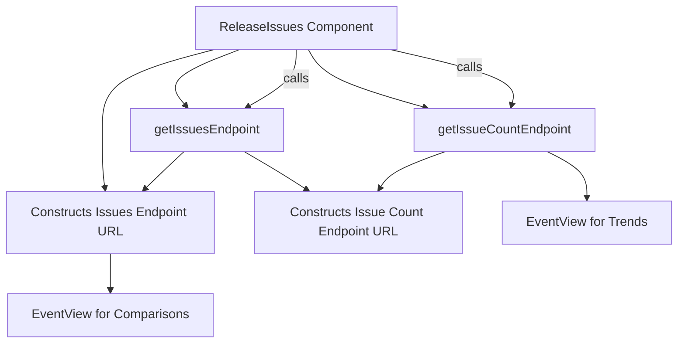

# Overview of Release Details

The Overview section provides a detailed summary of the release details in the application. It includes various components such as the release performance, trends, and comparisons. The section also contains detailed information about the project release, including version details, creation date, and associated events. Additionally, it provides insights into the performance metrics and trends of the release over time.

<SwmSnippet path="/static/app/views/releases/detail/overview/index.tsx" line="193">

---

# Release Performance

The <SwmToken path="static/app/views/releases/detail/overview/index.tsx" pos="193:1:1" line-data="  getReleasePerformanceEventView(">`getReleasePerformanceEventView`</SwmToken> function generates an <SwmToken path="static/app/views/releases/detail/overview/index.tsx" pos="196:4:4" line-data="  ): EventView {">`EventView`</SwmToken> for the release performance, which is used to display performance metrics.

```tsx
  getReleasePerformanceEventView(
    performanceType: string,
    baseQuery: NewQuery
  ): EventView {
    const eventView =
      performanceType === ProjectPerformanceType.FRONTEND
        ? (EventView.fromSavedQuery({
            ...baseQuery,
            fields: [
              ...baseQuery.fields,
              `p75(${WebVital.FCP})`,
              `p75(${WebVital.FID})`,
              `p75(${WebVital.LCP})`,
              `p75(${WebVital.CLS})`,
              `p75(${SpanOpBreakdown.SPANS_HTTP})`,
              `p75(${SpanOpBreakdown.SPANS_BROWSER})`,
              `p75(${SpanOpBreakdown.SPANS_RESOURCE})`,
            ],
          }) as EventView)
        : performanceType === ProjectPerformanceType.BACKEND
          ? (EventView.fromSavedQuery({
```

---

</SwmSnippet>

<SwmSnippet path="/static/app/views/releases/detail/overview/index.tsx" line="391">

---

# Titles and Sorting

The <SwmToken path="static/app/views/releases/detail/overview/index.tsx" pos="394:3:3" line-data="          const titles =">`titles`</SwmToken> constant defines the column titles for the transactions list, which can change based on the selected sort option.

```tsx
            selectedSort,
            releaseBounds
          );
          const titles =
            selectedSort.value !== TransactionsListOption.SLOW_LCP
              ? [t('transaction'), t('failure_count()'), t('tpm()'), t('p50()')]
              : [t('transaction'), t('failure_count()'), t('tpm()'), t('p75(lcp)')];
```

---

</SwmSnippet>

# Main Functions

There are several main functions in this folder. Some of them are <SwmToken path="static/app/views/releases/detail/overview/index.tsx" pos="380:3:3" line-data="          const hasDiscover = organization.features.includes(&#39;discover-basic&#39;);">`hasDiscover`</SwmToken>, <SwmToken path="static/app/views/releases/detail/overview/index.tsx" pos="385:4:4" line-data="          const {environments} = selection;">`environments`</SwmToken>, <SwmToken path="static/app/views/releases/detail/overview/index.tsx" pos="394:3:3" line-data="          const titles =">`titles`</SwmToken>, and <SwmToken path="static/app/views/releases/detail/overview/index.tsx" pos="380:7:7" line-data="          const hasDiscover = organization.features.includes(&#39;discover-basic&#39;);">`organization`</SwmToken>. We will dive a little into <SwmToken path="static/app/views/releases/detail/overview/index.tsx" pos="380:3:3" line-data="          const hasDiscover = organization.features.includes(&#39;discover-basic&#39;);">`hasDiscover`</SwmToken> and <SwmToken path="static/app/views/releases/detail/overview/index.tsx" pos="385:4:4" line-data="          const {environments} = selection;">`environments`</SwmToken>.

<SwmSnippet path="/static/app/views/releases/detail/overview/index.tsx" line="377">

---

## <SwmToken path="static/app/views/releases/detail/overview/index.tsx" pos="380:3:3" line-data="          const hasDiscover = organization.features.includes(&#39;discover-basic&#39;);">`hasDiscover`</SwmToken>

The <SwmToken path="static/app/views/releases/detail/overview/index.tsx" pos="380:3:3" line-data="          const hasDiscover = organization.features.includes(&#39;discover-basic&#39;);">`hasDiscover`</SwmToken> function checks if the organization has the <SwmToken path="static/app/views/releases/detail/overview/index.tsx" pos="380:14:16" line-data="          const hasDiscover = organization.features.includes(&#39;discover-basic&#39;);">`discover-basic`</SwmToken> feature enabled. This is used to determine if certain components, like the <SwmToken path="static/app/views/releases/detail/overview/index.tsx" pos="62:2:2" line-data="import ReleaseComparisonChart from &#39;./releaseComparisonChart&#39;;">`ReleaseComparisonChart`</SwmToken>, should be rendered.

```tsx
          releaseBounds,
        }) => {
          const {commitCount, version} = release;
          const hasDiscover = organization.features.includes('discover-basic');
          const hasPerformance = organization.features.includes('performance-view');
          const hasReleaseComparisonPerformance = organization.features.includes(
            'release-comparison-performance'
          );
```

---

</SwmSnippet>

<SwmSnippet path="/static/app/views/releases/detail/overview/index.tsx" line="385">

---

## environments

The <SwmToken path="static/app/views/releases/detail/overview/index.tsx" pos="385:4:4" line-data="          const {environments} = selection;">`environments`</SwmToken> constant is extracted from the selection object and is used to filter performance data and views based on the selected environments.

```tsx
          const {environments} = selection;
          const performanceType = platformToPerformanceType([project], [project.id]);
          const {selectedSort, sortOptions} = getTransactionsListSort(location);
          const releaseEventView = this.getReleaseEventView(
            version,
            project.id,
            selectedSort,
            releaseBounds
          );
          const titles =
            selectedSort.value !== TransactionsListOption.SLOW_LCP
              ? [t('transaction'), t('failure_count()'), t('tpm()'), t('p50()')]
              : [t('transaction'), t('failure_count()'), t('tpm()'), t('p75(lcp)')];
          const releaseTrendView = this.getReleaseTrendView(
            version,
            project.id,
            releaseMeta.released,
            releaseBounds
```

---

</SwmSnippet>

# Overview Endpoints

The Overview Endpoints section covers the endpoints used to fetch issues and issue counts related to a specific release.

<SwmSnippet path="/static/app/views/releases/detail/overview/releaseIssues.tsx" line="154">

---

## <SwmToken path="static/app/views/releases/detail/overview/releaseIssues.tsx" pos="154:1:1" line-data="  getIssuesEndpoint(): {path: string; queryParams: IssuesQueryParams} {">`getIssuesEndpoint`</SwmToken>

The <SwmToken path="static/app/views/releases/detail/overview/releaseIssues.tsx" pos="154:1:1" line-data="  getIssuesEndpoint(): {path: string; queryParams: IssuesQueryParams} {">`getIssuesEndpoint`</SwmToken> function constructs the endpoint URL and query parameters for fetching issues related to a specific release. It takes into account the release version, organization, and other filters to build the appropriate API endpoint.

```tsx
  getIssuesEndpoint(): {path: string; queryParams: IssuesQueryParams} {
    const {version, organization, location, releaseBounds} = this.props;
    const issuesType = this.getActiveIssuesType();

    const queryParams = {
      ...getReleaseParams({
        location,
        releaseBounds,
      }),
      limit: 10,
      sort: IssueSortOptions.FREQ,
      groupStatsPeriod: 'auto',
    };

    switch (issuesType) {
      case IssuesType.ALL:
        return {
          path: `/organizations/${organization.slug}/issues/`,
          queryParams: {
            ...queryParams,
            query: new MutableSearch([
```

---

</SwmSnippet>

<SwmSnippet path="/static/app/views/releases/detail/overview/releaseIssues.tsx" line="254">

---

## <SwmToken path="static/app/views/releases/detail/overview/releaseIssues.tsx" pos="254:1:1" line-data="  getIssueCountEndpoint() {">`getIssueCountEndpoint`</SwmToken>

The <SwmToken path="static/app/views/releases/detail/overview/releaseIssues.tsx" pos="254:1:1" line-data="  getIssueCountEndpoint() {">`getIssueCountEndpoint`</SwmToken> function constructs the endpoint URL for fetching the count of issues related to a specific release. It uses the release version and organization details to build the query parameters and returns the complete endpoint URL.

```tsx
  getIssueCountEndpoint() {
    const {organization, version, location, releaseBounds} = this.props;
    const issuesCountPath = `/organizations/${organization.slug}/issues-count/`;

    const params = [
      `${issuesQuery.new}:"${version}" is:unresolved`,
      `${issuesQuery.all}:"${version}" is:unresolved`,
      `${issuesQuery.unhandled} ${issuesQuery.all}:"${version}" is:unresolved`,
      `${issuesQuery.regressed}:"${version}"`,
    ];
    const queryParams = params.map(param => param);
    const queryParameters = {
      ...getReleaseParams({
        location,
        releaseBounds,
      }),
      query: queryParams,
    };

    return `${issuesCountPath}?${qs.stringify(queryParameters)}`;
```

---

</SwmSnippet>

&nbsp;

*This is an auto-generated document by Swimm AI 🌊 and has not yet been verified by a human*

<SwmMeta version="3.0.0" repo-id="Z2l0aHViJTNBJTNBc2VudHJ5LWRlbW8tMSUzQSUzQVN3aW1tLURlbW8=" repo-name="sentry-demo-1" doc-type="overview"><sup>Powered by [Swimm](/)</sup></SwmMeta>
