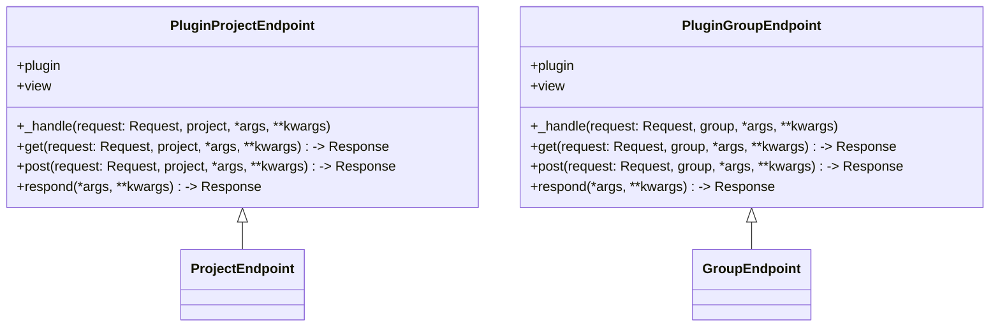

# Introduction

Plugins are modular components that extend the functionality of the application. They allow for additional features to be integrated without modifying the core codebase. Plugins can be registered and unregistered dynamically, providing flexibility in how features are added or removed from the application.

# Registering Plugins

The <SwmToken path="src/sentry/plugins/base/v2.py" pos="405:13:13" line-data="        &gt;&gt;&gt;     features = set([&#39;auth:register&#39;])">`register`</SwmToken> function is used to add a plugin to the system, making it available for use. This is seen in various files where different plugins are registered.

# Setting Plugin Options

Plugins can have configuration options that are specific to them. These options can be set and retrieved using functions like <SwmToken path="src/sentry/plugins/base/v2.py" pos="141:3:3" line-data="    def set_option(self, key, value, project=None, user=None) -&gt; None:">`set_option`</SwmToken> and <SwmToken path="src/sentry/plugins/base/v2.py" pos="107:7:7" line-data="            project_enabled = self.get_option(&quot;enabled&quot;, project)">`get_option`</SwmToken>.

<SwmSnippet path="/src/sentry/plugins/base/v2.py" line="141">

---

The <SwmToken path="src/sentry/plugins/base/v2.py" pos="141:3:3" line-data="    def set_option(self, key, value, project=None, user=None) -&gt; None:">`set_option`</SwmToken> function updates the value of an option in the plugin's keyspace. If a <SwmToken path="src/sentry/plugins/base/v2.py" pos="141:14:14" line-data="    def set_option(self, key, value, project=None, user=None) -&gt; None:">`project`</SwmToken> is passed, it will limit the scope to that project's keyspace.

```python
    def set_option(self, key, value, project=None, user=None) -> None:
        """
        Updates the value of an option in your plugins keyspace.

        If ``project`` is passed, it will limit the scope to that project's keyspace.

        >>> plugin.set_option('my_option', 'http://example.com')
        """
        from sentry.plugins.helpers import set_option

        set_option(self._get_option_key(key), value, project, user)
```

---

</SwmSnippet>

# Enabling Plugins

The <SwmToken path="src/sentry/plugins/base/v2.py" pos="165:3:3" line-data="    def enable(self, project=None, user=None):">`enable`</SwmToken> function is used to activate a plugin, making it operational within the application. This function sets the plugin's status to enabled.

<SwmSnippet path="/src/sentry/plugins/base/v2.py" line="165">

---

The <SwmToken path="src/sentry/plugins/base/v2.py" pos="165:3:3" line-data="    def enable(self, project=None, user=None):">`enable`</SwmToken> function sets the plugin's status to enabled, making it operational within the application.

```python
    def enable(self, project=None, user=None):
        """Enable the plugin."""
        self.set_option("enabled", True, project, user)
```

---

</SwmSnippet>

<SwmSnippet path="/src/sentry/plugins/__init__.py" line="1">

---

The <SwmToken path="src/sentry/plugins/__init__.py" pos="1:0:0" line-data="HIDDEN_PLUGINS = (">`HIDDEN_PLUGINS`</SwmToken> constant lists plugins that are hidden by default. These plugins are not available for general use but can be enabled if needed.

```python
HIDDEN_PLUGINS = (
    "bitbucket",
    "gitlab",
    "github",
    "slack",
    "jira",
    "pagerduty",
    "opsgenie",
)
```

---

</SwmSnippet>

# Plugin Endpoints

Plugin endpoints handle plugin-related requests at different levels, such as project and group levels.

## <SwmToken path="src/sentry/plugins/endpoints.py" pos="14:2:2" line-data="class PluginProjectEndpoint(ProjectEndpoint):">`PluginProjectEndpoint`</SwmToken>

The <SwmToken path="src/sentry/plugins/endpoints.py" pos="14:2:2" line-data="class PluginProjectEndpoint(ProjectEndpoint):">`PluginProjectEndpoint`</SwmToken> class defines endpoints for handling plugin-related requests at the project level. It includes methods for handling GET and POST requests by delegating to a view function if defined.

<SwmSnippet path="/src/sentry/plugins/endpoints.py" line="14">

---

The <SwmToken path="src/sentry/plugins/endpoints.py" pos="14:2:2" line-data="class PluginProjectEndpoint(ProjectEndpoint):">`PluginProjectEndpoint`</SwmToken> class defines endpoints for handling plugin-related requests at the project level. It includes methods for handling GET and POST requests by delegating to a view function if defined.

```python
class PluginProjectEndpoint(ProjectEndpoint):
    plugin = None
    view = None

    def _handle(self, request: Request, project, *args, **kwargs):
        if self.view is None:
            return Response(status=405)
        return self.view(request, project, *args, **kwargs)

    def get(self, request: Request, project, *args, **kwargs) -> Response:
        return self._handle(request, project, *args, **kwargs)

    def post(self, request: Request, project, *args, **kwargs) -> Response:
        return self._handle(request, project, *args, **kwargs)

    def respond(self, *args, **kwargs):
        return Response(*args, **kwargs)
```

---

</SwmSnippet>

## <SwmToken path="src/sentry/plugins/endpoints.py" pos="4:11:11" line-data="__all__ = [&quot;PluginProjectEndpoint&quot;, &quot;PluginGroupEndpoint&quot;]">`PluginGroupEndpoint`</SwmToken>

The <SwmToken path="src/sentry/plugins/endpoints.py" pos="4:11:11" line-data="__all__ = [&quot;PluginProjectEndpoint&quot;, &quot;PluginGroupEndpoint&quot;]">`PluginGroupEndpoint`</SwmToken> class defines endpoints for handling plugin-related requests at the group level. Similar to <SwmToken path="src/sentry/plugins/endpoints.py" pos="14:2:2" line-data="class PluginProjectEndpoint(ProjectEndpoint):">`PluginProjectEndpoint`</SwmToken>, it includes methods for handling GET and POST requests by delegating to a view function if defined.

&nbsp;

*This is an auto-generated document by Swimm AI 🌊 and has not yet been verified by a human*

<SwmMeta version="3.0.0" repo-id="Z2l0aHViJTNBJTNBc2VudHJ5LWRlbW8tMSUzQSUzQVN3aW1tLURlbW8=" repo-name="sentry-demo-1" doc-type="overview"><sup>Powered by [Swimm](/)</sup></SwmMeta>
