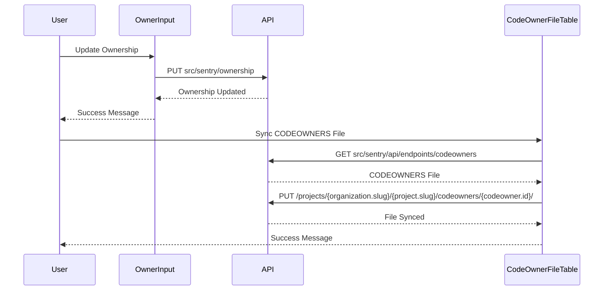

# Introduction to Project Ownership

Project ownership refers to the assignment of specific teams or individuals to a project. This ensures that there are designated parties responsible for the project's maintenance and issue resolution. In the codebase, project ownership is managed through various components and methods that allow for the selection and assignment of owners to a project. This includes the ability to add or remove teams and individuals as owners.

# <SwmToken path="static/app/views/settings/project/projectOwnership/selectOwners.tsx" pos="64:2:2" line-data="class SelectOwners extends Component&lt;Props, State&gt; {">`SelectOwners`</SwmToken> Component

The <SwmToken path="static/app/views/settings/project/projectOwnership/selectOwners.tsx" pos="64:2:2" line-data="class SelectOwners extends Component&lt;Props, State&gt; {">`SelectOwners`</SwmToken> component provides a user interface for selecting and assigning owners to a project. It includes functionality to filter and display teams that are not currently part of the project, allowing for easy management of project ownership.

<SwmSnippet path="/static/app/views/settings/project/projectOwnership/selectOwners.tsx" line="64">

---

The <SwmToken path="static/app/views/settings/project/projectOwnership/selectOwners.tsx" pos="64:2:2" line-data="class SelectOwners extends Component&lt;Props, State&gt; {">`SelectOwners`</SwmToken> component includes methods to manage the state and update the UI when teams are added to the project.

```tsx
class SelectOwners extends Component<Props, State> {
  state: State = {
    loading: false,
    inputValue: '',
  };

  componentDidUpdate(prevProps: Props) {
    // Once a team has been added to the project the menu can be closed.
    if (!isEqual(this.props.projects, prevProps.projects)) {
      this.closeSelectMenu();
    }
  }
```

---

</SwmSnippet>

# <SwmToken path="static/app/views/settings/project/projectOwnership/index.tsx" pos="23:15:15" line-data="import AddCodeOwnerModal from &#39;sentry/views/settings/project/projectOwnership/addCodeOwnerModal&#39;;">`projectOwnership`</SwmToken> Class

The <SwmToken path="static/app/views/settings/project/projectOwnership/index.tsx" pos="23:15:15" line-data="import AddCodeOwnerModal from &#39;sentry/views/settings/project/projectOwnership/addCodeOwnerModal&#39;;">`projectOwnership`</SwmToken> class handles the retrieval and display of ownership information for a project. It includes methods for fetching ownership data from the server and rendering it in the user interface.

<SwmSnippet path="/static/app/views/settings/project/projectOwnership/index.tsx" line="43">

---

The <SwmToken path="static/app/views/settings/project/projectOwnership/index.tsx" pos="48:1:1" line-data="  getEndpoints(): ReturnType&lt;DeprecatedAsyncView[&#39;getEndpoints&#39;]&gt; {">`getEndpoints`</SwmToken> method in the <SwmToken path="static/app/views/settings/project/projectOwnership/index.tsx" pos="23:15:15" line-data="import AddCodeOwnerModal from &#39;sentry/views/settings/project/projectOwnership/addCodeOwnerModal&#39;;">`projectOwnership`</SwmToken> class is responsible for defining the API endpoints that will be used to fetch ownership and codeowners data for a project.

```tsx
  getTitle() {
    const {project} = this.props;
    return routeTitleGen(this.getOwnershipTitle(), project.slug, false);
  }

  getEndpoints(): ReturnType<DeprecatedAsyncView['getEndpoints']> {
    const {organization, project} = this.props;
    const endpoints: ReturnType<DeprecatedAsyncView['getEndpoints']> = [
      ['ownership', `/projects/${organization.slug}/${project.slug}/ownership/`],
    ];
    if (organization.features.includes('integrations-codeowners')) {
      endpoints.push([
        'codeowners',
        `/projects/${organization.slug}/${project.slug}/codeowners/`,
        {query: {expand: ['codeMapping', 'ownershipSyntax']}},
      ]);
    }
    return endpoints;
  }
```

---

</SwmSnippet>

# Main Functions

There are several main functions in this folder. Some of them are <SwmToken path="static/app/views/settings/project/projectOwnership/index.tsx" pos="48:1:1" line-data="  getEndpoints(): ReturnType&lt;DeprecatedAsyncView[&#39;getEndpoints&#39;]&gt; {">`getEndpoints`</SwmToken>, <SwmToken path="static/app/views/settings/project/projectOwnership/index.tsx" pos="63:1:1" line-data="  handleAddCodeOwner = () =&gt; {">`handleAddCodeOwner`</SwmToken>, and <SwmToken path="static/app/views/settings/project/projectOwnership/index.tsx" pos="82:1:1" line-data="  handleOwnershipSave = (ownership: IssueOwnership) =&gt; {">`handleOwnershipSave`</SwmToken>. We will dive a little into <SwmToken path="static/app/views/settings/project/projectOwnership/index.tsx" pos="48:1:1" line-data="  getEndpoints(): ReturnType&lt;DeprecatedAsyncView[&#39;getEndpoints&#39;]&gt; {">`getEndpoints`</SwmToken> and <SwmToken path="static/app/views/settings/project/projectOwnership/index.tsx" pos="63:1:1" line-data="  handleAddCodeOwner = () =&gt; {">`handleAddCodeOwner`</SwmToken>.

## <SwmToken path="static/app/views/settings/project/projectOwnership/index.tsx" pos="63:1:1" line-data="  handleAddCodeOwner = () =&gt; {">`handleAddCodeOwner`</SwmToken>

The <SwmToken path="static/app/views/settings/project/projectOwnership/index.tsx" pos="63:1:1" line-data="  handleAddCodeOwner = () =&gt; {">`handleAddCodeOwner`</SwmToken> method in the <SwmToken path="static/app/views/settings/project/projectOwnership/index.tsx" pos="23:15:15" line-data="import AddCodeOwnerModal from &#39;sentry/views/settings/project/projectOwnership/addCodeOwnerModal&#39;;">`projectOwnership`</SwmToken> class opens a modal that allows users to add a new code owner to the project. It passes the organization and project details to the <SwmToken path="static/app/views/settings/project/projectOwnership/index.tsx" pos="65:2:2" line-data="      &lt;AddCodeOwnerModal">`AddCodeOwnerModal`</SwmToken> component and handles the save action.

<SwmSnippet path="/static/app/views/settings/project/projectOwnership/index.tsx" line="63">

---

The <SwmToken path="static/app/views/settings/project/projectOwnership/index.tsx" pos="63:1:1" line-data="  handleAddCodeOwner = () =&gt; {">`handleAddCodeOwner`</SwmToken> method opens a modal for adding a new code owner to the project.

```tsx
  handleAddCodeOwner = () => {
    openModal(modalProps => (
      <AddCodeOwnerModal
        {...modalProps}
        organization={this.props.organization}
        project={this.props.project}
        onSave={this.handleCodeOwnerAdded}
      />
    ));
```

---

</SwmSnippet>

# Project Ownership Endpoints

Project ownership involves several endpoints for managing ownership data. These endpoints handle updating ownership rules and synchronizing the CODEOWNERS file.

## <SwmToken path="static/app/views/settings/project/projectOwnership/ownerInput.tsx" pos="72:1:1" line-data="  handleUpdateOwnership = () =&gt; {">`handleUpdateOwnership`</SwmToken>

The <SwmToken path="static/app/views/settings/project/projectOwnership/ownerInput.tsx" pos="72:1:1" line-data="  handleUpdateOwnership = () =&gt; {">`handleUpdateOwnership`</SwmToken> method in the <SwmToken path="static/app/views/settings/project/projectOwnership/ownerInput.tsx" pos="49:2:2" line-data="class OwnerInput extends Component&lt;Props, State&gt; {">`OwnerInput`</SwmToken> component is responsible for updating the ownership rules of a project. It sends a PUT request to the endpoint <SwmPath>[src/sentry/ownership/](src/sentry/ownership/)</SwmPath> with the updated ownership data.

<SwmSnippet path="/static/app/views/settings/project/projectOwnership/ownerInput.tsx" line="72">

---

The <SwmToken path="static/app/views/settings/project/projectOwnership/ownerInput.tsx" pos="72:1:1" line-data="  handleUpdateOwnership = () =&gt; {">`handleUpdateOwnership`</SwmToken> method sends a PUT request to update the ownership rules of a project.

```tsx
  handleUpdateOwnership = () => {
    const {organization, project, onSave, page, initialText} = this.props;
    const {text} = this.state;
    this.setState({error: null});

    const api = new Client();
    const request = api.requestPromise(
      `/projects/${organization.slug}/${project.slug}/ownership/`,
      {
        method: 'PUT',
        data: {raw: text || ''},
      }
    );

    request
      .then(ownership => {
        addSuccessMessage(t('Updated issue ownership rules'));
        this.setState(
          {
            hasChanges: false,
            text,
```

---

</SwmSnippet>

## <SwmToken path="static/app/views/settings/project/projectOwnership/codeOwnerFileTable.tsx" pos="53:3:3" line-data="  const handleSync = (codeowner: CodeOwner) =&gt; async () =&gt; {">`handleSync`</SwmToken>

The <SwmToken path="static/app/views/settings/project/projectOwnership/codeOwnerFileTable.tsx" pos="53:3:3" line-data="  const handleSync = (codeowner: CodeOwner) =&gt; async () =&gt; {">`handleSync`</SwmToken> method in the <SwmToken path="static/app/views/settings/project/projectOwnership/index.tsx" pos="25:3:3" line-data="import {CodeOwnerFileTable} from &#39;sentry/views/settings/project/projectOwnership/codeOwnerFileTable&#39;;">`CodeOwnerFileTable`</SwmToken> component is used to synchronize the CODEOWNERS file for a project. It sends a GET request to <SwmPath>[src/sentry/api/endpoints/codeowners/](src/sentry/api/endpoints/codeowners/)</SwmPath> to fetch the latest file and then updates the project with a PUT request to `/projects/${organization.slug}/${project.slug}/codeowners/${codeowner.id}/`.

<SwmSnippet path="/static/app/views/settings/project/projectOwnership/codeOwnerFileTable.tsx" line="53">

---

The <SwmToken path="static/app/views/settings/project/projectOwnership/codeOwnerFileTable.tsx" pos="53:3:3" line-data="  const handleSync = (codeowner: CodeOwner) =&gt; async () =&gt; {">`handleSync`</SwmToken> method synchronizes the CODEOWNERS file by sending GET and PUT requests.

```tsx
  const handleSync = (codeowner: CodeOwner) => async () => {
    try {
      const codeownerFile: CodeownersFile = await api.requestPromise(
        `/organizations/${organization.slug}/code-mappings/${codeowner.codeMappingId}/codeowners/`,
        {
          method: 'GET',
        }
      );

      const data = await api.requestPromise(
        `/projects/${organization.slug}/${project.slug}/codeowners/${codeowner.id}/`,
        {
          method: 'PUT',
          data: {raw: codeownerFile.raw, date_updated: new Date().toISOString()},
        }
      );
      onUpdate({...codeowner, ...data});
      addSuccessMessage(t('CODEOWNERS file sync successful.'));
    } catch (_err) {
      addErrorMessage(t('An error occurred trying to sync CODEOWNERS file.'));
    }
```

---

</SwmSnippet>

## Sequence Diagram

The following sequence diagram illustrates the flow of updating ownership and synchronizing the CODEOWNERS file.



&nbsp;

*This is an auto-generated document by Swimm AI 🌊 and has not yet been verified by a human*

<SwmMeta version="3.0.0" repo-id="Z2l0aHViJTNBJTNBc2VudHJ5LWRlbW8tMSUzQSUzQVN3aW1tLURlbW8=" repo-name="sentry-demo-1" doc-type="overview"><sup>Powered by [Swimm](/)</sup></SwmMeta>
