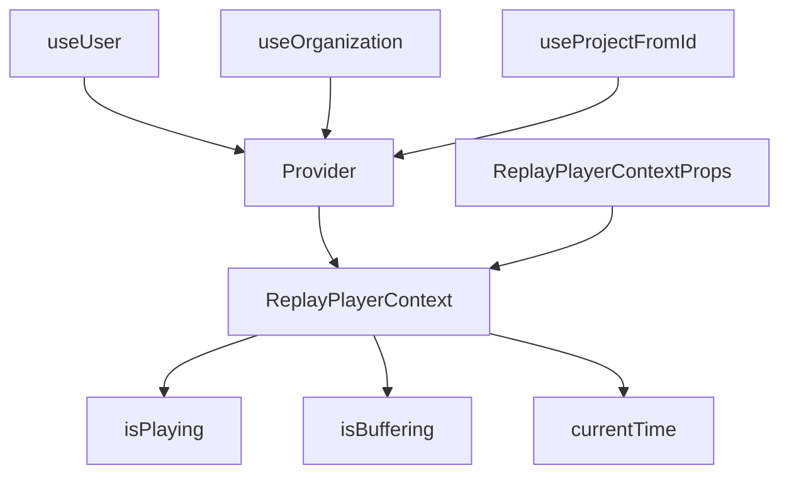

# Introduction

Replays are used to capture and replay user sessions, allowing developers to see exactly what users experienced. This document provides an overview of the components and hooks involved in managing replays within the application.

# <SwmToken path="static/app/components/replays/replayContext.tsx" pos="115:2:2" line-data="const ReplayPlayerContext = createContext&lt;ReplayPlayerContextProps&gt;({">`ReplayPlayerContext`</SwmToken>

The <SwmToken path="static/app/components/replays/replayContext.tsx" pos="115:2:2" line-data="const ReplayPlayerContext = createContext&lt;ReplayPlayerContextProps&gt;({">`ReplayPlayerContext`</SwmToken> provides the context for managing replay states such as <SwmToken path="static/app/components/replays/replayContext.tsx" pos="126:1:1" line-data="  isPlaying: false,">`isPlaying`</SwmToken>, <SwmToken path="static/app/components/replays/replayContext.tsx" pos="122:1:1" line-data="  isBuffering: false,">`isBuffering`</SwmToken>, and <SwmToken path="static/app/components/replays/replayContext.tsx" pos="39:1:1" line-data="  currentTime: number;">`currentTime`</SwmToken>. It defines properties and methods available in the replay context, including methods to control playback and manage highlights.

<SwmSnippet path="/static/app/components/replays/replayContext.tsx" line="115">

---

The <SwmToken path="static/app/components/replays/replayContext.tsx" pos="115:2:2" line-data="const ReplayPlayerContext = createContext&lt;ReplayPlayerContextProps&gt;({">`ReplayPlayerContext`</SwmToken> is initialized with default values for various states and methods. This context is crucial for managing the replay functionality within the application.

```tsx
const ReplayPlayerContext = createContext<ReplayPlayerContextProps>({
  analyticsContext: '',
  clearAllHighlights: () => {},
  currentTime: 0,
  dimensions: {height: 0, width: 0},
  fastForwardSpeed: 0,
  addHighlight: () => {},
  isBuffering: false,
  isVideoBuffering: false,
  isFetching: false,
  isFinished: false,
  isPlaying: false,
  isVideoReplay: false,
  removeHighlight: () => {},
  replay: null,
  restart: () => {},
  setCurrentTime: () => {},
  setRoot: () => {},
  togglePlayPause: () => {},
});
```

---

</SwmSnippet>

# Provider Function

The <SwmToken path="static/app/components/replays/replayContext.tsx" pos="174:4:4" line-data="export function Provider({">`Provider`</SwmToken> function initializes the replay context, setting up necessary states and handlers for replay functionality. It integrates with various utilities and hooks like <SwmToken path="static/app/components/replays/replayContext.tsx" pos="183:7:7" line-data="  const user = useUser();">`useUser`</SwmToken>, <SwmToken path="static/app/components/replays/replayContext.tsx" pos="184:7:7" line-data="  const organization = useOrganization();">`useOrganization`</SwmToken>, and <SwmToken path="static/app/components/replays/replayContext.tsx" pos="185:7:7" line-data="  const projectSlug = useProjectFromId({">`useProjectFromId`</SwmToken> to fetch necessary data for replay functionality.

<SwmSnippet path="/static/app/components/replays/replayContext.tsx" line="174">

---

The <SwmToken path="static/app/components/replays/replayContext.tsx" pos="174:4:4" line-data="export function Provider({">`Provider`</SwmToken> function sets up the replay context by initializing states and fetching necessary data using hooks like <SwmToken path="static/app/components/replays/replayContext.tsx" pos="183:7:7" line-data="  const user = useUser();">`useUser`</SwmToken>, <SwmToken path="static/app/components/replays/replayContext.tsx" pos="184:7:7" line-data="  const organization = useOrganization();">`useOrganization`</SwmToken>, and <SwmToken path="static/app/components/replays/replayContext.tsx" pos="185:7:7" line-data="  const projectSlug = useProjectFromId({">`useProjectFromId`</SwmToken>.

```tsx
export function Provider({
  analyticsContext,
  children,
  initialTimeOffsetMs,
  isFetching,
  replay,
  autoStart,
  value = {},
}: Props) {
  const user = useUser();
  const organization = useOrganization();
  const projectSlug = useProjectFromId({
    project_id: replay?.getReplay().project_id,
  })?.slug;
  const events = replay?.getRRWebFrames();

  const [prefs] = useReplayPrefs();
  const initialPrefsRef = useRef(prefs); // don't re-mount the player when prefs change, instead there's a useEffect

  const theme = useTheme();
  const oldEvents = usePrevious(events);
```

---

</SwmSnippet>

# <SwmToken path="static/app/components/replays/replayContext.tsx" pos="29:2:2" line-data="interface ReplayPlayerContextProps extends HighlightCallbacks {">`ReplayPlayerContextProps`</SwmToken> Interface

The <SwmToken path="static/app/components/replays/replayContext.tsx" pos="29:2:2" line-data="interface ReplayPlayerContextProps extends HighlightCallbacks {">`ReplayPlayerContextProps`</SwmToken> interface defines the properties and methods available in the replay context. It includes methods to control playback and manage highlights, ensuring that the replay functionality is robust and flexible.

<SwmSnippet path="/static/app/components/replays/replayContext.tsx" line="26">

---

The <SwmToken path="static/app/components/replays/replayContext.tsx" pos="29:2:2" line-data="interface ReplayPlayerContextProps extends HighlightCallbacks {">`ReplayPlayerContextProps`</SwmToken> interface outlines the properties and methods that are exposed to consumers of the replay context. This ensures that the replay functionality is encapsulated and managed effectively.

```tsx
// Important: Don't allow context Consumers to access `Replayer` directly.
// It has state that, when changed, will not trigger a react render.
// Instead only expose methods that wrap `Replayer` and manage state.
interface ReplayPlayerContextProps extends HighlightCallbacks {
  /**
   * The context in which the replay is being viewed.
   */
  analyticsContext: string;

  /**
   * The current time of the video, in milliseconds
   * The value is updated on every animation frame, about every 16.6ms
   */
  currentTime: number;

  /**
   * Original dimensions in pixels of the captured browser window
   */
  dimensions: Dimensions;

  /**
```

---

</SwmSnippet>

# Hooks Integration

Several hooks are used to fetch necessary data for replay functionality. These include <SwmToken path="static/app/components/replays/replayContext.tsx" pos="183:7:7" line-data="  const user = useUser();">`useUser`</SwmToken> to fetch the currently logged-in user, <SwmToken path="static/app/components/replays/replayContext.tsx" pos="184:7:7" line-data="  const organization = useOrganization();">`useOrganization`</SwmToken> to fetch the current organization, and <SwmToken path="static/app/components/replays/replayContext.tsx" pos="185:7:7" line-data="  const projectSlug = useProjectFromId({">`useProjectFromId`</SwmToken> to fetch the project based on the project ID.

<SwmSnippet path="/static/app/utils/useUser.tsx" line="5">

---

The <SwmToken path="static/app/utils/useUser.tsx" pos="8:4:4" line-data="export function useUser(): Readonly&lt;User&gt; {">`useUser`</SwmToken> hook is used to fetch the currently logged-in user. This data is essential for personalizing the replay experience.

```tsx
/**
 * Returns the currently logged in user.
 */
export function useUser(): Readonly<User> {
  // Intentional exception to accessing the deprecated field as we want to
  // deter users from consuming the user differently than through the hook.
  const {user} = useLegacyStore(configStore);
  // @TODO: Return a readonly type as a mechanism to deter users from mutating the
  // user directly. That said, this provides basic type safety and no runtime safety
  // as there are still plenty of ways to mutate the user. The runtime safe way of
  // enforcing this would be via Object.freeze.
  return user;
}
```

---

</SwmSnippet>

<SwmSnippet path="/static/app/utils/useOrganization.tsx" line="16">

---

The <SwmToken path="static/app/utils/useOrganization.tsx" pos="19:2:2" line-data="function useOrganization(opts?: Options&lt;false&gt;): Organization;">`useOrganization`</SwmToken> hook is used to fetch the current organization. This information is necessary for context-specific replay functionality.

```tsx
// The additional signatures provide proper type hints for when we set
// `allowNull` to true.

function useOrganization(opts?: Options<false>): Organization;
```

---

</SwmSnippet>

<SwmSnippet path="/static/app/utils/useProjectFromId.tsx" line="7">

---

The <SwmToken path="static/app/utils/useProjectFromId.tsx" pos="7:6:6" line-data="export default function useProjectFromId({project_id}: Props) {">`useProjectFromId`</SwmToken> hook is used to fetch the project based on the project ID. This ensures that the replay is associated with the correct project.

```tsx
export default function useProjectFromId({project_id}: Props) {
  const {projects} = useProjects();
  if (project_id) {
    return projects.find(p => p.id === project_id) ?? undefined;
  }
  return undefined;
}
```

---

</SwmSnippet>

# Main Functions

There are several main functions related to replays, including Replay Event, Replay Actions Event, Browse Replays, and Fetch Replay. These functions are essential for capturing, logging, and managing replay data.

## Replay Event

The <SwmToken path="static/app/components/replays/replayContext.tsx" pos="31:13:13" line-data="   * The context in which the replay is being viewed.">`replay`</SwmToken>` `<SwmToken path="static/app/components/replays/replayContext.tsx" pos="64:17:17" line-data="   * Set to true when the replay finish event is fired">`event`</SwmToken> function captures the details of a replay event, including the type, start time, replay ID, project ID, retention days, and payload. This function is essential for logging and tracking replay events.

## Replay Actions Event

The <SwmToken path="static/app/components/replays/replayContext.tsx" pos="31:13:13" line-data="   * The context in which the replay is being viewed.">`replay`</SwmToken>` Actions `<SwmToken path="static/app/components/replays/replayContext.tsx" pos="64:17:17" line-data="   * Set to true when the replay finish event is fired">`event`</SwmToken> function logs specific actions within a replay, such as user interactions or errors. This function helps in understanding user behavior and identifying issues within the replay.

## Browse Replays

The `Browse `<SwmToken path="static/app/components/replays/replayContext.tsx" pos="5:11:11" line-data="import useReplayHighlighting from &#39;sentry/components/replays/useReplayHighlighting&#39;;">`replays`</SwmToken> function allows users to list all replays for a specific organization. This function is useful for accessing and managing multiple replays.

## Fetch Replay

The `Fetch `<SwmToken path="static/app/components/replays/replayContext.tsx" pos="31:13:13" line-data="   * The context in which the replay is being viewed.">`replay`</SwmToken> function retrieves the details of a specific replay by its ID. This function is crucial for viewing and analyzing individual replays.

&nbsp;

*This is an auto-generated document by Swimm AI 🌊 and has not yet been verified by a human*

<SwmMeta version="3.0.0" repo-id="Z2l0aHViJTNBJTNBc2VudHJ5LWRlbW8tMSUzQSUzQVN3aW1tLURlbW8=" repo-name="sentry-demo-1" doc-type="overview"><sup>Powered by [Swimm](/)</sup></SwmMeta>
