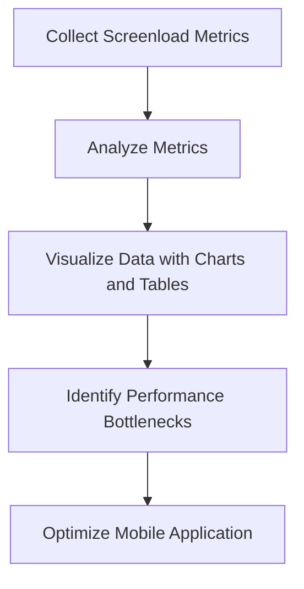

# Introduction

Screen load analysis refers to the process of measuring and analyzing the performance of screen loads in a mobile application. It involves tracking various metrics such as time to initial display (TTID), time to full display (TTFD), and frame rates to understand how quickly and smoothly screens are loading. These metrics are essential for identifying performance bottlenecks and ensuring a smooth user experience.

# Screenload Metrics

The <SwmToken path="static/app/views/insights/mobile/screenload/views/screenloadLandingPage.tsx" pos="30:4:4" line-data="export function PageloadModule() {">`PageloadModule`</SwmToken> function demonstrates how to gather and display screen load metrics. It uses hooks like <SwmToken path="static/app/views/insights/mobile/screenload/views/screenloadLandingPage.tsx" pos="31:7:7" line-data="  const organization = useOrganization();">`useOrganization`</SwmToken>, <SwmToken path="static/app/views/insights/mobile/screenload/views/screenloadLandingPage.tsx" pos="32:7:7" line-data="  const onboardingProject = useOnboardingProject();">`useOnboardingProject`</SwmToken>, and <SwmToken path="static/app/views/insights/mobile/screenload/views/screenloadLandingPage.tsx" pos="33:9:9" line-data="  const {isProjectCrossPlatform} = useCrossPlatformProject();">`useCrossPlatformProject`</SwmToken> to fetch necessary data and then renders components like <SwmToken path="static/app/views/insights/mobile/screenload/views/screenloadLandingPage.tsx" pos="28:2:2" line-data="import Onboarding from &#39;sentry/views/performance/onboarding&#39;;">`Onboarding`</SwmToken> and <SwmToken path="static/app/views/insights/mobile/screenload/views/screenloadLandingPage.tsx" pos="20:3:3" line-data="import {ScreensView} from &#39;sentry/views/insights/mobile/screenload/components/screensView&#39;;">`ScreensView`</SwmToken> to visualize the metrics.

<SwmSnippet path="/static/app/views/insights/mobile/screenload/views/screenloadLandingPage.tsx" line="30">

---

The <SwmToken path="static/app/views/insights/mobile/screenload/views/screenloadLandingPage.tsx" pos="30:4:4" line-data="export function PageloadModule() {">`PageloadModule`</SwmToken> function sets up the page layout, including the header, breadcrumbs, and main content area. It also conditionally renders onboarding components or the <SwmToken path="static/app/views/insights/mobile/screenload/views/screenloadLandingPage.tsx" pos="20:3:3" line-data="import {ScreensView} from &#39;sentry/views/insights/mobile/screenload/components/screensView&#39;;">`ScreensView`</SwmToken> component based on the presence of an onboarding project.

```tsx
export function PageloadModule() {
  const organization = useOrganization();
  const onboardingProject = useOnboardingProject();
  const {isProjectCrossPlatform} = useCrossPlatformProject();

  const crumbs = useModuleBreadcrumbs('screen_load');

  return (
    <Layout.Page>
      <PageAlertProvider>
        <Layout.Header>
          <Layout.HeaderContent>
            <Breadcrumbs crumbs={crumbs} />
            <HeaderWrapper>
              <Layout.Title>
                {MODULE_TITLE}
                <PageHeadingQuestionTooltip
                  docsUrl={MODULE_DOC_LINK}
                  title={MODULE_DESCRIPTION}
                />
              </Layout.Title>
```

---

</SwmSnippet>

# Visualizing Screenload Data

The <SwmToken path="static/app/views/insights/mobile/screenload/components/tables/screensTable.tsx" pos="46:4:4" line-data="export function ScreensTable({data, eventView, isLoading, pageLinks, onCursor}: Props) {">`ScreensTable`</SwmToken> component shows how to visualize screen load data. It uses the <SwmToken path="static/app/views/insights/mobile/screenload/components/tables/screensTable.tsx" pos="47:7:7" line-data="  const moduleURL = useModuleURL(&#39;screen_load&#39;);">`useModuleURL`</SwmToken> hook to generate URLs for navigation and displays metrics like average TTID and TTFD for different releases.

<SwmSnippet path="/static/app/views/insights/mobile/screenload/components/tables/screensTable.tsx" line="46">

---

The <SwmToken path="static/app/views/insights/mobile/screenload/components/tables/screensTable.tsx" pos="46:4:4" line-data="export function ScreensTable({data, eventView, isLoading, pageLinks, onCursor}: Props) {">`ScreensTable`</SwmToken> component sets up the table columns to display metrics such as average TTID and TTFD for different releases, along with the total count of screen loads.

```tsx
export function ScreensTable({data, eventView, isLoading, pageLinks, onCursor}: Props) {
  const moduleURL = useModuleURL('screen_load');
  const location = useLocation();
  const organization = useOrganization();
  const {primaryRelease, secondaryRelease} = useReleaseSelection();
  const {project} = useCrossPlatformProject();
  const eventViewColumns = eventView.getColumns();

  const ttidColumnNamePrimaryRelease = `avg_if(measurements.time_to_initial_display,release,${primaryRelease})`;
  const ttidColumnNameSecondaryRelease = `avg_if(measurements.time_to_initial_display,release,${secondaryRelease})`;
  const ttfdColumnNamePrimaryRelease = `avg_if(measurements.time_to_full_display,release,${primaryRelease})`;
  const ttfdColumnNameSecondaryRelease = `avg_if(measurements.time_to_full_display,release,${secondaryRelease})`;
  const countColumnName = `count()`;

  const columnNameMap = {
    transaction: t('Screen'),
    [ttidColumnNamePrimaryRelease]: t('AVG TTID (%s)', PRIMARY_RELEASE_ALIAS),
    [ttidColumnNameSecondaryRelease]: t('AVG TTID (%s)', SECONDARY_RELEASE_ALIAS),
    [ttfdColumnNamePrimaryRelease]: t('AVG TTFD (%s)', PRIMARY_RELEASE_ALIAS),
    [ttfdColumnNameSecondaryRelease]: t('AVG TTFD (%s)', SECONDARY_RELEASE_ALIAS),
    [countColumnName]: t('Total Count'),
```

---

</SwmSnippet>

# Main Functions

There are several main functions related to Screenload. Some of them are <SwmToken path="static/app/views/insights/mobile/screenload/views/screenLoadSpansPage.tsx" pos="57:2:2" line-data="function ScreenLoadSpans() {">`ScreenLoadSpans`</SwmToken>, <SwmToken path="static/app/views/insights/mobile/screenload/views/screenLoadSpansPage.tsx" pos="94:2:2" line-data="            &lt;ScreenLoadSpansContent /&gt;">`ScreenLoadSpansContent`</SwmToken>, <SwmToken path="static/app/views/insights/mobile/screenload/views/screenloadLandingPage.tsx" pos="30:4:4" line-data="export function PageloadModule() {">`PageloadModule`</SwmToken>, and <SwmToken path="static/app/views/insights/mobile/screenload/components/eventSamples.tsx" pos="33:4:4" line-data="export function ScreenLoadEventSamples({">`ScreenLoadEventSamples`</SwmToken>. We will dive a little into <SwmToken path="static/app/views/insights/mobile/screenload/views/screenLoadSpansPage.tsx" pos="57:2:2" line-data="function ScreenLoadSpans() {">`ScreenLoadSpans`</SwmToken> and <SwmToken path="static/app/views/insights/mobile/screenload/views/screenloadLandingPage.tsx" pos="30:4:4" line-data="export function PageloadModule() {">`PageloadModule`</SwmToken>.

## <SwmToken path="static/app/views/insights/mobile/screenload/views/screenLoadSpansPage.tsx" pos="57:2:2" line-data="function ScreenLoadSpans() {">`ScreenLoadSpans`</SwmToken>

The <SwmToken path="static/app/views/insights/mobile/screenload/views/screenLoadSpansPage.tsx" pos="57:2:2" line-data="function ScreenLoadSpans() {">`ScreenLoadSpans`</SwmToken> function is responsible for rendering the main layout of the Screenload spans page. It uses various hooks like <SwmToken path="static/app/views/insights/mobile/screenload/components/tables/screensTable.tsx" pos="48:7:7" line-data="  const location = useLocation();">`useLocation`</SwmToken>, <SwmToken path="static/app/views/insights/mobile/screenload/views/screenloadLandingPage.tsx" pos="31:7:7" line-data="  const organization = useOrganization();">`useOrganization`</SwmToken>, and <SwmToken path="static/app/views/insights/mobile/screenload/views/screenloadLandingPage.tsx" pos="33:9:9" line-data="  const {isProjectCrossPlatform} = useCrossPlatformProject();">`useCrossPlatformProject`</SwmToken> to fetch necessary data and context. The function sets up the page layout, including the header, breadcrumbs, and main content area, which is populated by the <SwmToken path="static/app/views/insights/mobile/screenload/views/screenLoadSpansPage.tsx" pos="94:2:2" line-data="            &lt;ScreenLoadSpansContent /&gt;">`ScreenLoadSpansContent`</SwmToken> component.

<SwmSnippet path="/static/app/views/insights/mobile/screenload/views/screenLoadSpansPage.tsx" line="57">

---

The <SwmToken path="static/app/views/insights/mobile/screenload/views/screenLoadSpansPage.tsx" pos="57:2:2" line-data="function ScreenLoadSpans() {">`ScreenLoadSpans`</SwmToken> function sets up the page layout, including the header, breadcrumbs, and main content area. It uses hooks like <SwmToken path="static/app/views/insights/mobile/screenload/views/screenLoadSpansPage.tsx" pos="58:7:7" line-data="  const location = useLocation&lt;Query&gt;();">`useLocation`</SwmToken>, <SwmToken path="static/app/views/insights/mobile/screenload/views/screenLoadSpansPage.tsx" pos="59:7:7" line-data="  const organization = useOrganization();">`useOrganization`</SwmToken>, and <SwmToken path="static/app/views/insights/mobile/screenload/views/screenLoadSpansPage.tsx" pos="60:9:9" line-data="  const {isProjectCrossPlatform} = useCrossPlatformProject();">`useCrossPlatformProject`</SwmToken> to fetch necessary data and context.

```tsx
function ScreenLoadSpans() {
  const location = useLocation<Query>();
  const organization = useOrganization();
  const {isProjectCrossPlatform} = useCrossPlatformProject();

  const crumbs = useModuleBreadcrumbs('screen_load');

  const {transaction: transactionName} = location.query;

  return (
    <Layout.Page>
      <PageAlertProvider>
        <Layout.Header>
          <Layout.HeaderContent>
            <Breadcrumbs
              crumbs={[
                ...crumbs,
                {
                  label: t('Screen Summary'),
                },
              ]}
```

---

</SwmSnippet>

## <SwmToken path="static/app/views/insights/mobile/screenload/views/screenloadLandingPage.tsx" pos="30:4:4" line-data="export function PageloadModule() {">`PageloadModule`</SwmToken>

The <SwmToken path="static/app/views/insights/mobile/screenload/views/screenloadLandingPage.tsx" pos="30:4:4" line-data="export function PageloadModule() {">`PageloadModule`</SwmToken> function is used to render the landing page for the Screenload module. It utilizes hooks like <SwmToken path="static/app/views/insights/mobile/screenload/views/screenloadLandingPage.tsx" pos="31:7:7" line-data="  const organization = useOrganization();">`useOrganization`</SwmToken>, <SwmToken path="static/app/views/insights/mobile/screenload/views/screenloadLandingPage.tsx" pos="32:7:7" line-data="  const onboardingProject = useOnboardingProject();">`useOnboardingProject`</SwmToken>, and <SwmToken path="static/app/views/insights/mobile/screenload/views/screenloadLandingPage.tsx" pos="33:9:9" line-data="  const {isProjectCrossPlatform} = useCrossPlatformProject();">`useCrossPlatformProject`</SwmToken> to gather necessary data. The function sets up the page layout, including the header, breadcrumbs, and main content area. It also conditionally renders onboarding components or the <SwmToken path="static/app/views/insights/mobile/screenload/views/screenloadLandingPage.tsx" pos="20:3:3" line-data="import {ScreensView} from &#39;sentry/views/insights/mobile/screenload/components/screensView&#39;;">`ScreensView`</SwmToken> component based on the presence of an onboarding project.

# Screenload Endpoints

Screenload Endpoints include functions like <SwmToken path="static/app/views/insights/mobile/screenload/views/screenLoadSpansPage.tsx" pos="57:2:2" line-data="function ScreenLoadSpans() {">`ScreenLoadSpans`</SwmToken> and <SwmToken path="static/app/views/insights/mobile/screenload/components/eventSamples.tsx" pos="33:4:4" line-data="export function ScreenLoadEventSamples({">`ScreenLoadEventSamples`</SwmToken>.

## <SwmToken path="static/app/views/insights/mobile/screenload/components/eventSamples.tsx" pos="33:4:4" line-data="export function ScreenLoadEventSamples({">`ScreenLoadEventSamples`</SwmToken>

The <SwmToken path="static/app/views/insights/mobile/screenload/components/eventSamples.tsx" pos="33:4:4" line-data="export function ScreenLoadEventSamples({">`ScreenLoadEventSamples`</SwmToken> function is used to render a table of screen load event samples. It takes several props, including <SwmToken path="static/app/views/insights/mobile/screenload/components/eventSamples.tsx" pos="34:1:1" line-data="  cursorName,">`cursorName`</SwmToken>, <SwmToken path="static/app/views/insights/mobile/screenload/components/tables/screensTable.tsx" pos="61:1:1" line-data="    transaction: t(&#39;Screen&#39;),">`transaction`</SwmToken>, <SwmToken path="static/app/views/insights/mobile/screenload/components/tables/screensTable.tsx" pos="54:14:14" line-data="  const ttidColumnNamePrimaryRelease = `avg_if(measurements.time_to_initial_display,release,${primaryRelease})`;">`release`</SwmToken>, and <SwmToken path="static/app/views/insights/mobile/screenload/components/eventSamples.tsx" pos="37:1:1" line-data="  sortKey,">`sortKey`</SwmToken>. The function uses the <SwmToken path="static/app/views/insights/mobile/screenload/components/tables/screensTable.tsx" pos="48:7:7" line-data="  const location = useLocation();">`useLocation`</SwmToken> and <SwmToken path="static/app/views/insights/mobile/screenload/components/eventSamples.tsx" pos="41:9:9" line-data="  const {selection} = usePageFilters();">`usePageFilters`</SwmToken> hooks to get the current location and page filters, respectively. It constructs a search query based on the transaction and release, and uses the <SwmToken path="static/app/views/insights/mobile/screenload/components/tables/screensTable.tsx" pos="252:4:4" line-data="export function useTableQuery({">`useTableQuery`</SwmToken> hook to fetch the data. The data is then rendered in an <SwmToken path="static/app/views/insights/mobile/screenload/components/eventSamples.tsx" pos="17:3:3" line-data="import {EventSamplesTable} from &#39;sentry/views/insights/mobile/screenload/components/tables/eventSamplesTable&#39;;">`EventSamplesTable`</SwmToken> component.

<SwmSnippet path="/static/app/views/insights/mobile/screenload/components/eventSamples.tsx" line="33">

---

The <SwmToken path="static/app/views/insights/mobile/screenload/components/eventSamples.tsx" pos="33:4:4" line-data="export function ScreenLoadEventSamples({">`ScreenLoadEventSamples`</SwmToken> function constructs a search query based on the transaction and release, and uses the <SwmToken path="static/app/views/insights/mobile/screenload/components/tables/screensTable.tsx" pos="252:4:4" line-data="export function useTableQuery({">`useTableQuery`</SwmToken> hook to fetch the data. The data is then rendered in an <SwmToken path="static/app/views/insights/mobile/screenload/components/eventSamples.tsx" pos="17:3:3" line-data="import {EventSamplesTable} from &#39;sentry/views/insights/mobile/screenload/components/tables/eventSamplesTable&#39;;">`EventSamplesTable`</SwmToken> component.

```tsx
export function ScreenLoadEventSamples({
  cursorName,
  transaction,
  release,
  sortKey,
  showDeviceClassSelector,
}: Props) {
  const location = useLocation();
  const {selection} = usePageFilters();
  const {primaryRelease} = useReleaseSelection();
  const cursor = decodeScalar(location.query?.[cursorName]);
  const {selectedPlatform: platform, isProjectCrossPlatform} = useCrossPlatformProject();

  const deviceClass = decodeScalar(location.query['device.class']);

  const searchQuery = useMemo(() => {
    const mutableQuery = new MutableSearch([
      'transaction.op:ui.load',
      `transaction:${transaction}`,
      `release:${release}`,
    ]);
```

---

</SwmSnippet>

&nbsp;

*This is an auto-generated document by Swimm AI 🌊 and has not yet been verified by a human*

<SwmMeta version="3.0.0" repo-id="Z2l0aHViJTNBJTNBc2VudHJ5LWRlbW8tMSUzQSUzQVN3aW1tLURlbW8=" repo-name="sentry-demo-1" doc-type="overview"><sup>Powered by [Swimm](/)</sup></SwmMeta>
