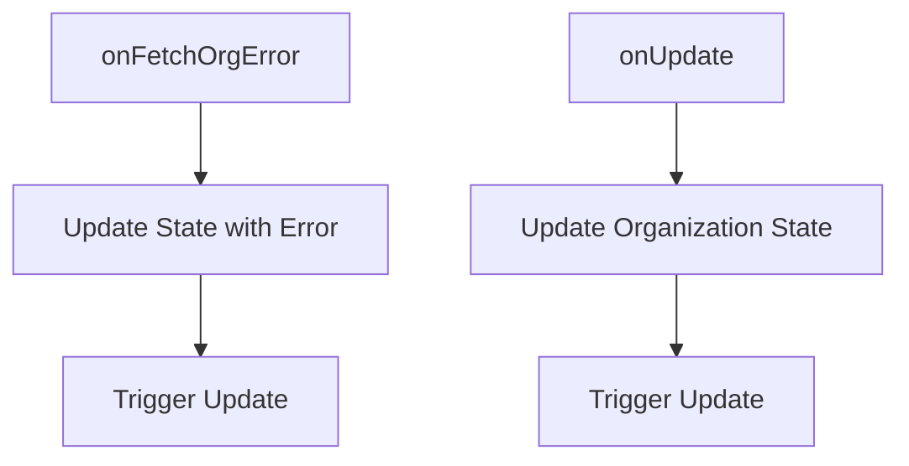

# Introduction to Stores

Stores are used to manage the state of various entities within the application. They provide a centralized place to handle data and state changes, ensuring consistency and ease of access.

# State Management

Each store typically defines a state object that holds the relevant data and status flags, such as loading states or error messages. This state object is updated through various methods defined within the store.

# <SwmToken path="static/app/stores/organizationsStore.tsx" pos="107:2:2" line-data="const OrganizationsStore = createStore(storeConfig);">`OrganizationsStore`</SwmToken>

The <SwmToken path="static/app/stores/organizationsStore.tsx" pos="107:2:2" line-data="const OrganizationsStore = createStore(storeConfig);">`OrganizationsStore`</SwmToken> manages the state of organizations, including loading states and the list of organizations. It provides methods to load organizations, update their properties, and handle changes such as slug updates.

<SwmSnippet path="/static/app/stores/organizationsStore.tsx" line="107">

---

The <SwmToken path="static/app/stores/organizationsStore.tsx" pos="107:2:2" line-data="const OrganizationsStore = createStore(storeConfig);">`OrganizationsStore`</SwmToken> is created and exported using the <SwmToken path="static/app/stores/organizationsStore.tsx" pos="107:6:6" line-data="const OrganizationsStore = createStore(storeConfig);">`createStore`</SwmToken> function.

```tsx
const OrganizationsStore = createStore(storeConfig);
export default OrganizationsStore;
```

---

</SwmSnippet>

# ProjectsStore

Similarly, the `ProjectsStore` manages the state of projects, including loading states and the list of projects. It provides methods to load initial data, update project properties, and handle changes such as adding or removing teams.

# State Updates

Stores also include methods to trigger updates and notify other parts of the application about state changes. This ensures that the application remains responsive and up-to-date with the latest data.

# Store Endpoints

Store endpoints are methods that handle specific actions or events related to the store's state. These methods ensure that the state is updated correctly and that other parts of the application are notified of changes.

## <SwmToken path="static/app/stores/organizationStore.tsx" pos="76:1:1" line-data="  onFetchOrgError(err) {">`onFetchOrgError`</SwmToken>

The <SwmToken path="static/app/stores/organizationStore.tsx" pos="76:1:1" line-data="  onFetchOrgError(err) {">`onFetchOrgError`</SwmToken> method handles errors that occur when fetching an organization. It updates the state with the error details and triggers an update to notify other parts of the application.

<SwmSnippet path="/static/app/stores/organizationStore.tsx" line="76">

---

The <SwmToken path="static/app/stores/organizationStore.tsx" pos="76:1:1" line-data="  onFetchOrgError(err) {">`onFetchOrgError`</SwmToken> method updates the state with error details and triggers an update.

```tsx
  onFetchOrgError(err) {
    let errorType: State['errorType'] = null;

    switch (err?.status) {
      case 401:
        errorType = ORGANIZATION_FETCH_ERROR_TYPES.ORG_NO_ACCESS;
        break;
      case 404:
        errorType = ORGANIZATION_FETCH_ERROR_TYPES.ORG_NOT_FOUND;
        break;
      default:
    }
    this.state = {
      errorType,
      dirty: false,
      error: err,
      loading: false,
      organization: null,
    };
    this.trigger(this.get());
```

---

</SwmSnippet>

## <SwmToken path="static/app/stores/organizationStore.tsx" pos="55:1:1" line-data="  onUpdate(updatedOrg: Organization, {replace = false} = {}) {">`onUpdate`</SwmToken>

The <SwmToken path="static/app/stores/organizationStore.tsx" pos="55:1:1" line-data="  onUpdate(updatedOrg: Organization, {replace = false} = {}) {">`onUpdate`</SwmToken> method updates the organization state with new data. It can either replace the existing organization data or merge it with the new data. After updating the state, it triggers an update to notify other parts of the application.

<SwmSnippet path="/static/app/stores/organizationStore.tsx" line="55">

---

The <SwmToken path="static/app/stores/organizationStore.tsx" pos="55:1:1" line-data="  onUpdate(updatedOrg: Organization, {replace = false} = {}) {">`onUpdate`</SwmToken> method updates the organization state and triggers an update.

```tsx
  onUpdate(updatedOrg: Organization, {replace = false} = {}) {
    const organization = replace
      ? updatedOrg
      : {...this.state.organization, ...updatedOrg};
    this.state = {
      loading: false,
      dirty: false,
      errorType: null,
      error: null,
      organization,
    };
    this.trigger(this.get());

    ReleaseStore.updateOrganization(organization);
    LatestContextStore.onUpdateOrganization(organization);
    HookStore.getCallback(
      'react-hook:route-activated',
      'setOrganization'
    )?.(organization);
  },
```

---

</SwmSnippet>

&nbsp;

*This is an auto-generated document by Swimm AI 🌊 and has not yet been verified by a human*

<SwmMeta version="3.0.0" repo-id="Z2l0aHViJTNBJTNBc2VudHJ5LWRlbW8tMSUzQSUzQVN3aW1tLURlbW8=" repo-name="sentry-demo-1" doc-type="overview"><sup>Powered by [Swimm](/)</sup></SwmMeta>
