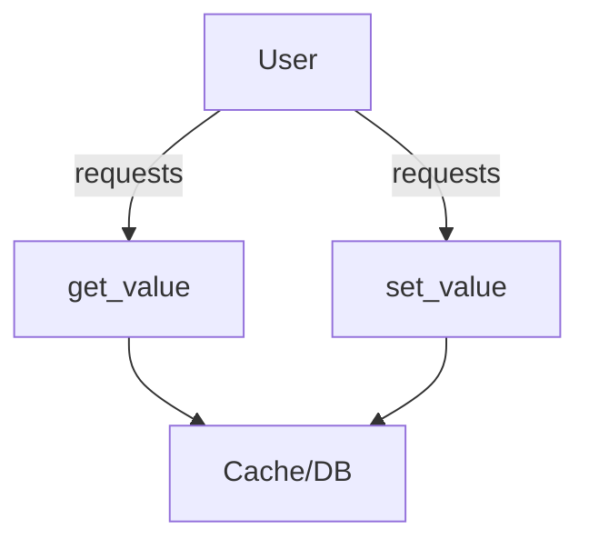

# Overview

Models in the Users module define the structure and behavior of user-related data in the application. This document provides an overview of the <SwmToken path="src/sentry/users/models/user_option.py" pos="46:4:4" line-data="        self, user: User | RpcUser, key: str, default: Any | None = None, **kwargs: Any">`user`</SwmToken> and <SwmToken path="src/sentry/users/models/user.py" pos="344:13:13" line-data="        from sentry.users.models.user_option import UserOption">`UserOption`</SwmToken> classes, their fields, methods, and usage within the application.

# User Model

The <SwmToken path="src/sentry/users/models/user_option.py" pos="46:4:4" line-data="        self, user: User | RpcUser, key: str, default: Any | None = None, **kwargs: Any">`user`</SwmToken> class represents a user in the system and includes various fields such as <SwmToken path="src/sentry/users/models/user.py" pos="98:7:7" line-data="    __relocation_custom_ordinal__ = [&quot;username&quot;]">`username`</SwmToken>, <SwmToken path="src/sentry/users/models/user.py" pos="106:1:1" line-data="    email = models.EmailField(_(&quot;email address&quot;), blank=True, max_length=75)">`email`</SwmToken>, <SwmToken path="src/sentry/users/models/user.py" pos="107:1:1" line-data="    is_staff = models.BooleanField(">`is_staff`</SwmToken>, <SwmToken path="src/sentry/users/models/user.py" pos="112:1:1" line-data="    is_active = models.BooleanField(">`is_active`</SwmToken>, and more. It also includes methods for managing user data, such as <SwmToken path="src/sentry/users/models/user.py" pos="205:3:3" line-data="    def delete(self, *args: Any, **kwargs: Any) -&gt; tuple[int, dict[str, int]]:">`delete`</SwmToken>, which handles the deletion of a user while ensuring certain constraints are met.

<SwmSnippet path="/src/sentry/users/models/user.py" line="13">

---

The <SwmToken path="src/sentry/users/models/user_option.py" pos="46:4:4" line-data="        self, user: User | RpcUser, key: str, default: Any | None = None, **kwargs: Any">`user`</SwmToken> class imports necessary modules and dependencies from Django and other parts of the application.

```python
from django.db import IntegrityError, models, router, transaction
from django.db.models import Count, Subquery
from django.db.models.query import QuerySet
from django.dispatch import receiver
from django.forms import model_to_dict
from django.http.request import HttpRequest
from django.urls import reverse
```

---

</SwmSnippet>

# <SwmToken path="src/sentry/users/models/user.py" pos="344:13:13" line-data="        from sentry.users.models.user_option import UserOption">`UserOption`</SwmToken> Model

The <SwmToken path="src/sentry/users/models/user.py" pos="344:13:13" line-data="        from sentry.users.models.user_option import UserOption">`UserOption`</SwmToken> class represents user-specific options and preferences, which can be scoped to a project or organization. It includes fields like <SwmToken path="src/sentry/users/models/user_option.py" pos="46:4:4" line-data="        self, user: User | RpcUser, key: str, default: Any | None = None, **kwargs: Any">`user`</SwmToken>, <SwmToken path="src/sentry/users/models/user_option.py" pos="77:1:1" line-data="        project_id = kwargs.get(&quot;project_id&quot;, None)">`project_id`</SwmToken>, <SwmToken path="src/sentry/users/models/user_option.py" pos="78:1:1" line-data="        organization_id = kwargs.get(&quot;organization_id&quot;, None)">`organization_id`</SwmToken>, <SwmToken path="src/sentry/users/models/user_option.py" pos="46:14:14" line-data="        self, user: User | RpcUser, key: str, default: Any | None = None, **kwargs: Any">`key`</SwmToken>, and <SwmToken path="src/sentry/users/models/user_option.py" pos="74:24:24" line-data="    def set_value(self, user: User | int, key: str, value: Any, **kwargs: Any) -&gt; None:">`value`</SwmToken>, which store the option's details.

<SwmSnippet path="/src/sentry/users/models/user.py" line="43">

---

The <SwmToken path="src/sentry/users/models/user.py" pos="344:13:13" line-data="        from sentry.users.models.user_option import UserOption">`UserOption`</SwmToken> class imports necessary modules and dependencies from Sentry and other parts of the application.

```python
from sentry.locks import locks
from sentry.models.lostpasswordhash import LostPasswordHash
from sentry.models.organizationmapping import OrganizationMapping
from sentry.models.organizationmembermapping import OrganizationMemberMapping
from sentry.models.orgauthtoken import OrgAuthToken
```

---

</SwmSnippet>

# Usage of Models

Both <SwmToken path="src/sentry/users/models/user_option.py" pos="46:4:4" line-data="        self, user: User | RpcUser, key: str, default: Any | None = None, **kwargs: Any">`user`</SwmToken> and <SwmToken path="src/sentry/users/models/user.py" pos="344:13:13" line-data="        from sentry.users.models.user_option import UserOption">`UserOption`</SwmToken> classes are used throughout the application to manage and retrieve user-related data and preferences.

# User Option APIs

The <SwmToken path="src/sentry/users/models/user.py" pos="344:13:13" line-data="        from sentry.users.models.user_option import UserOption">`UserOption`</SwmToken> class provides APIs to get and set user option values. These APIs can be scoped to a project or organization.

## <SwmToken path="src/sentry/users/models/user_option.py" pos="45:3:3" line-data="    def get_value(">`get_value`</SwmToken>

The <SwmToken path="src/sentry/users/models/user_option.py" pos="45:3:3" line-data="    def get_value(">`get_value`</SwmToken> method retrieves the value of a user option based on the provided key. It can be scoped to a project or organization. If both project and organization are provided, it raises an error. Otherwise, it fetches the value from the cache or database.

<SwmSnippet path="/src/sentry/users/models/user_option.py" line="45">

---

The <SwmToken path="src/sentry/users/models/user_option.py" pos="45:3:3" line-data="    def get_value(">`get_value`</SwmToken> method implementation in the <SwmToken path="src/sentry/users/models/user.py" pos="344:13:13" line-data="        from sentry.users.models.user_option import UserOption">`UserOption`</SwmToken> class.

```python
    def get_value(
        self, user: User | RpcUser, key: str, default: Any | None = None, **kwargs: Any
    ) -> Any:
        project = kwargs.get("project")
        organization = kwargs.get("organization")

        if organization and project:
            raise NotImplementedError(option_scope_error)
        if organization:
            result = self.get_all_values(user, None, organization)
        else:
            result = self.get_all_values(user, project)
        return result.get(key, default)
```

---

</SwmSnippet>

## <SwmToken path="src/sentry/users/models/user_option.py" pos="74:3:3" line-data="    def set_value(self, user: User | int, key: str, value: Any, **kwargs: Any) -&gt; None:">`set_value`</SwmToken>

The <SwmToken path="src/sentry/users/models/user_option.py" pos="74:3:3" line-data="    def set_value(self, user: User | int, key: str, value: Any, **kwargs: Any) -&gt; None:">`set_value`</SwmToken> method sets the value of a user option for a given key. It can be scoped to a project or organization. If both project and organization are provided, it raises an error. It updates the cache and database with the new value.

<SwmSnippet path="/src/sentry/users/models/user_option.py" line="74">

---

The <SwmToken path="src/sentry/users/models/user_option.py" pos="74:3:3" line-data="    def set_value(self, user: User | int, key: str, value: Any, **kwargs: Any) -&gt; None:">`set_value`</SwmToken> method implementation in the <SwmToken path="src/sentry/users/models/user.py" pos="344:13:13" line-data="        from sentry.users.models.user_option import UserOption">`UserOption`</SwmToken> class.

```python
    def set_value(self, user: User | int, key: str, value: Any, **kwargs: Any) -> None:
        project = kwargs.get("project")
        organization = kwargs.get("organization")
        project_id = kwargs.get("project_id", None)
        organization_id = kwargs.get("organization_id", None)
        if project is not None:
            project_id = project.id
        if organization is not None:
            organization_id = organization.id

        if organization and project:
            raise NotImplementedError(option_scope_error)

        inst, created = self.get_or_create(
            user_id=user.id if user and not isinstance(user, int) else user,
            project_id=project_id,
            organization_id=organization_id,
            key=key,
            defaults={"value": value},
        )
        if not created and inst.value != value:
```

---

</SwmSnippet>

&nbsp;

*This is an auto-generated document by Swimm AI 🌊 and has not yet been verified by a human*

<SwmMeta version="3.0.0" repo-id="Z2l0aHViJTNBJTNBc2VudHJ5LWRlbW8tMSUzQSUzQVN3aW1tLURlbW8=" repo-name="sentry-demo-1" doc-type="overview"><sup>Powered by [Swimm](/)</sup></SwmMeta>
