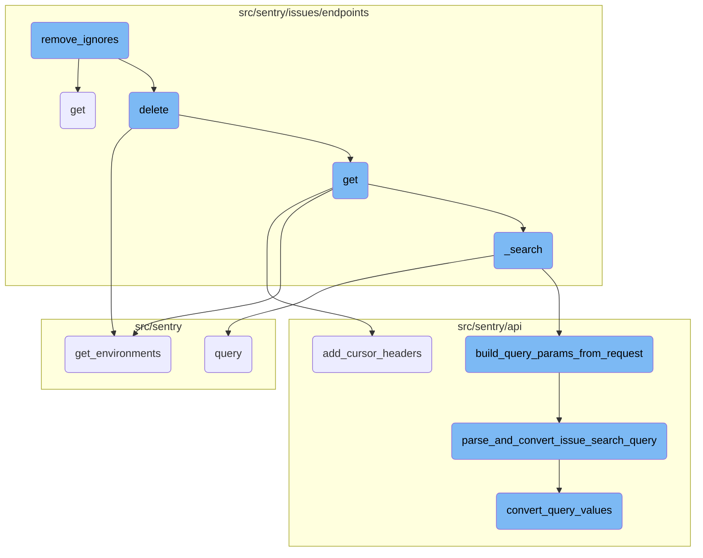
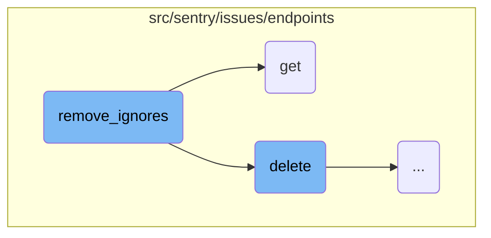
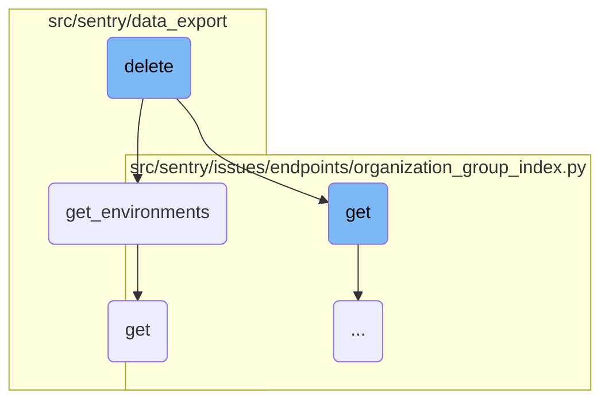
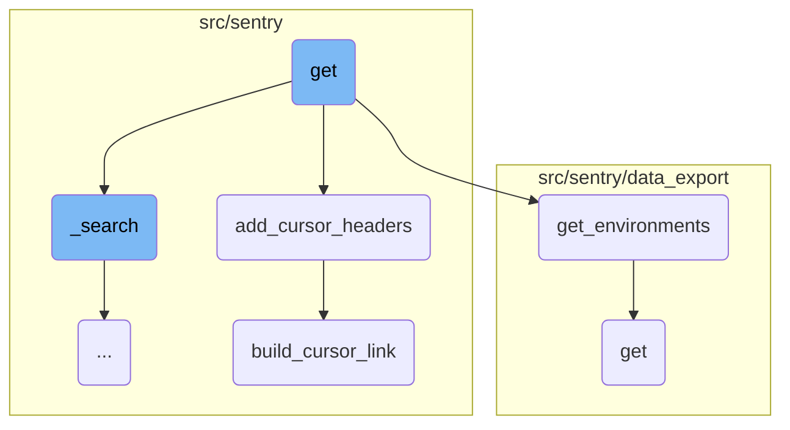
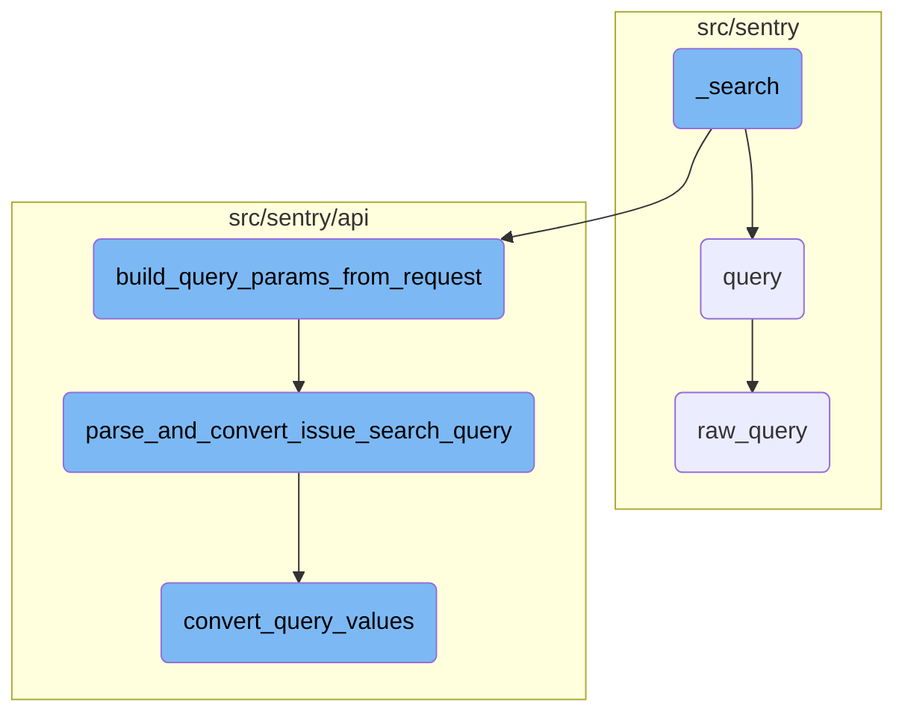

This document explains the purpose and functionality of the <SwmToken path="src/sentry/issues/receivers.py" pos="9:2:2" line-data="def remove_ignores(group: Group, **kwargs: Any) -&gt; None:">`remove_ignores`</SwmToken> function. It details how the function operates to ensure that any pending ignore rows are removed when an issue is resolved.

When an issue is resolved, the <SwmToken path="src/sentry/issues/receivers.py" pos="9:2:2" line-data="def remove_ignores(group: Group, **kwargs: Any) -&gt; None:">`remove_ignores`</SwmToken> function is triggered to clean up any pending ignore rows associated with that issue. It tries to find a <SwmToken path="src/sentry/issues/receivers.py" pos="14:5:5" line-data="        snooze = GroupSnooze.objects.get(group=group)">`GroupSnooze`</SwmToken> object linked to the issue's group. If it finds one, it deletes it. If it doesn't find one, it simply moves on without doing anything.

Here is a high level diagram of the flow, showing only the most important functions:



# Flow drill down

First, we'll zoom into this section of the flow:



<SwmSnippet path="/src/sentry/issues/receivers.py" line="13">

---

## Handling Issue Resolution

The <SwmToken path="src/sentry/issues/receivers.py" pos="9:2:2" line-data="def remove_ignores(group: Group, **kwargs: Any) -&gt; None:">`remove_ignores`</SwmToken> function ensures that any pending ignore rows are removed when an issue is resolved. It attempts to retrieve a <SwmToken path="src/sentry/issues/receivers.py" pos="14:5:5" line-data="        snooze = GroupSnooze.objects.get(group=group)">`GroupSnooze`</SwmToken> object associated with the issue's group and deletes it if found. If no such object exists, it simply passes without any action.

```python
    try:
        snooze = GroupSnooze.objects.get(group=group)
        snooze.delete()
    except GroupSnooze.DoesNotExist:
        pass
```

---

</SwmSnippet>

<SwmSnippet path="/src/sentry/issues/endpoints/project_stacktrace_link.py" line="122">

---

## Fetching Stacktrace Link Configurations

The <SwmToken path="src/sentry/issues/endpoints/project_stacktrace_link.py" pos="122:3:3" line-data="    def get(self, request: Request, project: Project) -&gt; Response:">`get`</SwmToken> function is responsible for generating the context for a stacktrace link request, validating the filepath, fetching integrations, and sorting code mapping configurations. It processes the configurations to determine the appropriate stacktrace link and handles any errors that occur during this process. The function also records analytics and returns a response containing the configuration, source URL, attempted URL, and integrations.

```python
    def get(self, request: Request, project: Project) -> Response:
        ctx = generate_context(request.GET)
        filepath = ctx["file"]
        if not filepath:
            return Response({"detail": "Filepath is required"}, status=400)

        integrations = integration_service.get_integrations(organization_id=project.organization_id)
        # TODO(meredith): should use get_provider.has_feature() instead once this is
        # no longer feature gated and is added as an IntegrationFeature
        serializer = IntegrationSerializer()
        serialized_integrations = [
            serialize(i, request.user, serializer)
            for i in integrations
            if i.has_feature(IntegrationFeatures.STACKTRACE_LINK)
        ]

        configs = get_sorted_code_mapping_configs(project)
        if not configs:
            return Response(
                {
                    "config": None,
```

---

</SwmSnippet>

Now, lets zoom into this section of the flow:



<SwmSnippet path="/src/sentry/issues/endpoints/organization_group_index.py" line="495">

---

## Deleting Issues

The <SwmToken path="src/sentry/issues/endpoints/organization_group_index.py" pos="495:3:3" line-data="    def delete(self, request: Request, organization) -&gt; Response:">`delete`</SwmToken> function is responsible for bulk removing a list of issues. It takes a request and an organization as parameters and permanently removes the given issues. The list of issues to be removed is provided through the <SwmToken path="src/sentry/issues/endpoints/organization_group_index.py" pos="501:12:12" line-data="        modify is given through the `id` query parameter.  It is repeated">`id`</SwmToken> query parameter. The function first retrieves the projects associated with the request and organization. It then checks if the user has the necessary permissions to delete issues across multiple projects. If the user does not have the required permissions, a response with a 400 status code is returned. Otherwise, the function proceeds to delete the issues using the <SwmToken path="src/sentry/issues/endpoints/organization_group_index.py" pos="23:1:1" line-data="    delete_groups,">`delete_groups`</SwmToken> function.

`````````````````````````````python
    def delete(self, request: Request, organization) -> Response:
        """
        Bulk Remove a List of Issues
        ````````````````````````````

        Permanently remove the given issues. The list of issues to
        modify is given through the `id` query parameter.  It is repeated
        for each issue that should be removed.

        Only queries by 'id' are accepted.

        If any IDs are out of scope this operation will succeed without
        any data mutation.

        :qparam int id: a list of IDs of the issues to be removed.  This
                        parameter shall be repeated for each issue, e.g.
                        `?id=1&id=2&id=3`. If this parameter is not provided,
                        it will attempt to remove the first 1000 issues.
        :pparam string organization_id_or_slug: the id or slug of the organization the
                                          issues belong to.
        :auth: required
`````````````````````````````

---

</SwmSnippet>

<SwmSnippet path="/src/sentry/data_export/processors/discover.py" line="61">

---

## Fetching Environments

The <SwmToken path="src/sentry/data_export/processors/discover.py" pos="61:3:3" line-data="    def get_environments(organization_id, query):">`get_environments`</SwmToken> function retrieves the environments specified in the query for a given organization. It first checks if the requested environments are provided as a list; if not, it converts them into a list. If no environments are specified, it returns an empty list. The function then queries the <SwmToken path="src/sentry/data_export/processors/discover.py" pos="62:10:10" line-data="        requested_environments = query.get(&quot;environment&quot;, [])">`environment`</SwmToken> model to fetch the environments that match the requested names. If any of the requested environments do not exist, an <SwmToken path="src/sentry/data_export/processors/discover.py" pos="77:3:3" line-data="            raise ExportError(&quot;Requested environment does not exist&quot;)">`ExportError`</SwmToken> is raised. Finally, it returns the list of environments.

```python
    def get_environments(organization_id, query):
        requested_environments = query.get("environment", [])
        if not isinstance(requested_environments, list):
            requested_environments = [requested_environments]

        if not requested_environments:
            return []

        environments = list(
            Environment.objects.filter(
                organization_id=organization_id, name__in=requested_environments
            )
        )
        environment_names = [e.name for e in environments]

        if set(requested_environments) != set(environment_names):
            raise ExportError("Requested environment does not exist")

        return environments
```

---

</SwmSnippet>

<SwmSnippet path="/src/sentry/data_export/endpoints/data_export_details.py" line="27">

---

## Retrieving Data Export Details

The <SwmToken path="src/sentry/data_export/endpoints/data_export_details.py" pos="27:3:3" line-data="    def get(self, request: Request, organization: Organization, data_export_id: str) -&gt; Response:">`get`</SwmToken> function retrieves information about a temporary file record associated with a data export. It first checks if the organization has the <SwmToken path="src/sentry/data_export/endpoints/data_export_details.py" pos="33:12:14" line-data="        if not features.has(&quot;organizations:discover-query&quot;, organization):">`discover-query`</SwmToken> feature enabled. If not, it returns a 404 response. The function then attempts to retrieve the <SwmToken path="src/sentry/data_export/endpoints/data_export_details.py" pos="37:5:5" line-data="            data_export = ExportedData.objects.get(id=data_export_id, organization=organization)">`ExportedData`</SwmToken> object using the provided <SwmToken path="src/sentry/data_export/endpoints/data_export_details.py" pos="27:20:20" line-data="    def get(self, request: Request, organization: Organization, data_export_id: str) -&gt; Response:">`data_export_id`</SwmToken> and organization. If the object does not exist, a 404 response is returned. The function also checks if the user has the necessary permissions to view the data export. If the user does not have the required permissions, a <SwmToken path="src/sentry/data_export/endpoints/data_export_details.py" pos="45:3:3" line-data="                raise PermissionDenied(">`PermissionDenied`</SwmToken> exception is raised. If the <SwmToken path="src/sentry/data_export/endpoints/data_export_details.py" pos="48:7:7" line-data="        # Ignore the download parameter unless we have a file to stream">`download`</SwmToken> parameter is present in the request and a file is available for download, the function returns the file for download. Otherwise, it returns a serialized response of the <SwmToken path="src/sentry/data_export/endpoints/data_export_details.py" pos="37:5:5" line-data="            data_export = ExportedData.objects.get(id=data_export_id, organization=organization)">`ExportedData`</SwmToken> object.

```python
    def get(self, request: Request, organization: Organization, data_export_id: str) -> Response:
        """
        Retrieve information about the temporary file record.
        Used to populate page emailed to the user.
        """

        if not features.has("organizations:discover-query", organization):
            return Response(status=404)

        try:
            data_export = ExportedData.objects.get(id=data_export_id, organization=organization)
        except ExportedData.DoesNotExist:
            return Response(status=404)
        # Check data export permissions
        if data_export.query_info.get("project"):
            project_ids = [int(project) for project in data_export.query_info.get("project", [])]
            projects = Project.objects.filter(organization=organization, id__in=project_ids)
            if any(p for p in projects if not request.access.has_project_access(p)):
                raise PermissionDenied(
                    detail="You don't have permissions to view some of the data this export contains."
                )
```

---

</SwmSnippet>

Now, lets zoom into this section of the flow:



<SwmSnippet path="/src/sentry/issues/endpoints/organization_group_index.py" line="203">

---

## Handling the Request

The <SwmToken path="src/sentry/issues/endpoints/organization_group_index.py" pos="203:3:3" line-data="    def get(self, request: Request, organization) -&gt; Response:">`get`</SwmToken> function handles the request to list an organization's issues. It starts by extracting query parameters from the request, such as <SwmToken path="src/sentry/issues/endpoints/organization_group_index.py" pos="219:4:4" line-data="        The ``statsPeriod`` parameter can be used to select a date window starting">`statsPeriod`</SwmToken>, <SwmToken path="src/sentry/issues/endpoints/organization_group_index.py" pos="215:4:4" line-data="        The ``groupStatsPeriod`` parameter can be used to select the timeline">`groupStatsPeriod`</SwmToken>, <SwmToken path="src/sentry/issues/endpoints/organization_group_index.py" pos="222:4:4" line-data="        The ``start`` and ``end`` parameters can be used to select an absolute">`start`</SwmToken>, and <SwmToken path="src/sentry/issues/endpoints/organization_group_index.py" pos="222:10:10" line-data="        The ``start`` and ``end`` parameters can be used to select an absolute">`end`</SwmToken>. It then validates these parameters and calculates the appropriate date range.

``````````````````````````````python
    def get(self, request: Request, organization) -> Response:
        """
        List an Organization's Issues
        `````````````````````````````

        Return a list of issues (groups) bound to an organization.  All parameters are
        supplied as query string parameters.

        A default query of ``is:unresolved issue.priority:[high,medium]`` is applied.
        To return results with other statuses send a new query value
        (i.e. ``?query=`` for all results).

        The ``groupStatsPeriod`` parameter can be used to select the timeline
        stats which should be present. Possible values are: '' (disable),
        '24h', '14d'

        The ``statsPeriod`` parameter can be used to select a date window starting
        from now. Ex. ``14d``.

        The ``start`` and ``end`` parameters can be used to select an absolute
        date period to fetch issues from.
``````````````````````````````

---

</SwmSnippet>

<SwmSnippet path="/src/sentry/issues/endpoints/organization_group_index.py" line="263">

---

## Fetching Projects and Environments

The function fetches the environments and projects associated with the organization. It checks if the user has access to multiple projects and whether the <SwmToken path="src/sentry/issues/endpoints/organization_group_index.py" pos="274:12:14" line-data="            and not features.has(&quot;organizations:global-views&quot;, organization, actor=request.user)">`global-views`</SwmToken> feature is enabled.

```python
        environments = self.get_environments(request, organization)

        projects = self.get_projects(request, organization)
        project_ids = [p.id for p in projects]

        if not projects:
            return Response([])
```

---

</SwmSnippet>

<SwmSnippet path="/src/sentry/issues/endpoints/organization_group_index.py" line="361">

---

## Performing the Search

The <SwmToken path="src/sentry/issues/endpoints/organization_group_index.py" pos="362:10:10" line-data="            cursor_result, query_kwargs = self._search(">`_search`</SwmToken> function is called to perform the actual search for issues based on the provided query parameters. It returns the search results and additional query arguments.

```python
        try:
            cursor_result, query_kwargs = self._search(
                request,
                organization,
                projects,
                environments,
                {"count_hits": True, "date_to": end, "date_from": start},
            )
        except (ValidationError, discover.InvalidSearchQuery) as exc:
```

---

</SwmSnippet>

<SwmSnippet path="/src/sentry/api/base.py" line="501">

---

## Adding Cursor Headers

The <SwmToken path="src/sentry/api/base.py" pos="501:3:3" line-data="    def add_cursor_headers(self, request: Request, response, cursor_result):">`add_cursor_headers`</SwmToken> function adds pagination headers to the response. It uses the <SwmToken path="src/sentry/api/base.py" pos="508:3:3" line-data="                self.build_cursor_link(request, &quot;previous&quot;, cursor_result.prev),">`build_cursor_link`</SwmToken> function to create links for the previous and next pages of results.

```python
    def add_cursor_headers(self, request: Request, response, cursor_result):
        if cursor_result.hits is not None:
            response["X-Hits"] = cursor_result.hits
        if cursor_result.max_hits is not None:
            response["X-Max-Hits"] = cursor_result.max_hits
        response["Link"] = ", ".join(
            [
                self.build_cursor_link(request, "previous", cursor_result.prev),
                self.build_cursor_link(request, "next", cursor_result.next),
            ]
        )
```

---

</SwmSnippet>

<SwmSnippet path="/src/sentry/api/base.py" line="239">

---

### Building Cursor Links

The <SwmToken path="src/sentry/api/base.py" pos="239:3:3" line-data="    def build_cursor_link(self, request: Request, name: str, cursor: Cursor):">`build_cursor_link`</SwmToken> function constructs the URL for pagination links. It takes the request, the name of the link ('previous' or 'next'), and the cursor object to generate the appropriate URL.

```python
    def build_cursor_link(self, request: Request, name: str, cursor: Cursor):
        if request.GET.get("cursor") is None:
            querystring = request.GET.urlencode()
        else:
            mutable_query_dict = request.GET.copy()
            mutable_query_dict.pop("cursor")
            querystring = mutable_query_dict.urlencode()

        url_prefix = (
            generate_organization_url(request.subdomain)
            if is_using_customer_domain(request)
            else None
        )
        base_url = absolute_uri(urlquote(request.path), url_prefix=url_prefix)

        if querystring:
            base_url = f"{base_url}?{querystring}"
        else:
            base_url = f"{base_url}?"

        return CURSOR_LINK_HEADER.format(
```

---

</SwmSnippet>

Now, lets zoom into this section of the flow:



<SwmSnippet path="/src/sentry/issues/endpoints/organization_group_index.py" line="153">

---

## \_search Function

The <SwmToken path="src/sentry/issues/endpoints/organization_group_index.py" pos="153:3:3" line-data="    def _search(">`_search`</SwmToken> function is responsible for handling the search logic within the application. It starts by building query parameters from the request using the <SwmToken path="src/sentry/issues/endpoints/organization_group_index.py" pos="157:5:5" line-data="            query_kwargs = build_query_params_from_request(">`build_query_params_from_request`</SwmToken> function. If additional query parameters are provided, they are merged into the existing ones. The function then determines whether to use the group Snuba dataset based on various conditions, such as feature flags and search filters. Finally, it performs the search using either the <SwmToken path="src/sentry/issues/endpoints/organization_group_index.py" pos="169:5:5" line-data="                result = inbox_search(**query_kwargs)">`inbox_search`</SwmToken> or <SwmToken path="src/sentry/issues/endpoints/organization_group_index.py" pos="199:5:9" line-data="                result = search.backend.query(**query_kwargs)">`search.backend.query`</SwmToken> method, depending on the query parameters.

```python
    def _search(
        self, request: Request, organization, projects, environments, extra_query_kwargs=None
    ):
        with start_span(op="_search"):
            query_kwargs = build_query_params_from_request(
                request, organization, projects, environments
            )
            if extra_query_kwargs is not None:
                assert "environment" not in extra_query_kwargs
                query_kwargs.update(extra_query_kwargs)

            query_kwargs["environments"] = environments if environments else None

            query_kwargs["actor"] = request.user
            if query_kwargs["sort_by"] == "inbox":
                query_kwargs.pop("sort_by")
                result = inbox_search(**query_kwargs)
            else:

                def use_group_snuba_dataset() -> bool:
                    # if useGroupSnubaDataset is present, override the flag so we can test the new dataset
```

---

</SwmSnippet>

<SwmSnippet path="/src/sentry/api/helpers/group_index/index.py" line="65">

---

### Building Query Parameters

The <SwmToken path="src/sentry/api/helpers/group_index/index.py" pos="65:2:2" line-data="def build_query_params_from_request(">`build_query_params_from_request`</SwmToken> function constructs the query parameters needed for the search. It extracts various parameters from the request, such as the sort order, limit, cursor, and query. It also handles saved searches and sets appropriate tags for monitoring. The function ultimately returns a dictionary of query parameters, including search filters parsed and converted by the <SwmToken path="src/sentry/api/helpers/group_index/index.py" pos="47:2:2" line-data="def parse_and_convert_issue_search_query(">`parse_and_convert_issue_search_query`</SwmToken> function.

```python
def build_query_params_from_request(
    request: Request,
    organization: "Organization",
    projects: Sequence["Project"],
    environments: Sequence["Environment"] | None,
) -> MutableMapping[str, Any]:
    query_kwargs = {"projects": projects, "sort_by": request.GET.get("sort", DEFAULT_SORT_OPTION)}

    limit = request.GET.get("limit")
    if limit:
        try:
            query_kwargs["limit"] = int(limit)
        except ValueError:
            raise ValidationError("invalid limit")

    # TODO: proper pagination support
    if request.GET.get("cursor"):
        try:
            query_kwargs["cursor"] = Cursor.from_string(request.GET.get("cursor"))
        except ValueError:
            raise ParseError(detail="Invalid cursor parameter.")
```

---

</SwmSnippet>

<SwmSnippet path="/src/sentry/api/helpers/group_index/index.py" line="47">

---

### Parsing and Converting Search Query

The <SwmToken path="src/sentry/api/helpers/group_index/index.py" pos="47:2:2" line-data="def parse_and_convert_issue_search_query(">`parse_and_convert_issue_search_query`</SwmToken> function parses the search query string and converts it into a sequence of search filters. It uses the <SwmToken path="src/sentry/api/helpers/group_index/index.py" pos="55:5:5" line-data="        search_filters = convert_query_values(">`convert_query_values`</SwmToken> function to transform the parsed search query into specific formats based on predefined converters. The function also validates the search filters against the organization's permissions and returns the final sequence of search filters.

```python
def parse_and_convert_issue_search_query(
    query: str,
    organization: Organization,
    projects: Sequence[Project],
    environments: Sequence[Environment],
    user: User | AnonymousUser,
) -> Sequence[SearchFilter]:
    try:
        search_filters = convert_query_values(
            parse_search_query(query), projects, user, environments
        )
    except InvalidSearchQuery as e:
        raise ValidationError(f"Error parsing search query: {e}")

    validate_search_filter_permissions(organization, search_filters, user)
    return search_filters
```

---

</SwmSnippet>

<SwmSnippet path="/src/sentry/utils/snuba.py" line="1318">

---

### Query Execution

The <SwmToken path="src/sentry/utils/snuba.py" pos="1318:2:2" line-data="def query(">`query`</SwmToken> function executes the search query against the Snuba dataset. It constructs the query body using the provided parameters and sends it to the <SwmToken path="src/sentry/utils/snuba.py" pos="1337:5:5" line-data="        body = raw_query(">`raw_query`</SwmToken> function. The function handles any errors that may occur during the query execution and validates the response. It then processes the result and returns the nested groups based on the specified groupby and aggregation columns.

```python
def query(
    dataset=None,
    start=None,
    end=None,
    groupby=None,
    conditions=None,
    filter_keys=None,
    aggregations=None,
    selected_columns=None,
    totals=None,
    use_cache=False,
    **kwargs,
):
    aggregations = aggregations or [["count()", "", "aggregate"]]
    filter_keys = filter_keys or {}
    selected_columns = selected_columns or []
    groupby = groupby or []

    try:
        body = raw_query(
            dataset=dataset,
```

---

</SwmSnippet>

<SwmSnippet path="/src/sentry/utils/snuba.py" line="846">

---

### Raw Query Execution

The <SwmToken path="src/sentry/utils/snuba.py" pos="846:2:2" line-data="def raw_query(">`raw_query`</SwmToken> function sends the constructed query to Snuba. It creates a <SwmToken path="src/sentry/utils/snuba.py" pos="861:15:15" line-data="    Sends a query to snuba.  See `SnubaQueryParams` docstring for param">`SnubaQueryParams`</SwmToken> object with the provided parameters and calls the <SwmToken path="src/sentry/utils/snuba.py" pos="882:3:3" line-data="    return bulk_raw_query([snuba_params], referrer=referrer, use_cache=use_cache)[0]">`bulk_raw_query`</SwmToken> function to execute the query. The function returns the first result from the bulk query response.

```python
def raw_query(
    dataset=None,
    start=None,
    end=None,
    groupby=None,
    conditions=None,
    filter_keys=None,
    aggregations=None,
    rollup=None,
    referrer=None,
    is_grouprelease=False,
    use_cache=False,
    **kwargs,
) -> Mapping[str, Any]:
    """
    Sends a query to snuba.  See `SnubaQueryParams` docstring for param
    descriptions.
    """

    if referrer:
        kwargs["tenant_ids"] = kwargs.get("tenant_ids") or dict()
```

---

</SwmSnippet>

<SwmSnippet path="/src/sentry/api/issue_search.py" line="260">

---

### Converting Query Values

The <SwmToken path="src/sentry/api/issue_search.py" pos="260:2:2" line-data="def convert_query_values(">`convert_query_values`</SwmToken> function converts the values of search filters into specific formats based on predefined converters. It iterates through the search filters and applies the appropriate converter functions. The function also handles special cases, such as aggregate filters and substatus query values. It returns a new collection of search filters with converted values.

```python
def convert_query_values(
    search_filters: ParsedTerms,
    projects: Sequence[Project],
    user: User | RpcUser | None,
    environments: Sequence[Environment] | None,
    value_converters=value_converters,
    allow_aggregate_filters=False,
) -> list[SearchFilter]:
    """
    Accepts a collection of SearchFilter objects and converts their values into
    a specific format, based on converters specified in `value_converters`.
    :param search_filters: Collection of `SearchFilter` objects.
    :param projects: List of projects being searched across
    :param user: The user making the search
    :param environments: The environments to consider when making the search
    :param value_converters: A dictionary of functions that convert search filter values into different formats.
    :return: New collection of `SearchFilters`, which may have converted values.
    """

    def convert_search_filter(
        search_filter: SearchFilter, organization: Organization
```

---

</SwmSnippet>

&nbsp;

*This is an auto-generated document by Swimm AI 🌊 and has not yet been verified by a human*

<SwmMeta version="3.0.0" repo-id="Z2l0aHViJTNBJTNBc2VudHJ5LWRlbW8tMSUzQSUzQVN3aW1tLURlbW8=" repo-name="sentry-demo-1" doc-type="flows"><sup>Powered by [Swimm](/)</sup></SwmMeta>
