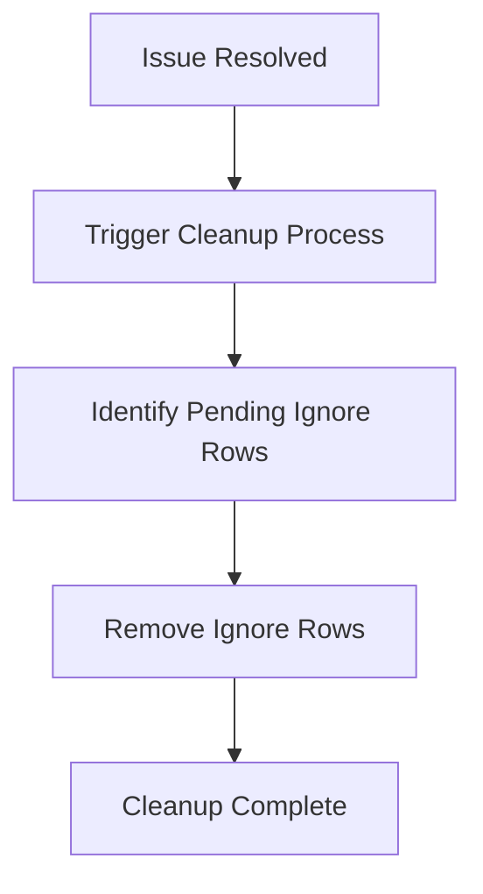

This document will cover the Issue Resolution Cleanup feature, which includes:

1. Triggering the cleanup process
2. Identifying and removing pending ignore rows.

Technical document: <SwmLink doc-title="Issue Resolution Cleanup">[Issue Resolution Cleanup](/.swm/issue-resolution-cleanup.5j5ti396.sw.md)</SwmLink>

# [Triggering the Cleanup Process](https://app.swimm.io/repos/Z2l0aHViJTNBJTNBc2VudHJ5LWRlbW8tMSUzQSUzQVN3aW1tLURlbW8=/docs/5j5ti396#when-an-issue-is-resolved-the-remove_ignores-function-is-triggered-to-clean-up-any-pending-ignore-rows-associated-with-that-issue)

When an issue is marked as resolved, the system automatically initiates a cleanup process. This process is essential to ensure that any temporary or pending actions related to the issue are properly handled and do not linger in the system. This helps maintain the integrity and performance of the application by removing unnecessary data.

# [Identifying Pending Ignore Rows](https://app.swimm.io/repos/Z2l0aHViJTNBJTNBc2VudHJ5LWRlbW8tMSUzQSUzQVN3aW1tLURlbW8=/docs/5j5ti396#it-tries-to-find-a-groupsnooze-object-linked-to-the-issues-group-if-it-finds-one-it-deletes-it-if-it-doesnt-find-one-it-simply-moves-on-without-doing-anything)

The cleanup process involves searching for any pending ignore rows associated with the resolved issue. These ignore rows are temporary records that indicate the issue was being ignored under certain conditions. The system attempts to locate a `GroupSnooze` object, which represents these ignore rows. If such an object is found, it is deleted to ensure that no outdated ignore instructions remain in the system. If no `GroupSnooze` object is found, the system simply proceeds without any further action.

# [Removing Ignore Rows](https://app.swimm.io/repos/Z2l0aHViJTNBJTNBc2VudHJ5LWRlbW8tMSUzQSUzQVN3aW1tLURlbW8=/docs/5j5ti396#if-it-finds-one-it-deletes-it-if-it-doesnt-find-one-it-simply-moves-on-without-doing-anything)

Once a `GroupSnooze` object is identified, it is removed from the system. This deletion is crucial to prevent any future conflicts or confusion regarding the issue's status. By removing these ignore rows, the system ensures that the issue is fully resolved and no residual data affects future operations or reports.

&nbsp;

*This is an auto-generated document by Swimm AI 🌊 and has not yet been verified by a human*

<SwmMeta version="3.0.0" repo-id="Z2l0aHViJTNBJTNBc2VudHJ5LWRlbW8tMSUzQSUzQVN3aW1tLURlbW8=" repo-name="sentry-demo-1" doc-type="product-flows">Powered by [Swimm](/)</SwmMeta>
