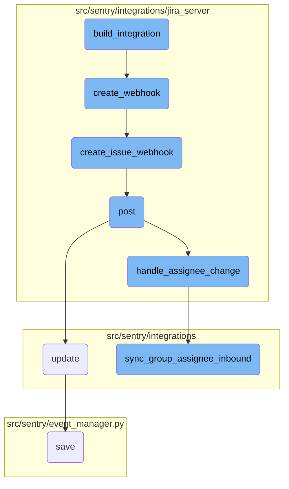

This document explains the process of integrating Jira Server with Sentry. The integration involves setting up webhooks to listen for issue creation and updates in Jira, and synchronizing these changes with Sentry.

The integration process starts by initializing the integration with necessary data and creating a webhook. This webhook is set up in Jira to listen for issue creation and updates. When an issue is created or updated in Jira, the webhook sends a request to Sentry. Sentry then processes this request, handles any changes such as assignee updates, and synchronizes these changes with its own system to ensure that the correct user is assigned to the group in Sentry.

# Flow drill down



<SwmSnippet path="/src/sentry/integrations/jira_server/integration.py" line="1182">

---

## Creating the Integration

The <SwmToken path="src/sentry/integrations/jira_server/integration.py" pos="1182:3:3" line-data="    def build_integration(self, state):">`build_integration`</SwmToken> function initializes the integration by extracting necessary data from the state, generating a webhook secret, and creating a webhook. This ensures that the integration is set up correctly before persisting any data.

```python
    def build_integration(self, state):
        install = state["installation_data"]
        access_token = state["access_token"]

        webhook_secret = sha1_text(install["private_key"]).hexdigest()

        hostname = urlparse(install["url"]).netloc
        external_id = "{}:{}".format(hostname, install["consumer_key"])[:64]

        credentials = {
            "consumer_key": install["consumer_key"],
            "private_key": install["private_key"],
            "access_token": access_token["oauth_token"],
            "access_token_secret": access_token["oauth_token_secret"],
        }
        # Create the webhook before the integration record exists
        # so that if it fails we don't persist a broken integration.
        self.create_webhook(external_id, webhook_secret, install, credentials)

        return {
            "name": install["consumer_key"],
```

---

</SwmSnippet>

<SwmSnippet path="/src/sentry/integrations/jira_server/integration.py" line="1219">

---

## Creating the Webhook

The <SwmToken path="src/sentry/integrations/jira_server/integration.py" pos="1219:3:3" line-data="    def create_webhook(self, external_id, webhook_secret, install, credentials):">`create_webhook`</SwmToken> function is responsible for setting up the webhook in Jira. It uses the <SwmToken path="src/sentry/integrations/jira_server/integration.py" pos="1220:5:5" line-data="        client = JiraServerSetupClient(">`JiraServerSetupClient`</SwmToken> to create the webhook and handles any errors that may occur during the process.

```python
    def create_webhook(self, external_id, webhook_secret, install, credentials):
        client = JiraServerSetupClient(
            install["url"], install["consumer_key"], install["private_key"], install["verify_ssl"]
        )
        try:
            client.create_issue_webhook(external_id, webhook_secret, credentials)
        except ApiError as err:
            logger.info(
                "jira-server.webhook.failed",
                extra={"error": str(err), "external_id": external_id},
            )
            try:
                details = next(x for x in err.json["messages"][0].values())
            except (KeyError, TypeError, StopIteration):
                details = ""
            message = f"Could not create issue webhook in Jira. {details}"
            raise IntegrationError(message)
```

---

</SwmSnippet>

<SwmSnippet path="/src/sentry/integrations/jira_server/client.py" line="279">

---

### Creating Issue Webhook

The <SwmToken path="src/sentry/integrations/jira_server/client.py" pos="279:3:3" line-data="    def create_issue_webhook(self, external_id, secret, credentials):">`create_issue_webhook`</SwmToken> function in the <SwmToken path="src/sentry/integrations/jira_server/integration.py" pos="1220:5:5" line-data="        client = JiraServerSetupClient(">`JiraServerSetupClient`</SwmToken> class constructs the webhook URL and sends a POST request to Jira to create the webhook. This function ensures that the webhook is correctly set up to listen for issue creation and updates.

```python
    def create_issue_webhook(self, external_id, secret, credentials):
        auth = OAuth1(
            client_key=credentials["consumer_key"],
            rsa_key=credentials["private_key"],
            resource_owner_key=credentials["access_token"],
            resource_owner_secret=credentials["access_token_secret"],
            signature_method=SIGNATURE_RSA,
            signature_type="auth_header",
            decoding=None,
        )

        # Create a JWT token that we can add to the webhook URL
        # so we can locate the matching integration later.
        token = jwt.encode({"id": external_id}, secret)
        path = reverse("sentry-extensions-jiraserver-issue-updated", kwargs={"token": token})
        data = {
            "name": "Sentry Issue Sync",
            "url": absolute_uri(path),
            "events": ["jira:issue_created", "jira:issue_updated"],
        }
        return self.post("/rest/webhooks/1.0/webhook", auth=auth, data=data)
```

---

</SwmSnippet>

<SwmSnippet path="/src/sentry/integrations/jira_server/webhooks.py" line="64">

---

## Handling Webhook Requests

The <SwmToken path="src/sentry/integrations/jira_server/webhooks.py" pos="64:3:3" line-data="    def post(self, request: Request, token, *args, **kwargs) -&gt; Response:">`post`</SwmToken> function handles incoming webhook requests from Jira. It validates the token, processes the request data, and calls functions to handle changes such as assignee changes and status changes.

```python
    def post(self, request: Request, token, *args, **kwargs) -> Response:
        clear_tags_and_context()
        extra: dict[str, object] = {}
        try:
            integration = get_integration_from_token(token)
            extra["integration_id"] = integration.id
        except ValueError as err:
            extra.update({"token": token, "error": str(err)})
            logger.warning("token-validation-error", extra=extra)
            metrics.incr("jira_server.webhook.invalid_token")
            return self.respond(status=400)

        data = request.data

        # Note: If we ever process more webhooks from jira server
        # we also need to update JiraServerRequestParser
        if not data.get("changelog"):
            logger.info("missing-changelog", extra=extra)
            return self.respond()

        try:
```

---

</SwmSnippet>

<SwmSnippet path="/src/sentry/integrations/jira_server/utils/api.py" line="25">

---

### Handling Assignee Changes

The <SwmToken path="src/sentry/integrations/jira_server/utils/api.py" pos="25:2:2" line-data="def handle_assignee_change(">`handle_assignee_change`</SwmToken> function checks if the assignee field has changed in the issue. If it has, it updates the group assignee in Sentry accordingly.

```python
def handle_assignee_change(
    integration: RpcIntegration | Integration,
    data: Mapping[str, Any],
) -> None:
    assignee_changed = any(
        item for item in data["changelog"]["items"] if item["field"] == "assignee"
    )
    if not assignee_changed:
        return

    fields = data["issue"]["fields"]

    # If there is no assignee, assume it was unassigned.
    assignee = fields.get("assignee")
    issue_key = data["issue"]["key"]

    if assignee is None:
        sync_group_assignee_inbound(integration, None, issue_key, assign=False)
        return

    email = get_assignee_email(integration, assignee)
```

---

</SwmSnippet>

<SwmSnippet path="/src/sentry/integrations/utils/sync.py" line="64">

---

### Synchronizing Group Assignee

The <SwmToken path="src/sentry/integrations/utils/sync.py" pos="64:2:2" line-data="def sync_group_assignee_inbound(">`sync_group_assignee_inbound`</SwmToken> function updates the group assignee in Sentry based on the assignee information from Jira. It ensures that the correct user is assigned to the group in Sentry.

```python
def sync_group_assignee_inbound(
    integration: RpcIntegration,
    email: str | None,
    external_issue_key: str,
    assign: bool = True,
) -> Sequence[Group]:
    """
    Given an integration, user email address and an external issue key,
    assign linked groups to matching users. Checks project membership.
    Returns a list of groups that were successfully assigned.
    """

    logger = logging.getLogger(f"sentry.integrations.{integration.provider}")

    orgs_with_sync_enabled = where_should_sync(integration, "inbound_assignee")
    affected_groups = Group.objects.get_groups_by_external_issue(
        integration,
        orgs_with_sync_enabled,
        external_issue_key,
    )
    log_context = {
```

---

</SwmSnippet>

&nbsp;

*This is an auto-generated document by Swimm AI 🌊 and has not yet been verified by a human*

<SwmMeta version="3.0.0" repo-id="Z2l0aHViJTNBJTNBc2VudHJ5LWRlbW8tMSUzQSUzQVN3aW1tLURlbW8=" repo-name="sentry-demo-1" doc-type="flows"><sup>Powered by [Swimm](/)</sup></SwmMeta>
