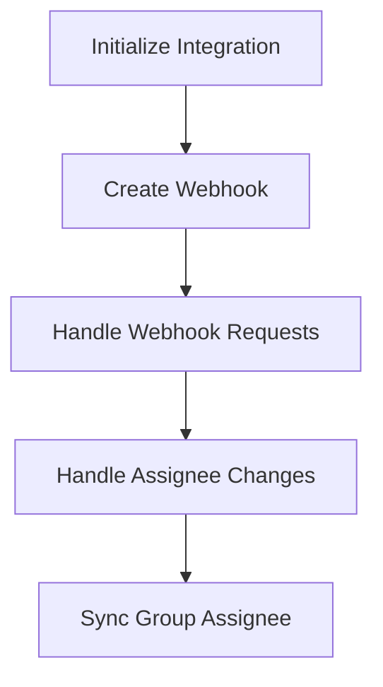

This document will cover the Jira Server Integration Flow, which includes:

1. Initializing the integration
2. Creating the webhook
3. Handling webhook requests
4. Handling assignee changes
5. Synchronizing group assignee.

Technical document: <SwmLink doc-title="Jira Server Integration Flow">[Jira Server Integration Flow](/.swm/jira-server-integration-flow.qn58m030.sw.md)</SwmLink>

# [Initializing the Integration](https://app.swimm.io/repos/Z2l0aHViJTNBJTNBc2VudHJ5LWRlbW8tMSUzQSUzQVN3aW1tLURlbW8=/docs/qn58m030#creating-the-integration)

The integration process begins by initializing the integration with necessary data. This involves extracting data such as installation details and access tokens. A webhook secret is generated to ensure secure communication between Jira and Sentry. The integration is set up correctly before any data is persisted to avoid storing incomplete or incorrect information.

# [Creating the Webhook](https://app.swimm.io/repos/Z2l0aHViJTNBJTNBc2VudHJ5LWRlbW8tMSUzQSUzQVN3aW1tLURlbW8=/docs/qn58m030#creating-the-webhook)

The webhook is created in Jira to listen for issue creation and updates. This step uses the JiraServerSetupClient to establish the webhook and handle any errors that may occur. The webhook ensures that any changes in Jira issues are communicated to Sentry in real-time.

# [Handling Webhook Requests](https://app.swimm.io/repos/Z2l0aHViJTNBJTNBc2VudHJ5LWRlbW8tMSUzQSUzQVN3aW1tLURlbW8=/docs/qn58m030#handling-webhook-requests)

When Jira sends a request to Sentry via the webhook, the request is processed to validate the token and extract the necessary data. This step ensures that only valid requests are processed, maintaining the integrity of the integration. The data from the request is then used to handle changes such as assignee updates.

# [Handling Assignee Changes](https://app.swimm.io/repos/Z2l0aHViJTNBJTNBc2VudHJ5LWRlbW8tMSUzQSUzQVN3aW1tLURlbW8=/docs/qn58m030#handling-assignee-changes)

If the assignee field in a Jira issue changes, this step updates the corresponding group assignee in Sentry. It checks if the assignee has changed and, if so, retrieves the new assignee's details. This ensures that the correct user is assigned to the issue in both Jira and Sentry.

# [Synchronizing Group Assignee](https://app.swimm.io/repos/Z2l0aHViJTNBJTNBc2VudHJ5LWRlbW8tMSUzQSUzQVN3aW1tLURlbW8=/docs/qn58m030#synchronizing-group-assignee)

The final step is to synchronize the group assignee in Sentry based on the assignee information from Jira. This involves updating the group assignment in Sentry to reflect the changes made in Jira. This synchronization ensures that the correct user is assigned to the group in Sentry, maintaining consistency between the two systems.

&nbsp;

*This is an auto-generated document by Swimm AI 🌊 and has not yet been verified by a human*

<SwmMeta version="3.0.0" repo-id="Z2l0aHViJTNBJTNBc2VudHJ5LWRlbW8tMSUzQSUzQVN3aW1tLURlbW8=" repo-name="sentry-demo-1" doc-type="product-flows">Powered by [Swimm](/)</SwmMeta>
