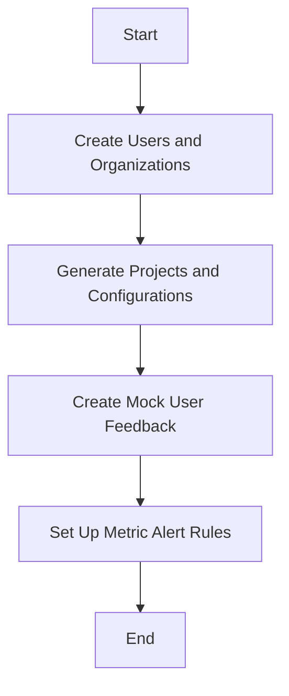

This document will cover the main function's flow for setting up mock data for testing purposes. We'll cover:

1. Creating Users and Organizations
2. Generating Projects and Configurations
3. Creating Mock User Feedback
4. Setting Up Metric Alert Rules

Technical document: <SwmLink doc-title="Main Function Overview">[Main Function Overview](/.swm/main-function-overview.uvb6s0cp.sw.md)</SwmLink>

# [Creating Users and Organizations](https://app.swimm.io/repos/Z2l0aHViJTNBJTNBc2VudHJ5LWRlbW8tMSUzQSUzQVN3aW1tLURlbW8=/docs/uvb6s0cp#main-function)

The process begins by creating a superuser and a regular user. This is essential for setting up the initial environment where different roles can be tested. The superuser has administrative privileges, while the regular user has standard access. After creating the users, an organization is set up. This organization acts as a container for various projects and configurations that will be created later. The organization is linked to the superuser, giving them ownership and administrative control.

# [Generating Projects and Configurations](https://app.swimm.io/repos/Z2l0aHViJTNBJTNBc2VudHJ5LWRlbW8tMSUzQSUzQVN3aW1tLURlbW8=/docs/uvb6s0cp#main-function)

Once the users and organization are created, the next step is to generate projects within the organization. Each project represents a different application or service that needs to be monitored. After generating the projects, default configurations such as environments, monitors, and access requests are set up. Environments represent different stages of deployment (e.g., production, staging), monitors track the health of the projects, and access requests manage permissions and access control.

# [Creating Mock User Feedback](https://app.swimm.io/repos/Z2l0aHViJTNBJTNBc2VudHJ5LWRlbW8tMSUzQSUzQVN3aW1tLURlbW8=/docs/uvb6s0cp#creating-mock-user-feedback)

Mock user feedback is generated to simulate real user interactions with the application. This feedback includes details such as the project ID, request URL, user information, and feedback message. The feedback is then processed to create a feedback issue, which helps in identifying and resolving user-reported problems. If the feedback includes an attachment, a mock attachment is also created to simulate file uploads.

# [Setting Up Metric Alert Rules](https://app.swimm.io/repos/Z2l0aHViJTNBJTNBc2VudHJ5LWRlbW8tMSUzQSUzQVN3aW1tLURlbW8=/docs/uvb6s0cp#creating-metric-alert-rule)

Metric alert rules are set up to monitor the performance and health of the projects. These rules define specific conditions under which alerts should be triggered. For example, an alert rule might be set to trigger if the error rate exceeds a certain threshold. The alert rule is associated with a project and includes parameters such as the rule name, threshold, and time window. When the conditions of the alert rule are met, an incident is created, and appropriate actions are taken to resolve the issue.

&nbsp;

*This is an auto-generated document by Swimm AI 🌊 and has not yet been verified by a human*

<SwmMeta version="3.0.0" repo-id="Z2l0aHViJTNBJTNBc2VudHJ5LWRlbW8tMSUzQSUzQVN3aW1tLURlbW8=" repo-name="sentry-demo-1" doc-type="product-flows">Powered by [Swimm](/)</SwmMeta>
