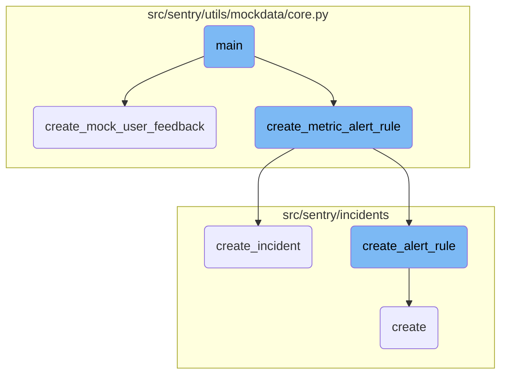
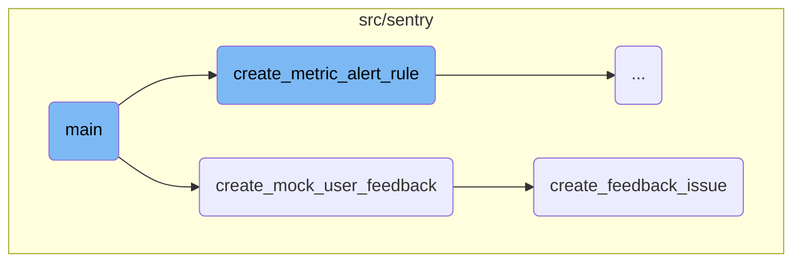

This document explains the main function, which orchestrates the setup of mock data for testing purposes. It covers the creation of users, organizations, projects, and various configurations, as well as the generation of events and feedback.

The main function starts by creating a superuser and a regular user. It then sets up an organization and generates projects. After that, it configures environments, monitors, and access requests. The function also generates events and processes any pending tasks. Finally, it creates mock user feedback and transactions to complete the setup.

Here is a high level diagram of the flow, showing only the most important functions:



# Flow drill down

First, we'll zoom into this section of the flow:



<SwmSnippet path="/src/sentry/utils/mockdata/core.py" line="1321">

---

## Main Function

The <SwmToken path="src/sentry/utils/mockdata/core.py" pos="1321:2:2" line-data="def main(">`main`</SwmToken> function orchestrates the setup of mock data for testing purposes. It creates a superuser, a regular user, and an organization. It then generates projects and sets up default configurations such as environments, monitors, and access requests. The function also generates events and processes pending buffers. Finally, it triggers the creation of mock user feedback and transactions.

```python
def main(
    skip_default_setup=False,
    num_events=1,
    extra_events=False,
    load_trends=False,
    load_performance_issues=False,
    slow=False,
):
    owner = get_superuser()
    user = create_user()
    create_broadcast()

    organization = get_organization()
    create_owner(organization, owner)
    member = create_member(organization, user, role=roles.get_default().id)

    project_map = generate_projects(organization)
    if not skip_default_setup:
        for project in project_map.values():
            environment = create_environment(project)
            create_monitor(project, environment)
```

---

</SwmSnippet>

<SwmSnippet path="/src/sentry/utils/mockdata/core.py" line="1282">

---

## Creating Mock User Feedback

The <SwmToken path="src/sentry/utils/mockdata/core.py" pos="1282:2:2" line-data="def create_mock_user_feedback(project, has_attachment=True):">`create_mock_user_feedback`</SwmToken> function generates a mock user feedback event. It creates an event dictionary with various details such as project ID, request URL, user information, and feedback message. This event is then passed to the <SwmToken path="src/sentry/feedback/usecases/create_feedback.py" pos="184:2:2" line-data="def create_feedback_issue(event, project_id: int, source: FeedbackCreationSource):">`create_feedback_issue`</SwmToken> function to create a feedback issue. If the <SwmToken path="src/sentry/utils/mockdata/core.py" pos="1282:7:7" line-data="def create_mock_user_feedback(project, has_attachment=True):">`has_attachment`</SwmToken> flag is true, it also creates a mock attachment for the event.

```python
def create_mock_user_feedback(project, has_attachment=True):
    event = {
        "project_id": project.id,
        "request": {
            "url": "https://sentry.sentry.io/feedback/?statsPeriod=14d",
            "headers": {
                "User-Agent": "Mozilla/5.0 (Macintosh; Intel Mac OS X 10_15_7) AppleWebKit/537.36 (KHTML, like Gecko) Chrome/118.0.0.0 Safari/537.36"
            },
        },
        "event_id": str(uuid.uuid4()).replace("-", ""),
        "timestamp": time.time(),
        "received": "2024-4-27T22:23:29.574000+00:00",
        "environment": "prod",
        "release": "frontend@daf1316f209d961443664cd6eb4231ca154db502",
        "user": {
            "ip_address": "72.164.175.154",
            "email": "josh.ferge@sentry.io",
            "id": 880461,
            "isStaff": False,
            "name": "Josh Ferge",
        },
```

---

</SwmSnippet>

<SwmSnippet path="/src/sentry/feedback/usecases/create_feedback.py" line="184">

---

### Creating Feedback Issue

The <SwmToken path="src/sentry/feedback/usecases/create_feedback.py" pos="184:2:2" line-data="def create_feedback_issue(event, project_id: int, source: FeedbackCreationSource):">`create_feedback_issue`</SwmToken> function handles the creation of a feedback issue from the provided event data. It first checks if the feedback should be filtered out. If not, it retrieves the project and checks for spam in the feedback message. It then constructs an <SwmToken path="src/sentry/feedback/usecases/create_feedback.py" pos="16:13:13" line-data="from sentry.issues.issue_occurrence import IssueEvidence, IssueOccurrence">`IssueOccurrence`</SwmToken> object with various details such as event ID, project ID, and feedback message. The function ensures the event data is valid and sends signals for the first feedback received. Finally, it produces the occurrence to Kafka and tracks the outcome.

```python
def create_feedback_issue(event, project_id: int, source: FeedbackCreationSource):
    metrics.incr("feedback.create_feedback_issue.entered")

    if should_filter_feedback(event, project_id, source):
        return

    project = Project.objects.get_from_cache(id=project_id)

    is_message_spam = None
    if features.has(
        "organizations:user-feedback-spam-filter-ingest", project.organization
    ) and project.get_option("sentry:feedback_ai_spam_detection"):
        try:
            is_message_spam = is_spam(event["contexts"]["feedback"]["message"])
        except Exception:
            # until we have LLM error types ironed out, just catch all exceptions
            logger.exception("Error checking if message is spam")
        metrics.incr(
            "feedback.create_feedback_issue.spam_detection",
            tags={"is_spam": is_message_spam},
            sample_rate=1.0,
```

---

</SwmSnippet>

Now, lets zoom into this section of the flow:

```mermaid
graph TD;
      subgraph src/sentry/incidents
b2697e2f3fe02b7fbae9a189f9df5d08eeba145a18941b89c2753a2a94414bf5(create_metric_alert_rule):::mainFlowStyle --> 803b71ae718bd2f5f17fb0becab9e16a40aa9915c4016a7272925a8e77de9436(create_incident)
end

subgraph src/sentry/incidents
b2697e2f3fe02b7fbae9a189f9df5d08eeba145a18941b89c2753a2a94414bf5(create_metric_alert_rule):::mainFlowStyle --> 84bf78faf60c4c34dd52053b68c7cdd26a5748932df0481a53b3be7620a28b37(create_alert_rule):::mainFlowStyle
end

subgraph src/sentry/incidents
803b71ae718bd2f5f17fb0becab9e16a40aa9915c4016a7272925a8e77de9436(create_incident) --> 3d3372c9ba8b72c81622e85e94c61a6b1c8c8166dee7c2ba3bde07dba9f8aee7(create_incident_activity)
end

subgraph src/sentry/incidents
803b71ae718bd2f5f17fb0becab9e16a40aa9915c4016a7272925a8e77de9436(create_incident) --> 1e1cb398de04140375fe38cf061bc16fcaf4bb0a8b605e4cd48e1e622e417456(create)
end

subgraph src/sentry/incidents
1e1cb398de04140375fe38cf061bc16fcaf4bb0a8b605e4cd48e1e622e417456(create) --> 829a66f459daa8959c1c006a6104ea00d1ef274c974343bbd0685f4603638730(_handle_actions)
end


      classDef mainFlowStyle color:#000000,fill:#7CB9F4
classDef rootsStyle color:#000000,fill:#00FFF4
classDef Style1 color:#000000,fill:#00FFAA
classDef Style2 color:#000000,fill:#FFFF00
classDef Style3 color:#000000,fill:#AA7CB9

%% Swimm:
%% graph TD;
%%       subgraph <SwmPath>[src/sentry/incidents/](src/sentry/incidents/)</SwmPath>
%% b2697e2f3fe02b7fbae9a189f9df5d08eeba145a18941b89c2753a2a94414bf5(create_metric_alert_rule):::mainFlowStyle --> 803b71ae718bd2f5f17fb0becab9e16a40aa9915c4016a7272925a8e77de9436(create_incident)
%% end
%% 
%% subgraph <SwmPath>[src/sentry/incidents/](src/sentry/incidents/)</SwmPath>
%% b2697e2f3fe02b7fbae9a189f9df5d08eeba145a18941b89c2753a2a94414bf5(create_metric_alert_rule):::mainFlowStyle --> 84bf78faf60c4c34dd52053b68c7cdd26a5748932df0481a53b3be7620a28b37(create_alert_rule):::mainFlowStyle
%% end
%% 
%% subgraph <SwmPath>[src/sentry/incidents/](src/sentry/incidents/)</SwmPath>
%% 803b71ae718bd2f5f17fb0becab9e16a40aa9915c4016a7272925a8e77de9436(create_incident) --> 3d3372c9ba8b72c81622e85e94c61a6b1c8c8166dee7c2ba3bde07dba9f8aee7(create_incident_activity)
%% end
%% 
%% subgraph <SwmPath>[src/sentry/incidents/](src/sentry/incidents/)</SwmPath>
%% 803b71ae718bd2f5f17fb0becab9e16a40aa9915c4016a7272925a8e77de9436(create_incident) --> 1e1cb398de04140375fe38cf061bc16fcaf4bb0a8b605e4cd48e1e622e417456(create)
%% end
%% 
%% subgraph <SwmPath>[src/sentry/incidents/](src/sentry/incidents/)</SwmPath>
%% 1e1cb398de04140375fe38cf061bc16fcaf4bb0a8b605e4cd48e1e622e417456(create) --> 829a66f459daa8959c1c006a6104ea00d1ef274c974343bbd0685f4603638730(_handle_actions)
%% end
%% 
%% 
%%       classDef mainFlowStyle color:#000000,fill:#7CB9F4
%% classDef rootsStyle color:#000000,fill:#00FFF4
%% classDef Style1 color:#000000,fill:#00FFAA
%% classDef Style2 color:#000000,fill:#FFFF00
%% classDef Style3 color:#000000,fill:#AA7CB9
```



<SwmSnippet path="/src/sentry/utils/mockdata/core.py" line="746">

---

## Creating Metric Alert Rule

The function <SwmToken path="src/sentry/utils/mockdata/core.py" pos="746:2:2" line-data="def create_metric_alert_rule(organization: Organization, project: Project) -&gt; None:">`create_metric_alert_rule`</SwmToken> is responsible for setting up a metric alert rule for a given organization and project. It first calls <SwmToken path="src/sentry/utils/mockdata/core.py" pos="748:5:5" line-data="    alert_rule = create_alert_rule(">`create_alert_rule`</SwmToken> to define the alert rule parameters, such as the organization, project, rule name, and threshold. Then, it creates an alert rule trigger and an incident associated with the alert rule.

```python
def create_metric_alert_rule(organization: Organization, project: Project) -> None:
    # Metric alerts
    alert_rule = create_alert_rule(
        organization,
        [project],
        "My Alert Rule",
        "level:error",
        "count()",
        10,
        AlertRuleThresholdType.ABOVE,
        1,
    )
    create_alert_rule_trigger(alert_rule, "critical", 10)
    create_incident(
        organization,
        type_=IncidentType.DETECTED,
        title="My Incident",
        date_started=datetime.now(timezone.utc),
        alert_rule=alert_rule,
        projects=[project],
    )
```

---

</SwmSnippet>

<SwmSnippet path="/src/sentry/incidents/logic.py" line="507">

---

## Creating Alert Rule

The function <SwmToken path="src/sentry/incidents/logic.py" pos="507:2:2" line-data="def create_alert_rule(">`create_alert_rule`</SwmToken> constructs an alert rule for an organization. It involves setting up the query parameters, time window, threshold type, and other configurations. The function ensures that the alert rule is correctly associated with the specified projects and handles any validation errors that may arise during the creation process.

```python
def create_alert_rule(
    organization,
    projects,
    name,
    query,
    aggregate,
    time_window,
    threshold_type,
    threshold_period,
    owner: Actor | None = None,
    resolve_threshold=None,
    environment=None,
    include_all_projects=False,
    excluded_projects=None,
    query_type: SnubaQuery.Type = SnubaQuery.Type.ERROR,
    dataset=Dataset.Events,
    user=None,
    event_types=None,
    comparison_delta: int | None = None,
    monitor_type: AlertRuleMonitorTypeInt = AlertRuleMonitorTypeInt.CONTINUOUS,
    activation_condition: AlertRuleActivationConditionType | None = None,
```

---

</SwmSnippet>

<SwmSnippet path="/src/sentry/incidents/logic.py" line="128">

---

## Creating Incident

The function <SwmToken path="src/sentry/incidents/logic.py" pos="128:2:2" line-data="def create_incident(">`create_incident`</SwmToken> is used to create an incident when an alert rule is triggered. It records the incident details, such as the organization, type, title, and start date. The function also creates incident activities to log the detection and creation of the incident and sends analytics data for the created incident.

```python
def create_incident(
    organization,
    type_,
    title,
    date_started,
    date_detected=None,
    # TODO: Probably remove detection_uuid?
    detection_uuid=None,
    projects=None,
    user=None,
    alert_rule=None,
    activation=None,
    subscription=None,
):
    if date_detected is None:
        date_detected = date_started

    with transaction.atomic(router.db_for_write(Incident)):
        incident = Incident.objects.create(
            organization=organization,
            detection_uuid=detection_uuid,
```

---

</SwmSnippet>

<SwmSnippet path="/src/sentry/incidents/logic.py" line="270">

---

## Creating Incident Activity

The function <SwmToken path="src/sentry/incidents/logic.py" pos="270:2:2" line-data="def create_incident_activity(">`create_incident_activity`</SwmToken> logs activities related to an incident, such as comments or status changes. It ensures that users involved in the incident are subscribed to notifications and records the activity in the incident's history. This function helps maintain a detailed log of all actions taken during the incident's lifecycle.

```python
def create_incident_activity(
    incident,
    activity_type,
    user=None,
    value=None,
    previous_value=None,
    comment=None,
    mentioned_user_ids=None,
    date_added=None,
) -> IncidentActivity:
    if activity_type == IncidentActivityType.COMMENT and user:
        subscribe_to_incident(incident, user.id)
    value = str(value) if value is not None else value
    previous_value = str(previous_value) if previous_value is not None else previous_value
    kwargs = {}
    if date_added:
        kwargs["date_added"] = date_added
    activity = IncidentActivity.objects.create(
        incident=incident,
        type=activity_type.value,
        user_id=user.id if user else None,
```

---

</SwmSnippet>

<SwmSnippet path="/src/sentry/incidents/serializers/alert_rule_trigger.py" line="69">

---

## Handling Alert Rule Trigger Actions

The function <SwmToken path="src/sentry/incidents/serializers/alert_rule_trigger.py" pos="69:3:3" line-data="    def _handle_actions(self, alert_rule_trigger, actions):">`_handle_actions`</SwmToken> manages the actions associated with an alert rule trigger. It processes the actions provided in the input, updates existing actions, and deletes any actions that are no longer present. This function ensures that the alert rule trigger's actions are correctly maintained and validated.

```python
    def _handle_actions(self, alert_rule_trigger, actions):
        channel_lookup_timeout_error = None
        if actions is not None:
            # Delete actions we don't have present in the updated data.
            action_ids = [x["id"] for x in actions if "id" in x]
            actions_to_delete = AlertRuleTriggerAction.objects.filter(
                alert_rule_trigger=alert_rule_trigger
            ).exclude(id__in=action_ids)
            for action in actions_to_delete:
                delete_alert_rule_trigger_action(action)

            for action_data in actions:
                action_data = rewrite_trigger_action_fields(action_data)
                if "id" in action_data:
                    action_instance = AlertRuleTriggerAction.objects.get(
                        alert_rule_trigger=alert_rule_trigger, id=action_data["id"]
                    )
                else:
                    action_instance = None

                action_serializer = AlertRuleTriggerActionSerializer(
```

---

</SwmSnippet>

&nbsp;

*This is an auto-generated document by Swimm AI 🌊 and has not yet been verified by a human*

<SwmMeta version="3.0.0" repo-id="Z2l0aHViJTNBJTNBc2VudHJ5LWRlbW8tMSUzQSUzQVN3aW1tLURlbW8=" repo-name="sentry-demo-1" doc-type="flows"><sup>Powered by [Swimm](/)</sup></SwmMeta>
