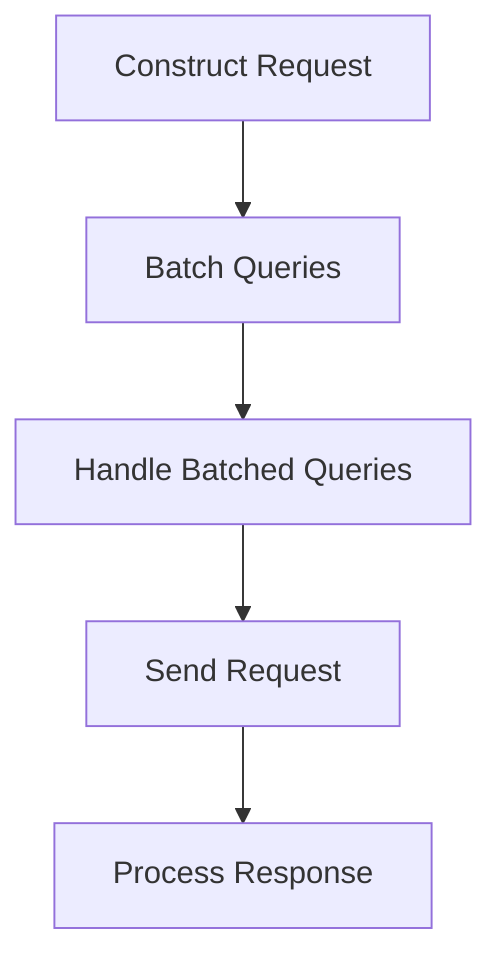

This document will cover the process of making event requests, which includes:

1. Constructing the request
2. Batching queries
3. Handling batched queries
4. Sending the request
5. Processing the response.

Technical document: <SwmLink doc-title="Making Event Requests">[Making Event Requests](/.swm/making-event-requests.e9ns5q40.sw.md)</SwmLink>

# [Constructing the Request](https://app.swimm.io/repos/Z2l0aHViJTNBJTNBc2VudHJ5LWRlbW8tMSUzQSUzQVN3aW1tLURlbW8=/docs/e9ns5q40#making-event-requests)

The process begins with constructing the request URL and query parameters based on the provided options. These options include details such as the organization, project IDs, environments, time period, and other relevant parameters. This step ensures that the request is tailored to fetch the specific data needed by the user.

# [Batching Queries](https://app.swimm.io/repos/Z2l0aHViJTNBJTNBc2VudHJ5LWRlbW8tMSUzQSUzQVN3aW1tLURlbW8=/docs/e9ns5q40#batching-requests)

If query batching is enabled, the request is delegated to the batchRequest function. This function adds the query to a batch context and returns a promise. Batching allows multiple queries to be aggregated and sent together, which can significantly improve performance by reducing the number of individual requests sent to the server.

# [Handling Batched Queries](https://app.swimm.io/repos/Z2l0aHViJTNBJTNBc2VudHJ5LWRlbW8tMSUzQSUzQVN3aW1tLURlbW8=/docs/e9ns5q40#handling-batching)

The handleBatching function processes the batched queries. It separates mergeable and unmergeable queries. Mergeable queries are those that can be combined into a single request, while unmergeable queries need to be handled individually. This step is crucial for optimizing the number of requests sent to the server.

# [Sending the Request](https://app.swimm.io/repos/Z2l0aHViJTNBJTNBc2VudHJ5LWRlbW8tMSUzQSUzQVN3aW1tLURlbW8=/docs/e9ns5q40#sending-requests)

The requestFunction sends the request to the server using the provided API client, path, and query object. This function returns a promise that resolves with the server's response. This step is where the actual data retrieval happens.

# [Processing the Response](https://app.swimm.io/repos/Z2l0aHViJTNBJTNBc2VudHJ5LWRlbW8tMSUzQSUzQVN3aW1tLURlbW8=/docs/e9ns5q40#request-promise)

The requestPromise method handles the response from the server. It resolves the promise with the data if the request is successful or rejects it with an error if it fails. This step ensures that the user receives the requested data or an appropriate error message if something goes wrong.

&nbsp;

*This is an auto-generated document by Swimm AI 🌊 and has not yet been verified by a human*

<SwmMeta version="3.0.0" repo-id="Z2l0aHViJTNBJTNBc2VudHJ5LWRlbW8tMSUzQSUzQVN3aW1tLURlbW8=" repo-name="sentry-demo-1" doc-type="product-flows">Powered by [Swimm](/)</SwmMeta>
