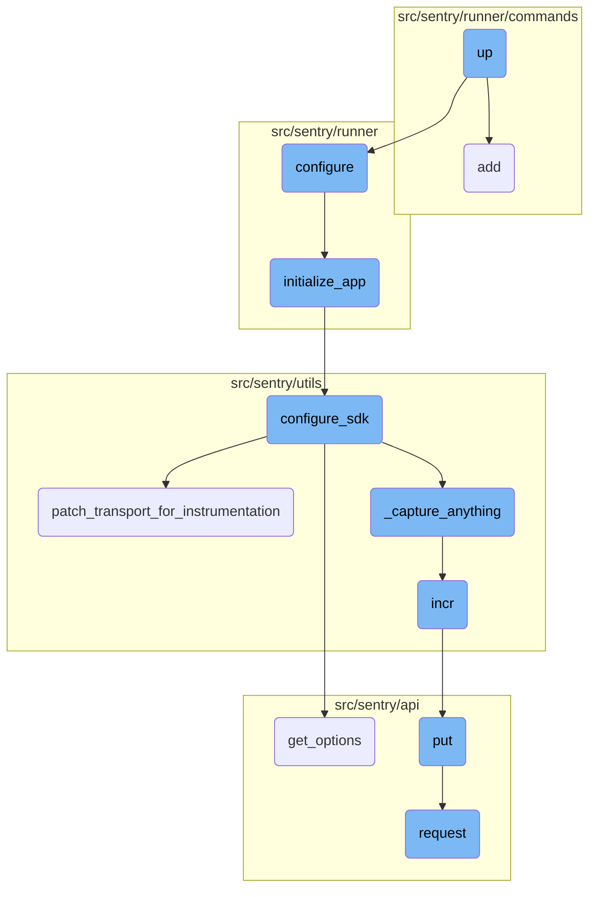
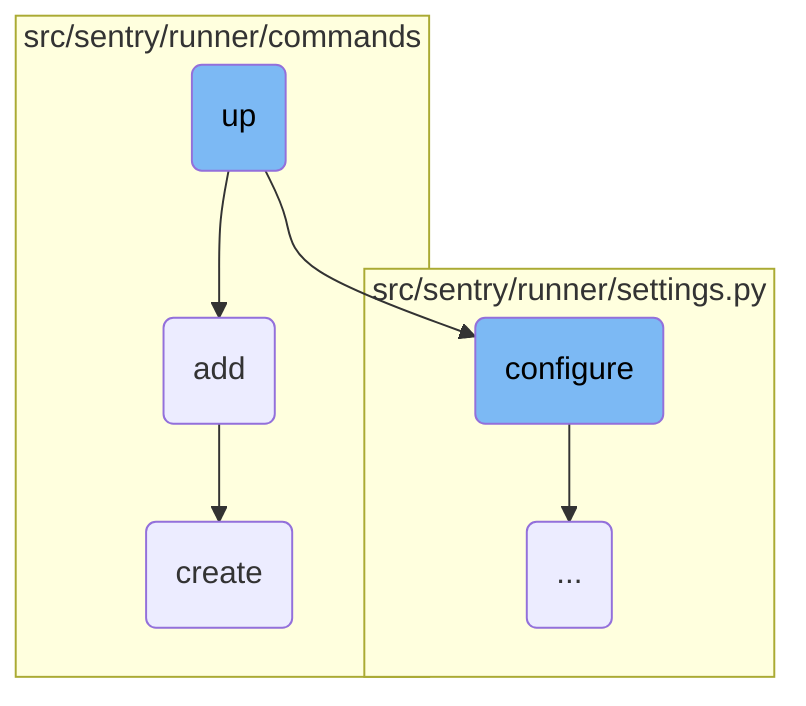
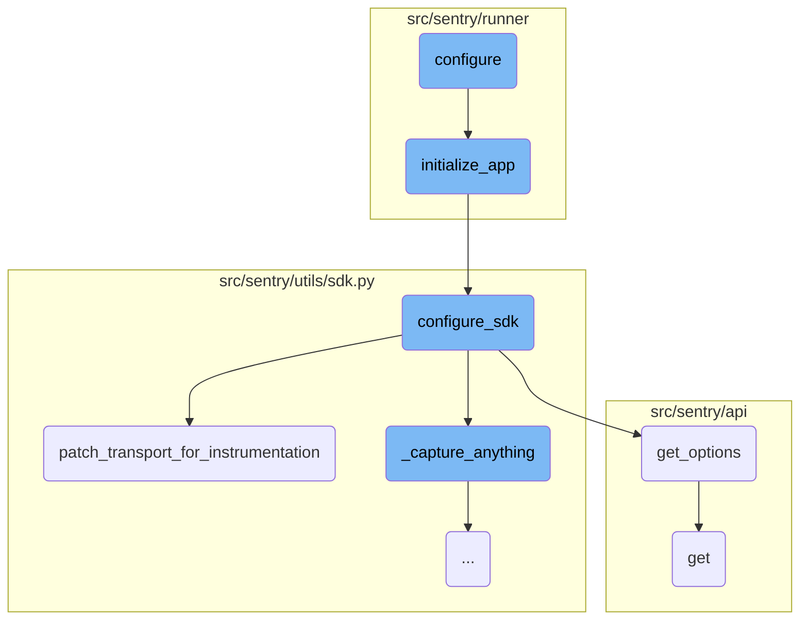
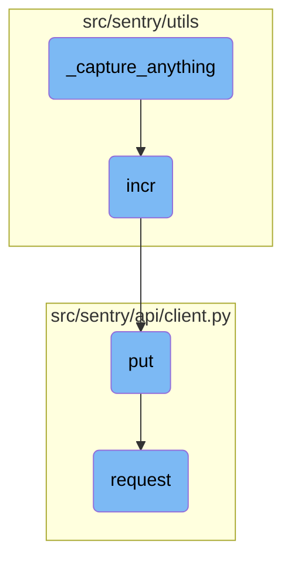

In this document, we will explain the <SwmToken path="src/sentry/runner/commands/devservices.py" pos="291:2:2" line-data="def up(">`up`</SwmToken> function, which is responsible for running or updating all development services in the background. The function configures the environment, prepares the necessary containers, and starts the specified services using a thread pool executor. After starting the services, it checks their health to ensure they are running correctly.

The <SwmToken path="src/sentry/runner/commands/devservices.py" pos="291:2:2" line-data="def up(">`up`</SwmToken> function helps in managing development services by first setting up the environment and preparing the necessary containers. It then starts the specified services in the background and checks if they are running correctly. This ensures that all required services are up and running for development purposes.

Here is a high level diagram of the flow, showing only the most important functions:



# Flow drill down

First, we'll zoom into this section of the flow:



<SwmSnippet path="/src/sentry/runner/commands/devservices.py" line="291">

---

## Managing Development Services

The <SwmToken path="src/sentry/runner/commands/devservices.py" pos="291:2:2" line-data="def up(">`up`</SwmToken> function is responsible for running or updating all development services in the background. It first configures the environment, prepares the necessary containers, and then starts the specified services using a thread pool executor. After starting the services, it checks their health to ensure they are running correctly.

```python
def up(
    services: list[str],
    project: str,
    exclude: list[str],
    skip_only_if: bool,
    recreate: bool,
) -> None:
    """
    Run/update all devservices in the background.

    The default is everything, however you may pass positional arguments to specify
    an explicit list of services to bring up.

    You may also exclude services, for example: --exclude redis --exclude postgres.
    """
    from sentry.runner import configure

    configure()

    containers = _prepare_containers(
        project, skip_only_if=(skip_only_if or len(services) > 0), silent=True
```

---

</SwmSnippet>

<SwmSnippet path="/src/sentry/runner/commands/permissions.py" line="37">

---

## Assigning User Permissions

The <SwmToken path="src/sentry/runner/commands/permissions.py" pos="37:2:2" line-data="def add(user: str, permission: str) -&gt; None:">`add`</SwmToken> function adds a specific permission to a user. It retrieves the user instance, attempts to create a new <SwmToken path="src/sentry/runner/commands/permissions.py" pos="41:9:9" line-data="    from sentry.users.models.userpermission import UserPermission">`userpermission`</SwmToken> record within a transaction, and handles any integrity errors that may occur if the permission already exists.

```python
def add(user: str, permission: str) -> None:
    "Add a permission to a user."
    from django.db import IntegrityError, transaction

    from sentry.users.models.userpermission import UserPermission

    user_inst = user_param_to_user(user)

    try:
        with transaction.atomic(router.db_for_write(UserPermission)):
            UserPermission.objects.create(user=user_inst, permission=permission)
    except IntegrityError:
        click.echo(f"Permission already exists for `{user_inst.username}`")
    else:
        click.echo(f"Added permission `{permission}` to `{user_inst.username}`")
```

---

</SwmSnippet>

<SwmSnippet path="/src/sentry/runner/commands/workstations.py" line="417">

---

## Provisioning and Connecting to Workstations

The <SwmToken path="src/sentry/runner/commands/workstations.py" pos="417:2:2" line-data="def create(ctx: click.Context, name: str, project: str, config: str) -&gt; None:">`create`</SwmToken> function provisions a new workstation and connects to it. It first checks if a workstation with the given name already exists and connects to it if it does. If not, it provisions a new workstation using the specified configuration and then connects to it.

```python
def create(ctx: click.Context, name: str, project: str, config: str) -> None:
    with gcloud_manager(ctx, project):
        conf = _get_workstation_config(project=project, config=config)

        # If this workstation already exists, inform the user and connect to it.
        info = _get_workstation_info(name, conf)
        if info is not None:
            _notify(f"A workstation named {name} already exists, connecting to it now.")
            return _connect(name, conf)

        # Create the workstation, then connect to it.
        _notify(
            f"""Provisioning a new workstation {name}, this could take a few minutes...
            Project: {conf.project}
            Region: {conf.region}
            Cluster: {conf.cluster}
            Config: {conf.config}
            Machine: {conf.machine}
            """
        )
        _sync_gcloud_workstation_cmd(
```

---

</SwmSnippet>

Now, lets zoom into this section of the flow:



<SwmSnippet path="/src/sentry/runner/settings.py" line="53">

---

## Setting Up the Environment

The <SwmToken path="src/sentry/runner/settings.py" pos="53:2:2" line-data="def configure(">`configure`</SwmToken> function sets up the environment by ensuring warnings are displayed, adding additional MIME types, and checking the existence of configuration files.

```python
def configure(
    ctx: click.Context | None, py: str, yaml: str | None, skip_service_validation: bool = False
) -> None:
    """
    Given the two different config files, set up the environment.

    NOTE: Will only execute once, so it's safe to call multiple times.
    """
    global __installed
    if __installed:
        return

    # Make sure that our warnings are always displayed.
    warnings.filterwarnings("default", "", Warning, r"^sentry")

    # Add in additional mimetypes that are useful for our static files
    # which aren't common in default system registries
    import mimetypes

    for type, ext in (
        ("application/json", "map"),
```

---

</SwmSnippet>

<SwmSnippet path="/src/sentry/runner/initializer.py" line="306">

---

## Initializing the Application

The <SwmToken path="src/sentry/runner/initializer.py" pos="306:2:2" line-data="def initialize_app(config: dict[str, Any], skip_service_validation: bool = False) -&gt; None:">`initialize_app`</SwmToken> function initializes the application by configuring settings, setting up logging, validating configurations, and registering plugins.

```python
def initialize_app(config: dict[str, Any], skip_service_validation: bool = False) -> None:
    settings = config["settings"]

    # Just reuse the integration app for Single Org / Self-Hosted as
    # it doesn't make much sense to use 2 separate apps for SSO and
    # integration.
    if settings.SENTRY_SINGLE_ORGANIZATION:
        options_mapper.update(
            {
                "github-app.client-id": "GITHUB_APP_ID",
                "github-app.client-secret": "GITHUB_API_SECRET",
            }
        )

    bootstrap_options(settings, config["options"])

    logging.raiseExceptions = settings.DEBUG

    configure_structlog()

    # Commonly setups don't correctly configure themselves for production envs
```

---

</SwmSnippet>

<SwmSnippet path="/src/sentry/utils/sdk.py" line="280">

---

## Configuring the SDK

The <SwmToken path="src/sentry/utils/sdk.py" pos="280:2:2" line-data="def configure_sdk():">`configure_sdk`</SwmToken> function configures the SDK by setting up the transport and capturing events.

```python
def configure_sdk():
    """
    Setup and initialize the Sentry SDK.
    """
    sdk_options, dsns = _get_sdk_options()

    internal_project_key = get_project_key()

    if dsns.sentry4sentry:
        transport = make_transport(get_options(dsn=dsns.sentry4sentry, **sdk_options))
        sentry4sentry_transport = patch_transport_for_instrumentation(transport, "upstream")
    else:
        sentry4sentry_transport = None

    if dsns.sentry_saas:
        transport = make_transport(get_options(dsn=dsns.sentry_saas, **sdk_options))
        sentry_saas_transport = patch_transport_for_instrumentation(transport, "relay")
    elif settings.IS_DEV and not settings.SENTRY_USE_RELAY:
        sentry_saas_transport = None
    elif internal_project_key and internal_project_key.dsn_private:
        transport = make_transport(get_options(dsn=internal_project_key.dsn_private, **sdk_options))
```

---

</SwmSnippet>

<SwmSnippet path="/src/sentry/utils/sdk.py" line="242">

---

## Patching the Transport for Instrumentation

The <SwmToken path="src/sentry/utils/sdk.py" pos="244:2:2" line-data="def patch_transport_for_instrumentation(transport, transport_name):">`patch_transport_for_instrumentation`</SwmToken> function patches the transport to add metrics for improved resolution around events sent to the ingest.

```python
# Patches transport functions to add metrics to improve resolution around events sent to our ingest.
# Leaving this in to keep a permanent measurement of sdk requests vs ingest.
def patch_transport_for_instrumentation(transport, transport_name):
    _send_request = transport._send_request
    if _send_request:

        def patched_send_request(*args, **kwargs):
            metrics.incr(f"internal.sent_requests.{transport_name}.events")
            return _send_request(*args, **kwargs)

        transport._send_request = patched_send_request
    return transport
```

---

</SwmSnippet>

<SwmSnippet path="/src/sentry/api/serializers/models/project.py" line="478">

---

## Getting Project Options

The <SwmToken path="src/sentry/api/serializers/models/project.py" pos="478:3:3" line-data="    def get_options(self, projects):">`get_options`</SwmToken> function retrieves project options by filtering the <SwmToken path="src/sentry/api/serializers/models/project.py" pos="487:5:5" line-data="        queryset = ProjectOption.objects.filter(project__in=projects, key__in=option_list)">`ProjectOption`</SwmToken> objects based on the provided projects and option keys.

```python
    def get_options(self, projects):
        # no options specified
        option_list = []

        # must be a safe key
        if self.expand_context.get("options"):
            option_list = self.expand_context.get("options")
            option_list = [option for option in option_list if option in OPTION_KEYS]

        queryset = ProjectOption.objects.filter(project__in=projects, key__in=option_list)

        options_by_project = defaultdict(dict)
        for option in queryset:
            options_by_project[option.project_id][option.key] = option.value

        return options_by_project
```

---

</SwmSnippet>

<SwmSnippet path="/src/sentry/api/client.py" line="113">

---

## Making GET Requests

The <SwmToken path="src/sentry/api/client.py" pos="113:3:3" line-data="    def get(self, *args, **kwargs):">`get`</SwmToken> function makes GET requests by calling the <SwmToken path="src/sentry/api/client.py" pos="114:5:5" line-data="        return self.request(&quot;GET&quot;, *args, **kwargs)">`request`</SwmToken> method with the 'GET' method type.

```python
    def get(self, *args, **kwargs):
        return self.request("GET", *args, **kwargs)
```

---

</SwmSnippet>

Now, lets zoom into this section of the flow:



<SwmSnippet path="/src/sentry/utils/sdk.py" line="343">

---

## Capturing Events

The <SwmToken path="src/sentry/utils/sdk.py" pos="343:3:3" line-data="        def _capture_anything(self, method_name, *args, **kwargs):">`_capture_anything`</SwmToken> function is responsible for capturing events and sending them to the appropriate Sentry transport. It first checks if <SwmToken path="src/sentry/utils/sdk.py" pos="346:3:3" line-data="            if sentry4sentry_transport:">`sentry4sentry_transport`</SwmToken> is available and increments the internal captured events metric. It then processes the event, filtering out certain items if necessary, and sends it to the <SwmToken path="src/sentry/utils/sdk.py" pos="346:3:3" line-data="            if sentry4sentry_transport:">`sentry4sentry_transport`</SwmToken>. If <SwmToken path="src/sentry/utils/sdk.py" pos="296:1:1" line-data="        sentry_saas_transport = patch_transport_for_instrumentation(transport, &quot;relay&quot;)">`sentry_saas_transport`</SwmToken> is available, it checks if the current event is safe and either increments the captured events metric and sends the event or increments the uncaptured events metric if the event is unsafe.

```python
        def _capture_anything(self, method_name, *args, **kwargs):
            # Sentry4Sentry (upstream) should get the event first because
            # it is most isolated from the sentry installation.
            if sentry4sentry_transport:
                metrics.incr("internal.captured.events.upstream")
                # TODO(mattrobenolt): Bring this back safely.
                # from sentry import options
                # install_id = options.get('sentry:install-id')
                # if install_id:
                #     event.setdefault('tags', {})['install-id'] = install_id
                s4s_args = args
                # We want to control whether we want to send metrics at the s4s upstream.
                if (
                    not settings.SENTRY_SDK_UPSTREAM_METRICS_ENABLED
                    and method_name == "capture_envelope"
                ):
                    args_list = list(args)
                    envelope = args_list[0]
                    # We filter out all the statsd envelope items, which contain custom metrics sent by the SDK.
                    # unless we allow them via a separate sample rate.
                    safe_items = [
```

---

</SwmSnippet>

<SwmSnippet path="/src/sentry/utils/metrics.py" line="98">

---

## Incrementing Metrics

The <SwmToken path="src/sentry/utils/metrics.py" pos="98:3:3" line-data="    def incr(">`incr`</SwmToken> function is used to increment a specific metric. It takes several parameters including the metric key, instance, tags, amount, and sample rate. If the metrics system is not started, it starts it and then puts the metric data into a queue for processing.

```python
    def incr(
        self,
        key: str,
        instance: str | None = None,
        tags: Tags | None = None,
        amount: int = 1,
        sample_rate: float = settings.SENTRY_METRICS_SAMPLE_RATE,
    ) -> None:
        if not self._started:
            self._start()
        self.q.put((key, instance, tags, amount, sample_rate))
```

---

</SwmSnippet>

<SwmSnippet path="/src/sentry/api/client.py" line="119">

---

## Sending PUT Requests

The <SwmToken path="src/sentry/api/client.py" pos="119:3:3" line-data="    def put(self, *args, **kwargs):">`put`</SwmToken> function is a wrapper around the <SwmToken path="src/sentry/api/client.py" pos="120:5:5" line-data="        return self.request(&quot;PUT&quot;, *args, **kwargs)">`request`</SwmToken> function that sends a PUT request. It simplifies making PUT requests by calling the <SwmToken path="src/sentry/api/client.py" pos="120:5:5" line-data="        return self.request(&quot;PUT&quot;, *args, **kwargs)">`request`</SwmToken> function with the method set to 'PUT'.

```python
    def put(self, *args, **kwargs):
        return self.request("PUT", *args, **kwargs)
```

---

</SwmSnippet>

<SwmSnippet path="/src/sentry/api/client.py" line="32">

---

## Making API Requests

The <SwmToken path="src/sentry/api/client.py" pos="32:3:3" line-data="    def request(">`request`</SwmToken> function is responsible for making API requests. It constructs the full path for the request, resolves the path to get the appropriate callback, and creates a mock request object. It then sets various attributes on the mock request, such as authentication and user information, and updates the request data. Finally, it calls the resolved callback with the mock request and returns the response if successful, or raises an error if the response status code indicates a failure.

```python
    def request(
        self,
        method,
        path,
        user=None,
        auth=None,
        params=None,
        data=None,
        is_sudo=None,
        is_superuser=None,
        request=None,
    ):
        if self.prefix not in path:
            full_path = self.prefix + path
        else:
            full_path = path

        # we explicitly do not allow you to override the request *and* the user
        # as then other checks like is_superuser would need overwritten
        assert not (request and (user or auth)), "use either request or auth"

```

---

</SwmSnippet>

&nbsp;

*This is an auto-generated document by Swimm AI 🌊 and has not yet been verified by a human*

<SwmMeta version="3.0.0" repo-id="Z2l0aHViJTNBJTNBc2VudHJ5LWRlbW8tMSUzQSUzQVN3aW1tLURlbW8=" repo-name="sentry-demo-1" doc-type="flows"><sup>Powered by [Swimm](/)</sup></SwmMeta>
