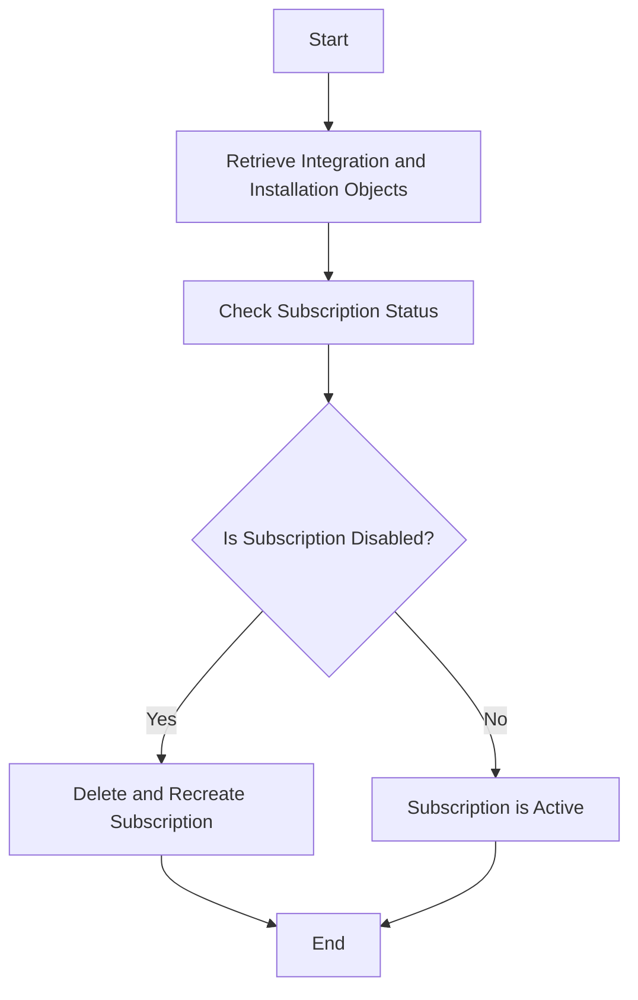

This document will cover the process of managing VSTS subscriptions, which includes:

1. Retrieving integration and installation objects
2. Checking the subscription status
3. Handling the subscription accordingly.

Technical document: <SwmLink doc-title="Managing VSTS Subscriptions">[Managing VSTS Subscriptions](/.swm/managing-vsts-subscriptions.l9rsz8ut.sw.md)</SwmLink>

# [Retrieving Integration and Installation Objects](https://app.swimm.io/repos/Z2l0aHViJTNBJTNBc2VudHJ5LWRlbW8tMSUzQSUzQVN3aW1tLURlbW8=/docs/l9rsz8ut#vsts_subscription_check)

The process begins by retrieving the integration and installation objects. These objects contain the necessary information to manage the VSTS subscription. The integration object represents the connection between our system and VSTS, while the installation object provides the specific details for the organization using the integration. This step ensures that we have the correct context and credentials to proceed with managing the subscription.

# [Checking the Subscription Status](https://app.swimm.io/repos/Z2l0aHViJTNBJTNBc2VudHJ5LWRlbW8tMSUzQSUzQVN3aW1tLURlbW8=/docs/l9rsz8ut#vsts_subscription_check)

Once the integration and installation objects are retrieved, the next step is to check the status of the VSTS subscription. This involves querying the VSTS API to determine if the subscription is active or disabled. The status check is crucial because it informs us whether the subscription is functioning correctly or if any action is needed to restore its functionality.

# [Handling the Subscription Accordingly](https://app.swimm.io/repos/Z2l0aHViJTNBJTNBc2VudHJ5LWRlbW8tMSUzQSUzQVN3aW1tLURlbW8=/docs/l9rsz8ut#vsts_subscription_check)

If the subscription is found to be disabled, we need to handle it by deleting and recreating the subscription. This step ensures that the subscription is reactivated and up-to-date. Deleting and recreating the subscription involves making API calls to VSTS to remove the old subscription and create a new one with the same parameters. This process guarantees that the subscription is refreshed and any issues causing it to be disabled are resolved.

&nbsp;

*This is an auto-generated document by Swimm AI 🌊 and has not yet been verified by a human*

<SwmMeta version="3.0.0" repo-id="Z2l0aHViJTNBJTNBc2VudHJ5LWRlbW8tMSUzQSUzQVN3aW1tLURlbW8=" repo-name="sentry-demo-1" doc-type="product-flows">Powered by [Swimm](/)</SwmMeta>
