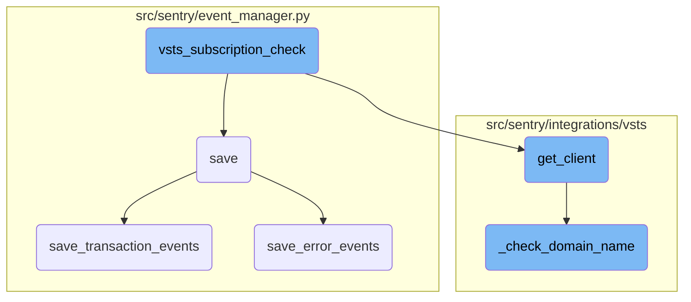

This document explains the process of verifying and managing VSTS subscriptions. The process involves retrieving integration and installation objects, checking the subscription status, and handling the subscription accordingly.

The flow starts by retrieving the integration and installation objects. It then checks the status of the subscription. If the subscription is found to be disabled, it attempts to delete and recreate it to ensure it is active and up-to-date.

# Flow drill down



<SwmSnippet path="/src/sentry/integrations/vsts/tasks/subscription_check.py" line="21">

---

## <SwmToken path="src/sentry/integrations/vsts/tasks/subscription_check.py" pos="21:2:2" line-data="def vsts_subscription_check(integration_id: int, organization_id: int) -&gt; None:">`vsts_subscription_check`</SwmToken>

The <SwmToken path="src/sentry/integrations/vsts/tasks/subscription_check.py" pos="21:2:2" line-data="def vsts_subscription_check(integration_id: int, organization_id: int) -&gt; None:">`vsts_subscription_check`</SwmToken> function is responsible for verifying the status of a VSTS subscription. It retrieves the integration and installation objects, checks the subscription status, and attempts to delete and recreate the subscription if it is disabled. This function ensures that the subscription is active and up-to-date.

```python
def vsts_subscription_check(integration_id: int, organization_id: int) -> None:
    from sentry.integrations.vsts.integration import VstsIntegration

    integration = Integration.objects.get(id=integration_id)
    installation = integration.get_installation(organization_id=organization_id)
    assert isinstance(installation, VstsIntegration), installation
    try:
        client = installation.get_client()
    except ObjectDoesNotExist:
        return

    subscription_id = None
    subscription = None
    try:
        subscription_id = integration.metadata["subscription"]["id"]
        subscription = client.get_subscription(subscription_id=subscription_id)
    except (KeyError, ApiError) as e:
        logger.info(
            "vsts_subscription_check.failed_to_get_subscription",
            extra={
                "integration_id": integration_id,
```

---

</SwmSnippet>

<SwmSnippet path="/src/sentry/event_manager.py" line="448">

---

## save

The <SwmToken path="src/sentry/event_manager.py" pos="448:3:3" line-data="    def save(">`save`</SwmToken> function processes and saves events. It normalizes the event data, retrieves the project, and then delegates the saving process to either <SwmToken path="src/sentry/event_manager.py" pos="502:5:5" line-data="            jobs = save_transaction_events([job], projects)">`save_transaction_events`</SwmToken> or <SwmToken path="src/sentry/event_manager.py" pos="544:3:3" line-data="    def save_error_events(">`save_error_events`</SwmToken> based on the event type. This function ensures that events are correctly processed and stored.

```python
    def save(
        self,
        project_id: int | None,
        raw: bool = False,
        assume_normalized: bool = False,
        start_time: float | None = None,
        cache_key: str | None = None,
        skip_send_first_transaction: bool = False,
        has_attachments: bool = False,
    ) -> Event:
        """
        After normalizing and processing an event, save adjacent models such as
        releases and environments to postgres and write the event into
        eventstream. From there it will be picked up by Snuba and
        post-processing.

        We re-insert events with duplicate IDs into Snuba, which is responsible
        for deduplicating events. Since deduplication in Snuba is on the primary
        key (based on event ID, project ID and day), events with same IDs are only
        deduplicated if their timestamps fall on the same day. The latest event
        always wins and overwrites the value of events received earlier in that day.
```

---

</SwmSnippet>

<SwmSnippet path="/src/sentry/event_manager.py" line="1040">

---

### <SwmToken path="src/sentry/event_manager.py" pos="502:5:5" line-data="            jobs = save_transaction_events([job], projects)">`save_transaction_events`</SwmToken>

The <SwmToken path="src/sentry/event_manager.py" pos="502:5:5" line-data="            jobs = save_transaction_events([job], projects)">`save_transaction_events`</SwmToken> function handles the saving of transaction events. It performs various operations such as creating releases, deriving tags, and recording metrics. This function ensures that transaction events are properly processed and stored in the database.

```python
        if group_info.is_new_group_environment:
            rpe_new_groups += 1
    if rp_new_groups:
        buffer_incr(
            ReleaseProject,
            {"new_groups": rp_new_groups},
            {"release_id": release.id, "project_id": project.id},
        )
    if rpe_new_groups:
        buffer_incr(
            ReleaseProjectEnvironment,
            {"new_issues_count": rpe_new_groups},
            {
                "project_id": project.id,
                "release_id": release.id,
                "environment_id": environment.id,
            },
        )


def _get_or_create_group_release_many(jobs: Sequence[Job]) -> None:
```

---

</SwmSnippet>

<SwmSnippet path="/src/sentry/event_manager.py" line="544">

---

### <SwmToken path="src/sentry/event_manager.py" pos="544:3:3" line-data="    def save_error_events(">`save_error_events`</SwmToken>

The <SwmToken path="src/sentry/event_manager.py" pos="544:3:3" line-data="    def save_error_events(">`save_error_events`</SwmToken> function handles the saving of error events. It performs operations such as assigning events to groups, creating environments, and recording metrics. This function ensures that error events are correctly processed and stored.

```python
    def save_error_events(
        self,
        project: Project,
        job: Job,
        projects: ProjectsMapping,
        metric_tags: MutableTags,
        raw: bool = False,
        cache_key: str | None = None,
        has_attachments: bool = False,
    ) -> Event:
        jobs = [job]

        if is_sample_event(job):
            logger.info(
                "save_error_events: processing sample event",
                extra={
                    "event.id": job["event"].event_id,
                    "project_id": project.id,
                    "sample_event": True,
                },
            )
```

---

</SwmSnippet>

<SwmSnippet path="/src/sentry/integrations/vsts/integration.py" line="134">

---

## <SwmToken path="src/sentry/integrations/vsts/integration.py" pos="134:3:3" line-data="    def get_client(self) -&gt; VstsApiClient:">`get_client`</SwmToken>

The <SwmToken path="src/sentry/integrations/vsts/integration.py" pos="134:3:3" line-data="    def get_client(self) -&gt; VstsApiClient:">`get_client`</SwmToken> function retrieves a VSTS API client. It checks the domain name and ensures that the necessary authentication details are available. This function is crucial for making API calls to VSTS.

```python
    def get_client(self) -> VstsApiClient:
        base_url = self.instance
        if SiloMode.get_current_mode() != SiloMode.REGION:
            if self.default_identity is None:
                self.default_identity = self.get_default_identity()
            self._check_domain_name(self.default_identity)

        if self.org_integration is None:
            raise Exception("self.org_integration is not defined")
        if self.org_integration.default_auth_id is None:
            raise Exception("self.org_integration.default_auth_id is not defined")
        return VstsApiClient(
            base_url=base_url,
            oauth_redirect_url=VstsIntegrationProvider.oauth_redirect_url,
            org_integration_id=self.org_integration.id,
            identity_id=self.org_integration.default_auth_id,
        )
```

---

</SwmSnippet>

<SwmSnippet path="/src/sentry/integrations/vsts/integration.py" line="358">

---

## <SwmToken path="src/sentry/integrations/vsts/integration.py" pos="358:3:3" line-data="    def _check_domain_name(self, default_identity: RpcIdentity) -&gt; None:">`_check_domain_name`</SwmToken>

The <SwmToken path="src/sentry/integrations/vsts/integration.py" pos="358:3:3" line-data="    def _check_domain_name(self, default_identity: RpcIdentity) -&gt; None:">`_check_domain_name`</SwmToken> function verifies and updates the domain name for the VSTS integration. It ensures that the domain name is correctly set in the integration metadata.

```python
    def _check_domain_name(self, default_identity: RpcIdentity) -> None:
        if re.match("^https://.+/$", self.model.metadata["domain_name"]):
            return

        base_url = VstsIntegrationProvider.get_base_url(
            default_identity.data["access_token"], self.model.external_id
        )
        self.model.metadata["domain_name"] = base_url
        self.model.save()
```

---

</SwmSnippet>

&nbsp;

*This is an auto-generated document by Swimm AI 🌊 and has not yet been verified by a human*

<SwmMeta version="3.0.0" repo-id="Z2l0aHViJTNBJTNBc2VudHJ5LWRlbW8tMSUzQSUzQVN3aW1tLURlbW8=" repo-name="sentry-demo-1" doc-type="flows"><sup>Powered by [Swimm](/)</sup></SwmMeta>
