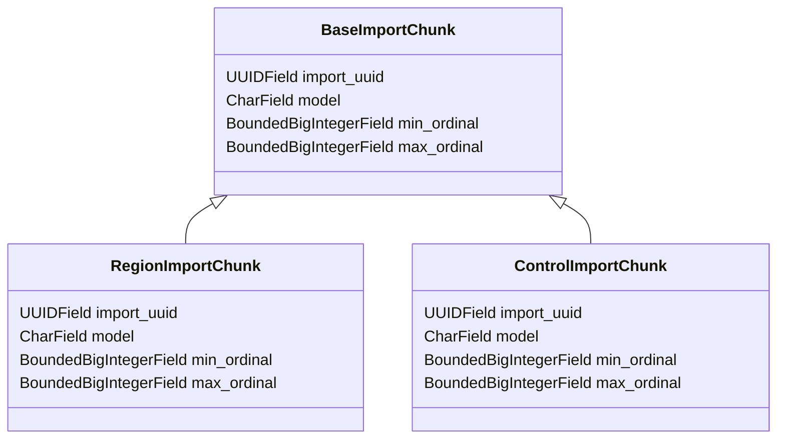

# Overview

Models are used to define the structure of the database tables and the relationships between them. They encapsulate the data and provide methods to interact with the database, ensuring data integrity and consistency. Models are defined using the <SwmToken path="src/sentry/models/importchunk.py" pos="19:15:15" line-data="    # simply inherits from the `Relocation` model, and can be used to connect back to it. If it is">`model`</SwmToken> class from the <SwmToken path="src/sentry/models/importchunk.py" pos="6:2:6" line-data="from sentry.db.models import BoundedBigIntegerField, control_silo_model, region_silo_model">`sentry.db.models`</SwmToken> module, which provides a base class for all models in the application.

# Defining Models

Each model typically includes fields that represent the columns in the database table, and methods that define the behavior and interactions of the data. Models are a crucial part of the application's data layer, enabling the application to perform CRUD (Create, Read, Update, Delete) operations on the database.

<SwmSnippet path="/src/sentry/models/importchunk.py" line="11">

---

## <SwmToken path="src/sentry/models/importchunk.py" pos="11:2:2" line-data="class BaseImportChunk(DefaultFieldsModel):">`BaseImportChunk`</SwmToken> Class

The <SwmToken path="src/sentry/models/importchunk.py" pos="11:2:2" line-data="class BaseImportChunk(DefaultFieldsModel):">`BaseImportChunk`</SwmToken> class is an example of a model that represents the map of import primary keys to final, <SwmToken path="src/sentry/models/importchunk.py" pos="13:22:24" line-data="    Base class representing the map of import pks to final, post-import database pks.">`post-import`</SwmToken> database primary keys. It includes various fields such as <SwmToken path="src/sentry/models/importchunk.py" pos="23:1:1" line-data="    import_uuid = UUIDField(db_index=True)">`import_uuid`</SwmToken>, <SwmToken path="src/sentry/models/importchunk.py" pos="19:15:15" line-data="    # simply inherits from the `Relocation` model, and can be used to connect back to it. If it is">`model`</SwmToken>, <SwmToken path="src/sentry/models/importchunk.py" pos="29:1:1" line-data="    min_ordinal = BoundedBigIntegerField()">`min_ordinal`</SwmToken>, <SwmToken path="src/sentry/models/importchunk.py" pos="32:1:1" line-data="    max_ordinal = BoundedBigIntegerField()">`max_ordinal`</SwmToken>, and several JSON fields to map original primary keys to their assigned values.

```python
class BaseImportChunk(DefaultFieldsModel):
    """
    Base class representing the map of import pks to final, post-import database pks.
    """

    __relocation_scope__ = RelocationScope.Excluded

    # Every import has a UUID assigned to it. If the import was triggered by a relocation, this UUID
    # simply inherits from the `Relocation` model, and can be used to connect back to it. If it is
    # not done via the `Relocation` pathway (that is, someone triggered it using a `sentry import`
    # command via the CLI), it is randomly generated, but shared between all chunks of the same
    # import.
    import_uuid = UUIDField(db_index=True)

    # The name of model that was imported.
    model = models.CharField(db_index=True, max_length=64)

    # The minimum ordinal (inclusive), relative to the source JSON, imported by this chunk.
    min_ordinal = BoundedBigIntegerField()

    # The maximum ordinal (inclusive), relative to the source JSON, imported by this chunk.
```

---

</SwmSnippet>

<SwmSnippet path="/src/sentry/models/importchunk.py" line="70">

---

## Usage of <SwmToken path="src/sentry/models/importchunk.py" pos="71:4:4" line-data="class RegionImportChunk(BaseImportChunk):">`BaseImportChunk`</SwmToken>

The <SwmToken path="src/sentry/models/importchunk.py" pos="71:4:4" line-data="class RegionImportChunk(BaseImportChunk):">`BaseImportChunk`</SwmToken> class is extended by other classes such as <SwmToken path="src/sentry/models/importchunk.py" pos="71:2:2" line-data="class RegionImportChunk(BaseImportChunk):">`RegionImportChunk`</SwmToken>, <SwmToken path="src/sentry/models/importchunk.py" pos="86:2:2" line-data="class ControlImportChunk(BaseImportChunk):">`ControlImportChunk`</SwmToken>, and <SwmToken path="src/sentry/models/importchunk.py" pos="101:2:2" line-data="class ControlImportChunkReplica(BaseImportChunk):">`ControlImportChunkReplica`</SwmToken>. These classes inherit the fields and methods from <SwmToken path="src/sentry/models/importchunk.py" pos="71:4:4" line-data="class RegionImportChunk(BaseImportChunk):">`BaseImportChunk`</SwmToken>, allowing them to represent different types of import chunks in the database.

```python
@region_silo_model
class RegionImportChunk(BaseImportChunk):
    """
    Records the pk mapping for the successful import of instances of a model that lives in the
    region silo.
    """

    __relocation_scope__ = RelocationScope.Excluded

    class Meta:
        app_label = "sentry"
        db_table = "sentry_regionimportchunk"
        unique_together = (("import_uuid", "model", "min_ordinal"),)


@control_silo_model
class ControlImportChunk(BaseImportChunk):
    """
    Records the pk mapping for the successful import of instances of a model that lives in the
    control silo.
    """
```

---

</SwmSnippet>

&nbsp;

*This is an auto-generated document by Swimm AI 🌊 and has not yet been verified by a human*

<SwmMeta version="3.0.0" repo-id="Z2l0aHViJTNBJTNBc2VudHJ5LWRlbW8tMSUzQSUzQVN3aW1tLURlbW8=" repo-name="sentry-demo-1" doc-type="overview"><sup>Powered by [Swimm](/)</sup></SwmMeta>
